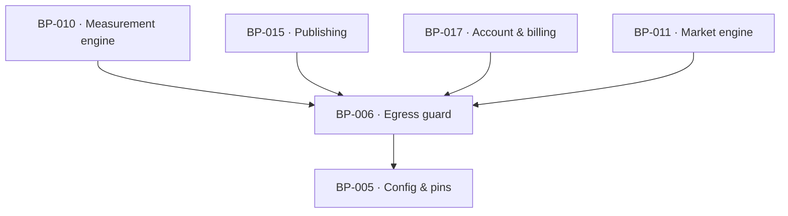

# BP-006 — Egress guard — the one outbound fetcher

- Parent: BP-001
- Kind: **component** — the only path from this process to a URL the product did
  not author.

## Responsibility
Fetch any customer-supplied or dataset-supplied URL exactly once, through one
SSRF-guarded, DNS-pinned, size-capped, timeout-bounded, robots-respecting client,
and answer the one other question the product asks about a domain — whether it
resolves in DNS.

## Module / boundary
`src/lib/egress/` — `safeFetch`, the DNS resolver, the robots reader and the
allow/deny policy. Every fetch of a customer's page, a rival's page, a
`robots.txt`, and every 24-hour liveness check goes through it. Vendor API calls
do not: they are BP-008's, to hosts we authored.

## Diagram


## Public interface
```ts
export type FetchOutcome =
  | { ok: true; status: number; url: string; html: string; bytes: number; readAt: Date }
  | { ok: false; reason: 'dns' | 'refused' | 'timeout' | 'too_large' | 'blocked_by_policy'
              | 'robots_disallowed' | 'status'; status?: number; url: string; readAt: Date }

export function safeFetch(url: string, opts?: {
  timeoutMs?: number            // default 8000, hard max 15000
  maxBytes?: number             // default 2_000_000
  respectRobots?: boolean       // default true
  userAgent?: 'reachkit-measure' | 'reachkit-verify'
}): Promise<FetchOutcome>

export function resolvesInDns(host: string): Promise<boolean>

/** Declared here because `readRobots` produces it and this is the one module
 *  that reads a `robots.txt`. BP-010 returns `Measured<RobotsPolicy>` from
 *  `measureDomain`, BP-024's `verdictOf` takes one and BP-047 serves one; none
 *  of them declared it. It is a parse of a fetched document, never a judgement
 *  about it: what each rule means for the blocked-readers count is BP-024's and
 *  what ReachKit serves on a hosted domain is BP-047's. */
export interface RobotsPolicy {
  ok: true
  origin: string
  readAt: Date
  /** True where the document tells *every* reader not to crawl — REQ-004 c7's
   *  "a home document the scan read that tells every reader not to index it". */
  disallowsAll: boolean
  /** Per user-agent token, whether this document disallows it at the origin
   *  root. Keyed by the token as written in the document, lowercased; the
   *  closed set the product counts over is BP-005's `AI_READER_AGENTS`
   *  (ADR-022, ADR-090) and is applied by the caller, not here. */
  disallowedAgents: Readonly<Record<string, boolean>>
  /** Sitemap declarations found in the document, in the order they appeared. */
  sitemaps: readonly string[]
  /** True where the origin answered 404 or an equivalent "no robots.txt".
   *  That is a *read* with nothing in it — REQ-004 criterion 7's `zero`, not
   *  criterion 6's `undeterminable` — and the distinction is the reason this
   *  field exists rather than a null policy. */
  absent: boolean
}
export function readRobots(origin: string): Promise<RobotsPolicy | { ok: false; reason: string }>
```

## Data model delta
None. Payloads are stored by BP-007 when a caller asks for them to be.

## Error & edge behavior
- Refuses by policy, before any connection: private, loopback, link-local,
  multicast and reserved address space; non-http(s) schemes; redirects that leave
  the policy (each hop re-checked); ports other than 80/443.
- DNS-pinned: the address resolved during the policy check is the address
  connected to, so a name cannot be re-resolved to a private address between
  check and connect.
- **Never throws.** Every failure is a typed `FetchOutcome` with `ok: false`, so
  a caller can distinguish "could not determine" (REQ-004 criterion 6) from
  "read it and it contained nothing" (REQ-004 criterion 7). This distinction is
  the whole reason the return type is a union rather than a thrown error, which
  is why REQ-004 is in this node's `covers` — its behaviour partly lives here
  even though the node was not cut from it (rule 5.4). It was cited here and
  absent from the edge list until 2026-08-31; the citation was the correct half.
- `resolvesInDns` answers exactly one question — does this name resolve — and is
  the shared test behind REQ-021 criterion 9, REQ-026 criterion 8 and REQ-071
  criteria 4 to 6. A site that is new, thin, unbuilt or blocking our fetcher
  resolves and is therefore accepted; reachability is never widened to "the site
  responded".
- No crawling: the caller supplies the URL set. There is no link following and
  no sitemap reader (`BUILD.md` §17).

## NFR budget
- p95 ≤ 3 s, hard timeout 8 s per fetch; a scan's 25 measured pages run at a
  bounded concurrency so the 90-second ceiling (REQ-003 criterion 5) is
  reachable.
- Size cap 2 MB; a larger response is `too_large`, not a truncated parse.
- Security: this module is the audited boundary. A `fetch(` call anywhere else
  under `src/lib/` that is not BP-008's vendor client is a lint error.
- Observability: host, outcome reason, status, bytes and duration; never a body.

## Decisions
1. **A typed union outcome, never a thrown error** — Status: accepted
   - Context: REQ-004 makes the difference between an unreadable input and an
     empty one a customer-visible promise, and a thrown error erases it.
   - Decision: `safeFetch` returns a discriminated union and never rejects.
   - Alternatives considered: throw and catch per call site — rejected, the
     catch block is where "could not determine" silently becomes 0, which is the
     false public accusation REQ-004's rationale names.
   - Consequences: every caller must handle both arms; the type system enforces
     it. Reversing would re-open the exact defect the requirement exists to
     prevent.
2. **DNS resolution is a capability of this module, not of the callers** — Status: accepted
   - Context: three requirements independently define "reachable" as "resolves
     in DNS" and would otherwise implement it three times (rule 7.1).
   - Decision: one `resolvesInDns`, one meaning, cited by all three feature nodes.
   - Alternatives considered: a check inside each settings/setup handler —
     rejected, two implementations of one capability is a `blocked-by`.
   - Consequences: widening the meaning of reachable later is a one-line change
     with three customer-visible consequences, which is why it is recorded.

## Status grounds (rule 3.2)
Self-certified `approved`. Grounds: cut from `BUILD.md` §6.4 ("Every fetch of
user-supplied URLs goes through one SSRF-guarded, DNS-pinned, size-capped
fetcher; robots.txt respected; no crawling"), not from one requirement;
`satisfies` empty by rule 5.4, so §3's blueprint gate — "no blueprint from a non-approved
requirement" — reads no ancestor here. `covers` is coverage, never authorising
ancestry (rule 5.4), so these grounds assert nothing about the status of the
requirements this node covers; eight of the corpus's requirements are
`in-review` and none of them is this node's ancestor.

## Open questions
