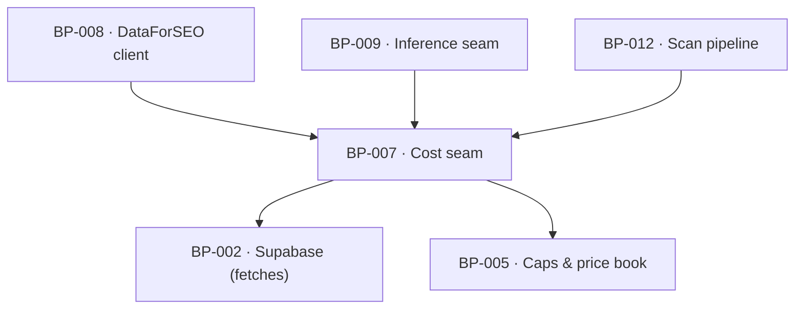

# BP-007 — Cost seam — ledger, cache and raw store in one

- Parent: BP-001
- Kind: **component** — the money boundary every paid call passes through.

## Responsibility
Run every vendor and model call inside a per-scan cost context that reads cache
first, ledgers what was spent whether or not the call succeeded, and degrades the
scan at its cap instead of throwing. Research on the DataForSEO endpoints and pricing
is in `registry/evidence/RESEARCH-dataforseo-endpoints.md`.

## Module / boundary
`src/lib/costs/` and the `fetches` table, which is ledger, cache and raw store in
one (`BUILD.md` §6.5). BP-008 and BP-009 are its only callers for spend; BP-012
opens and closes the context.

## Diagram


## Public interface
```ts
export type CapName = 'FREE' | 'DEEP' | 'WEEKLY' | 'DRAFT'

export function withCostContext<T>(
  ctx: { scanId: string; cap: CapName; policyVersion: number },
  body: (cost: CostContext) => Promise<T>
): Promise<T>

export interface CostContext {
  /** Cache-first, ledger-always. `fresh` false means the payload came from cache
   *  and cost nothing. An empty payload is always a miss; there is no negative
   *  cache. */
  recordFetch<P>(call: {
    source: string           // vendor endpoint or model id
    cacheKey: string
    freshnessDays: number
    /** The **reservation**: the most this call can cost, known before it runs.
     *  The cap is checked against this, so no call is made against money the
     *  context has not got. */
    costCents: number
    /** Optional **settlement** (ADR-094 decision 3a). Where a vendor's own
     *  documented rule makes the final charge a function of the response, the
     *  call site supplies it and the ledger records the settled figure instead
     *  of the reservation. `settled <= reserved` is enforced here, not trusted:
     *  a closure returning more is clamped to the reservation and logged, since
     *  the excess would be money the cap never authorised. One call site uses
     *  it today — BP-008's flagged `serpOrganic`. Omitting it is the ordinary
     *  case and behaves exactly as before this argument existed. */
    settleCents?: (payload: P) => number
    run: () => Promise<P>
  }): Promise<{ payload: P; fresh: boolean; costCents: number } | { skipped: 'cap' }>
  // The returned `costCents` is the settled figure where one was supplied, the
  // reservation otherwise — one number, and it is the one the row carries.

  capHit(): boolean          // re-checked between calls in any multi-call step
  spentCents(): number
  degraded(): boolean
}
```

## Data model delta
`fetches` — `id, scan_id, source, cache_key, policy_version, cost_cents,
reserved_cents, payload jsonb, created_at`. `cost_cents` is what was
**ledgered** — the settled figure where a call settled, the reservation
otherwise — and `reserved_cents` is what the cap was checked against; they
differ only on the one endpoint ADR-094 flags, and the difference is what
reconciles our ledger against the vendor's account statement (decision 4,
ADR-094's open `rests-on` row). A column, not a second table: the two figures
belong to the same call. `reserved_cents` is added by this node's own migration
glob (`supabase/migrations/*_fetches*.sql`) and no row exists yet to backfill. **Insert-only; no unique constraint on
`(source, cache_key, policy_version)`** (corrected 2026-09-03, decision 3 —
see below). Indexed `(source, cache_key, policy_version, created_at desc)` for
the cache read and on `scan_id` for the ledger read. No second table: the
ledger, the cache and the raw store are one row, and every vendor call
actually made writes one — a cache hit writes none, because nothing was
spent to ledger.

## Error & edge behavior
- **Caps degrade, never throw.** At the cap, `recordFetch` returns
  `{ skipped: 'cap' }` and the context is marked degraded; the caller records the
  outstanding measurement as *not attempted* (REQ-004 criterion 9), never as 0.
- Money already spent is always ledgered — a call that succeeds at the vendor and
  fails on parse still writes its row.
- The cache is keyed `source + key + policyVersion`. Bumping the policy version
  is how a changed derivation invalidates its cache; nothing is deleted.
- **A cache read is the newest row on that key inserted within
  `freshnessDays`, excluding a row whose payload is the vendor's own
  zero-result shape** (corrected 2026-09-03, decision 3). An empty payload is
  therefore always a miss and is retried on the next scan — it is still
  ledgered, at cost, every time it is bought, and is never served back as a
  hit — so "0 rows" is billed once per scan and never remembered as an answer
  (`BUILD.md` §6.4) without a second flag or a second table to say so.
- A free scan of a domain measured less than 7 days ago serves the stored report
  and opens no context at all — the cheapest possible path is not a cache hit but
  no scan.
- **`capHit()` is evaluated against ledgered cents, and ledgered means
  settled.** On the one endpoint ADR-094 flags, the reservation is
  `ASYNC_AIO_SURCHARGE_MULTIPLIER`× the base price and the settlement is the
  vendor's own documented final charge, read off the response by BP-008's
  closure (ADR-094 decision 3a, which amends decision 3). Between the
  reservation and the settlement a scan is charged the higher figure, so a cap
  can never be exceeded by a call in flight; after it, the context holds the
  figure the vendor says it will bill. This replaces the earlier acceptance —
  that a free scan may degrade at a ceiling it never actually reached — which
  was harmless only while the free path had one spender. It no longer does:
  REQ-094's correction shares the ceiling, and the difference between reserved
  and settled is the difference between a corrected report that completes and
  one that truncates.
- **A settlement never raises a charge.** `settled > reserved` is a defect, not
  a case: it is clamped to the reservation and logged, because the excess is
  money no cap check authorised. A settled figure is what the row carries and
  what `spentCents()` sums.

## NFR budget
- One cache read per call, indexed; the seam adds under 5 ms per call.
- A free scan's context must not exceed 12¢, a deep pass 150¢, a weekly 40¢, a
  draft 45¢ — enforced here, not assumed anywhere else.
- Observability: every row is the audit trail, and a row whose charge was
  settled records **both** figures — reserved and settled — so the difference
  can be reconciled against the vendor's own account statement (the assumption
  ADR-094's second `rests-on` row carries; without both numbers logged, nothing
  could discharge it). A per-scan roll-up (`spentCents`, `degraded`) is written
  to `scans.cost_cents` and `scans.status` at close. No cost figure is ever rendered to a customer
  (REQ-003 non-goal, REQ-092 criterion 8).

## Decisions
1. **`skipped: 'cap'` is a value, not an exception** — Status: accepted
   - Context: REQ-003 criterion 11 requires the ceiling to hold "whether or not a
     driver of the score depends on it", and REQ-004 criterion 9 requires the
     result to read as *not measured*, never as 0 and never as an error.
   - Decision: the cap outcome is a third arm of the return type, so a caller
     cannot handle it by accident.
   - Alternatives considered: throwing a `CapExceeded` — rejected, `BUILD.md`
     §6.5 says caps degrade and never throw, and a throw at the wrong depth
     discards the measurements already paid for.
   - Consequences: every multi-call step carries an explicit cap branch, which is
     also where the "stopped early" written line is produced.
2. **One table for ledger, cache and raw store** — Status: accepted
   - Context: three tables would state one fact three times (rule 2.4) and make
     "what did this scan cost" a join.
   - Decision: `fetches` as specified by `BUILD.md` §6.5, with the payload kept.
   - Alternatives considered: separate `cache` and `spend_ledger` — rejected,
     they diverge the first time a cached call is re-billed.
   - Consequences: `fetches` grows fast and needs a retention policy; the payload
     of a deleted account is purged with the account (REQ-079 criterion 7).

3. **`fetches` is insert-only; there is no unique constraint on the cache
   key** — Status: accepted (parameter, rule 1.1)
   - Context: the data model as approved made `(source, cache_key,
     policy_version)` unique to serve the cache read, while this node's own
     Error & edge behaviour promises every ordinary re-buy a second row at
     the same key — a SERP re-bought after its 30-day window ages out, and an
     empty payload "retried on the next scan … billed once per scan and
     never remembered as an answer". Both promises collide with the
     constraint: the choices it left open were an upsert (which loses the
     earlier spend the ledger promises is always recorded) or an insert
     (which fails). Neither was decided.
   - Decision: drop the uniqueness; keep a plain index on `(source, cache_key,
     policy_version, created_at desc)`. A cache read takes the newest row on
     that key inside `freshnessDays`, **skipping any row whose payload is the
     vendor's own zero-result shape** — an empty array or an explicit
     no-match marker the parser already produces. Excluding empty payloads at
     the *read*, not the *write*, is what keeps "0 rows billed once per scan,
     never remembered as an answer" true without a second column: the row
     still exists, ledgered and auditable, it is only never served back as a
     hit.
   - Alternatives considered: an upsert that overwrites the earlier row —
     rejected, it is the exact loss "money already spent is always ledgered"
     forbids; a `created_at`-or-generation column added to a constraint that
     stays unique — rejected, it is the same index shape as the one chosen,
     stated as a constraint instead of a read predicate, and a constraint
     that must be widened every time a new re-buy pattern appears is the
     thing an insert-only ledger with an ordinary index avoids by
     construction; a separate `is_cache_eligible` column — rejected, it is a
     second, storable copy of a fact the parser's own output already carries
     (rule 2.4).
   - Consequences: a heavily re-bought key accumulates rows faster than a
     unique-keyed table would; this is the same growth Decision 2 already
     budgets for and needs no new retention policy. The cache read is one
     index scan with a `limit 1`, not a point lookup — no measurable NFR
     change at this seam's call volumes.
   - Cost of reversing: a migration back to a unique constraint would first
     need every colliding key collapsed to one row, silently discarding the
     ledger history the collision was hiding; this is not a boolean flip like
     ADR-094's landmine, and reversing it is the expensive direction.

4. **The seam reserves before a call and may settle after it, and the vendor
   rule that decides the settlement lives at the call site** — Status: accepted
   (ADR-094 decision 3a; seam shape, rule 1.1)
   - Context: one endpoint in the closed list has a charge the vendor decides
     *after* the request — `serpOrganic` with `loadAsyncAiOverview: true` bills
     twice the base price and refunds the excess when no asynchronous overview
     was there to fetch. This seam was built on a fixed cost known before the
     call, which is what makes the cap checkable at all; ADR-094 decision 3
     therefore ledgered the high figure and accepted the over-statement. Once
     REQ-094's correction began sharing the same ceiling (ADR-094 decision 5),
     that over-statement stopped being spare headroom and became the reason a
     corrected report truncates.
   - Decision: keep the reservation as the cap's input, add an optional
     `settleCents` closure as the ledger's input, and enforce
     `settled ≤ reserved` here. The **rule** that computes a settlement is
     vendor knowledge and stays at the call site (BP-008), so this node gains no
     endpoint-specific branch and stays generic; what it gains is one argument
     and one invariant.
   - Alternatives considered: leave the ledger conservative — rejected, it makes
     REQ-094 criterion 7's partial correction the ordinary outcome on every
     uncached scan, which is the customer-visible cost of an accounting
     convenience; hold a separate refundable balance per context and reconcile
     it at close — rejected, it is a second ledger for one endpoint and the
     figure it would reconcile to is the same one the closure already returns;
     widen `costCents` itself to accept a function — rejected at ADR-094
     Alternative 5, and it would leave the cap with no pre-call figure to check.
   - Consequences: eleven call sites are unchanged and one supplies a closure.
     Rows carry both figures (NFR budget above), which is what makes ADR-094's
     open `rests-on` row dischargeable.
   - Cost of reversing: one optional argument, one invariant and one column.
     `reserved_cents` would be dropped with it — which is the part worth
     noticing, because without both figures on the row nothing can ever check
     whether the vendor refunded what it documents.

## Status grounds (rule 3.2)
Self-certified `approved`. Grounds: cut from `BUILD.md` §6.5 ("Every vendor/LLM
call runs inside a per-scan cost context … one `fetches` table is ledger + cache
+ raw store"), not from one requirement; `satisfies` empty by rule 5.4, every
`covers` requirement approved.

## Open questions

None.

## Log
- 2026-09-03 reviewed — research/efficiency — cost-envelope audit: two REVIEW lines raised (the unique constraint collides with the ledger's own re-buy promises; the cap-vs-refund consequence of ADR-094's ledgering choice was unstated).
- 2026-09-03 amended — architect — settled both. Decision 3 added: `fetches` is insert-only, no unique constraint, cache reads take the newest non-empty-payload row inside `freshnessDays` (parameter, rule 1.1; data-model shape, migration owed before this ships). One Error & edge behaviour bullet added stating the cap-vs-refund consequence as ADR-094 decision 3's, cited rather than re-decided. `satisfies` unaffected; no requirement text changed.
- 2026-09-03 amended — architect — `/decide` follow-up: `recordFetch` gains an optional `settleCents?: (payload) => number` with `settled <= reserved` enforced here, decision 4 added, the `capHit()` bullet rewritten (the earlier acceptance of ledgering above the vendor's charge is replaced), `fetches` gains `reserved_cents`, observability now requires both figures per settled row — all per **ADR-094 decision 3a**. Eleven call sites unchanged; one column on a table with no rows yet (WO-022 is `approved`, unbuilt — the planner's to fold); `satisfies` empty and `covers` unaffected.
