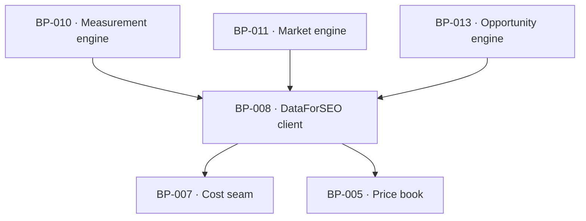

# BP-008 — Search-data vendor client — the closed DataForSEO endpoint list

- Parent: BP-001
- Kind: **component** — the typed boundary to the one search-data vendor.

## Responsibility
Expose exactly the DataForSEO endpoints `BUILD.md` §6.3 admits, each already
priced, cached and cost-contexted, and make every endpoint on the never-list
unreachable from application code. Research on the DataForSEO endpoints, competing
products' measurement practices, and the closed dataset list is in
`registry/evidence/RESEARCH-dataforseo-endpoints.md` and
`registry/evidence/RESEARCH-competitor-visibility-measurement.md`.

## Module / boundary
`src/lib/vendors/dataforseo/` — one function per admitted endpoint, plus the
response parsers that turn a vendor payload into the product's own types. No
other module constructs a vendor URL.

## Diagram


## Public interface
```ts
// Every call takes the CostContext; none can be made outside one.
export function rankedKeywords(c: CostContext, a: { domain: string; rows: 50|100|300 }): Promise<Measured<RankedRow[]>>
export function keywordSuggestions(c: CostContext, a: { seed: string; rows: 50 }): Promise<Measured<SuggestionRow[]>>
export function competitorsDomain(c: CostContext, a: { domain: string }): Promise<Measured<CompetitorRow[]>>
export function serpOrganic(c: CostContext, a: { query: string; mode: 'live'|'std'; loadAsyncAiOverview: boolean }): Promise<Measured<SerpResult>>
  // SerpResult carries organic top-10 AND the ai_overview item with its
  // reference domains. `loadAsyncAiOverview` is required, never defaulted
  // (decision 2's pattern applied a second time): `true` only at BP-025's
  // twelve-question free-matrix call site, `false` everywhere else —
  // ADR-094 (landmine). BUILD.md §6.2/§6.4 still say "never set" this flag
  // in writing; that line is superseded by the 2026-09-03 owner ruling
  // ADR-094 records, not by this comment.
export function aiMode(c: CostContext, a: { query: string; mode: 'live'|'std' }): Promise<Measured<AiAnswer>>       // paid battery only
export function llmScraper(c: CostContext, a: { query: string; mode: 'std' }): Promise<Measured<AiAnswer>>          // paid battery only

// Every call is fixed to SERP_LOCATION (Google US / en) and depth 10.
```

## Data model delta
None of its own; payloads land in `fetches` through BP-007.

## Error & edge behavior
- **The never-list is enforced by absence**: SERP depth > 10, search operators,
  clickstream flags, Labs historical endpoints, per-rival `ranked_keywords` on
  the free path, a fourth engine, per-draft re-probing and AI Keyword Data have
  no function to call.
- **`load_async_ai_overview` is the never-list's one admitted exception**
  (ADR-094, 2026-09-03 owner ruling — supersedes `BUILD.md` §6.2/§6.4's
  "Never set"). `serpOrganic`'s `loadAsyncAiOverview` parameter is required,
  never defaulted, so a call site that has not decided is a compile error;
  only BP-025's twelve-question free-matrix call passes `true`, and only on an
  **initial** pass — a correction's re-run of that same fan-out passes `false`
  (ADR-094 decision 5, owner ruling on `OWNER-QUESTIONS.md` item 9). Every other
  call site — the paid weekly and deep target-SERP battery — passes `false`
  explicitly, unchanged.
- **A flagged call reserves the surcharge and settles the vendor's own charge.**
  `serpOrganic` passes `costCents` at `ASYNC_AIO_SURCHARGE_MULTIPLIER`× the base
  price when the flag is `true`, and supplies BP-007's `settleCents` closure
  (ADR-094 decision 3a) applying the rule the vendor documents: the base price
  where the response's `ai_overview` element is absent or carries
  `asynchronous_ai_overview: false`, the surcharge rate where it does not. The
  rule lives here because it is vendor knowledge; the seam stays generic. An
  unflagged call supplies no closure and behaves as every other endpoint does.
- Zero rows is a legal, billed result and returns a measured empty array —
  never `unmeasured`. A vendor error, a timeout or an unparseable payload
  returns `unmeasured` with its reason, so REQ-004's trichotomy survives the
  vendor boundary intact.
- `mode: 'live'` is permitted only where a human is waiting; the deep pass and
  the free scan pass `'live'`, every scheduled job passes `'std'`. The mode is a
  required argument precisely so a scheduled caller cannot inherit `'live'` by
  default.
- Credentials come from BP-005's `env` and never appear in a log, a payload or an
  error message.

## NFR budget
- 12 live SERPs for the free battery complete within the 60-second promise at
  bounded concurrency; the free path makes **zero** AI Optimization calls
  (`BUILD.md` §6.2).
- Free battery ≤ 6.6¢ target (BP-011's corrected two-nano-call reading,
  BP-025 decision 2), 12¢ cap; weekly paid battery **2.88¢** (corrected
  2026-09-03: `AI_MODE_STD_C` was pinned at half the vendor's price — BP-005
  decision 3 addendum). **Since ADR-094**, the free matrix's SERPs carry
  `loadAsyncAiOverview: true` on an initial pass, which **reserves** ~7.2¢ for
  BP-025's own spend and **settles** between 4.8¢ and 7.2¢ by how many of the
  twelve carried an asynchronous overview (ADR-094 decision 3a; see that node's
  NFR budget) — inside the 12¢ cap either way. The paid
  weekly battery's own figure is unchanged by ADR-094, only by the AI Mode
  price correction above.
- Observability: endpoint, rows returned, cost, cache hit or miss, duration.

## Decisions
1. **One function per admitted endpoint; the never-list has no function** — Status: accepted
   - Context: `BUILD.md` §6.4's never-list is a policy, and a policy expressed as
     a comment is a policy that ships.
   - Decision: express the closed list as the module's exported surface. A call
     the product may not make is a compile error, not a review finding.
   - Alternatives considered: a generic `dataforseo(endpoint, params)` with a
     runtime allow-list — rejected, it moves a build-time guarantee to runtime
     and makes "which datasets does the product pull" unanswerable by reading
     one file.
   - Consequences: adding an endpoint means adding a price-book row and a
     function, which is exactly the friction the charter's cost envelope asks
     for.
2. **`mode` is required, never defaulted** — Status: accepted
   - Context: live-mode creep is one of the charter's four named cost dangers.
   - Decision: no default; every call site states whether a human is waiting.
   - Alternatives considered: default `'std'` — rejected, a defaulted parameter
     is invisible at the call site and the free path's 60-second promise depends
     on the opposite choice.
   - Consequences: noisier call sites, which is the point.
3. **`load_async_ai_overview` is admitted, on one call site, by owner ruling** — Status: accepted
   - Recorded as **ADR-094 (landmine)**: the reasoning spans this node, BP-007
     and BP-025, and it corrects a line `BUILD.md` §6.2/§6.4 still states in
     writing ("Never set `load_async_ai_overview`"), so it is a standalone
     file, not an entry here. Two amendments there bind this node and are not
     restated: **decision 5** (a correction's pass passes `false`) and
     **decision 3a** (this node supplies BP-007's `settleCents` closure, so the
     ledger records the vendor's documented charge rather than the reservation).

4. **One `freshnessDays` per endpoint, named here, with one stated exception** — Status: accepted (parameter, rule 1.1)
   - Context: this node is the only caller of BP-007's `recordFetch`, whose
     `freshnessDays` is a required per-call argument, and no line here said
     which window each endpoint passes. `BUILD.md` §6.4 states the SERP
     window with an unhomed exception — "SERPs 30d (except the weekly target
     re-check)" — and BP-005's `CACHE_WINDOWS_D` pinned four windows with no
     row for it.
   - Decision: `rankedKeywords` on the customer's own domain passes
     `CACHE_WINDOWS_D.own` (7d); on a rival, and `competitorsDomain`, pass
     `CACHE_WINDOWS_D.rival` (30d); `keywordSuggestions` passes
     `CACHE_WINDOWS_D.suggestions` (30d); `serpOrganic` passes
     `CACHE_WINDOWS_D.serp` (30d) at every call site **except BP-050's weekly
     target-SERP battery**, which passes the new `CACHE_WINDOWS_D.serpWeeklyRecheck`
     (7d, BP-005 decision 3 addendum) — the home `BUILD.md` §6.4's exception
     had none.
   - Alternatives considered: pass `CACHE_WINDOWS_D.serp` everywhere and let
     BP-050 read the pinned 30 — rejected, that is the defect this decision
     exists to close: three weeks of every four the weekly re-check would
     serve a cached SERP wearing that week's date, and REQ-065's "measured
     once a week" would be met by a monthly measurement; mint no exception and
     have BP-050 buy `mode: 'live'` weekly to force a fresh call regardless of
     cache — rejected, live mode is reserved for a human waiting (decision 2)
     and would multiply the weekly battery's cost 3–7× for no reason the cache
     window doesn't already give more cheaply.
   - Consequences: none for this interface — every window was already an
     argument each call site supplies; this decision states which constant
     each site passes rather than leaving it to the first implementer.
   - Cost of reversing: one pin and one call-site argument per site.

5. **The cache key for a paid-battery call carries the site id; it is not
   shared across customers** — Status: accepted (parameter, rule 1.1)
   - Context: BP-007 keys the cache `source + cacheKey + policyVersion` and no
     node stated what `cacheKey` is for any endpoint. For `serpOrganic` the
     choice decides the product's largest recurring cost: a key of `query +
     SERP_LOCATION` alone is shared across every customer whose market
     contains that search — a market's thirteen weekly target SERPs bought
     once however many customers track it; a key carrying the site id buys
     them once per customer. `DATA-COSTS.md` §5's COGS roll-up and BP-050's
     NFR budget ("≈8.7¢ ledgered per site") already assume the second and
     neither stated so until now.
   - Decision: the paid weekly and deep target-SERP battery's `cacheKey`
     includes the site id: `query + SERP_LOCATION.location + '|' +
     SERP_LOCATION.language + '|' + siteId`. The free path's twelve-question
     matrix keys on domain instead of site id — the same shape, since a free
     scan has no account — and gains negligible cross-domain sharing anyway:
     BP-007's own rule serves the stored report and opens no cost context at
     all for a domain re-scanned inside 7 days, so the only calls this key
     could share are between two *different* domains whose markets happen to
     select an identical phrase, a coincidence too rare to design the key
     around.
   - Alternatives considered: share the key across customers (query +
     location only) — rejected here, not on the merits of cheaper spend, but
     because it would silently invalidate the COGS figures `DATA-COSTS.md`
     §5 already publishes and BP-050's NFR budget already states, without
     re-deriving either; that re-derivation is `DATA-COSTS.md`'s to make,
     not a side effect of a cache-key pin.
   - Consequences: matches the cost model already on record. A future move to
     a shared key is cheap in code — dropping one field from the key
     expression — and expensive in bookkeeping: it re-opens `DATA-COSTS.md`'s
     COGS roll-up and BP-050's NFR line, which this decision leaves standing.
   - Cost of reversing: one field in one expression; the real cost is the
     re-derivation named above, not the code.

## Status grounds (rule 3.2)
Self-certified `approved`. Grounds: cut from `BUILD.md` §6.1 to §6.4 (the price
book, the AI-visibility ruling and the never-pull list), not from one
requirement; `satisfies` empty by rule 5.4, so §3's blueprint gate — "no blueprint from a non-approved
requirement" — reads no ancestor here. `covers` is coverage, never authorising
ancestry (rule 5.4), so these grounds assert nothing about the status of the
requirements this node covers; eight of the corpus's requirements are
`in-review` and none of them is this node's ancestor.

## Open questions

None.

## Log
- 2026-09-03 amended — architect — `/decide`: `serpOrganic` gained the required `loadAsyncAiOverview` parameter, the never-list bullet corrected, NFR budget worst case updated, decision 3 added, `rests-on` row added — all per **ADR-094** (landmine, owner ruling 1, `OWNER-QUESTIONS.md` item 1). Status grounds unaffected: REQ-006/008/041/047/063/096 (`covers`) are unchanged by this edit and `satisfies` remains empty.
- 2026-09-03 reviewed — research/efficiency — cost-envelope audit: three REVIEW lines raised (no endpoint-to-freshness map and no home for `BUILD.md` §6.4's weekly-SERP exception; no stated cache key; three stale figures in the NFR budget). No interface or decision changed.
- 2026-09-03 amended — architect — settled all three. Decision 4 added: the endpoint-to-freshness map, and `CACHE_WINDOWS_D.serpWeeklyRecheck` (BP-005) closes the weekly-recheck exception. Decision 5 added: the paid battery's `cacheKey` carries the site id, matching `DATA-COSTS.md`'s existing COGS assumption (parameter, rule 1.1). NFR budget corrected: 6.6¢ free-battery target, 2.88¢ weekly paid battery, per BP-005's price-book correction. `satisfies` unaffected; no requirement text changed.
- 2026-09-03 amended — architect — `/decide` follow-up: the flag bullet now scopes `true` to an **initial** pass (ADR-094 d5) and one bullet added for the reserve/settle closure this node supplies (ADR-094 d3a); NFR budget states reserved and settled; decision 3 and the `rests-on` row point at both amendments. No signature change — `loadAsyncAiOverview` and `mode` are unchanged — and no `covers` edge moved.
