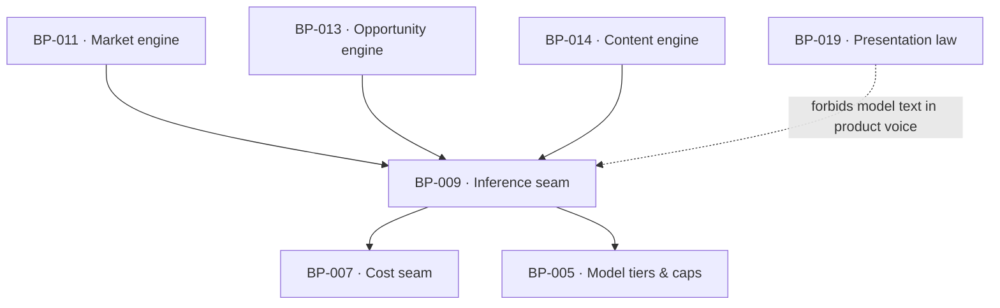

# BP-009 — Inference seam — the one llm() call site registry

- Parent: BP-001
- Kind: **component** — the only place a language model is called.

## Responsibility
Make every model call go through one function with a declared call site, a
declared model tier, a declared cost and a typed output — so the closed set of
things a model is allowed to touch is readable in one file and enforced by the
type system.

## Module / boundary
`src/lib/llm/` — the seam, the model tiers, the prompt templates and the call-site
union. Callers are BP-011 (profile, question phrasing), BP-013 (opportunity
typing) and BP-014 (brief, outline, draft, answerability pass, claim check).

## Diagram


## Public interface
```ts
export type LlmCallSite =
  | 'profile'            // nano · homepage+pricing text -> business profile (BUILD 6.7 step 1)
  | 'question-phrasing'  // nano · a selected search -> a question's wording (step 4)
  | 'opportunity-typing' // haiku · label/classify an already-derived opportunity
  | 'brief' | 'outline'  // nano
  | 'draft'              // haiku · grounded draft
  | 'answerability'      // haiku · answerability + SEO pass
  | 'claim-check'        // nano

export function llm<T>(c: CostContext, call: {
  site: LlmCallSite
  input: unknown
  schema: ZodType<T>          // output is parsed or the call failed
  tier: 'nano' | 'haiku'
}): Promise<Measured<T>>
```

## Data model delta
None; every call is ledgered in `fetches` through BP-007 with the call site as
its `source`.

## Error & edge behavior
- A response that does not parse against the schema is `unmeasured` with reason
  **`undeterminable`** — REQ-004 criterion 6's "unreadable", BP-024's member,
  not this node's to widen — retried at most once inside the caller's own
  budget, and never silently coerced. The parse/unavailability distinction is
  kept in this node's log, as the `parse outcome` field the `## NFR budget`
  below already specifies, and `unparseable` is a value of *that* field alone.
  **This sentence read `unparseable` until 2026-09-04 and named a member
  `UnmeasuredReason` has never had; see ADR-096 (landmine) before making the
  union agree with the old wording.**
- **The model touches vocabulary, never selection** (`BUILD.md` §6.7): the seam
  refuses to be given a selection decision by construction — `profile` and
  `question-phrasing` return words, and the twelve searches are chosen by
  BP-011's deterministic scorer before either call is made.
- Model unavailability degrades the caller; every product-voice string still
  renders because none of them comes from here (REQ-093 criterion 5).
- No call site outside the union exists; adding one is a change to this node and
  to REQ-093's admissions.

## NFR budget
- Nano ~0.3¢ per `profile` call. A day of content is this node's five
  content-pipeline calls — `brief`, `outline`, `draft`, `answerability`,
  `claim-check` — at `DATA-COSTS.md` §4's own per-step prices, ~4.4¢, plus its
  ×1.5 retry allowance on the two haiku steps (~2.0¢): **~6.4¢ against the
  45¢ cap**. `DATA-COSTS.md` §4's own total of ~6.5¢ includes a 0.1¢
  embeddings row this node does not call — the near-duplicate check is
  BP-042's shingle overlap at 0¢, own compute, and has no call site or tier
  in this node's `LlmCallSite` union.
- p95 latency: nano ≤ 3 s, haiku ≤ 20 s; the free scan's **two** nano calls —
  `profile` and `question-phrasing` (BP-025 decision 2) — sit inside the
  60-second promise, ≈0.6¢ together (BP-011's corrected free-scan reading).
- Observability: call site, tier, tokens in and out, cost, duration, parse
  outcome; never the prompt or the completion in a log.

## Decisions
1. **A closed call-site union rather than free-form prompts** — Status: accepted
   - Context: REQ-093 makes "where may model text appear" a customer promise, and
     the answer must be checkable by reading one file.
   - Decision: the union is the answer, and every member maps to one of REQ-093's
     admissions or to text no reader ever sees (brief, outline, claim check).
   - Alternatives considered: a generic prompt helper — rejected, it makes the
     promise unverifiable and puts the burden on review.
   - Consequences: an eighth call site is a requirement change, not a code change.
2. **`llm()`'s `site` parameter is narrowed to `LlmCallSite`, and WO-027 is
   what narrows it** — Status: accepted
   - Context: WO-026 shipped `src/lib/llm/index.ts` with `call.site` typed
     `string`, because `LlmCallSite` is WO-027's own file
     (`src/lib/llm/call-sites.ts`) and WO-027 lands after WO-026 and lists no
     modify row for `index.ts`. Every member the union will ever have is a
     string literal, so the widening is source-compatible in both directions
     and nothing shipped is wrong today.
   - Decision: it is narrowed, and it is WO-027's one-line modify row on
     `src/lib/llm/index.ts` that does it — not left as `string`.
   - Alternatives considered: leave `string` permanently — rejected. Decision 1
     above says the closed set must be "enforced by the type system", and a
     `string` parameter at the only seam that reaches a model enforces nothing:
     the promise degrades to the review burden decision 1 explicitly rejected.
     Add the union to WO-026 instead — rejected, that is a file WO-026 does not
     own and would invert the two orders' dependency edge.
   - Consequences: **WO-027's file plan gains `src/lib/llm/index.ts` as a
     modify row** — one import and one parameter type, nothing else — and its
     test plan gains the assertion that a non-member string is a type error.
     Cost of reversing: one line, one direction, no data and no caller.

## Status grounds (rule 3.2)
Self-certified `approved`. Grounds: cut from the charter's stack table
("Inference | … behind one `llm()` seam with per-call cost logging") and
`BUILD.md` §8, not from one requirement; `satisfies` empty by rule 5.4, every
`covers` requirement approved.

## Open questions

None.

## Log
- 2026-09-03 reviewed — research/efficiency — cost-envelope audit: two REVIEW lines raised (the NFR budget's stale "single nano call" wording; the per-day total assembled from a call this node cannot make).
- 2026-09-04 amended — architect — W4 `rests-on` disposition, WO-026's two type-ownership rows: `## Error & edge behavior`'s parse-failure reason corrected from `unparseable` (a member `UnmeasuredReason` has never had) to `undeterminable`, with `unparseable` kept as the log's parse-outcome value — reasoning in ADR-096 (landmine), which spans BP-019/BP-020's owner-owed copy keys and so earns a file under rule 2.2. Decision 2 added: `call.site` is narrowed to `LlmCallSite` by a one-line modify row on WO-027, not left `string`. No `satisfies`/`covers` edge changed; no requirement text touched.
- 2026-09-03 amended — architect — settled both: NFR budget corrected to state the two free-path nano calls (BP-025 decision 2) and the five content-pipeline calls this node actually makes, ~6.4¢ against `CAPS.DRAFT_C` (excluding `DATA-COSTS.md`'s embeddings row, BP-042's). `satisfies` unaffected; no requirement text changed.
