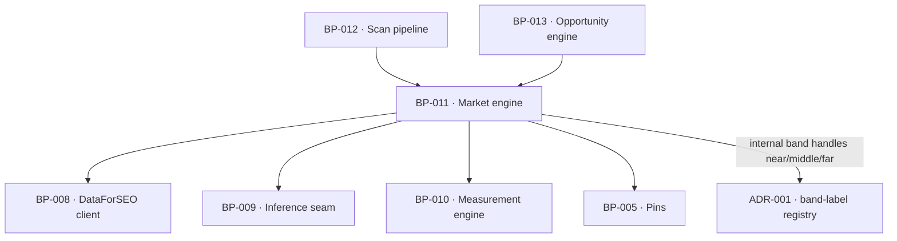

# BP-011 — Market engine — profile, the twelve questions, rivals and rival sizing

- Parent: BP-001
- Kind: **component** — the chain from a URL to the twelve questions, and from
  the twelve questions to the rivals.

## Responsibility
Derive, deterministically and auditably, what market a domain is in, the twelve
questions that stand for it, the rivals competing in it and how big each of those
rivals is — with a language model touching vocabulary and never selection. Research on
the DataForSEO endpoints and competing products' measurement practices is in
`registry/evidence/RESEARCH-dataforseo-endpoints.md` and
`registry/evidence/RESEARCH-competitor-visibility-measurement.md`.

## Module / boundary
`src/lib/market/` — profile, market set, the deterministic selector, question
phrasing, the coherence check, rival derivation from the twelve SERPs, and rival
sizing and banding. It owns the question set's identity and its freezing after
confirmation.

## Diagram


## Public interface
```ts
export function deriveProfile(c: CostContext, a: { home: string; pricing?: string }): Promise<Measured<Profile>>
export function deriveMarketSet(c: CostContext, a: { seeds: string[] }): Promise<Measured<SuggestionRow[]>>

/** Deterministic. No model call. score = intentWeight x log10(volume+1), volume
 *  floor 50/mo, own-brand dropped, relevance guard against the profile's
 *  vocabulary, near-duplicate collapse, composition constraints. Returns as many
 *  as the market yielded — never padded to twelve. */
export function selectTwelve(a: { profile: Profile; market: SuggestionRow[] }): SelectedSearch[]

/** `BUILD.md` §6.7 step 3's intent classifier, exported because it is also the
 *  `intent` term in BP-040's ranking formula. One classification in the product,
 *  not two (rule 2.4): a second classifier would let a search be `decision` for
 *  selection and `informational` for ranking on the same scan. Deterministic
 *  keyword-shape patterns, no model call; the weights are BP-005's
 *  `SELECTION.intentWeights`. */
export type Intent = 'decision' | 'solution' | 'problem' | 'informational'
export function classifyIntent(keyword: string, p: Profile): Intent | 'own_brand'
export function intentWeight(keyword: string, p: Profile): number   // 3 | 3 | 2 | 1; own_brand drops
  // These read `query` and `'own-brand'` at approval. BP-025, the leaf cut from
  // REQ-006 that owns `src/lib/market/questions/**`, ships `keyword` and
  // `'own_brand'`; one symbol cannot carry two spellings, and the leaf's is the
  // one bound to the requirement — the same precedent BP-010 records for
  // `computeScore`. `keyword` is also what every sibling in that module already
  // calls the field (`SuggestionRow.keyword`, `SelectedSearch.keyword`,
  // `stemKey`), and `own_brand` matches the corpus's dominant convention for a
  // multi-word string-literal member. See decision 2.

export function phraseQuestions(c: CostContext, a: { selected: SelectedSearch[] }): Promise<Measured<Question[]>>
  // template-first; phrasing never changes which search a question stands for

/** The union is BP-028's `CoherenceVerdict` and each arm carries the figures the
 *  report renders. This section declared a bare three-arm union at approval;
 *  BP-028, the leaf cut from REQ-094, ships the shape below, and one symbol in
 *  `src/lib/market/coherence/check.ts` cannot carry two. Same precedent as
 *  BP-010's `computeScore`. */
export type CoherenceVerdict =
  | { verdict: 'coherent' }
  | { verdict: 'incoherent'; threshold: number; best: number }
  | { verdict: 'unjudgeable'; measuredCount: number }
export function checkCoherence(a: { serps: SerpResult[]; measuredCount: number }): CoherenceVerdict

/** Zero extra cost: counts over the twelve SERPs already bought. */
export function deriveRivals(a: { serps: SerpResult[]; ownDomain: string }):
  { rivals: RivalCandidate[]; sources: string[] }   // score = top10Appearances + 2 x aiCitations

export function sizeRivals(c: CostContext, a: { rivals: string[]; ownRanked: number }):
  Promise<Measured<RivalSize[]>>     // { domain, rankedCount, band: 'near'|'middle'|'far', at }
```

## Data model delta
Writes the `questions`, `market`, `rivals` and `coherence` sections of
`scans.report jsonb` — each has a member on BP-012's `StoredReport` to land in,
`coherence` since **ADR-095** decision 3 and `market` in BP-025's `MarketSet`
shape (decisions 1 and 2), not this node's `deriveMarketSet` return type; writes `sites.category` and `sites.competitors jsonb` on
confirmation. Rival sizes and bands live in the scan's report blob, not on
`sites`, so a band always carries the date it was measured (REQ-096 criterion 4).

## Error & edge behavior
- **Cold start is the default path, not a branch.** Profile is derived from the
  homepage's own text, never from rankings; the market set is seeded from the
  profile; rivals are counted over the market's SERPs. Output is identical at
  0 and at 10,000 ranked searches (`BUILD.md` §6.6).
- Fewer than twelve is a legal result: the volume floor, the relevance guard, the
  near-duplicate collapse and the composition constraints may each leave the set
  short, and nothing is invented to reach twelve (REQ-006 criteria 1 and 8).
- `checkCoherence` has three verdicts, not two, because a report that measured
  fewer than three searches cannot judge coherence and must say so rather than
  claiming the market looks wrong (REQ-094 criterion 2).
- The question set freezes after the customer confirms the category and
  re-derives only when they change it (REQ-071 criteria 7 and 15).
- A rival is sized only after the deep pass; before that, no band and no blank —
  one written line (REQ-096 criterion 5). No band ever removes a rival from the
  set (criterion 7).

## NFR budget
- The whole chain on the free path: **two** nano calls (~0.6¢ — `profile` at
  §6.7 step 1 and `question-phrasing` at step 4), one suggestions call (1.8¢),
  twelve live SERPs (2.4¢) — 4.8¢ for this chain, inside the 60-second promise
  and the 12¢ cap. `BUILD.md` §6.7 step 4 reads "nano, same call as step 1",
  which is arithmetically impossible: step 4's input is step 3's output and step
  3's input is step 2's, so the phrasing call cannot precede its own input.
  BP-009's `LlmCallSite` already carries `'profile'` and `'question-phrasing'` as
  two sites. With the second call counted, `BUILD.md` §6.3's free-scan headline
  of "~6.3¢" is ~6.6¢ (0.6 nano + 1.8 suggestions + 2.4 SERPs + 1.8
  `ranked_keywords`@50), still under the 12¢ cap with 5.4¢ of headroom.
  `BUILD.md` is the incoming specification and is not edited; the divergence is
  recorded here and reported to its owner.
- Rival sizing rides the monthly rival `ranked_keywords` rows; it buys nothing new
  (REQ-096 non-goal).
- Determinism: given the same market rows and the same profile, `selectTwelve`
  returns the same twelve in the same order.

## Decisions
1. **Selection is deterministic; the model only words the question** — Status: accepted
   - Context: `BUILD.md` §6.7 states it, and REQ-006 criterion 13 makes it a
     customer promise ("how the question is worded never changes which search it
     stands for").
   - Decision: `selectTwelve` takes no `CostContext` — it cannot make a model
     call, by signature.
   - Alternatives considered: an LLM re-ranker over the fifty suggestions —
     rejected, it makes the provenance line unfalsifiable and breaks REQ-006
     criterion 13.
   - Consequences: selection quality rests on the intent-weight patterns, which
     are pins and therefore tunable without touching a promise.
2. **The intent classifier is exported, not copied** — Status: accepted
   - Context: `BUILD.md` §6.7 step 3's `intentWeight` decides which twelve
     searches are selected. `BUILD.md` §7's ranking formula
     (`demand × intent × (1−effort) × fit`) needs the same classification, and
     BP-040 recorded an open `rests-on` that this node would export it rather
     than let a second one be minted.
   - Decision: `classifyIntent` and `intentWeight` are public. The weights stay
     BP-005 pins; the patterns stay here, in one place.
   - Alternatives considered: BP-040 classifies again from the same patterns —
     rejected under rule 2.4: the second copy is how a search becomes `decision`
     for selection and `informational` for ranking on the same scan, and neither
     number is wrong on its own so nothing fails; a shared pattern list in BP-005
     with two implementations over it — rejected, the pins file holds values, not
     behaviour (`structure.md` rule 5).
   - Consequences: BP-040 depends on this node's interface, which it already
     declares. Reversal is a copy, which is the thing being prevented.
   - **Two corrections, 2026-08-31.** (a) The exported symbol lives in BP-025's
     `src/lib/market/questions/select.ts` — this node declares the seam, BP-025
     ships it — and BP-025's `## Public interface` omitted `intentWeight`
     entirely even though `structure.md` and `capabilities.md` both list it as
     that module's entry point. It is declared there now. (b) The parameter is
     `keyword`, not `query`, and the extra member is `'own_brand'`, not
     `'own-brand'`, per the leaf. (c) BP-040 decision 3 called it
     `intentWeight(query) / 3` with one argument — a one-argument classifier is
     precisely the second classifier this decision rejects, since the drop set is
     the profile's. BP-040 is corrected and `rankScore` now carries a `profile`.
3. **Rival size bands carry internal handles here; their words are elsewhere** — Status: accepted
   - Context: REQ-096 names the bands `near`, `middle`, `far` as internal handles
     and requires the customer-facing terms to share nothing with REQ-047's
     winnability terms — a constraint over the union of two engines' outputs.
   - Decision: this node produces handles only. The words, and the disjointness,
     are ADR-001's.

## Status grounds (rule 3.2)
Self-certified `approved`. Grounds: cut from `BUILD.md` §6.6 and §6.7, not from
one requirement; `satisfies` empty by rule 5.4, every `covers` requirement
approved.

## Open questions
