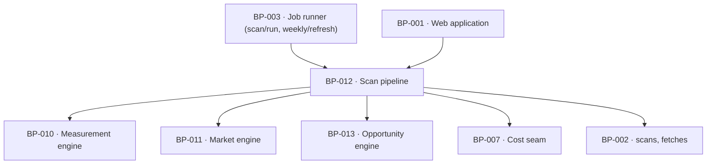

# BP-012 — Scan pipeline — one pipeline, tier as a parameter, bounded in time and money

- Parent: BP-001
- Kind: **component** — the orchestration every measurement in the product runs
  through.

## Responsibility
Run the one measurement pipeline at whichever tier it was asked for, admit or
refuse a free scan against the free path's bounds, hold the time and spend
ceilings, and store exactly one current report per domain with the date it was
measured. Research on the DataForSEO endpoints and pricing is in
`registry/evidence/RESEARCH-dataforseo-endpoints.md`.

## Module / boundary
`src/lib/scan/` — admission control, the staged pipeline, the ceilings, the
report blob assembly, the current-report pointer, and the progress stream the
waiting screen reads. It calls BP-010, BP-011 and BP-013; it renders nothing.

## Diagram


## Public interface
```ts
export type Tier = 'free' | 'deep' | 'weekly'

export function runScan(a: {
  domain: string; siteId?: string; tier: Tier
  correctionOf?: string          // a market correction re-measures inside the scan it corrects
}): Promise<{ scanId: string; status: 'done' | 'degraded' | 'failed' }>

export type Admission =
  | { admit: true }
  | { refuse: 'hourly'; retryAfterSeconds: number }
  | { refuse: 'in_flight'; sameDomain: boolean; runningScanId?: string }
  | { refuse: 'daily'; retryAfterSeconds: number }
  | { refuse: 'switched_off' }        // no time promised
  | { refuse: 'cooldown'; retryAfterSeconds: number }
  | { refuse: 'removed' }
// `CanonicalDomain` and `NetworkKey` are `src/lib/scan/domain.ts` and
// `src/lib/scan/admission.ts`'s branded string types (BP-023); corrected
// here 2026-09-03 from the looser `{ domain: string; network: string }`
// this line originally read — same contract, narrower typing, no behaviour
// change (drift assessment, this node's `rests-on`).
export function admitFreeScan(a: { domain: CanonicalDomain; network: NetworkKey }): Promise<Admission>

/** The versioned report blob `BUILD.md` §10 names ("report jsonb(versioned blob:
 *  measurements, questions, answers, market set)"), declared here because this
 *  node assembles it and is the only writer. Five blueprints named this type and
 *  none declared it; consumers were reading it through locally-invented reader
 *  interfaces, which is the second copy rule 2.4 exists to prevent.
 *
 *  Every section is a type its own node already owns. This node composes and
 *  stores; it defines none of the section shapes and re-derives no figure. A
 *  section that could not be measured is present with its `Measured` arms
 *  saying so — a section is never omitted, because an absent key and a
 *  `not_attempted` value read the same to a consumer and REQ-004 forbids that. */
export interface StoredReport {
  version: number                        // the blob is versioned; readers branch on nothing else
  scanId: string
  domain: CanonicalDomain                // ADR-020's one canonical key
  measuredAt: Date                       // one date; every figure under it is this scan's
  tier: Tier
  complete: boolean                      // false where `stopped_reason` is a ceiling or a failure
  stoppedReason: 'complete' | 'time_ceiling' | 'spend_ceiling' | 'failed'
  fromIncompleteRescan: boolean          // REQ-001 c14's re-scan control reads this
  verdict: Verdict                       // BP-024 — score, band, factors, missing, blockedReaders
  market: Measured<MarketSet>            // BP-025 — profile, suggestions, total volume (ADR-095)
  questions: Measured<Question[]>        // BP-025 — the twelve, or as many as the market yielded
  answers: AiAnswersCard                 // BP-025 — REQ-006 c1's denominator lives in here
  serps: readonly Measured<SerpResult>[] // BP-026 — the bought top-tens, per target search
  rivals: Measured<RivalCandidate[]>     // BP-026
  rivalSizes: Measured<RivalSize[]>      // BP-052 — absent on the free path by REQ-096's non-goal
  onPage: OnPageFacts                    // BP-010
  robots: Measured<RobotsPolicy>         // BP-006's type, BP-010's measurement
  coherence: CoherenceVerdict            // BP-028 — total union, unwrapped; ADR-095 decision 3
  correctionState: CorrectionState       // BP-028's value domain, stored on the scan row too
}
export function readCurrentReport(domain: string): Promise<StoredReport | null>
export function progress(scanId: string): AsyncIterable<{ stage: StageName; done: boolean }>
```

## Data model delta
`scans` — as `BUILD.md` §10, plus `is_current` (partial unique index on `domain`
where `is_current`), `supersedes_scan_id`, `correction_state`, and
`stopped_reason` (`'complete' | 'time_ceiling' | 'spend_ceiling' | 'failed'`).
One report blob per scan; no per-section tables.

## Error & edge behavior
- **The pipeline never branches on tier; only its parameters change** — row
  counts, live versus standard mode, which batteries run. Cold start branches
  nothing at all (`BUILD.md` §6.6).
- Two ceilings, both giving back what was measured: 90 seconds (REQ-003
  criterion 5) and the tier's spend cap (REQ-003 criterion 11). Both end in a
  stored report whose outstanding work is `unmeasured / not_attempted`, never 0.
- The current-report pointer moves only when a new scan has produced a report,
  so a failed re-scan or a failed correction leaves the previous report and its
  date exactly where they were (REQ-001 criterion 17). The partial unique index
  makes "two current reports for one domain" unrepresentable.
- Admission is evaluated in one fixed order, and the order is this node's to fix
  (REQ-003 non-goal): **removed → cooldown → switched off / daily ceiling →
  in-flight → hourly**. Removal comes first because REQ-002 criterion 3 says a
  removed domain is never scanned again for anyone, which no other outcome may
  override; a limit refusal is told in writing either way.
- The limiter fails **open** (a scan proceeds if the limiter is unavailable);
  lead capture fails **closed** (BP-016). The asymmetry is `BUILD.md` §11's.
- A market correction runs inside the scan it corrects: same spend ceiling, no
  second allowance consumed, its own 60/90-second clock timed from acceptance.

## NFR budget
- Free scan: p95 ≤ 60 s to a readable report, hard stop at 90 s, ≤ 12¢ ledgered.
- Deep pass: live, released at 10 minutes whatever its state (REQ-029 criterion 5).
- Weekly: standard queue, ~8¢, once per site per customer-local week.
- Progress heartbeat at least every 30 s while a pass runs (REQ-029 criterion 1).
- Observability: stage transitions, stop reason, cost, degraded flag.

## Decisions
1. **A partial unique index, not application logic, enforces one current report** — Status: accepted
   - Context: REQ-001 criterion 17 and REQ-004 criterion 12 together forbid a
     report that carries measurements from two scans, and a correction, a re-scan
     and a weekly refresh can all race.
   - Decision: `unique (domain) where is_current` plus a single transaction that
     inserts the new scan and flips the pointer.
   - Alternatives considered: a "latest scan wins" read-side query — rejected, a
     failed re-scan then becomes the report; an application-level lock —
     rejected, it is a second copy of a constraint the database can hold.
   - Consequences: the flip is the commit point; anything that fails before it
     leaves the customer's report untouched, which is exactly the promise.
2. **Admission order is fixed here and cited by the requirements that defer it** — Status: accepted
   - Context: REQ-003's non-goal explicitly hands the evaluation order to the
     blueprint, derived from REQ-002 criterion 3.
   - Decision: the order above, exhaustive, with one written line per outcome.
   - Alternatives considered: checking limits before removal — rejected, it would
     tell a domain owner "try again in an hour" about a report that will never be
     served again.

3. **`StoredReport` is declared here, and it is a composition, not a
   re-derivation** — Status: accepted (2026-08-31)
   - Context: BP-022, BP-027, BP-013, BP-040 and BP-041 all name `StoredReport`
     and this node exports `readCurrentReport(domain): Promise<StoredReport |
     null>`; no `## Public interface` in the corpus declared its shape. Work
     orders were consuming it "opaquely through a narrow reader interface it
     defines locally" (WO-061's own `rests-on`), which is one type with as many
     shapes as there are readers.
   - Decision: the interface above. This node owns it because it assembles the
     blob and is its only writer; every field is a type another node already
     declares, so a section's shape changes in one place and this composition
     follows.
   - Alternatives considered: leave each consumer its own reader interface —
     rejected, it is rule 2.4's second copy N times and the first divergence is
     silent; declare it in BP-002 with the schema — rejected, the column is
     `jsonb` and its shape is this pipeline's contract, not the database's;
     declare a section-per-table model — rejected, `BUILD.md` §10 fixes "one
     report blob per scan, no per-section tables".
   - Consequences: BP-028's and BP-034's refusal to import this type stands and
     is now clearly a *cycle* decision rather than a shape one — `ReportFacts`
     and BP-034's equivalent stay, because `src/lib/market → src/lib/scan` is
     the edge structure.md rule 6 forbids, and a declared shape does not make
     that edge safe.
   - Cost of reversing: one interface. Nothing is stored differently; the blob
     already had this shape, unwritten.

## Status grounds (rule 3.2)
Self-certified `approved`. Grounds: cut from `BUILD.md` §11 (`scan/run`, "The one
pipeline; tier is a parameter") and §6.5, not from one requirement; `satisfies`
empty by rule 5.4, so §3's blueprint gate — "no blueprint from a non-approved
requirement" — reads no ancestor here. `covers` is coverage, never authorising
ancestry (rule 5.4), so these grounds assert nothing about the status of the
requirements this node covers; eight of the corpus's requirements are
`in-review` and none of them is this node's ancestor.

## Open questions

## Log
- 2026-09-03 amended — architect — drift assessment (`factory-console --check`'s `stale-blueprint` finding): `40a7ec9`/`c6c1788`/`7865c43`/`b1a7b60` build BP-023, this node's leaf, and confirm this node's declared `Admission` union and admission order verbatim. One real drift found and fixed: `admitFreeScan`'s parameter types were `{ domain: string; network: string }`; corrected to `{ domain: CanonicalDomain; network: NetworkKey }` to match `src/lib/scan/admission.ts` as built — same contract, narrower typing. `rests-on` row added.
