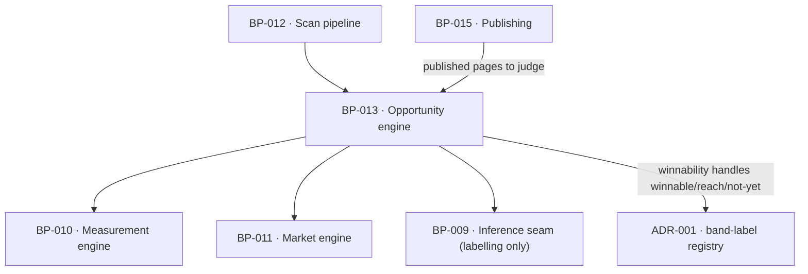

# BP-013 — Opportunity engine — evidence, acceptance tests, winnability, supply and verdicts

- Parent: BP-001
- Kind: **component** — the unit the whole subscription rests on, derived
  mechanically.

## Responsibility
Derive opportunities mechanically from measured evidence, band each target's
winnability, rank them into one list, keep the depth of unused supply, and judge
each published page every week against the test recorded when its opportunity was
created.

## Module / boundary
`src/lib/opportunities/` — the closed type enum, evidence assembly, acceptance
tests, the winnability bands, the ranking, the supply counters and the weekly
verdicts. A model labels; it never decides what an opportunity is.

## Diagram


## Public interface
```ts
export type OpportunityType =
  | 'answer_page' | 'keyword_page' | 'comparison_page' | 'format_page'   // Write
  | 'expand_page' | 'answerable_page' | 'refresh_page'                   // Improve
  | 'unblock'                                                            // Fix
export type Family = 'write' | 'improve' | 'fix'

// The four signatures below read `gate: string`, `Promise<Opportunity[]>`,
// `ownRanked: number` and `number[]` at approval. BP-040, the leaf cut from
// REQ-047 that owns `src/lib/opportunities/derive|winnability|rank/**`, ships
// what is written here now; one symbol cannot carry two signatures and the
// leaf's is the one bound to the requirement — the precedent BP-010 records
// in-file for `computeScore`, applied. See decision 5.
export type Acceptance =
  | { form: 'top20'; query: string }
  | { form: 'named_on'; question: string }
  | { form: 'gate_cleared'; gate: Barrier }    // BP-040's closed union, not a free string

export type Winnability = 'winnable' | 'reach' | 'not-yet'   // internal handles

export function deriveOpportunities(c: CostContext, a: {
  siteId: string; scanId: string; report: StoredReport; ownRanked: Measured<number>
}): Promise<{ created: Opportunity[]; assessed: number; rejected: RejectionCount }>

export function bandWinnability(a: { top10RankedCounts: Measured<number>[]; ownRanked: number }): Winnability
export function qualifies(a: { top10RankedCounts: Measured<number>[]; ownRanked: number }): boolean

/** Unused supply is `open` and non-`fix`. An `unblock` generates no page, so it
 *  is never a day of pages (REQ-047 c5, REQ-095). Shipped shape is BP-041's. */
export function supplyDepth(siteId: string): Promise<{
  unused: number
  exhaustedSince: Date | null             // set only while unused === 0
}>
export function nextForDay(siteId: string): Promise<Opportunity | null>   // ranked order; never invents; never an `unblock`

export function judgePublished(a: { siteId: string; weekStart: Date }):
  Promise<Array<{ publicationId: string
                  verdict: 'working' | 'too_early' | 'not_working' | 'not_judgeable'
                  reason?: 'search_untracked' | 'unpublished' | 'question_left_set' | 'domain_changed'
                  measuredAt: Date; decline?: number }>>
```

## Data model delta
`opportunities` as `BUILD.md` §10, with `acceptance jsonb` written at creation
and **never updated** (a database rule, not a convention: an update trigger
rejects a change to `acceptance` — REQ-047 criterion 8), `fit_band` holding the
winnability handle, and `status` in `open | queued | done | dismissed`. Supply
depth is `count(*) where status = 'open' and family <> 'fix'` — no counter table
(rule 2.4). The `family <> 'fix'` term is not an optimisation: see decision 2.

## Error & edge behavior
- **Supply is the cap.** No opportunity is ever created to fill a day; when
  evidence is exhausted, future days stay empty (REQ-047 criterion 3).
- Every opportunity carries the evidence its type demands — the Write family a
  rival page or position, the Improve family the customer's own page and the
  measurement showing the shortfall, `unblock` the barrier and the page it was
  found on — and every value is one the product measured (REQ-047 criterion 2).
- `unblock` consumes no publishing day, generates no page and is never actioned
  automatically in either mode (REQ-047 criterion 5).
- At `ownRanked = 0` the qualifying bar is `max(500, 0)` = 500 and the Winnable
  bar is `max(100, 0)` = 100, so all three bands stay reachable and the winnable
  set stays non-empty (REQ-047 criteria 11 and 14).
- A verdict is produced only from this week's re-measurement; a page whose
  recorded test can no longer be evaluated gets `not_judgeable` with which of the
  four causes, and the recorded test is never rewritten (REQ-063 criterion 6).
- A decline is reported beside the verdict, never smoothed (REQ-063 criterion 3).

## NFR budget
- Derivation adds no vendor spend beyond the rows the scan already bought,
  except `opportunity-typing` (haiku, ~4 calls per deep pass).
- Deep pass pursues 30 unused qualifying opportunities and stops at 30, at
  exhausted evidence, or when the pass ends early (REQ-095 criterion 1).
- Weekly verdicts for a site complete inside the weekly job's fan-out budget.
- Observability: per-derivation counts by type and by band; unused-supply depth
  after every pass.

## Decisions
1. **The acceptance test is immutable at the database level** — Status: accepted
   - Context: REQ-047 criterion 8 says the recorded test "is never rewritten —
     including where it can no longer be evaluated", and REQ-063 judges against
     it weeks later. A convention would survive exactly until the first
     convenient migration.
   - Decision: a trigger rejects any update to `acceptance` on `opportunities`.
   - Alternatives considered: application-level immutability — rejected, it is
     the second copy of a rule the database can hold and the failure is silent;
     versioned tests — rejected, REQ-047 forbids a second version existing.
   - Consequences: correcting a genuinely malformed test means dismissing the
     opportunity and deriving a new one, which is the honest move anyway.
2. **Supply depth is a query, never a counter — and it counts pages, not
   instructions** — Status: accepted
   (amended 2026-08-31; the predicate as approved was `status = 'open'` alone)
   - Context: REQ-095 criteria 5 and 6 render lines from the depth, and a stale
     counter would make the product tell a customer supply is short when it is not.
     Separately, REQ-047 criterion 5 says an `unblock` "takes no publishing day
     and consumes no supply", and every REQ-095 line is denominated in **days of
     pages** ("how many days of pages the product holds for them"). An `unblock`
     generates no page, so counting it makes the product tell a customer holding
     four instructions and no pages that they have four days of pages.
   - Decision: `count(*) where status = 'open' and family <> 'fix'`, indexed on
     `(site_id, status)`. The same predicate governs `exhaustedSince` and every
     other reading of depth. BP-041, the leaf cut from REQ-095, implements it and
     reported the narrowing upward; this entry is the amendment.
   - Alternatives considered: a materialised counter on `sites` — rejected,
     it is the classic drifting second copy. Counting every open row — rejected,
     it is the precise failure REQ-095 was written against, and it fails silently
     because a wrong count reads exactly like a right one. A separate `fix` table
     — rejected, the eight types are one closed enum (REQ-047 criterion 1).
   - Consequences: `unblock` is excluded from `unused`, from `nextForDay` and
     from `exhaustedSince`. Reversal is a predicate edit and a re-derivation of
     nothing stored — but it re-arms a false statement about the customer's own
     market, which is why the term is recorded here rather than left to the leaf.
3. **Winnability handles here; words in ADR-001's registry** — Status: accepted
   - Same shape as BP-011's decision 2; the disjointness constraint spans both.
   - The three words landed by owner ruling on 2026-08-31 (BP-019 decision 6);
     this node still emits handles only.

4. **A component's signature yields to its leaf's, and the correction is
   recorded in the component** — Status: accepted (2026-08-31)
   - Context: four symbols in this node's interface disagreed with BP-040's:
     `Acceptance.gate_cleared`'s gate, `deriveOpportunities`' return and
     `ownRanked`, and the two winnability predicates' count arrays. Nine
     planners hit the same class of divergence across the corpus and each
     implemented the leaf's, citing the precedent BP-010 records in-file for
     `computeScore`.
   - Decision: that precedent is the corpus-wide rule and is applied here. Where
     a component and the leaf beneath it declare one symbol two ways, **the leaf
     cut from the requirement wins**, because it is the node the stage gate binds
     (rule 5.4) and the one whose acceptance criteria the signature has to
     satisfy; the component's section is corrected in place with a comment saying
     what it read at approval, so nobody re-derives the superseded shape from a
     stale memory. It is not left to the reader to notice.
   - Alternatives considered: make the component authoritative and push the
     correction down into the leaves — rejected, it inverts rule 5.4 and would
     have overwritten four signatures that carry `Measured<T>` with four that
     lose the reason a count is absent, which is REQ-004's whole subject; leave
     both and let the implementer pick — rejected, that is the drift the
     blueprint-writing skill makes a `blocked-by`, and it silently picked
     differently in different work orders.
   - Consequences: a component's `## Public interface` is a summary that can go
     stale, and this is the maintenance that keeps it honest. Applied in this
     pass to BP-011, BP-013 and BP-014.
   - Cost of reversing: none in code; the leaves already say this.

## Status grounds (rule 3.2)
Self-certified `approved`. Grounds: cut from `BUILD.md` §7 and §9's Monday
verdicts, not from one requirement; `satisfies` empty by rule 5.4, every
`covers` requirement approved.

## Open questions
