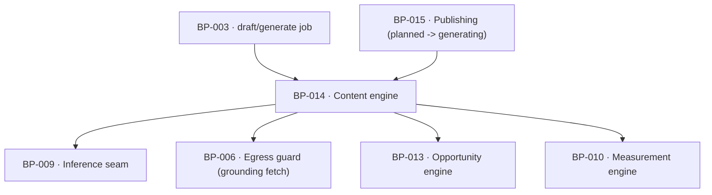

# BP-014 — Content engine — the five-step pipeline and the hard rules

- Parent: BP-001
- Kind: **component** — the one place a page is written, and the one place it is
  stopped.

## Responsibility
Write one page per opportunity through brief → outline → grounded draft →
answerability pass → claim check, and enforce every hard rule in code so a draft
that fails one is never queued for review.

## Module / boundary
`src/lib/generate/` — the pipeline, the grounding capture, the hard-rule battery
and the recovery path. It writes `drafts`; it does not publish and does not
render.

## Diagram


## Public interface
```ts
export type HardRule =
  | 'grounding'        // >=1 fact from a customer live page, with URL, read date, verbatim passage
  | 'rival_source'     // every competitor figure links the public page it came from
  | 'no_private_figure'// no ranking/volume/visibility figure only ReachKit holds
  | 'no_invented_people'
  | 'no_unsourced_testimonial'
  | 'brand_gap'        // brand absent from the first 300 rendered characters
  | 'no_hidden_text'   // nothing a reader of the published page would not see
  | 'no_machine_address'
  | 'near_duplicate'   // < 85% similar to every published/measured/queued page
  | 'do_not_claim'     // the customer's list, verbatim or paraphrase

// The three signatures below read differently at approval. BP-042 (cut from
// REQ-050) and BP-043 (cut from REQ-053) ship what is written here now; one
// symbol cannot carry two signatures and the leaf's is the one the stage gate
// binds — the precedent BP-010 records in-file for `computeScore` and BP-013
// decision 4 states as the corpus-wide rule.
export function generateDraft(c: CostContext, a: { opportunityId: string; siteId: string }):
  Promise<
    | { ok: true;  draftId: string; grounded: GroundedFact }
    | { ok: false; reason: 'rules'; failed: RuleFailure[]; attempt: 1 | 2 }
    | { ok: false; reason: 'step_failed'; step: PipelineStep }   // REQ-092 c1
  >
  // was: `{ ok: false; failed: HardRule[]; attempt }` — a bare rule list cannot
  // carry REQ-092 c1's "a step that failed", which is not a rule failure at all.

export function runHardRules(c: CostContext, a: {
  markdown: string; rendered: string; site: SiteRuleInputs
  comparison: ComparisonSet; grounded: GroundedFact | null
}): Promise<{ passed: true } | { passed: false; failed: RuleFailure[] }>
  // was: no `CostContext`, `site: SiteVoiceAndClaims`, `published: PageIndex`,
  // and `matchedEntry?` hoisted to the top level. `RuleFailure` carries the
  // matched entry on the arm that has one, so a caller cannot read a
  // near-duplicate's similarity off a do-not-claim failure.

export function claimCheck(c: CostContext, a: { text: string; list: string[] }):
  Promise<ClaimVerdict>
  // was: `{ markdown; list }` returning `Measured<{ passed; matchedEntry? }>`.
  // `ClaimVerdict`'s `unrun` arm names why it did not run (`llm_unavailable` |
  // `cap_hit`), which `Measured` flattens into `undeterminable`.

export function similarity(a: string, b: string): number   // one fixed recorded measure
```

## Data model delta
`drafts` as `BUILD.md` §10, plus `grounded_fact jsonb` carrying
`{ url, readAt, passage }` — the passage stored verbatim and never updated, so
the statement can still be read against it after the customer's own page has
moved on (REQ-050 criterion 1) — and `claim_check jsonb`
`{ state: 'pending'|'passed'|'failed', matchedEntry?, at }`, plus
`hard_rule_attempts smallint`.

## Error & edge behavior
- **One regeneration, then rest.** A draft stopped by any hard rule is
  regenerated exactly once; a second failure moves the item to
  `needs_attention` (BP-015's transition) and the day carries its line
  (REQ-053 criterion 3).
- Hard rules bind what ReachKit generates and are never turned on text the
  customer wrote (REQ-050 criterion 12, REQ-053's non-goal).
- The brand-gap and hidden-text rules run over the **rendered** text, not the
  Markdown source, because that is what the reader meets (REQ-050 criteria 6
  and 7); links and their addresses are explicitly exempt.
- `similarity` is one fixed recorded measure so the same pair always returns the
  same verdict (REQ-050 criterion 13) — it takes no options and has no
  configurable threshold.
- Brand voice is appended verbatim and nothing is learned: no profile, summary or
  embedding derived from the customer's edits, drafts or history is stored or
  sent (REQ-055 criterion 4). A voice instruction that asks for something a hard
  rule forbids loses to the hard rule.
- A near-duplicate rejection carries the page it duplicated, so the day's line
  can name a cause (REQ-050 criterion 14).

## NFR budget
- One day of content ≈ 6.5¢ against `CAP_DRAFT` 45¢, enforced **before** the
  pipeline runs.
- Generation completes the evening before the publish date, before the veto
  window would start.
- Observability: per-step cost and duration, which hard rules failed, attempt
  number. Never the prompt or the draft body in a log.

## Decisions
1. **Hard rules are a battery over the finished text, not prompt instructions** — Status: accepted
   - Context: `BUILD.md` §8 says "enforced in code, not prompts", and REQ-050
     makes each rule a customer promise about what may reach them.
   - Decision: the pipeline produces text; `runHardRules` is a separate,
     deterministic pass with a typed failure list. Prompts may also ask, but the
     asking is never the enforcement.
   - Alternatives considered: rely on the model plus a spot check — rejected,
     REQ-050 criterion 10 requires that a failing draft is never queued at all,
     which a probabilistic check cannot promise.
   - Consequences: some correct drafts are rejected by a strict rule; the
     recovery path is one regeneration, which is the cost the requirement already
     accepted.
2. **The grounded passage is copied, not referenced** — Status: accepted
   - Context: REQ-050 criterion 1 requires the passage "copied word for word from
     the content fetched that day … kept unchanged from then on".
   - Decision: store the passage in `drafts.grounded_fact`, and treat that copy
     as customer page content for erasure (REQ-079 criterion 7 names it).
   - Alternatives considered: store a URL and re-fetch on display — rejected, the
     customer's page moves and the highlight becomes a lie; and it would re-fetch
     a customer's site on every render.

3. **This component's three signatures yield to BP-042's and BP-043's** — Status:
   accepted (2026-08-31)
   - `generateDraft`, `runHardRules` and `claimCheck` are declared here as a
     component summary and shipped by the two leaves cut from REQ-050 and
     REQ-053. All three had drifted. The rule applied — the leaf cut from the
     requirement wins, and the component is corrected in place with what it read
     at approval — is BP-013 decision 4, and is not restated here (rule 2.4).
   - Each of the three corrections restores a distinction the component's shape
     had flattened: a failed pipeline *step* is not a failed *rule* (REQ-092 c1),
     a rule failure's detail belongs on the arm that has it, and a claim check
     that could not run says which of two reasons stopped it.

## Status grounds (rule 3.2)
Self-certified `approved`. Grounds: cut from `BUILD.md` §8, not from one
requirement; `satisfies` empty by rule 5.4, every `covers` requirement approved.

## Open questions
