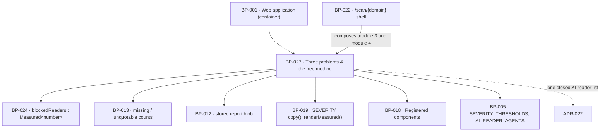

# BP-027 — Three problems, three severities, and the free method

- Parent: BP-001
- Kind: **feature** — cut from REQ-009; the leaf that renders exactly three
  problem cards, their severities and the three instructional sections beneath
  them.

## Responsibility
Render exactly three problems — blocked AI readers, missing pages, unquotable
pages — each with its count, its severity from one closed three-level set, and,
for the first of them only, the exact lines a founder pastes; and carry the whole
free method beneath them as three instructional sections that ask for nothing.

## Module / boundary
Inside BP-001's `src/app/(public)/**`, at
`src/app/(public)/scan/[domain]/_problems/` — a private folder, so it adds no
route. It holds the three cards, the three DIY sections, the severity mapping and
the unblock-line composition, and nothing else.

It computes no measurement. `blockedReaders` is BP-024's (REQ-009 criteria 1, 3
and 4 are a rendering of REQ-004's partition), and the missing-pages and
unquotable-pages counts are BP-013's opportunity supply, assembled into the
report blob by BP-012. This node reads three `Measured<number>` values and turns
them into cards. Its primitives are BP-018's registered components and every
sentence is a `CopyKey` from BP-019.

## Diagram


## Public interface

```ts
// src/app/(public)/scan/[domain]/_problems/model.ts

/** Exactly three, closed. REQ-009 criterion 1's "three problems" is the union,
 *  not a length check on an array somebody can push to. */
export type ProblemName = 'blocked_readers' | 'missing_pages' | 'unquotable_pages'

/** Ordered, internal. The three words are BP-019's `SEVERITY` triple and the
 *  owner's (REQ-093 c1). */
export type Severity = 'low' | 'mid' | 'high'

/** REQ-009 criterion 1's "where a problem could not be measured, its count and
 *  its severity both read '—'": the trichotomy is carried, not re-decided. */
export function severityOf(p: ProblemName, count: Measured<number>): Measured<Severity>

/** REQ-009 criterion 5: "neither lists or previews the pages themselves." There
 *  is no field here that could hold a page, a title or a URL, so the promise is
 *  unrepresentable-otherwise rather than reviewed. */
export interface ProblemCard {
  problem: ProblemName
  count: Measured<number>
  severity: Measured<Severity>
  doer: CopyKey                     // who does the work — REQ-009 c5
  fix: Fix
}

/** REQ-009 criteria 2, 3 and 4 as a sum: lines exist on exactly one arm, so a
 *  card can neither show a founder lines they should not paste nor omit them
 *  when they are needed. */
export type Fix =
  | { kind: 'none_needed' }                                   // measured zero (c3)
  | { kind: 'unknown' }                                       // unmeasured (c4)
  | { kind: 'paste'; lines: readonly string[] }               // blocked_readers, measured > 0 (c2)
  | { kind: 'we_write' }                                      // missing_pages
  | { kind: 'we_rewrite' }                                    // unquotable_pages

export function cardsOf(report: StoredReport): readonly [ProblemCard, ProblemCard, ProblemCard]

// src/app/(public)/scan/[domain]/_problems/unblock.ts
/** The lines a founder pastes, composed from BP-005's pinned agent list
 *  (ADR-022) and never from a model. Verbatim, in paste order, one directive
 *  per line — a wrong robots line is worse than none. */
export function unblockLines(blocked: readonly AiReaderAgent[]): readonly string[]

// src/app/(public)/scan/[domain]/_problems/method.tsx
/** REQ-009 criterion 6: three sections, one per problem, on the same page, no
 *  payment and no address asked for. The union is the same three, so a method
 *  section cannot go missing for a problem that has a card. */
export function MethodSections(p: { for: readonly [ProblemName, ProblemName, ProblemName] }): JSX.Element
```

## Data model delta
None. This node reads the stored report blob and writes nothing — which is also
how REQ-009 criterion 7 is discharged: see the error section.

## Error & edge behavior

**Severity is a step function of the count alone.** REQ-009 criterion 8 requires
that "of any two reports the one with the larger count for the same problem never
carries the lower severity", so severity may not depend on a denominator, a tier,
a market or anything else that varies between reports. `severityOf` takes exactly
one number, and its three steps per problem are pinned in BP-005:

| Problem | `low` | `mid` | `high` |
|---|---|---|---|
| `blocked_readers` | 0 | 1–2 | ≥ 3 |
| `missing_pages` | 0 | 1–9 | ≥ 10 |
| `unquotable_pages` | 0 | 1 | ≥ 2 |

Zero is always `low` and always carries the "nothing to fix" line, per criterion
8's first clause. Monotonicity is a property test over the whole integer range,
not three example cases.

**Carrying the trichotomy.** `severityOf` maps `unmeasured → unmeasured` with the
same reason, `zero → measured low`, `measured n → measured band(n)`. So a card
whose count could not be measured shows `—` for both count and severity (REQ-009
c1), states which of REQ-004's two reasons applies in the words that criterion
gives the case (c4), and reaches the `Fix.unknown` arm, which has no lines. There
is no path from an `unmeasured` count to a `0`, and none from a `zero` to a `—`:
both are BP-019's `renderMeasured` arms and neither is written here.

**The blocked-readers card, exhaustively (REQ-009 c1–c4):**

| `blockedReaders` | Card | Fix |
|---|---|---|
| `zero` | count 0, severity `low`, states nothing is blocking AI readers | `none_needed` — no lines |
| `measured n > 0` | count n, severity by the table | `paste` — the exact lines, copyable, labelled a free fix the founder does |
| `unmeasured / undeterminable` | `—`, `—`, REQ-004 criterion 6's line | `unknown` — no lines |
| `unmeasured / not_attempted` | `—`, `—`, REQ-004 criterion 9's line | `unknown` — no lines |

The card is never absent (c3) — the union has no absent arm — and the two
unmeasured rows never say "nothing is blocking AI readers" and never tell the
founder we could not read rules we never tried to read: the reason travels with
the value from BP-024, so the two lines cannot be swapped.

**Everything else.**
- The unblock lines are composed from BP-005's pinned agent list, in a fixed
  order, and are asserted character-for-character in a fixture test. No model
  produces them (`BUILD.md` §7: `unblock` is instruction only, never generated,
  never automated) and no per-report variation exists beyond which agents are
  blocked.
- REQ-009 criterion 7 — "ReachKit makes no change to their site, its files or its
  access rules, and offers no control that would" — is discharged structurally:
  this node exports no mutation, imports no destination adapter and no egress
  client, and a test asserts that nothing under `_problems/` performs a write or
  an outbound request. The only control on a fix is copy-to-clipboard.
- REQ-009 criteria 5 and 6 hold against the paywall by construction: the three
  method sections render inside the same server component as the cards, take no
  session, and there is no branch anywhere in this node on payment or identity.
- A section whose data could not be retrieved is absent with one written line
  naming it (REQ-004 c10) — but the three problem cards are never that section:
  they are always present, with `—` where a count is missing. The distinction is
  BP-024's `sectionOutcome('problems', …)`, which is `present: false` only when
  the report blob has no problems object at all.
- Every string a person reads is a `CopyKey`. The one exception is
  `unblockLines`, which is not the product speaking in its own voice but a
  technical artefact the founder pastes into their own file — pinned in BP-005
  and asserted, not written into the copy registry, because the copy registry is
  the owner's voice and these lines are neither prose nor changeable at will.

## NFR budget
- Pure rendering over three numbers already in the report blob: no query, no
  fetch, no vendor call, no model call on any path.
- Contribution to the report render: three cards and three collapsed sections,
  server-rendered inside BP-001's ≤ 400 ms p95 budget; the DIY sections are
  collapsed markup, not a lazy fetch, so criterion 6's "readable on the same
  page" survives a client with no JavaScript.
- Authorisation: none, and none reachable — no session read, no payment branch.
- Observability: none of its own. A card reaching `Fix.unknown` is already logged
  by BP-024 as an unmeasured input; logging it again here would be the second
  copy rule 2.4 forbids.

## Decisions

1. **Severity thresholds, per problem, absolute** — Status: accepted (parameter, rule 1.1)
   - Context: REQ-009 criterion 8 fixes the shape — three closed levels, monotone
     in that problem's own count — and leaves the boundaries to the system.
     `BUILD.md` §4.1 gives only "left border colour = severity".
   - Decision: the table above. `blocked_readers` reaches `high` at three because
     three or more named readers blocked is a policy, not a mis-scoped rule.
     `missing_pages` reaches `high` at ten because publishing is one page a day
     (`BUILD.md` §9), so ten is a backlog longer than a week and a half — a
     structural gap rather than an incidental one. `unquotable_pages` reaches
     `high` at two because the free path reads at most two documents (home and a
     detected pricing page, `BUILD.md` §6.3), so two is every page we read.
   - Alternatives considered: one shared threshold triple for all three problems —
     rejected, the three counts live on different scales and a shared boundary
     would make `unquotable_pages` permanently `low` on the free path, which is
     the "reads the same however large the problem" failure REQ-009's rationale
     names; a proportional threshold against a denominator — rejected, criterion
     8 requires monotonicity in the count alone across *any two reports*, and a
     varying denominator breaks it directly.
   - Consequences: the boundaries are pins, so a change is one line in
     `constants.ts` plus `tests/pins.test.ts`. Reversal cost is a pin edit; no
     stored data and no copy changes. `unquotable_pages` will need its boundaries
     revisited when the paid path measures up to 25 pages, and that is a pin edit
     too.

2. **`Fix` is a sum type, so a card cannot show the wrong lines** — Status: accepted
   - Context: REQ-009 criterion 3 forbids a zero-count card from showing lines,
     criterion 4 forbids an unmeasured card from showing them or from claiming
     nothing is blocked, and criterion 2 requires them exactly when readers are
     blocked. Three prohibitions over one card is where a boolean `showLines`
     gets it wrong once and nobody notices.
   - Decision: one closed `Fix` union with lines on exactly one arm, derived from
     the `Measured<number>` count in one function.
   - Alternatives considered: `lines?: string[]` with a comment — rejected, the
     optional field is present at every call site and absent-by-mistake reads the
     same as absent-by-rule; a per-card component deciding for itself — rejected,
     three decisions where the requirement makes one.
   - Consequences: adding a fourth problem is a union arm and a threshold row.
     Reversing re-opens exactly the three prohibitions above.

3. **The three severity words are not chosen here** — Status: accepted
   - Context: REQ-009 criterion 8 requires "the same three words on every report",
     and constitution §1's rights table makes customer-visible strings the
     owner's. BP-019 already declares `SEVERITY` as a triple of `CopyKey`s.
   - Decision: this node emits `low | mid | high` and never a word. The dependency
     on the owner's three words was a `rests-on` row above rather than a
     placeholder somebody later mistakes for a ruling. **The owner ruled on
     2026-08-31** — `high` → Critical, `mid` → Worth fixing, `low` → Minor — and
     the row is discharged; the words are in BP-019's `SEVERITY` and still never
     in this file.
   - Alternatives considered: choose three words and mark them provisional —
     rejected under §1 and rule 1.2's neighbour: a provisional customer-visible
     string is the copy that ships.
   - Consequences: the report could not render its severities until the owner
     wrote three words — the intended blocking point, and it blocked copy, not
     structure. It is now unblocked.

4. **The AI-reader agent list** is one closed, pinned set read by this node's
   unblock lines, by BP-024's blocked-readers count and by BP-004's hosted robots
   policy. It spans nodes no single blueprint owns and is recorded as
   **ADR-022**, not here.

## Status grounds (rule 3.2)
Self-certified `approved`. Grounds: cut on `/expand-requirement` from REQ-009,
`status: approved`, so the gate "no blueprint from a non-approved requirement" is
met. REQ-009's criterion 8 explicitly "fixes the shape of one [severity
vocabulary] … and leaves the three words themselves to the owner's copy"; this
node fixes the shape and the boundaries under rule 1.1 and leaves the words, as
a `rests-on` row. No customer-visible string is invented here. The librarian
audits.

## Open questions
