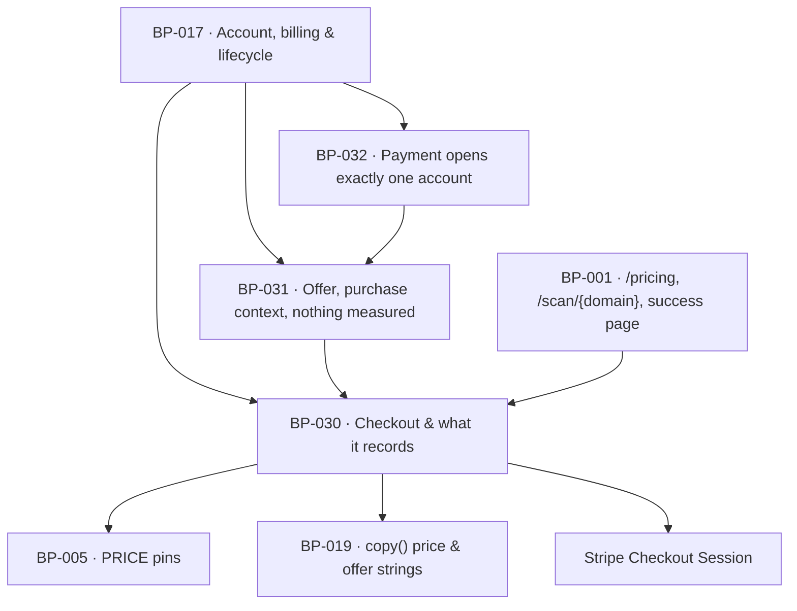

# BP-030 — Checkout without an account: one price, and what checkout records

- Parent: BP-017
- Kind: **feature** — a leaf of the Epic → Feature → Capability tree, cut from
  REQ-020 and REQ-022.

## Responsibility
Open a Stripe Checkout Session that asks for nothing but what taking a €49/mo
VAT-inclusive payment needs, and record the billing country and VAT number that
session collected against the buyer's billing record.

## Module / boundary
`src/lib/account/checkout/` — the Checkout Session builder and its parameter
allow-list, the price binding, the billing-record write for country and VAT
number, and the success/cancel return contract. It owns the `users_billing`
migration topic.

Outside this boundary and named here so nobody re-implements them: the `/pricing`
and report surfaces that carry the control (BP-001), the sentences those surfaces
speak (BP-019), the pinned price (BP-005), signature verification and
provisioning (BP-032), everything after the first payment (BP-060).

## Diagram


## Public interface
```ts
/** Where the buyer came from. `scanId` is present only when a completed report
 *  exists for it; a scanless surface never fabricates one (BUILD.md §13). */
export type CheckoutOrigin =
  | { kind: 'report'; scanId: string }
  | { kind: 'pricing' }

export function createCheckoutSession(a: {
  origin: CheckoutOrigin
  returnTo: string                     // absolute ReachKit URL, allow-listed to NEXT_PUBLIC_APP_URL
}): Promise<
  | { ok: true; url: string; sessionId: string }
  | { ok: false; reason: 'origin_scan_incomplete' | 'return_to_not_ours' | 'vendor' }
>

/** The exact Stripe parameter set the session is built with. Exported so
 *  `tests/account/checkout/**` can assert REQ-020 criterion 6 and REQ-022
 *  criteria 3-7 against the object, not against a screenshot. */
export const CHECKOUT_PARAMS: {
  mode: 'subscription'
  line_items: [{ price: string /* env STRIPE_PRICE_ID */; quantity: 1 }]
  billing_address_collection: 'required'      // REQ-022 c5
  tax_id_collection: { enabled: true }        // REQ-022 c6
  automatic_tax: { enabled: false }           // ADR-052
  customer_creation: 'always'
  phone_number_collection: { enabled: false } // REQ-020 c6
  custom_fields: []                           // REQ-020 c6
  allow_promotion_codes: false                // REQ-022 c3
  currency: 'eur'                             // REQ-022 c4
}

/** Called by BP-032 when a session completes, before provisioning. Idempotent
 *  on `sessionId`: it writes the billing record and nothing else. */
export function recordCheckoutFacts(sessionId: string): Promise<{
  email: string
  billingCountry: string | null      // ISO-3166-1 alpha-2 as Stripe reported it
  vatNumber: string | null           // verbatim as entered; never normalised, never validated
  stripeCustomerId: string
  origin: CheckoutOrigin
}>

/** The copy keys every price-bearing surface must render. Naming only — the
 *  sentences are the owner's and live in BP-019's registry (REQ-093). */
export const PRICE_COPY_KEYS: readonly ['price.amount', 'price.vat_included', 'price.interval']
```

## Data model delta
`users` (additive, `*_users_billing_*.sql`):
- `stripe_customer_id text unique`
- `billing_country text null` — REQ-022 c5
- `vat_number text null` — REQ-022 c6, stored verbatim
- `checkout_session_id text unique` — the replay key BP-032's provisioning
  conflicts on (BP-017 decision 2)

No new table. The €49, its currency and its interval are **not** columns: they are
`PRICE_EUR_CENTS`, `PRICE_CURRENCY`, `PRICE_INTERVAL` in `src/lib/config/constants.ts`
(BP-005) asserted in `tests/pins.test.ts`, plus `STRIPE_PRICE_ID` in env (BUILD §15).

## Error & edge behavior
- **Abandoned checkout creates nothing** (REQ-020 c2). No row is written until a
  session completes; `createCheckoutSession` writes no `users` row. The surface the
  buyer returns to is unchanged because there is nothing to change.
- `returnTo` is refused unless it is same-origin with `NEXT_PUBLIC_APP_URL` — an
  open redirect on a payment success path is a credential-adjacent hole.
- An `origin.kind === 'report'` whose scan is not `done` is refused
  (`origin_scan_incomplete`) — REQ-021 c3 is enforced on the surface *and* here,
  so a stale client cannot start checkout against a running scan.
- A buyer who leaves the VAT field empty completes unimpeded; a buyer who enters
  anything at all completes, whatever a registry would say (REQ-022 c7). No VIES
  call exists in this module and none may be added.
- No country is refused (REQ-022 c5). There is no country allow-list or
  block-list in this module.
- A vendor failure returns `{ ok: false, reason: 'vendor' }`; the surface renders
  a copy key, never a Stripe error string.
- REQ-020 criteria 4 and 5 — what an address with no account is told, and what a
  signed-out `/setup` or `/app` shows — are branches of one sign-in function and
  are implemented in BP-032 (`requestMagicLink`), which carries `covers: REQ-020`.
  Splitting one function across two nodes would be the second implementation rule
  7.1 forbids.

## NFR budget
- `createCheckoutSession` p95 ≤ 800 ms; one Stripe API call, no database read.
- No card number, CVC, `STRIPE_SECRET_KEY` or session URL is ever logged. The
  VAT number is logged nowhere; it is written once and read on the invoice.
- Authorisation: **none** — this is the one account-module entry point reachable
  with no session, by design (REQ-020 c1). Rate-limited at the route (BP-001).
- Observability: one structured event per session created and per session
  recorded, carrying `sessionId`, `origin.kind` and outcome — never the address.

## Decisions
1. **The Checkout Session parameter set is an exported constant, not inline
   arguments** — Status: accepted
   - Context: REQ-020 c6 and REQ-022 c3-c7 are all assertions about *what
     checkout asks*. A promise of the form "nothing else is asked" is only
     testable against the whole parameter object.
   - Decision: `CHECKOUT_PARAMS` is exported and asserted field-by-field in
     `tests/account/checkout/`, including the negative fields (`custom_fields: []`,
     `allow_promotion_codes: false`).
   - Alternatives considered: assert against the rendered Checkout page — rejected,
     it tests Stripe's renderer and cannot fail before the code exists.
   - Consequences: adding a field to checkout is a visible diff to a constant with
     a failing test, which is the point.
2. **Presentment-currency conversion is off, permanently** — Status: accepted
   - Context: REQ-022 c4 — "the same amount and the same currency wherever they
     are, never converted to a local one". Stripe offers automatic local-currency
     presentment; enabling it reads like a conversion-rate improvement.
   - Decision: EUR only. `CHECKOUT_PARAMS.currency` is `'eur'` and the account-level
     setting stays off. `tests/account/checkout/` asserts the session's currency.
   - Alternatives considered: local presentment for non-euro buyers — rejected,
     it makes the amount the customer is charged a number ReachKit did not promise.
   - Consequences: non-euro buyers see a foreign-currency charge and bear their
     bank's conversion. That is the promise REQ-022 c4 makes, not a defect.
3. **Migration filenames within BP-017 carry a second topic token** — Status: accepted
   - Context: `structure.md` rule 3 gives BP-017 the `users` and `sites` migration
     topics, but seven feature nodes partition that component and rule 3 forbids two
     nodes sharing a token.
   - Decision: `*_users_<sub>_*.sql` and `*_sites_<sub>_*.sql`, where `<sub>` is one
     of `billing` (BP-030), `provisioning` (BP-031, BP-032), `subscription`/`hosting`
     (BP-060), `identity` (BP-061), `erasure` (BP-063). Each glob is inside BP-017's
     and disjoint from its siblings'.
   - Alternatives considered: one node owning all `users` migrations — rejected, it
     makes five nodes wait on one for an additive column.
   - Consequences: migration filenames are longer and the convention must hold; a
     filename carrying two sub-tokens is a lint failure, not a judgement call.
     Reversal is expensive once applied — an applied migration is not renamed.
4. **The price is a pin and three copy keys, never a literal in this module** —
   Status: accepted
   - Context: €49/mo VAT-inclusive is an owner ruling (REQ-022 c1). Constitution §1
     makes the number and the sentence the owner's; rule 2.4 makes it one home.
   - Decision: the number lives in BP-005's `constants.ts`, the sentences in BP-019's
     registry under `PRICE_COPY_KEYS`. This module holds neither, only the binding.
   - Consequences: a price change is one pin and the owner's strings, not a grep.

See also **ADR-052** (landmine — €49 is tax-inclusive and Stripe Tax stays off),
which binds this node, BP-060 and BP-005.

## Status grounds (rule 3.2)
Self-certified `approved` per rule 3.2. Grounds: cut from REQ-020 and REQ-022, both
`status: approved`, so §3's "no blueprint from a non-approved requirement" is met;
`satisfies` names those two ids and nothing else; `code:` globs sit inside BP-017's
and overlap no sibling's.

## Open questions
