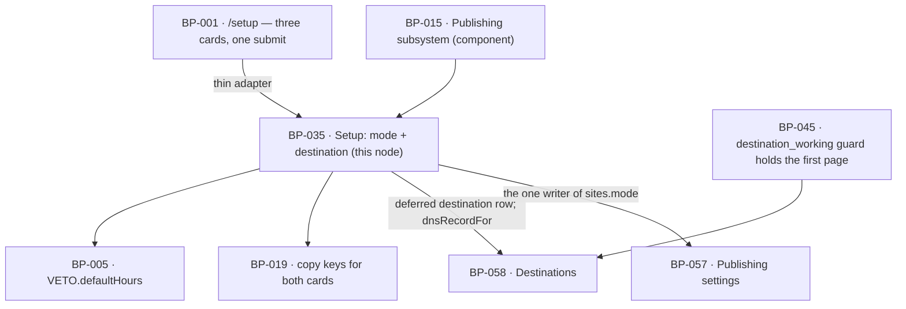

# BP-035 — Mode and destination chosen at setup with working defaults

- Parent: BP-015
- Kind: **feature** — a leaf cut straight from REQ-028: the one setup decision
  that touches the founder's own web presence, answerable in one click and
  never waiting on DNS or a WordPress login.

## Responsibility
Supply the setup cards' data with working defaults already chosen, record the
founder's one choice without making a single network call, and guarantee that a
page whose chosen destination is not connected is held rather than sent
somewhere the founder did not choose.

## Module / boundary
`src/lib/publish/setup/` — inside BP-015's `src/lib/publish/**`, disjoint from
`machine/`, `attempt/`, `switch/`, `ceilings/`, `publishable/`, `settings/`,
`verify/` and `destinations/`:

| Path | Holds |
|---|---|
| `cards.ts` | The two cards' data: what is pre-selected, which copy key each option carries, and the DNS record or its pending state. |
| `apply.ts` | `applySetupChoice` — one write of the mode, one deferred destination row, no network call. |

It **renders nothing**: `/setup` is BP-001's surface and calls this as a thin
adapter (structure.md rule 1). It **stores no setting of its own**: the mode goes
through BP-057's single writer, and the destination row through BP-058's
`connect`. It owns one invariant and two cards' worth of data.

## Diagram


## Public interface
```ts
// src/lib/publish/setup/cards.ts
export interface ModeOption {
  mode: 'autopilot' | 'copilot'
  preselected: boolean                       // autopilot true, copilot false
  copy: 'setup.mode.autopilot' | 'setup.mode.copilot'
}
export interface DestinationOption {
  kind: 'hosted' | 'wordpress'
  preselected: boolean                       // hosted true, wordpress false
  copy: 'setup.destination.hosted' | 'setup.destination.wordpress'
  /** Present only for `hosted`. `pending` is criterion 2's written line, never a blank. */
  dns?: DnsRecord | { pending: 'no_domain_yet'; copy: 'setup.destination.dnsPending' }
}
export function setupCards(siteId: string): Promise<{
  mode: readonly ModeOption[]
  destination: readonly DestinationOption[]
}>

// src/lib/publish/setup/apply.ts
export function applySetupChoice(a: {
  siteId: string
  mode: 'autopilot' | 'copilot'
  destinationKind: 'hosted' | 'wordpress'
  by: Actor
}): Promise<{ ok: true; destinationId: string; connected: false }>
```

`applySetupChoice` returns `connected: false` unconditionally and by design:
nothing is connected at setup, so the type has no branch for it and no caller
can be written that waits on one.

## Data model delta
**None of its own.** `sites.mode` is written through BP-057's
`savePublishingSettings`, the single writer; `sites.veto_hours` is left at
`VETO.defaultHours` and `publish_time` and `timezone` at whatever sign-in and
BP-057's defaults hold — REQ-028's non-goal keeps all three off this screen.
The destination row is created by BP-058's `connect` with a null config, which
is a **deferred connection**: `health='expired'`, `reason='never_connected'`,
`last_checked_at` set at creation.

One invariant this node owns lands as an index in BP-058's `destinations`
migration (that topic is BP-058's under structure.md rule 3, so this node
declares `depends-on: BP-058` for it rather than claiming the file): a partial
unique index on `(site_id) where deleted_at is null` — **one live destination
per site**. See decision 2.

## Error & edge behavior
- **Setup never makes a network call.** `applySetupChoice` performs two writes
  and returns. It does not resolve DNS, does not reach a WordPress site, and does
  not check health — so no DNS state and no WordPress outage can make the footer
  submit fail or hang (REQ-028 criteria 3 and 4). The first health check happens
  the first time somebody reads the destinations list (BP-058's
  `ensureFreshHealth`) or a publish is attempted, both after setup.
- **Defaults are already chosen and are working ones.** Autopilot is
  pre-selected and copilot is one option away in the same card pair; the hosted
  blog on the founder's own domain is pre-selected. Both defaults are data on
  the card, not a fallback applied when a field is missing, so a submit that
  carries no explicit choice records the same value the founder was shown.
- **The DNS record, or a written line — never a blank.** `setupCards` returns
  BP-058's `dnsRecordFor(siteId)`: the record where the site address is known,
  and `{pending:'no_domain_yet'}` with its own copy key where it is not. There is
  no third shape, so no surface can render a blank, a dash or a placeholder where
  a value would sit (REQ-028 criterion 2, REQ-091 criterion 2). The record's
  value comes from BP-005's `env`, so it is one pinned hostname and not a string
  in a card.
- **WordPress is deferred, not skipped.** Choosing WordPress creates the
  destination row in the deferred state and completes setup. The founder is
  asked again for what is missing when their first page is ready, which is
  BP-058's `reconnect` action on the `never_connected` reason — the same action,
  the same line, the same place as any other broken destination (REQ-074
  criterion 2). There is no separate setup-completion flow to maintain.
- **The first page is produced whatever the destination's state.** Nothing here
  gates generation: `draft/generate` runs, the page enters review, and the
  founder can read it (REQ-028 criterion 4). Only the delivery is held.
- **Held, and never redirected.** With one live destination per site, "nothing is
  published to any other destination" (criterion 5) is true because no other
  destination exists to publish to. BP-045's `destination_working` guard then
  holds the page — the state it holds, no skip, no `needs_attention` on account
  of the destination not being connected yet — and BP-058's view says which
  action is missing. This node contains no fallback logic, because a fallback
  would be the bug: the one thing a founder must be able to trust at setup is
  that their pages do not appear somewhere they did not choose.
- **Nothing else is configured here.** The veto window, the publish time, brand
  voice and do-not-claim are not readable or writable through this module
  (REQ-028's non-goals); they are BP-057's and the generation engine's.

## NFR budget
- `applySetupChoice` p95 ≤ 150 ms, and **zero outbound network calls** — asserted
  as a test with the egress seam stubbed to throw, so a future edit that adds a
  DNS check to setup fails rather than slowing it. This is the budget REQ-028's
  whole rationale rests on ("must never make finishing setup wait on DNS or a
  WordPress login").
- `setupCards` p95 ≤ 40 ms; one row read, no health check, no egress.
- Both writes are in one transaction: a founder never ends setup with a mode
  recorded and no destination, or the reverse.
- Observability: one log line on submit — site id, mode, destination kind,
  deferred. No credential is involved because none is collected here.

## Decisions
1. **The setup cards carry copy keys and no logic** — Status: accepted
   - Context: criterion 1 wants one written line per mode; REQ-073 criterion 2
     wants one written line per *pair* on Settings. Two lines about the same two
     modes is where a second implementation usually appears.
   - Decision: at setup there is nothing to compute — autopilot is pre-selected
     and the window is the default — so this node names two copy keys and holds
     no rule. BP-057's `explainPair` remains the only place a mode-and-window
     pair is turned into a statement.
   - Alternatives considered: calling `explainPair` with the default window —
     rejected, it would put a Settings sentence on a setup card and make one
     key's wording answerable to two screens; the strings are the owner's and
     the two surfaces may word them differently.
   - Consequences: two keys in BP-019's registry that must both exist before the
     card renders (REQ-093). No duplicated logic, because there is none.
2. **One live destination per site, enforced by a partial unique index** —
   Status: accepted
   - Context: criterion 5 promises that when the chosen destination is not
     connected, "nothing is published to any other destination"; REQ-028's
     non-goal allows no more than one destination chosen at setup and REQ-074's
     allows no more than one of the same kind per site. No approved requirement
     describes a site publishing to two destinations at once.
   - Decision: `unique (site_id) where deleted_at is null` on `destinations`.
     The never-redirected promise is then a database invariant rather than a
     branch someone can forget, in the same spirit as BP-015's idempotency
     index. Changing destination in Settings is disconnect then connect, which
     REQ-074 criterion 4 already defines and which keeps published pages live.
   - Alternatives considered: allowing one row per kind and choosing between
     them at publish time — rejected, it requires a selection rule no
     requirement states, and the first bug in that rule publishes a customer's
     page to a destination they did not choose. A `sites.destination_id`
     pointer — rejected, it is a second copy of a fact the `destinations` rows
     already carry (rule 2.4).
   - Consequences: a founder who later wants both must wait for a requirement
     that says so. **Cost of reversing:** one migration to drop the index plus a
     stated selection rule; low in code, and the reason to record it is that the
     index is what makes criterion 5 true, so dropping it without the selection
     rule silently re-opens the exact failure.
3. **A deferred connection is a normal broken destination, not a fourth state** —
   Status: accepted
   - Context: criteria 3 and 5 describe a destination that is chosen but not
     connected, and REQ-074 criterion 2 describes one that has stopped working.
     Both end in the same place: pages held, one action offered, one line saying
     nothing has been lost.
   - Decision: the deferred connection is `health='expired'` with
     `reason='never_connected'` (BP-058's taxonomy). One state machine for
     brokenness, one Reconnect action, one held-queue mechanism.
   - Alternatives considered: a `pending` health value — rejected, it widens a
     column `BUILD.md` §10 specifies, and every surface would then need to know
     that pending and expired are shown the same way.
   - Consequences: the word the founder reads at setup is chosen by the reason,
     not the state, so the copy registry does the work. Trivial to reverse.

## Status grounds (rule 3.2)
Self-certified `approved`. Grounds: cut from REQ-028, `status: approved`, so
§3's blueprint gate is met; one `satisfies` edge written at creation; `code:`
globs sit inside BP-015's `src/lib/publish/**` and overlap no sibling's, and no
migration file is claimed. No `blocked-by`: REQ-028 carries no unresolved review
line, and its relationship to REQ-025's setup surface is a dependency on
BP-001's route, not a scope overlap — this node holds no rendering.

## Open questions
