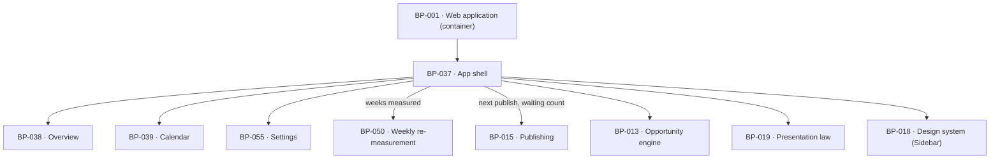

# BP-037 — App shell: three destinations, publishing state always in view

- Parent: BP-001
- Kind: **feature** — cut from REQ-040, a leaf under the web-application container.

## Responsibility
Render the frame every app screen sits inside — the domain block with a week
count that never overstates the evidence, exactly three destinations with the
Calendar's waiting count, and the publishing mode with either the next publish
time or the one line naming why there is none.

## Module / boundary
`src/app/(account)/app/layout.tsx` (the frame), `page.tsx` (the `/app` redirect
to Overview) and `src/app/(account)/app/_shell/**` (the sidebar, the mobile tab
bar and the one shell query). The `_shell` prefix keeps the folder out of the
route table, so the shell can never become a fourth destination by accident. It
holds no screen content: Overview, Calendar and Settings are BP-038, BP-039 and
BP-055.

## Diagram


## Public interface
```ts
export default function AppLayout(p: { children: React.ReactNode }): JSX.Element

/** REQ-040 criterion 1 made structural. Exactly three, one tuple, consumed by
 *  both the sidebar and the mobile tab bar — so a fourth cannot appear on one
 *  breakpoint only, and cannot appear at all without a type change. */
export const DESTINATIONS = ['overview', 'calendar', 'settings'] as const
export type Destination = (typeof DESTINATIONS)[number]

export type WeekCount =
  | { kind: 'counted'; weeks: number; lastMeasuredOn: Date }   // criterion 6
  | { kind: 'none'; firstDueOn: Date }                         // criterion 7

/** Criterion 4's four causes. Ordered by NO_PUBLISH_PRECEDENCE, not by whichever
 *  test a renderer happens to run first. */
export type NoPublishReason =
  | 'reachkit_stopped' | 'publishing_paused' | 'nothing_approved' | 'nothing_planned'
export const NO_PUBLISH_PRECEDENCE: readonly NoPublishReason[]
// ['reachkit_stopped', 'publishing_paused', 'nothing_approved', 'nothing_planned']

export interface ShellModel {
  domain: string
  weeks: WeekCount
  waiting: number                          // 0 renders no count at all (criterion 2)
  publishing:
    | { mode: 'autopilot' | 'copilot'; next: Date }
    | { mode: 'autopilot' | 'copilot'; next: null; because: NoPublishReason }
}
export function readShell(siteId: string): Promise<ShellModel>

/** Criterion 6's rule, isolated so it has exactly one implementation: the number
 *  of distinct site-local weeks, for the *current* domain, in which a weekly
 *  measurement produced something. Never elapsed weeks, never a stored counter. */
export function weeksMeasured(a: { siteId: string; domain: string }): Promise<WeekCount>
```

## Data model delta
None. Every value the shell states already exists: `sites.domain`,
`sites.time_zone`, `sites.mode`, `sites.publish_time`, the `scans` rows BP-050
stamps with `week_start`, and the `drafts` states BP-015 owns. The waiting count
is `count(*) from drafts where state in ('in_review','needs_attention')` for the
site — a query, not a counter, for the same reason BP-013 decision 2 gives.

## Error & edge behavior
- **The week count counts measured weeks, not elapsed weeks.** A week whose
  re-measurement did not run (BP-050's `not_measured`) does not advance it; a
  week measured in part does. The count is scoped to `sites.domain`, so a domain
  change restarts it at the first measurement of the new domain (REQ-071
  criterion 13) with no reset step to remember.
- Zero measured weeks — never measured, or measured only under a previous domain
  — renders `{ kind: 'none' }`: no number, and the one written line naming the
  date the first measurement is due (criterion 7). The due date comes from
  BP-050's `nextDueOn`, so the shell and the Overview cannot state two different
  dates.
- **The no-publish reason has a fixed precedence and ReachKit's stop comes
  first** (decision 2). REQ-092 criterion 7 requires that where ReachKit stopped
  its own work, that is the reason given and no other, "whether or not that other
  reason is also true of the account at that moment" — so the resolver returns on
  the first match in `NO_PUBLISH_PRECEDENCE` and the line for `reachkit_stopped`
  is BP-019's `stoppedWorkLine`, which carries a resumption date or an explicit
  no-time-promised and names no internal cause.
- A next publish time exists only when BP-015's `becomesPublishable` yields one;
  the shell never computes a schedule of its own.
- Every time and date the shell states renders in `sites.time_zone`. `BUILD.md`
  §4.4's literal `re-measured Mon` renders as the **date** the measurement was
  taken in that zone, not the weekday word (decision 4).
- **`compact` (ADR-093 decision 1): the sidebar is replaced by top tabs**
  rendering the same `DESTINATIONS` tuple, and the domain block and publishing
  state collapse into the tab bar's header rather than disappearing (criterion 3
  binds *any* app screen, so the publishing state is not a desktop-only
  affordance). "Narrow" is now a named band with a value `design/` mints, not a
  judgement each surface makes for itself; the sidebar shows at `medium` and
  `wide`, which is `BUILD.md` §4.4's *"Mobile: sidebar hidden, top tabs"* given
  a width.
- **The tab bar is a shell-local composition over BP-018's registered `Tabs`,
  not a sixth custom component** (ADR-093 decision 7 — the call
  `components.md` §4 gap 5 left to the architect). What distinguishes it from
  `Tabs` is sticky positioning and band visibility, which are layout, not a
  widget. It lives in `_shell/**` and consumes the same tuple, so a fourth
  destination cannot appear on one band only.
- A shell render for a site with no active access is not reachable — BP-017's
  gate runs above it — so the shell has no unauthenticated arm to get wrong.

## NFR budget
- One query per request for the whole `ShellModel`, cached for the request; the
  shell renders on every app screen, so a fan-out here multiplies across the app.
  Budget: ≤ 40 ms p95 server time, ≤ 3 index lookups.
- The shell runs no measurement and no vendor call (`BUILD.md` §3, "never during
  server render").
- Authorisation: session plus site ownership, inherited from the `(account)`
  route group; the shell resolves `siteId` from the session only.
- Observability: nothing beyond BP-001's per-route line. The shell is a read.

## Decisions

1. **Three destinations are one `const` tuple, consumed twice** — Status: accepted
   - Context: criterion 1 says exactly three and no fourth anywhere; criterion 5
     says the same three stay reachable on a narrow viewport. Two renderers mean
     two lists.
   - Decision: `DESTINATIONS` is a readonly tuple, `Destination` is derived from
     it, and both the sidebar and the mobile tab bar map over it. A route added
     under `/app` with no entry is unreachable by navigation, which is the safe
     failure.
   - Alternatives considered: derive the nav from the filesystem route table —
     rejected, the draft view and the day panel are routes and are explicitly not
     destinations (REQ-040's non-goals); two hand-written lists — rejected, they
     diverge at the first addition.

2. **The no-publish reason is resolved in a fixed precedence with ReachKit's stop first** — Status: accepted
   - Context: criterion 4 lists four causes and REQ-092 criterion 7 requires
     ReachKit's stop to be the reason given whenever it holds, even when another
     cause is simultaneously true. Several are commonly true at once — a stopped
     product also has nothing approved.
   - Decision: `NO_PUBLISH_PRECEDENCE` is an ordered constant and the resolver is
     a first-match over it. `reachkit_stopped` is first, then `publishing_paused`
     (a customer choice they can undo), then `nothing_approved`, then
     `nothing_planned`.
   - Alternatives considered: evaluate in whatever order the data arrives —
     rejected, it makes REQ-092 criterion 7 a coincidence; render every true
     cause — rejected, criterion 4 says "one written line" and REQ-092 criterion
     7 says "gives no other reason for it".
   - Consequences: adding a cause means placing it in the order, which is a
     visible decision rather than an appended `else if`. Reversing the order
     silently re-breaks REQ-092 criterion 7 — the test asserts the pair
     (stopped ∧ paused) resolves to `reachkit_stopped`.

3. **The week count is derived from measured weeks, never stored** — Status: accepted
   - Context: criterion 6 binds the number to the customer's own history — "never
     larger than the number of weeks in which the site was measured".
   - Decision: `weeksMeasured` counts distinct `scans.week_start` values for the
     current domain where the scan produced a measurement. No counter column.
   - Alternatives considered: `sites.weeks_measured`, incremented weekly —
     rejected, an increment that runs on a week with no measurement overstates
     the evidence, which is exactly what criterion 6 forbids, and the drift is
     silent; weeks since `sites.created_at` — rejected for the same reason and
     more directly.
   - Consequences: the count needs an index on `scans (site_id, domain,
     week_start)`. Reversing to a counter re-opens the overstatement.

4. **`re-measured Mon` renders as a date, not a weekday word** — Status: accepted
   - Context: `BUILD.md` §4.4 writes the domain block as `Week n · re-measured
     Mon`. REQ-065 criterion 1 requires the measurement to carry the date it was
     taken, in the customer's zone.
   - Decision: the block renders the measurement date. "Mon" is a specimen in a
     layout sketch, not a promise; a customer whose Monday measurement ran on
     Tuesday would otherwise read a false weekday.
   - Consequences: reversal is one copy key and would state a fact the product
     did not measure.

## Status grounds (rule 3.2)
Self-certified `approved`. Grounds: cut from REQ-040, `status: approved`;
`satisfies: [REQ-040]`. Globs sit inside BP-001's `src/app/(account)/**` and
overlap no sibling — BP-038, BP-039, BP-055 and BP-044 each own a distinct
child segment of `src/app/(account)/app/`.

## Open questions
