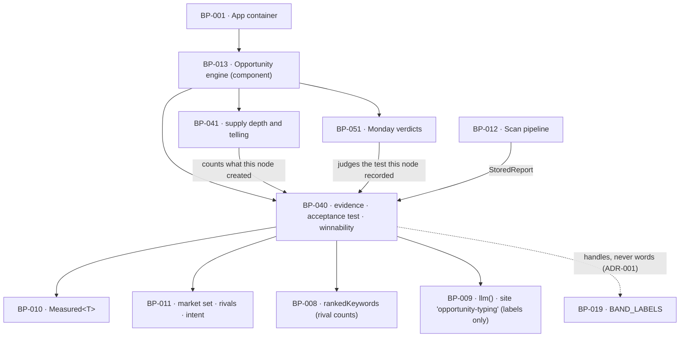

# BP-040 — Opportunities: evidence, acceptance test, winnability bands

- Parent: BP-013
- Kind: **feature** — a leaf of the Epic → Feature → Capability tree, cut
  straight from REQ-047.

## Responsibility
Turn a completed scan's measurements into opportunities of exactly eight kinds,
each carrying the measured evidence that produced it, an immutable acceptance
test, and a winnability handle — and create none that measured evidence did not
produce.

## Module / boundary
`src/lib/opportunities/derive/`, `/winnability/`, `/rank/` and `types.ts` inside
BP-013's `src/lib/opportunities/` boundary. This node owns the `opportunities`
table's core shape (migration token `opportunities`, file discriminator
`_opportunities_core`). It does **not** own supply depth or the customer-facing
supply lines (BP-041), the weekly verdicts (BP-051), any customer-visible word
(BP-019), or the calendar surface (BP-001).

## Diagram


## Public interface
```ts
// ---- the closed enum (REQ-047 c1; BUILD.md §7) -----------------------------
export type OpportunityType =
  | 'answer_page' | 'keyword_page' | 'comparison_page' | 'format_page'  // Write
  | 'expand_page' | 'answerable_page' | 'refresh_page'                  // Improve
  | 'unblock'                                                           // Fix
export type Family = 'write' | 'improve' | 'fix'
export const FAMILY_OF: Readonly<Record<OpportunityType, Family>>

// ---- evidence: one shape per family, every value Measured (REQ-047 c2) -----
export type Shortfall =
  | { kind: 'position';  position: Measured<number> }
  | { kind: 'thin';      words: Measured<number> }
  | { kind: 'stale';     lastSeenChanged: Measured<Date> }
export type Barrier =
  | 'robots_disallow' | 'noindex' | 'login_wall' | 'js_only' | 'blocked_ai_agent'

export type Evidence =
  | { family: 'write';   query: string; volume: Measured<number>
      rival: { domain: string; url: Measured<string>; position: Measured<number> } }
  | { family: 'improve'; query: string; volume: Measured<number>
      pageUrl: string; shortfall: Shortfall }
  | { family: 'fix';     barrier: Barrier; foundOnUrl: string }

// ---- the acceptance test (REQ-047 c6) --------------------------------------
export type Acceptance =
  | { form: 'top20';       query: string }
  | { form: 'named_on';    question: string }
  | { form: 'gate_cleared'; gate: Barrier }

// ---- winnability (REQ-047 c9, c10, c13, c14) -------------------------------
export type Winnability = 'winnable' | 'reach' | 'not-yet'   // internal handles

/** Pure. Takes no site id, no options and no configuration, so criterion 13
 *  ("the threshold applied is identical for both") holds by construction:
 *  there is no argument through which a per-customer threshold could arrive. */
/** The four numbers are BP-005's `WINNABILITY`
 *  ({ qualifyFloor: 500, qualifyMultiple: 5, nearFloor: 100, nearMultiple: 2 }),
 *  imported, never re-declared here — `structure.md` rule 5. */
export function qualifyingBar(ownRanked: number): number      // max(500, 5 * ownRanked)
export function winnableBar(ownRanked: number): number        // max(100, 2 * ownRanked)
export function qualifies(a: { top10RankedCounts: Measured<number>[]; ownRanked: number }): boolean
export function bandWinnability(a: { top10RankedCounts: Measured<number>[]; ownRanked: number }): Winnability

// ---- ranking (BUILD.md §7: demand x intent x (1-effort) x fit) --------------
export interface Ranked { opportunityId: string; score: number }
/** `profile` is required because the intent term is BP-011's
 *  `intentWeight(keyword, p)`, whose second parameter is not optional and whose
 *  node explicitly rejects a second classifier (BP-011 decision 2). There is no
 *  arm of this function that ranks without a profile, and no default profile:
 *  ranking a search whose intent cannot be classified against the site it was
 *  selected for would be a second classification (rule 2.4). `rankOpen` loads
 *  the site's profile once per call and passes it to every row. */
export function rankScore(a: {
  volume: Measured<number>; query: string; type: OpportunityType
  fit: Winnability; profile: Profile
}): number
export function rankOpen(siteId: string): Promise<Ranked[]>   // computed, never stored

// ---- derivation ------------------------------------------------------------
export interface Opportunity {
  id: string; siteId: string; scanId: string
  type: OpportunityType; family: Family
  targetQuery: string | null                 // null only for 'unblock'
  targetRef: string                          // proposed slug (write) | page URL (improve) | barrier page URL (fix)
  volume: Measured<number> | null
  evidence: Evidence
  acceptance: Acceptance
  fitBand: Winnability | null                // null only for 'unblock'
  effort: number                             // 0..1, from EFFORT_BY_TYPE
  status: 'open' | 'queued' | 'done' | 'dismissed'
  createdAt: Date
}

export function deriveOpportunities(c: CostContext, a: {
  siteId: string; scanId: string; report: StoredReport; ownRanked: Measured<number>
}): Promise<{ created: Opportunity[]; assessed: number; rejected: RejectionCount }>

export interface RejectionCount {
  not_yet: number            // failed criterion 9
  unmeasured_top10: number   // no measured ranked count in the top ten (see edge behaviour)
  duplicate_open: number     // an equivalent open/queued opportunity already exists
}

/** What the day panel needs to say why a page exists (REQ-047 c7, c12).
 *  Handles and measured values only — no sentence, no word (REQ-093 c1, c4). */
export function explainChoice(opportunityId: string): Promise<{
  type: OpportunityType; family: Family
  fitBand: Winnability | null
  acceptance: Acceptance
  evidence: Evidence
}>
```

## Data model delta
Migration `*_opportunities_core*.sql` creates `opportunities` as `BUILD.md` §10,
with these deltas this node is the home of:

- `acceptance jsonb not null`, written at creation and **never updated**: a
  `before update` trigger raises when `new.acceptance is distinct from
  old.acceptance` (BP-013 decision 1; REQ-047 c8). The trigger is the invariant,
  not application logic.
- `fit_band text` constrained to `('winnable','reach','not-yet')`, null only
  where `family = 'fix'`.
- `type text` and `family text` constrained to the eight and the three; a ninth
  value cannot be stored (REQ-047 c1), and `family` is a stored, constrained
  mirror of `FAMILY_OF` asserted by a check constraint rather than a second
  source of truth.
- `evidence jsonb not null` with a check that its `family` discriminator equals
  the row's `family`.
- `effort numeric(3,2) not null check (effort >= 0 and effort <= 1)`.
- Partial unique index
  `(site_id, type, target_query, target_ref) where status in ('open','queued')`
  — so a weekly top-up (REQ-095 c4, BP-041) re-deriving the same target adds
  nothing, while a target whose earlier page is `done` or `dismissed` may be
  proposed again.
- Index `(site_id, status)` and partial index `(site_id) where status = 'open'`
  — BP-041 reads depth off the second.
- `status_changed_at timestamptz not null default now()` is **not** here; it is
  BP-041's, in `*_opportunities_supply*.sql`, because only the supply telling
  needs it.
- No rank column. See decision 4.

## Error & edge behavior
- **An unmeasured ranked count never satisfies a bar.** `qualifies` passes only
  where at least one top-ten domain has a `kind: 'measured'` (or `'zero'`) ranked
  count at or under `qualifyingBar(ownRanked)`. A top ten whose counts are all
  `unmeasured` yields no opportunity and is counted in
  `RejectionCount.unmeasured_top10`. Supply is the cap (REQ-047 c3), so the
  honest outcome of not knowing is fewer opportunities, never a guessed one
  (REQ-093 c4). Decision 2.
- **Cold start.** `ownRanked` of `zero` gives bars of 500 and 100, both positive,
  so all three bands stay assignable and the winnable set stays non-empty
  (REQ-047 c11, c14; `BUILD.md` §6.6). The counts that feed the bars are the
  rivals' — bought as `ranked_keywords@100 × rivals` monthly, derived from the
  market and not from the customer — so nothing here is keyed on the customer's
  own presence. At cold start only the Write family is derivable: the Improve
  family needs a page of the customer's that ranks, and `deriveOpportunities`
  simply produces none rather than inventing a page to improve.
- **Property, asserted not assumed:** for every `ownRanked >= 0`,
  `winnableBar(r) < qualifyingBar(r)`. A property test over the whole non-negative
  range is what keeps the Reach band reachable (REQ-047 c14); the two-floor
  arrangement REQ-047's second `rests-on` argues for is only true because of this
  strict inequality, and it is the assertion that would catch someone raising
  `WINNABILITY.nearFloor` to 500. (That constant is BP-005's, and has been since
  BP-005 was cut: `WINNABILITY: { qualifyFloor: 500; qualifyMultiple: 5;
  nearFloor: 100; nearMultiple: 2 }`. This line previously named a
  `WINNABLE_FLOOR` that is nowhere in the corpus; `structure.md` rule 5 puts the
  four numbers in `constants.ts` and nowhere else, so no module declares them
  locally.)
- **`unblock` is inert.** It is created with `acceptance.form = 'gate_cleared'`,
  `fit_band` null, no volume, and is excluded from `rankOpen` and from
  `nextForDay`. It consumes no supply and takes no day (REQ-047 c5); no page is
  ever generated from it in either publishing mode. It is the one type whose
  `targetQuery` is null, which is what makes "never generated" a shape rather
  than a policy.
- **A model labels, never selects.** `llm()` at call site `opportunity-typing`
  may only refine an already-derived candidate's `type` within the closed enum
  and its proposed slug/title. A candidate that no measured evidence produced is
  never created, whatever the model returns, and an `unmeasured` result from
  `llm()` falls back to the deterministic type the trigger implies.
- **Evidence is copied at creation, never referenced.** Every value in `evidence`
  is the stored measurement with its scan date, so criterion 7's day-panel
  explanation still reads correctly after the next weekly scan moves the numbers
  (REQ-093 c4: "never recomputed for display").
- **Empty is a success state** (`BUILD.md` §2.5). `deriveOpportunities` returning
  `created: []` is a normal return with counts, not an error; the cause handles
  in `RejectionCount` are what let REQ-043 c3's day line be distinguished from
  c4's.

## NFR budget
- **Vendor spend: zero beyond the rows the scan already bought.** Winnability
  reads rival ranked counts already in `fetches`; the only spend is
  `opportunity-typing` (haiku, ~4 calls per deep pass, `BUILD.md` §6.3), inside
  the deep pass's `CAP_DEEP` 150¢ — never its own budget line.
- Derivation for one deep pass completes inside the onboarding pass's own
  ceiling; it adds no network round trip of its own.
- `rankOpen` is a single indexed read plus an in-process sort; no per-row query.
- Authz: every read and write goes through `db()` under RLS (BP-002); nothing in
  this node uses `dbAdmin()`.
- Observability: per-derivation counts by type, by family and by band, plus the
  three `RejectionCount` counters — the third is how a silent supply drought is
  told apart from a market with nothing in it. Never a query string in a log
  line at warn level or above.

## Decisions

1. **The acceptance test is written once and the database refuses the second
   write** — Status: accepted (implements BP-013 decision 1)
   - Context: REQ-047 c8 and REQ-063 c6 both rest on a test that predates its
     outcome; BP-013 already ruled the trigger. This node is where it lands.
   - Decision: `before update` trigger on `opportunities` rejecting any change to
     `acceptance`. Correcting a malformed test means dismissing the opportunity
     and deriving a new one.
   - Alternatives considered: none re-opened — BP-013 owns the reasoning
     (rule 2.4).
   - Consequences: a migration that recreates the table must recreate the
     trigger; the pins test is not the guard here, the schema is.

2. **An unmeasured ranked count is never read as a small one** — Status: accepted
   - Context: REQ-047 c9 asks whether some domain in the top ten "ranks for no
     more than" a bar. The top ten of a target SERP contains domains we bought no
     ranked rows for, and `ranked_keywords@100` returns at most 100 rows, so a
     result at the cap is a floor rather than a count.
   - Decision: only a `measured` or `zero` count can satisfy a bar. A count that
     arrived at the row cap is coerced to `unmeasured` before comparison. An
     all-unmeasured top ten produces no opportunity and increments
     `unmeasured_top10`.
   - Alternatives considered: (a) estimate the count from SERP features —
     rejected, it composes a value REQ-093 c4 requires to be measured and
     REQ-047 c2 requires to be stored; (b) treat unmeasured as passing —
     rejected, it manufactures targets the customer cannot win, which is the
     exact harm REQ-047 exists to prevent; (c) buy ranked rows for every top-ten
     domain — rejected, REQ-095's non-goals bar buying more data to manufacture
     depth, and thirteen target SERPs × ten domains is an order of magnitude over
     `CAP_DEEP`.
   - Consequences: supply is lower than a permissive reading would give, which is
     the correct direction (supply is the cap). This reads like a bug to whoever
     first sees `unmeasured_top10` climbing; the counter exists so they see the
     cause rather than the symptom.

3. **The ranking coefficients are chosen here and pinned in BP-005** — Status: accepted
   - Context: `BUILD.md` §7 fixes the shape `demand × intent × (1−effort) × fit`
     and no term's scale. Rule 1.1 makes the scales this node's to choose;
     REQ-047's non-goals bar any per-customer tuning of them.
   - Decision, with derivation:
     - `demand = min(1, log10(volume + 1) / 5)` — log-scaled for the reason
       `BUILD.md` §6.7 gives ("volume enters log-scaled so it breaks ties inside
       an intent class rather than steamrolling across classes"); the divisor 5
       puts 100,000/mo at 1.0, which is above any volume the market set carries,
       so the term saturates rather than clips. An `unmeasured` volume gives
       `demand = 0`, never a default.
     - `intent = intentWeight(query, profile) / 3`, reusing BP-025's classifier
       verbatim (3 decision · 3 solution · 2 problem · 1 informational,
       `BUILD.md` §6.7) so there is one classification in the product, not two
       (rule 2.4). **Corrected 2026-08-31:** this entry read
       `intentWeight(query) / 3`, and the exported function has always taken a
       required `Profile` as its second parameter — the own-brand drop set and
       the relevance vocabulary are the profile's, so a one-argument classifier
       cannot exist without being the second classifier BP-011 decision 2
       rejects. `rankScore` gains `profile` for it, and `rankOpen` — which has
       the site — supplies it. This blocked WO-183.
     - `effort = EFFORT_BY_TYPE`: `answerable_page` .2 · `expand_page` .3 ·
       `refresh_page` .3 · `answer_page` .5 · `keyword_page` .5 ·
       `comparison_page` .6 · `format_page` .7. Derived from what the type asks
       the pipeline to produce: improving a page that exists and already ranks is
       less work than writing one from nothing, and a comparison or a new format
       needs the most grounding. `unblock` has no effort term because it is not
       ranked.
     - `fit = { winnable: 1.0, reach: 0.5, 'not-yet': 0 }`. `not-yet` is zero
       rather than excluded so the formula cannot rank a target REQ-047 c10 bars
       from being queued even if a caller passes one.
   - Alternatives considered: linear volume — rejected by `BUILD.md` §6.7's own
     argument; a learned or per-customer weighting — rejected, REQ-047's
     non-goals bar it and REQ-055 c4 bars deriving a profile from the customer.
   - Consequences: cost of reversing is one edit to `constants.ts` and one to
     `tests/pins.test.ts`. Nothing is stored, so a retune changes tomorrow's
     order and rewrites no history — see decision 4.

4. **Rank is computed on read and never stored** — Status: accepted
   - Context: the ranking decides which opportunity fills the next day
     (REQ-047 c4: "in the order the ranking gives"), and its coefficients are
     parameters this node chose and will retune.
   - Decision: no `rank` column. `rankOpen` computes from stored evidence at
     read time. An opportunity's order is fixed only when it becomes `queued`
     against a date.
   - Alternatives considered: a stored score — rejected, it is a derived value
     with a second home (rule 2.4) and every retune becomes a backfill migration
     over rows whose evidence has not changed.
   - Consequences: order can differ between two reads across a retune. Harmless
     while an opportunity is `open`; impossible once it is `queued`, which is the
     only moment a customer has seen it.

5. **Winnability is a handle; the three words are BP-019's** — Status: accepted
   (governed by ADR-001)
   - This node emits `winnable | reach | not-yet` and knows no customer-facing
     word. The words are the owner's (constitution §1) and are outstanding — the
     third `rests-on` above. Nothing here blocks on them: REQ-047 c10's band is
     recorded and c12's day-panel line is a rendering BP-019 owns.

## Status grounds (rule 3.2)
Self-certified `approved` per rule 3.2. Grounds: cut from **REQ-047**, which is
`status: approved`, so §3's "no blueprint from a non-approved requirement" gate
is met; the node names one module inside its parent component's boundary, its
`code:` globs overlap no sibling's, and every parameter it chose carries its
derivation and reversal cost above (rule 1.1). It introduces no customer-visible
string. The librarian audits and may revert.

## Open questions
