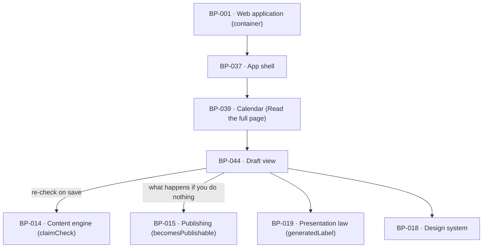

# BP-044 — The draft view: read it whole, edit as Markdown, copy it out

- Parent: BP-001
- Kind: **feature** — cut from REQ-045, a leaf under the web-application container.

## Responsibility
Render every word that would publish together with its grounding and its
claim-check outcome, let the customer edit the Markdown with a live preview and
lose nothing, and make the words available as Markdown and HTML for any
destination.

## Module / boundary
`src/app/(account)/app/draft/[draftId]/` — the read view, the Markdown editor,
the preview pane and the copy-out controls — plus two route handlers: the
autosave `PATCH /api/drafts/{id}` and `GET /api/drafts/{id}/export`. It owns
neither the state machine nor the checks: approve, veto and skip are the
publishing node's routes under `src/app/api/drafts/[id]/{approve,veto,skip}/`,
which this node deliberately does not glob; the claim check is BP-014's; when a
page becomes publishable is BP-015's.

## Diagram


## Public interface
```ts
export type ClaimState =
  | { state: 'passed'; at: Date }
  | { state: 'failed'; matchedEntry: string; at: Date }      // criterion 11
  | { state: 'outstanding' }                                 // criterion 9 — nothing shown yet
  | { state: 'nothing_to_check' }                            // criterion 3 — empty list

/** Criterion 1 and REQ-093 criterion 2: what ReachKit wrote is labelled as this
 *  page's generated content, and the label never presents the customer's own
 *  words as text ReachKit generated. Two states, page-level (decision 1). */
export type Authorship = { edited: false } | { edited: true; firstEditedAt: Date }

export interface DraftView {
  draftId: string
  title: string
  bodyMd: string                                             // every word that would publish
  authorship: Authorship
  grounded: { fact: string; url: string; readAt: Date; present: boolean }  // criteria 2 and 8
  claim: ClaimState
  doNothing: { key: CopyKey; publishesAt: Date | null }      // criterion 4, from becomesPublishable
  lastSavedAt: Date | null
}
export function readDraft(draftId: string): Promise<DraftView>

/** PATCH /api/drafts/{id} — the autosave. Last write wins (criterion 6). */
export interface SaveBody { bodyMd: string }
export type SaveResult =
  | { ok: true; savedAt: Date; grounded: { present: boolean }; claim: { state: 'outstanding' } }
  | { ok: false; refused: 'not_editable' | 'too_large' | 'store_unavailable' }
export async function PATCH(req: Request, ctx: { params: { id: string } }): Promise<Response>

/** GET /api/drafts/{id}/export?as=md|html — criterion 12, any draft or published
 *  page, whatever its destination. */
export async function GET(req: Request, ctx: { params: { id: string } }): Promise<Response>

export const AUTOSAVE_DEBOUNCE_MS: 1200
export const PREVIEW_DEBOUNCE_MS: 100
export const MAX_BODY_BYTES: 262144
```

## Data model delta
On `drafts` (migration topic `drafts`; this node globs no migration):
- `body_md_generated text not null` — the text as generated, written once at
  generation and never updated. It is what makes the authorship label truthful
  after an edit and what the export of an unedited page is identical to.
- `first_edited_at timestamptz null` — set on the first save that changes
  `body_md`; the two-state authorship label reads it.
- `claim_checked_body_hash text null` — the hash of the text the last completed
  claim check ran against. A draft whose `body_md` hashes differently has an
  outstanding re-check; this is the observable fact behind criterion 10 and
  BP-015's `claim_recheck` refusal.
No new table. `grounded_fact jsonb` already exists (`BUILD.md` §10).

## Error & edge behavior
- **Nothing is withheld or summarised** (criterion 1): the view renders
  `body_md` in full. There is no truncation path and no "show more" on the body.
- **Grounding** renders with the URL it was read from and the date it was read
  (criterion 2). On save, `present` is recomputed by testing whether the recorded
  verbatim passage still occurs in the saved text: it stays marked if the fact
  survived and is no longer marked if it was removed (criterion 8). The fact
  itself is never rewritten to match the edit.
- **The claim outcome is stated in every case**, including the empty list, where
  it states there was nothing to check against (criterion 3). An empty
  `do_not_claim` is `nothing_to_check`, never a silent pass.
- **On save the badge drops.** A successful save sets `claim: outstanding` and
  clears `claim_checked_body_hash`; no claim-check outcome is shown for that
  draft until a check completes against the text as saved (criterion 9,
  `BUILD.md` §4.6, "drops the claim-check badge until the check re-runs on save").
- **A failed check returns the draft to the customer naming the entry it
  matched, with their own text intact** (criterion 11). Nothing is regenerated
  here — this node has no generation call — and the re-check stands outstanding
  until one passes, which is what keeps the draft unpublishable through BP-015.
- **Text no check has run against never publishes** (criterion 10). The
  server-observable predicate is `hash(body_md) != claim_checked_body_hash`,
  which BP-015 reads as `claim_recheck`; publication follows REQ-057 criterion 2's
  single rule and nothing here releases a page earlier.
- **A save that does not land tells the customer it is unsaved** (criterion 7).
  The second half of that criterion needs no mechanism: text that failed to save
  is not in the store and therefore cannot be published. A failed save keeps the
  buffer, retries on the next debounce tick, and never discards the customer's
  words — `store_unavailable` is a retryable refusal, never a redirect.
- **Two sessions editing one draft: the most recently saved version is the
  draft** (criterion 6). No merge, no conflict prompt, no version list — REQ-045's
  non-goals exclude all three.
- **Approve, edit and veto are all available without leaving the view**
  (criterion 4); approve and veto post to the publishing node's routes and this
  view re-reads. Which of them is offered follows the same projection from
  BP-015's `TRANSITIONS` that BP-039 decision 2 describes, so the two surfaces
  cannot offer different actions for one state.
- **Copy-out is always available** (criterion 12), for a draft or a published
  page, on any destination. The HTML is produced by the same Markdown renderer
  the hosted template uses (BP-004), so what the customer copies is what would
  publish rather than a second rendering.
- **Editor and preview are two columns at `medium` and `wide`, and tabbed at
  `compact`** — `BUILD.md` §4.6's own ruling (*"two columns on desktop, tabbed
  on mobile"*), given a width by ADR-093 decision 1 and recorded here because it
  was in no blueprint. The tabbed arm changes which pane is visible and nothing
  else: autosave, the debounce, the grounding recomputation and the badge drop
  are identical in every band, and switching tabs is not a save boundary.
- **Nothing in this view truncates at any band** (ADR-093 decisions 3 and 4).
  Criterion 1 already forbids it for the body; the same holds for the grounding
  source line, its URL and its read date, which are values and are wrapped —
  never ellipsised — and for the claim-check outcome, which is a written
  sentence and is never abbreviated to fit a narrow column.
- A draft the customer does not own, or an id that does not exist, resolves to one
  written line, never a stack trace or a vendor payload.

## NFR budget
- Autosave debounce 1200 ms plus a flush on blur and on route change; a save
  round-trip budget of 400 ms p95. Derivation of 1200 ms: criterion 6 triggers on
  "pauses or leaves the view"; 1200 ms is above ordinary inter-keystroke pauses
  and below the interval at which a customer starts to feel their work is at
  risk. Pinned in BP-005; reversal is one constant.
- Preview re-renders at most every 100 ms and runs entirely client-side, so
  "as they type" (criterion 5) costs no round trip.
- Body cap 256 KB; a larger body refuses with `too_large` rather than truncating.
- One claim re-check per save that changed the text — one nano call (`BUILD.md`
  §4.6) — debounced so a burst of saves produces one check, never one per save.
- Authorisation: session plus draft ownership on every route, including export.
- Observability: one line per save carrying `draftId`, byte delta and outcome —
  never the body, which is the customer's content.

## Decisions

1. **The authorship label is page-level with two states, not a per-span diff** — Status: accepted
   - Context: criterion 1 requires the page's generated content to be labelled as
     such and requires that the label never present the customer's own words as
     ReachKit's. REQ-045's non-goals hand the mechanism here.
   - Decision: `body_md_generated` is stored at generation; the label reads
     `first_edited_at` and renders one of two keys — this page's content as
     ReachKit wrote it, or this page's content as ReachKit wrote it and the
     customer has since edited. The grounded-fact highlight already marks the one
     span whose provenance is load-bearing.
   - Alternatives considered: diff the saved text against `body_md_generated` and
     highlight surviving generated spans — rejected, a diff mislabels on
     rewording (the same sentence retyped reads as ReachKit's, the classic false
     attribution criterion 1 exists to forbid), and it costs a diff on every
     render for a distinction the customer has already made themselves; drop the
     label once edited — rejected, REQ-093 criterion 2 binds the label wherever
     the page appears, including after an edit.
   - Consequences: two owner-owed strings instead of a highlight layer. Reversal
     to a diff is possible without a migration, since the generated text is stored
     either way — which is why it is stored.

2. **The observable predicate for "no unsaved edit" is the claim-check hash** — Status: accepted
   - Context: criterion 10 requires that a page not publish while an edit is
     unsaved or a check is outstanding. A server cannot observe text a browser is
     still holding.
   - Decision: `claim_checked_body_hash` is the one server-side fact. Text that
     never reached the store cannot publish because it does not exist; text that
     reached the store but has not been checked yields `claim_recheck` from
     `becomesPublishable`. The customer-facing "unsaved" indicator (criterion 7)
     is a client state and carries no publishing authority.
   - Alternatives considered: an edit-session heartbeat that marks a draft
     unsaved while a browser is open — rejected, a closed laptop then holds a page
     forever, and REQ-057 criterion 2's rule would be gated on a liveness signal
     nobody promised; block publication for a fixed grace period after every save
     — rejected, it invents an interval and delays a page the customer approved.
   - Consequences: BP-015's `becomesPublishable` returns an `'unsaved_edit'` arm
     that nothing server-side can produce. Reported upward as a finding rather
     than changed here; this node never relies on that arm.

3. **Export renders through the publishing template's Markdown renderer** — Status: accepted
   - Context: criterion 12 promises the words in a form the customer can paste
     anywhere, and `BUILD.md` §9 makes copy-as-Markdown/HTML the path for every
     destination ReachKit does not serve.
   - Decision: one renderer, shared with BP-004's hosted template.
   - Alternatives considered: a separate export renderer — rejected, two
     renderers mean the copied HTML and the published HTML differ, and the
     customer is the publisher of record for whichever they use.

## Status grounds (rule 3.2)
Self-certified `approved`. Grounds: cut from REQ-045, `status: approved`;
`satisfies: [REQ-045]`. Globs sit inside BP-001's boundary; the two api globs are
file-precise so the approve, veto and skip routes remain available to the node
that owns REQ-056 and REQ-057, and overlap no sibling.

## Open questions
