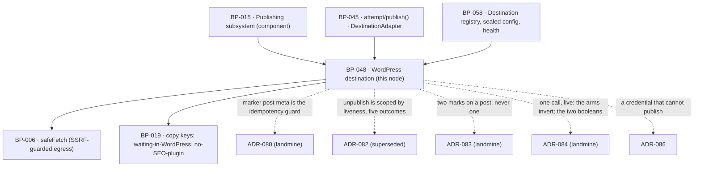

# BP-048 — The WordPress destination

- Parent: BP-015
- Kind: **feature** — a leaf cut straight from REQ-060: one destination adapter,
  for a site we do not own, publishing live there in one call.

## Responsibility
Publish a page live into the customer's own WordPress in a single call, at most
once, with the SEO title and description written into whichever of Yoast and
RankMath is present and one term the customer can list every ReachKit post by in
their own wp-admin; report the permalink the site came back with; and never write
into a post ReachKit did not itself make live.

## Module / boundary
`src/lib/publish/destinations/wordpress/` — inside BP-015's
`src/lib/publish/**`, disjoint from BP-058's `destinations/index.ts`,
`destinations/health/` and `destinations/hosted/`:

| Path | Holds |
|---|---|
| `adapter.ts` | The `DestinationAdapter` implementation: `deliver`, `unpublish`, `health`, and the two capability probes BP-058 calls. |
| `client.ts` | The REST calls, every one through BP-006's `safeFetch`. |
| `seo.ts` | Plugin detection and the title/description write. |
| `errors.ts` | Vendor response → BP-045's `FailureReason`. The one place a vendor payload stops. |

Credential storage, encryption, the destination row and disconnect-time
destruction are **BP-058's** (REQ-074 criterion 4); this adapter receives a
decrypted `DestinationConfig` for the duration of one call and holds nothing.
The state machine, the retry policy and the publication row are **BP-045's**.

## Diagram


## Public interface
```ts
// src/lib/publish/destinations/wordpress/adapter.ts
export const wordpressAdapter: DestinationAdapter   // kind: 'wordpress'

export interface WordPressConfig {          // the shape stored in destinations.config, sealed by BP-058
  baseUrl: string                           // the customer's site root; the REST root is derived, never stored twice
  username: string
  applicationPassword: string               // present only in memory, only inside one call
}

export type SeoPlugin = 'yoast' | 'rankmath'
export function detectSeoPlugins(cfg: WordPressConfig): Promise<readonly SeoPlugin[]>

/** REQ-060 criterion 6's "one place", and ADR-083. Can this credential assign —
 *  and if necessary create — the stamp term on this install? Called by BP-058 at
 *  connect and at each health check, never by this node on a schedule of its
 *  own, so a site that will not take the stamp is a known destination state
 *  rather than something a customer discovers by following a mail to an empty
 *  filter. */
export function canStamp(cfg: WordPressConfig): Promise<boolean>

/** REQ-060 criterion 7 and **ADR-084 Decision 3**. Can this credential *publish*,
 *  not merely create? WordPress's default role map gives `edit_posts` to
 *  Contributor and `publish_posts` only from Author upward, so an application
 *  password from a Contributor-level user can create a post and have WordPress
 *  quietly hold it at `draft` whatever the request asked for — the one route by
 *  which the owner's ruling could produce, unnoticed, exactly the outcome it
 *  abolishes: a page ReachKit reports as published sitting invisible in a drafts
 *  folder. Probed by BP-058 at connect and at each health check, never by this
 *  node on a schedule of its own; `false` makes the destination **failing** with
 *  reason `cannot_publish` (**ADR-086** Decision 1) and holds the queue there,
 *  rather than being discovered by a customer whose page went nowhere.
 *
 *  It is a **separate probe from `canStamp` and must stay one.** A site can
 *  publish and refuse the term, and a site can take the term and refuse to
 *  publish; they gate different things (one holds the queue, one only costs
 *  REQ-060 c6's list), and merging them either blocks publishing over a
 *  findability attribute or publishes into a site that cannot publish. */
export function canPublish(cfg: WordPressConfig): Promise<boolean>

// deliver(): one create call that publishes, or finds the post we already created
export type WordPressDelivery = DeliveryResult & {
  /** **ADR-084 Decision 2.** The permalink the create response returned. Not
   *  computed by us, not derived from the slug: the site's own answer for the
   *  post it just made live. `liveUrl: undefined` and `madeLive: false` are no
   *  longer narrowed by type on this adapter — the narrowing that used to uphold
   *  REQ-060 criterion 1 upheld a criterion that has since inverted. */
  liveUrl: string
  madeLive: true                            // ADR-084 Decision 4: true for every row
                                            // this adapter writes. It looks like a
                                            // constant and is the discriminator
                                            // REQ-056 c16's second outcome rests on.
  remoteId: string                          // the WordPress post id
  seoWritten: readonly SeoPlugin[]          // possibly empty — criterion 4's case
  stampApplied: boolean                     // ADR-083. `false` is a delivered page
                                            // whose site would not take the term:
                                            // criterion 6 is unmet for it and
                                            // REQ-079 c6's mail has no place to
                                            // name — stated, never inferred
  deliveredAt: Date
}
```

## Data model delta
None of its own. It reads `destinations.config` through BP-058's sealed accessor
and writes only what BP-045's publication row already holds: `remote_id` (the
WordPress post id), `published_at` (the delivery date), `live_url` (**the
permalink the create call returned** — ADR-084 Decision 2), `made_live_by_us`
(true), and `delivery_state='delivered'`. No WordPress-specific column and no
second copy.

**Corrected 2026-09-01.** This section previously read "`live_url` left
**null**, and `delivery_state='delivered'`. REQ-060 criterion 2's 'names the
WordPress site and the date of delivery and no live address' is therefore the row
itself". Both halves are refuted: ADR-084 makes the address real, and REQ-060
criterion 2's rewritten text says the page "is shown as live until either the
customer unpublishes it or ReachKit's one check finds no page at its address".
Because `live_url` is now written, BP-045 also sets `verify_due_at` on this row
by the rule it already had, so a WordPress page is verified at 24 hours (BP-049)
and receives weekly verdicts (BP-051) **with no new destination rule anywhere**.

**The waiting-in-WordPress line is retired.** `publish.wordpress.awaitingYou`
described a page waiting for the customer to publish it, which no page does any
more; ADR-084's Consequences name it, and REQ-056 criterion 6's second arm ("a
written line saying so in place of an address") was deleted from the requirement
on 2026-09-01. It is removed rather than repurposed: a retired key with a new
meaning is the plausible-but-wrong address rule 5.3 exists against.
Neither key needs an edit
to BP-019 or BP-020: those nodes hold the registry's mechanism and the band and
severity words, and enumerate no `publish.*` key — every key on this topic is
named here and by the ADRs, which is where ADR-084's "BP-019 owes" line actually
lands. `publish.wordpress.namedForRemoval` is **kept, minted and unreached** for
the opposite reason (ADR-084 Decision 4) — a deleted key is how an empty arm becomes
unrenderable and therefore deletable next. Criterion 4's line,
`publish.wordpress.noSeoPlugin`, and ADR-082's unpublish lines are unchanged.
This node supplies keys and values, never sentences (REQ-093).

The stamp term's slug is `WORDPRESS_STAMP_SLUG`, a pin in BP-005 (config over
constants, rule 7); its value and the term's display name are customer-visible
strings and are **owner-owed**, and their ground is now stronger and their debt
sooner: the term is public **from the moment of delivery**, and it is ReachKit's
act rather than the customer's that makes it so (ADR-084 Decision 5). The tag
archive it produces at `/tag/<slug>/` on the customer's own domain is a public
page ReachKit causes to exist there. `stampApplied` travels into the publication
record beside `seoWritten`, in the existing `verify jsonb` sibling field rather
than a new column, for the reason decision 2 gives.

## Error & edge behavior
- **A post is created live, in one call, and there is no draft state this
  adapter intends to leave behind** (**ADR-084 Decision 1**). One WordPress REST
  create carrying `status: 'publish'`, the SEO fields and ADR-083's stamp in the
  same request, returning the permalink. **There is no create-then-publish
  two-step, and adding one is forbidden**: a two-step opens a window in which a
  post exists in the customer's site as a draft ReachKit meant to publish, and a
  crash inside that window re-creates by accident exactly the population the
  owner's ruling removes — while ADR-080's marker search, which answers "is this
  the post for draft X?", would then also have to answer "and did we finish?",
  the second job ADR-083 Decision 3 forbids loading onto a mark.
- **At most one post, even after an unrecorded delivery.** Before creating,
  `deliver` searches the site for a post carrying our marker for this
  `idempotencyKey` (the draft id); a hit is returned as the existing delivery.
  The unique index on `(draft_id, destination_id)` cannot reach inside a site we
  do not own, so the marker is the second half of the same guarantee. Neither
  the marker nor the row may be cleaned up — **ADR-080**.
- **The stamp is written at creation, in the create call, and never afterwards**
  (REQ-060 criterion 6, ADR-083 decision 2). One `post_tag` term, assigned as the
  post is made. There is no backfill path and there must not be one: adding the
  term to an existing post is "a later write into their site", which criterion 6
  forbids in terms. This is affordable only because no WordPress post has ever
  been created by this product, so the un-stamped population is empty — which
  makes the work-order sequence load-bearing, not a preference.
- **The stamp is never the idempotency search.** `deliver` looks for the ADR-080
  marker and only the marker. The term is the customer's to rename, merge or
  delete in their own admin; the marker is not visible to them there. A
  discriminating test removes the term from a post and asserts the idempotency
  search still finds it — **ADR-083** is why, and merging the two is the cleanup
  that file exists to stop.
- **A site that will not take the stamp is still a successful delivery.**
  `stampApplied: false`, the page is in their site, and nothing is retried:
  same shape as a missing SEO plugin (decision 2), same reason. What follows is
  stated rather than hidden — for those posts REQ-060 criterion 6 is not met and
  REQ-079 criterion 6's mail has no place to name, which is REQ-060's own
  `rests-on` row's stated consequence. BP-058's `canStamp` probe at connect and
  at health check is what makes it known before a customer is told about a place.
- **Existing posts are never touched.** The only writes are the creation of our
  own post, the SEO fields on that post, and the stamp term on that post — all
  three in the creation of a post this adapter made. Nothing this node does reads, edits,
  deletes or reorders a post it did not create (REQ-060's non-goals).
- **SEO plugins are detected, never assumed.** `detectSeoPlugins` inspects the
  REST index of the customer's site once per delivery. Both present means both
  written; one present means one written; **neither present is not a failure** —
  the page is still delivered and the customer is told, in one written line,
  that no SEO plugin was found (REQ-060 criterion 4). A write to one plugin
  failing while the delivery succeeded is reported the same way, as a
  not-written outcome on `seoWritten`, never as a failed publish: the page is in
  their site, and saying otherwise would be false.
- **Credentials never leave the call.** The application password is decrypted by
  BP-058 for the duration of one call, never logged, never returned by any read
  path a surface uses, and never echoed back to anyone (REQ-060 criterion 5,
  REQ-074 criterion 7). `errors.ts` maps every vendor response to a
  `FailureReason` member and discards the payload; no vendor string reaches a
  screen, a mail or an export.
- **Failure mapping.** 401/403 → `credentials_expired` (not retryable → the page
  comes to rest needing the customer, and BP-058 marks the destination
  `expired`). **A create that succeeds but comes back with a post whose status is
  not `publish` → `credentials_invalid`, not retryable** (**ADR-086** Decision
  5): the credential is valid and will never do what is needed, BP-058's probe
  reads the same site as `failing`/`cannot_publish`, and the page comes to rest
  needing the customer. It is deliberately **not** `credentials_expired`, which
  would put the destination in the wrong one of REQ-074 criterion 1's three
  states and offer the customer the ordinary Reconnect — the one remedy REQ-060
  criterion 7 says is never offered here. **No post is ever reported as
  published with a draft behind it**: this is the arm that catches the case the
  probe missed by one health-check interval. 404 on the REST root, or a root that
  is not a WordPress REST index → `destination_rejected`, not retryable. 429 →
  `rate_limited`, retryable. 5xx, connection reset, DNS failure, timeout → the retryable members.
  A response we cannot classify is **not retryable**: an unrecognised outcome at
  a destination we do not own must not be hammered three times.
- **Verification and weekly verdicts now apply here, and no rule was written to
  make them.** The row carries a `live_url`, so BP-049 schedules the 24-hour
  check by the rule it already had — decided from the address, never from
  `destination.kind` — and BP-051 judges the page by the same route. REQ-062's
  non-goal excluding "a page delivered to a destination as a draft the customer
  must publish themselves" and REQ-063's equivalent were both **deleted from
  their requirements** on 2026-09-01. What broke was the assertions written
  against the old constant, not the shape (ADR-084 Decision 2).
- **What the check finds at that address is not this node's.** A 404 or 410 at
  the *page's public address* is BP-049's `page_not_found` and every other answer
  is its `could_not_confirm` (ADR-085); this node's `errors.ts` maps answers to
  the *REST API* about a post id it holds. The two mappings look alike, run
  against the same host, and mean different things — `already_gone` is a fact
  about a post ReachKit is trying to write to, `page_not_found` is a fact about a
  page a reader went to. They share one unverified assumption (that a 404 can be
  told from an unreachable site) and nothing else. Do not merge them.
- **`unpublish` is scoped by liveness (ADR-082, carried forward by ADR-084
  Decision 4), and the discriminator is stored.** `publications.made_live_by_us`
  (BP-045) is the only input to the liveness question; the customer's site is
  never re-read to decide which of the two populations the page is in, because a
  customer who published our draft themselves is not a page ReachKit made live.
  **The populations have inverted**: `returned_to_draft` is now every unpublish
  that reaches the site and `named_for_removal` is the arm with no members. Not
  one of the five arms is deleted, and the arm that now reads as dead code is the
  *other* one — read ADR-084's warning block before removing either. In every arm the product stops
  treating the page as one of the customer's live pages,
  `publications.unpublished_at` is set, and the outcome is recorded in
  `publications.unpublish_outcome`. Four of REQ-056 criterion 16's outcomes are
  this adapter's:
  - **`made_live_by_us = true` → `returned_to_draft`.** One `POST` setting that
    post's status to `draft`. Exactly one field of exactly one post this adapter
    itself created and itself made live; no other field is read, edited or
    reordered. Setting an already-draft post to draft is a no-op and still
    returns `returned_to_draft`.
  - **`made_live_by_us = false`, post present → `named_for_removal`. This arm is
    now empty in production and stays specified, tested and unreachable.**
    Nothing this adapter creates is left un-live, so no row it writes can take
    it; it is held open against REQ-056 criterion 16's second outcome, which the
    criterion still promises and which the analyst deliberately did not narrow to
    today's population. Its copy key is kept minted and unreached beside it.
    **No write
    of any kind to the customer's site**: not the post status, not a tag, not a
    comment, not a removal of the marker and not a removal of the stamp (ADR-080
    decision 5 and ADR-083 decision 3 both stand unchanged here). The post is
    named for the customer on ReachKit's own surface, through
    `publish.wordpress.namedForRemoval`.
  - **Post no longer in the site → `already_gone`.** Nothing was written and
    nothing is theirs to remove. This is its own arm and **not**
    `named_for_removal`: the two lines say opposite things about what the
    customer must now do, and ADR-082 Decision 3b withdraws the mapping ADR-081
    made. It applies whichever way `made_live_by_us` reads — there is nothing
    left to return either way.
  - **Site could not be reached → `unreachable`.** Nothing was written, the post
    may still be live there, and the page's record carries the action to ask
    again (BP-045's `retryUnpublishWrite`). It is `ok: true`: the customer's stop
    was taken and the page is `unpublished`; what did not happen is the write
    into a site we do not own.
  - **The mapping between the last two is `errors.ts`'s, and it is the one place
    it can be got wrong.** A `404` for a post id we hold is `already_gone`; a DNS
    failure, connection reset, timeout or 5xx at the site is `unreachable`.
    Collapsing them makes one of criterion 16's four outcomes unreachable, which
    is a change to the requirement. That the distinction is reliable is ADR-082's
    third `rests-on` and is **not verified in this corpus**.
  - The marker and the stamp stay on the post in every arm.
  - **`returned_to_draft` is the ordinary outcome, and `named_for_removal` is
    the empty arm — the ends have swapped.** Until 2026-09-01 this bullet said
    the opposite, on REQ-060 criterion 1's promise that a page here "appears in
    their WordPress site as a draft and is never made live by us". That criterion
    has inverted (ADR-084), this adapter sets `status: 'publish'` on every
    create, and `made_live_by_us` is `true` on every publication it writes. Both
    arms keep a discriminating test against a fixture row of the opposite kind,
    so deleting either fails a test rather than passing silently — which is the
    protection ADR-082 built for the arm that is no longer the empty one.

## NFR budget
- `deliver` p95 ≤ 8 s including the marker search, the create and up to two SEO
  writes; hard timeout 20 s, inherited from BP-045's adapter contract.
- `health` p95 ≤ 3 s: one authenticated read of the REST index. Called by
  BP-058, never by this node on a schedule of its own.
- Every outbound call goes through BP-006's `safeFetch` with a 2 MB response cap
  and DNS pinning. Chosen (rule 1.1): robots checking is **off** for this
  adapter, because these are authenticated API calls to a site the customer
  connected and gave us a credential for; `robots.txt` governs crawling, not an
  API the site's own administrator authorised. Reversal is one flag, and
  reversing it would make a customer's own `Disallow: /` stop their paid
  publishing.
- `canStamp` and `canPublish` are one authenticated read each; both are called by
  BP-058 on the connect and health paths and neither adds anything to the
  delivery budget. They are two probes and not one — decision 4.
- Observability: one log line per delivery — destination id, draft id, outcome,
  `remoteId`, plugins written, whether the stamp was applied, duration. Never the base URL's credentials,
  never a response body.

## Decisions
1. **The marker on the post is the destination-side idempotency guard** —
   recorded as **ADR-080** (landmine), not here: the same invariant has one half
   in BP-045's publication row, one half in this adapter, and touches BP-058's
   disconnect path and BP-017's erasure and unpublish-everything paths. No one
   blueprint owns it.
1a. **A post carries two marks, and the second is a `post_tag` term the customer
   can list by** — recorded as **ADR-083** (landmine), not here: it spans this
   node's create path, BP-058's connect and health probe, BP-005's pin and
   BP-063's deletion mail, and the merge of the two marks reads as a cleanup in
   both directions while failing no test. The choice of a tag over an author or a
   category, and why the term's name is the owner's and not this node's, are
   there and are not restated (rule 2.4).
2. **Neither SEO plugin present is a success, not a degradation** — Status: accepted
   - Context: criterion 4 requires the page still be delivered and the customer
     told in one written line.
   - Decision: `seoWritten: []` on a successful `DeliveryResult`; the state
     machine reaches `published` in the delivered sense, and the line is a copy
     key on the page record.
   - Alternatives considered: `needs_attention` — rejected, the page is in their
     site and nothing needs the customer. A silent success — rejected, criterion
     4 requires the telling.
   - Consequences: `seoWritten` is on the delivery result and must survive into
     the publication record for the line to be rendered later; it is stored in
     the publication row's existing `verify jsonb` sibling field rather than a
     new column. Cheap to reverse.
3. **An unclassifiable vendor response is not retryable** — Status: accepted
   - Context: REQ-056 criterion 4 retries only "while that reason is one a
     repeated attempt could clear". An unknown response is by definition not
     known to be one.
   - Decision: the default arm of the error mapping is non-retryable, so the
     page comes to rest needing the customer rather than making three writes
     into somebody else's site on a guess.
   - Alternatives considered: retry by default — rejected: the destination is
     not ours, the failure mode is a duplicate or a partial post, and the
     customer is the one who can look.
   - Consequences: more pages reach `needs_attention` early. That is the safer
     direction at a destination we do not own, and each arrival is a mapping we
     can then classify.
4. **`canPublish` and `canStamp` are two probes, and the delivery is a second
   guard behind them** — Status: accepted (2026-09-01)
   - Context: ADR-084 Decision 3 puts the capability question at connect and at
     each health check, and REQ-060 criterion 7 requires the *delivery* to fail
     non-retryably where it happens anyway.
   - Decision: two probes, called by BP-058, gating different things — a site
     that cannot publish is `failing` and its queue is held; a site that will not
     take the stamp publishes normally and only loses REQ-060 criterion 6's list.
     And the create call checks the status of the post it got back, so a probe
     stale by one health-check interval cannot produce a page reported as
     published with a draft behind it.
   - Alternatives considered: one capability probe returning a set — rejected, it
     invites one caller to gate on the wrong member and one is queue-blocking
     while the other is not; the probe alone, with no check on the created post —
     rejected, it leaves the race between a role change and the next health check
     unspecified and the page in `publishing`; deliver as a draft and tell the
     customer — rejected in ADR-084 alternative 5, because it makes the abolished
     population reachable again by an accident of a role assignment.
   - Consequences: one extra read on the connect and health paths, and one extra
     assertion on the create response. Cost of reversing: the drafted post the
     owner's ruling exists to abolish, arriving silently.
5. **What a credential that cannot publish says and offers** — recorded as
   **ADR-086**, not here: it amends ADR-084 Decision 3, which rule 2.2b forbids
   editing in place, and it settles a `HealthReason` and an action in BP-058, a
   telling in BP-046, a failure reason in BP-045 and the mapping above in this
   node. Read it before wiring the destinations list: the action must lead to a
   credential for a **different account**, and the ordinary Reconnect is the one
   remedy that cannot work here.
3a. **The unpublish outcomes are ADR-082's** — Status: accepted, recorded as
   **ADR-082** (superseded by **ADR-084**, which carries the union forward with
   all five arms and no change of shape and inverts which of them have members),
   not here: the union spans BP-045's column
   and return type, this node's arms and error mapping, BP-015's adapter contract
   and BP-063's `stillLive`. What is this node's alone is the `errors.ts` mapping
   that separates `already_gone` from `unreachable`, stated under Error & edge
   behavior above.

## Blocked-by — discharged 2026-08-31 by ADR-081, carried by ADR-082 (rule 2.3)
This node carried `blocked-by: [REQ-079]` because REQ-056 criterion 16 and
REQ-079 criterion 4 described one customer action two incompatible ways. The
ruling — **scope by liveness**, each criterion true of its own population — was
ADR-081's and is carried forward unchanged by **ADR-082**, which supersedes it
after REQ-056 criterion 16 grew from one outcome to four. The edge stays removed
and every arm is specified above. Neither file's reasoning is restated here
(rule 2.4); cite **ADR-084**, which supersedes ADR-082 and is where the arms'
populations now stand.

Still owed and still not this node's to write: the written lines the customer
reads. ADR-081 named two (`publish.wordpress.namedForRemoval` and the was-live
line); ADR-082 adds the `already_gone` line, the `unreachable` line and the
retry action's label; ADR-083 adds the stamp term's display name and slug; and
ADR-084 and ADR-086 add the cannot-publish line. `publish.wordpress.awaitingYou`
is **struck from that list** — its occasion no longer exists (Data model delta).
All the rest are owner-owed strings under BP-019/BP-020 — this node supplies the
keys and the values, never the sentence (REQ-093).

## Status grounds (rule 3.2)
Self-certified `approved`: cut from REQ-060 while that requirement was
`status: approved`, which is when §3's blueprint gate was met and read; one
`satisfies` edge written at creation; `code:` globs sit inside BP-015's
`src/lib/publish/**` and overlap no sibling's. The `blocked-by` that previously
scoped the unpublish write path out of this approval is discharged, so the fourth
work order — the one never cut — may be planned alongside the three (deliver,
SEO detection and write, health and failure mapping) that were never affected.

**Status grounds addendum, 2026-09-01 — discharged 2026-09-02.** That addendum
recorded that this node had been rewritten against **REQ-060** while it was
`status: in-review` — criterion 1 inverted by ADR-084 so the page is publicly
readable from the moment delivery completes, criterion 2 rewritten with it,
criteria 6 and 7 new — reading **REQ-056** and **REQ-062** in the same state,
and that §3's gate was therefore not met. It also recorded that more of this
node rested on unsigned text than of any other in the corpus: the create call,
the returned address, both booleans on the delivery, the inverted arms and the
retired copy key. **The owner has since approved all three requirements, and
criterion 1 stands inverted as ADR-084 ruled it. The gate is now met and these
grounds hold — for the node's whole surface, including every item that list
named.** No retroactive refusal is owed.

The six `rests-on` rows above stand unchanged and none of them moves: they are
claims about how a WordPress install behaves, and a requirement's approval
cannot discharge one. The owner-owed strings under `## Open questions` stand
too — approving the behaviour did not mint the sentences.

## Open questions
- [ ] The stamp term's display name and slug are owner-owed customer-visible
      strings (owner: user) — **public on the customer's own site from the moment
      of delivery, by ReachKit's act rather than theirs**, and producing a public
      tag archive at `/tag/<slug>/` on their domain. ADR-083 Decision 5 is the
      derivation and ADR-084 Decision 5 strengthens its ground; this node holds
      the pin's name and no string.
- [ ] The line the customer reads when their WordPress credential can create
      posts but not publish them (owner: user). Carried from ADR-084 and bounded
      by ADR-086 Decision 3: it is its own copy key, it may not be written from
      the held-pages count, and it may never say pages are being held and nothing
      has been lost.
- [ ] What REQ-079 criterion 6's mail says for a site that would not take the
      stamp, where there is no place to name (owner: user). The count and the
      "theirs to keep or remove" half are unaffected.

The one that stood here — REQ-060's own `REVIEW(ambiguity)`, whether a
WordPress-only customer is told anywhere other than in the app that their page is
waiting — is **closed, and then made moot**: it was folded into criterion 2 and
deleted on 2026-09-01, and the criterion it was folded into has since been
rewritten. No page waits, and criterion 2's "sends the customer no mail of its
own" is gone with the rest of the waiting apparatus — a WordPress delivery now
occasions REQ-062 criterion 5's `published` mail like any other (BP-049, BP-053).
