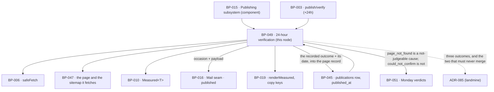

# BP-049 — 24-hour liveness verification, failures shown plainly

- Parent: BP-015
- Kind: **feature** — a leaf cut straight from REQ-062: one check, once, a day
  after a page went out, three things that check can come back with, and nothing
  ever guessed.

## Responsibility
Fetch a published page's own live address 24 hours after it published and record
exactly one of three outcomes — the four `Measured<boolean>` checks where the
page answered; that no page was found, on a 404 or a 410 and no other answer; or
that the check could not be confirmed, where any other answer came back — and
record, only from an answer a site gave, a condition of that site that no page
on it may be blamed for.

## Module / boundary
`src/lib/publish/verify/` — inside BP-015's `src/lib/publish/**`, disjoint from
BP-045's four directories and from `destinations/`:

| Path | Holds |
|---|---|
| `verify.ts` | `verifyLive()` — the one fetch, the three-way outcome, and the four checks in the arm that has them. |
| `answer.ts` | The status map: which answers are `page_not_found`, which are `could_not_confirm`, and the identity test that separates "not our page" from "our page we cannot read" (ADR-085 Decision 2, decision 4 below). |
| `due.ts` | Which publications are due, and the disposition of one that never will be. |
| `coverage.ts` | The one definition of "returns its whole page content". |
| `site.ts` | The condition of a site the page sits in — recorded only from an answer that site gave, and read back for later pages (REQ-062 criterion 6). |
| `telling.ts` | The occasion and payload for the `published` message. |

It writes only `publications.verify` and `publications.verify_due_at`; it takes
no transition, sends no mail itself, and never repairs anything. It fetches a
published page's address **once, ever** — there is no retry, no reschedule and no
second look for any reason (REQ-062's non-goals; ADR-085 Decision 3).

## Diagram


## Public interface
```ts
// src/lib/publish/verify/verify.ts
export type CheckId = 'reachable' | 'indexable' | 'sitemap' | 'aiReadable'

/** `VerifyChecks`, `VerifyOutcome`, `NotConfirmed` and `VerifyDisposition` are
 *  **declared in BP-045's `src/lib/publish/types.ts`** and re-exported here, so
 *  every caller's spelling is what it reads below. They live in the leaf because
 *  BP-045's `record/` must name the recorded outcome for REQ-062 criterion 7 and
 *  `types.ts` imports nothing — declaring them here would make BP-045 → BP-049 →
 *  BP-045 a node cycle and a build failure (BP-045 decisions 6 and 9). The
 *  shapes are restated below for readability of this node's contract and are
 *  single-homed there; **the behaviour behind every arm is this node's**, and so
 *  is all of ADR-085. */
export type { VerifyChecks, VerifyOutcome, NotConfirmed, VerifyDisposition } from '../types'

/** REQ-062 criterion 4's three outcomes of the one check, as three arms.
 *  **ADR-085 (landmine).** `checkedAt` is on every arm because criterion 4 and
 *  criterion 7 both require the date on every one of them, and criterion 7's
 *  promise is that no surface states a page's state without it. There is no
 *  fourth arm and no "pending": a check that has not run yet is a
 *  `VerifyDisposition`, not an outcome. */
export type VerifyOutcome =
  | { outcome: 'found';              checks: VerifyChecks; checkedAt: Date }
  | { outcome: 'page_not_found';     status: 404 | 410;    checkedAt: Date }
  | { outcome: 'could_not_confirm';  why: NotConfirmed;    checkedAt: Date }

/** Why the check did not settle. Recorded for the log and for the copy key;
 *  **never a cause of the page's absence** — criterion 4 forbids naming one, and
 *  no member of this union says anything about who did what. */
export type NotConfirmed =
  | 'unreachable'      // DNS failure, connection reset, timeout, TLS failure
  | 'server_error'     // 5xx
  | 'redirected_away'  // 3xx to an address that is not this page's
  | 'not_our_page'     // it answered, and what came back is not the page we published

export function verifyLive(publicationId: string): Promise<VerifyOutcome>
// (the two type aliases above are the leaf's; repeated here as the contract this
//  node implements, never declared twice in code)

// src/lib/publish/verify/answer.ts
/** ADR-085 Decision 2: a **whitelist of two statuses**, never a blacklist of
 *  failures. An answer this function does not recognise is `could_not_confirm`,
 *  because the default arm must be the one that asserts nothing. */
export function classify(a: {
  status: number | null            // null = no HTTP answer at all
  finalUrl: string | null          // after redirects
  requestedUrl: string
  html: string | null
  publishedTitle: string
}): { outcome: 'found'; html: string } | { outcome: 'page_not_found'; status: 404 | 410 }
 | { outcome: 'could_not_confirm'; why: NotConfirmed }

/** decision 4. Is this document the page we published, independently of whether
 *  we can read its body? Canonical link or `og:url` resolving to `requestedUrl`
 *  is sufficient; where the document declares neither, a normalised `<title>`
 *  match. This is what keeps a JavaScript-gated page in `found` — failing
 *  `aiReadable`, which is the whole point of that check — instead of
 *  disappearing into `not_our_page`. */
export function isOurPage(html: string, a: { requestedUrl: string; publishedTitle: string }): boolean

// src/lib/publish/verify/due.ts — the union below is the leaf's (see above)
export type VerifyDisposition =
  | { kind: 'not_yet';     dueAt: Date }                       // REQ-062 c3, the 24 hours before
  | { kind: 'due' }
  | { kind: 'done';        result: VerifyOutcome }             // all three of c4's outcomes live here
  | { kind: 'never';       because: 'taken_down_first' }       // REQ-062 c4, first sentence
  | { kind: 'never';       because: 'no_live_address' }        // a delivery that never reached an address

export function dispositionFor(publicationId: string): Promise<VerifyDisposition>
export function dueNow(limit: number): Promise<string[]>       // publication ids, oldest due first

// src/lib/publish/verify/coverage.ts
/** The one definition of REQ-062 criterion 1's "whole page content". */
export function bodyCoverage(fetchedHtml: string, draftBodyMd: string): number  // 0..1

// src/lib/publish/verify/site.ts
/** REQ-062 criterion 6, narrowed by the 2026-09-01 fold to the sitemap and the
 *  robots policy alone — reachability moved into criterion 4's third outcome and
 *  is **not** a site condition. Recorded only from an answer the site gave. */
export type SiteConditionKind = 'publishes_no_sitemap' | 'robots_blocks_site'
export interface SiteCondition { kind: SiteConditionKind; foundAt: Date }

/** The site's condition as of the last check that got an answer from it. Derived
 *  from the most recent `publications.verify.siteCondition` for that
 *  destination — one indexed read, not a second column and not a second fetch
 *  (decision 5). `null` where no check has ever had an answer to record one
 *  from, which is not the same as "the site is fine" and is never rendered as
 *  one. */
export function siteConditionFor(destinationId: string): Promise<SiteCondition | null>

// src/lib/publish/verify/telling.ts
/** REQ-062 criterion 5. One message on the same occasion whichever of the three
 *  outcomes was recorded — a failed check, an absent page and an unconfirmed
 *  check are none of them a reason to send nothing. */
export interface PublishedTelling {
  publicationId: string
  liveUrl: string
  result: VerifyOutcome
  /** Non-empty only under `found`; possibly empty then. Never a reason not to
   *  send. Under the other two arms it is empty **because there are no check
   *  outcomes at all**, which the mail states in their place and never
   *  alongside them (criterion 5's last sentence). */
  failed: readonly CheckId[]
  /** Criterion 5: named separately from the page's own outcomes, and only where
   *  criterion 6 recorded one. */
  siteCondition: SiteCondition | null
  copy: 'mail.published.verified' | 'mail.published.notFound' | 'mail.published.notConfirmed'
}
export function tellingFor(publicationId: string): Promise<PublishedTelling>
```

## Data model delta
On the `publications` topic — `supabase/migrations/*_publications*.sql` is
**BP-045's** glob under structure.md rule 3, so these land in BP-045's migration
file and this node declares `depends-on: BP-045` for them.
`publications.verify jsonb` already exists in `BUILD.md` §10.

| Column / shape | Why |
|---|---|
| `verify_due_at timestamptz null` | REQ-062 criterion 3 requires the surface to state **when** the check will run, in the 24 hours before it does. Set to `published_at + 24h` at the moment `delivery_state` becomes `delivered`, and left null where `live_url` is null. Since **ADR-084** that is every delivery at both destinations, WordPress included: the rule reads the address, and a WordPress row now has one (BP-045). It is also the due-work index (`(verify_due_at) where verify is null`), so BP-003's "the queue is the state machine" holds here too. |
| `verify jsonb` shape | The serialised `VerifyOutcome`: `{outcome, checkedAt, …}` — `checks` (four serialised `Measured<boolean>`) under `found`, `status` under `page_not_found`, `why` under `could_not_confirm`. **Not** four bare booleans and **not** a flat object with optional fields: the discriminant is stored, so a reader cannot obtain the four outcomes without having gone through the arm that produces them (ADR-085 Decision 1). "Not checked yet", "checked and false", "no page there" and "we could not tell" are four different values in the column and none can be conflated with another. |
| `verify.siteCondition` | `SiteCondition \| null`, inside the same jsonb. REQ-062 criterion 6's condition is a fact one check learned about the site the page sits in; it is stored on the check that learned it and read back for later pages by `siteConditionFor` (decision 5). No new column, no new topic, and nothing on BP-058's `destinations` row. |

## Error & edge behavior
- **One fetch, three outcomes, and never a fourth.** `verifyLive` makes one
  `safeFetch` of `live_url` and `classify` maps the answer. A **404 or a 410 and
  no other answer** is `page_not_found`. **Any** other answer — no HTTP answer at
  all, a 5xx, a redirect away from the page, or a document that is not the page
  we published — is `could_not_confirm`. There is no third status in the
  whitelist and no blacklist anywhere: an answer `classify` does not recognise
  falls to `could_not_confirm`, because the default arm must be the one that
  asserts nothing (**ADR-085** Decision 2).
- **Neither of those two outcomes produces the four checks, states a failure of
  the page, or names a cause.** REQ-062 criterion 4 forbids all three in terms:
  "it names no cause and never says who removed the page or that the customer
  did", and "nothing is stated as a failure of this page". `NotConfirmed`'s four
  members are for the log and the copy key and none of them attributes anything.
- **Neither is retried, rescheduled or repeated.** `dueNow` selects only rows
  with `verify is null`; a recorded `could_not_confirm` is a recorded outcome and
  the row is not due again. "Not confirmed" is **final for that page, not
  pending**, and is never rendered as pending (REQ-062's non-goal). A retry here
  is the single most likely wrong change anyone will make to this node —
  **ADR-085**'s warning block leads with it.
- **The two outcomes have opposite consequences downstream.**
  `page_not_found` stops the page being shown as live (REQ-060 criterion 2) and
  is a terminal not-judgeable cause (BP-051, **ADR-072**). `could_not_confirm`
  does neither: the page goes on being shown as it was and goes on receiving
  ordinary weekly verdicts, with the outcome shown *beside* them and never in
  place of one (REQ-063 criterion 1). They render as the same grey line and must
  never be merged — ADR-085 Decision 4 is the table.
- **`reachable` is `true` in every `found` result, and is not deleted for it.**
  Every way a page could be unreachable now lands in criterion 4's third
  outcome, so the arm that produces the four checks is only ever reached by a
  200 carrying our page. The check therefore has one value in production and
  reads exactly like a field nobody needs. It is kept because REQ-062 criteria
  1, 2 and 3 promise the customer **four** outcomes with their dates, and
  because criterion 3 requires all four to state that they have not been checked
  yet in the 24 hours before the check runs — a promise a three-outcome surface
  cannot keep. This is the same shape as ADR-084's `made_live_by_us`: a constant
  column that is load-bearing for a rendered promise. Deleting it is a surface
  change, not a cleanup.
- **Four outcomes, never inferred from each other.** Inside `found`, a check
  that could not be read records `unmeasured` with its reason, never `false`.
  REQ-062 criterion 3 forbids stating an outcome that was not observed, and
  nothing anywhere defaults a `Measured<boolean>` to `false` (BP-010).
- **Before the check, the outcomes say so.** `dispositionFor` returns `not_yet`
  with `dueAt`, and BP-019's `renderMeasured` renders the four as unmeasured.
- **Taken down first.** A publication with `unpublished_at` set before
  `verify_due_at` is `never: 'taken_down_first'`; no fetch is made and the
  surface states that the page was taken down before it could be verified
  (REQ-062 criterion 4, first sentence). The row is not deleted and `verify`
  stays null — deleting it would break BP-045's idempotency guard (ADR-080).
- **No live address, no check.** The disposition is decided from
  `live_url is null`, **not** from `destination.kind`. Since **ADR-084** every
  destination serves publicly and every delivered row carries an address, so this
  arm is now reached only by a delivery that never completed — and it stays
  written against the address rather than the kind, which is why WordPress
  joined the verified population with no second rule (ADR-084 Decision 2).
- **Exactly one check per publication.** A completed check is never re-run and
  there is no re-verification schedule. A run that crashed mid-way wrote
  nothing, so it is still due — the job is idempotent by the null check.
- **The four checks, in the `found` arm.**
  - `reachable` — true, as above: the arm was reached.
  - `indexable` — true when neither the response's `X-Robots-Tag` nor the
    document's `<meta name="robots">` marks it against indexing. Both are
    checked, because either alone can be the one that is set.
  - `sitemap` — one `safeFetch` of the sitemap the site publishes: BP-047's
    document for a hosted page, and `/{sitemap_index,sitemap}.xml` plus whatever
    `robots.txt` names for a site ReachKit does not serve. True when the page's
    own address is listed.
  - `aiReadable` — the same document as the page fetch, read with a user agent
    the policy REQ-059 serves permits and with no script execution of any kind,
    is true when `bodyCoverage(html, drafts.body_md) ≥ VERIFY.coverageFloor`.
    We never run a browser; if a page needs one, that is precisely the failure
    this check exists to find — which is why `isOurPage` decides identity from
    the document's canonical link or title and **not** from coverage (decision
    4).
- **A condition of the site is recorded only from an answer that site gave**
  (REQ-062 criterion 6, as narrowed on 2026-09-01). A site that answered that it
  publishes no sitemap, or whose own robots document blocks the permitted
  crawlers across the whole site, is recorded as `SiteCondition` on this check
  with the date it was found; that page's affected outcome is `unmeasured` with
  that reason — **never `false`** — so no page is marked as having failed a check
  for a condition of the site, then or on any later page.
- **Where ReachKit could not reach or could not read what it went to look at,
  nothing is recorded and nothing is suppressed.** A sitemap or robots document
  that did not answer, or that came back unparseable, leaves that one check
  `unmeasured` for **this page alone**, writes no `SiteCondition`, states nothing
  about the site as the customer's to act on, and suppresses no check for any
  later page. Any suppression keyed on "could not be reached" is wrong twice
  over: that case moved to criterion 4's third outcome, and criterion 6 may not
  fire on a non-answer at all.
- **A page absent from a sitemap the site does publish, or blocked where the
  rest of the site is not, is that page failing**, and criterion 3 governs it —
  `false`, stated plainly, not a site condition.
- **Reachability is no longer a criterion 6 case at either destination.** A
  hosted page whose CNAME broke after publishing is `could_not_confirm`, not a
  condition of a site ReachKit serves and not a failure of the page.
- **A failed check is a recorded outcome, not an error.** `verifyLive` never
  throws for a failing check and never retries one. A failure of the *job* — our
  own crash before any outcome was written — writes nothing and leaves the row
  due, so the difference between "the job did not run" and "the check did not
  settle" is never lost. Those are different facts and the second is now a
  stored outcome, which is exactly why the first must stay unstored.
- **The message is sent on the same occasion in all three arms.** `tellingFor`
  returns the outcome, the failed checks where there are any, and the site
  condition where one was recorded; BP-016 sends it whether `failed` is empty or
  not and whichever arm was taken (REQ-062 criterion 5). Under
  `page_not_found` and `could_not_confirm` the mail carries what was recorded
  and its date **in place of** the four outcomes and never alongside them.
  Whether the customer has switched that mail off is REQ-075's and BP-016's; the
  outcome never enters that decision.
- **Every surface reads the recorded outcome with the page's state, never
  without it** (REQ-062 criterion 7). This node does not police surfaces: it
  hands the whole `VerifyOutcome`, `checkedAt` included, to BP-045's page-record
  read model, which returns it inside the same value as the page's state so a
  surface cannot obtain one without the other (ADR-085 Decision 5).
- **Nothing is repaired.** A failed check produces no retry, no republish and no
  transition (REQ-062's non-goal). The customer reads it.

## NFR budget
- Up to three fetches per publication — the page, the sitemap, and (at a site
  ReachKit does not serve) that site's `robots.txt` — each ≤ 10 s timeout and
  ≤ 2 MB through BP-006; `verifyLive` p95 ≤ 5 s, p99 ≤ 31 s. Under
  `page_not_found` and `could_not_confirm` only the first is made: the other two
  exist to decide checks that arm does not produce.
- Due window: a check is run at the first `publish/verify` invocation at or
  after `published_at + 24h` and must run inside 25 h of publication — one hour
  of slack, chosen (rule 1.1) so a job tick of up to an hour satisfies "24 hours
  have passed" without a per-publication timer. Reversal: a pin and a schedule.
- `VERIFY.coverageFloor = 0.95` and `VERIFY.userAgent` belong in BP-005
  (config over constants, rule 7). The floor is chosen so that template chrome,
  typographic substitution and markdown-to-HTML differences cannot fail a page
  whose content is wholly present, while a page gated behind client JavaScript —
  which returns close to none of the draft's tokens — fails decisively. Reversal
  is one pin; the risk of raising it is false failures on a customer's own
  domain, and of lowering it is calling a JavaScript-gated page AI-readable.
- The user agent is our own token and is permitted because the robots document
  BP-047 serves blocks no general crawler (REQ-059 criterion 4) — it is not one
  of the six named AI agents, and impersonating one of them would be a false
  statement to a server we are measuring.
- `publish/verify` is read-only and is **not** stopped by the kill switch
  (BP-003), so a page that went out before a stop is still verified.
- Observability: one log line per check — publication id, the outcome arm, the
  four checks or the status or the `NotConfirmed` reason, the coverage ratio
  where one was computed, whether a site condition was recorded, and duration.
  No page body and no fetched HTML is logged. The count of `could_not_confirm`
  per week is worth a counter of its own: it is the number of pages the product
  now says nothing about, and it is invisible without one.

## Decisions
1. **The four outcomes are `Measured<boolean>`, not booleans** — Status: accepted
   - Context: REQ-062 criterion 3 forbids showing an unrun check as passed or
     failed, and criterion 4 adds cases that are neither. (The outer
     three-outcome union is **ADR-085**'s; this decision is about the four
     values inside its `found` arm.)
   - Decision: reuse BP-010's `Measured<T>`, which already distinguishes
     measured, measured-zero and unmeasured, and let BP-019 render it. No new
     tri-state and no nullable boolean.
   - Alternatives considered: `boolean | null` — rejected, null reads as false
     in every language the surface will pass through, and the reason a check did
     not run (not due, taken down, no address) would be lost. A separate
     `verify_status` column — rejected, a second copy of the same fact.
   - Consequences: the jsonb is bulkier and one existing renderer serves it.
     Reversing means re-introducing exactly the "published means a row was
     written" failure REQ-062 exists to end.
2. **Exclusion from verification is decided by a null live address, not by
   destination kind** — Status: accepted, **and vindicated by ADR-084**
   - Context: as written on 2026-08-30, REQ-062's non-goal excluded a WordPress
     draft "because it has no live address". That non-goal is now false and has
     been deleted from the requirement; the rule it produced is untouched.
   - Decision: the rule tests the address, which was the stated reason, rather
     than the kind, which was only that day's instance of it.
   - Alternatives considered: `if (kind === 'wordpress')` — rejected, it is a
     rule that says the wrong thing and would be wrong for the first destination
     that delivers without serving.
   - Consequences: **this is the seam that held.** When the owner ruled on
     2026-09-01 that every destination publishes live, WordPress rows gained a
     `live_url` and joined the verified population with **no edit to this rule
     and no second destination rule anywhere** (ADR-084 Decision 2). What broke
     was the fixtures written against the old constant, not the shape. Trivial to
     reverse, and the reversal would have cost a destination-kind switch every
     future adapter must be threaded through.
3. **`bodyCoverage` is one function, one threshold, one place** — Status: accepted
   - Context: "returns its whole page content" needs an operational definition
     or the check is unfalsifiable, and a vague check is a vacuous test (§8).
   - Decision: normalise both sides to lowercase alphanumeric tokens and measure
     multiset containment of the draft's tokens in the fetched document; one
     pinned floor.
   - Alternatives considered: a byte-length ratio — rejected, chrome and markup
     dominate it. Exact substring match — rejected, any markdown rendering
     difference fails a correct page. A headless browser comparison — rejected,
     it would defeat the check's purpose, which is precisely to look without one.
   - Consequences: the definition is testable against a fixture page and against
     a JavaScript-gated one, so the check discriminates. Reversal is a pin.

4. **Identity and readability are two questions, decided from two different
   parts of the document** — Status: accepted (2026-09-01)
   - Context: criterion 4's third outcome includes "what came back was not the
     page ReachKit published", and criterion 1's fourth check asks whether the
     page "returns its whole page content to a crawler that runs no scripts".
     Decided from `bodyCoverage` alone these are the **same measurement at two
     thresholds**: a parked page, a soft-404 and a login wall return almost none
     of the draft's tokens — and so does a correctly published page whose body is
     behind client JavaScript, which is exactly the failure `aiReadable` exists
     to find. One threshold cannot serve both, and whichever way it is set, one
     of the two promises breaks silently.
   - Decision: **identity** is `isOurPage` — a canonical link or `og:url`
     resolving to the address we fetched, or, where the document declares
     neither, a normalised `<title>` match against the published title.
     **Readability** is `bodyCoverage` against `VERIFY.coverageFloor`, evaluated
     only after identity holds. The split rests on the fact that a CMS emits a
     page's own identity in server-rendered markup even where it withholds the
     body — recorded as this node's second `rests-on` row, `open`.
   - Alternatives considered: a second, much lower coverage floor for identity —
     rejected, it is one measurement with two pins and the gap between them is
     unfalsifiable; the HTTP status alone — rejected, a soft-404 answers 200 and
     is the case the requirement names; ADR-080's marker — rejected, it is post
     meta and is not in the served HTML, and ADR-083 forbids loading a second
     job onto either mark.
   - Consequences: a page whose CMS emits no canonical, no `og:url` and a
     rewritten title reads as `not_our_page` when it is in fact ours. That is the
     safe direction: it asserts nothing. Reversal is one function.
5. **A site's condition is stored on the check that found it and read back, not
   held on the destination row** — Status: accepted (2026-09-01)
   - Context: criterion 6 requires a recorded condition to be named, dated,
     stated as the customer's own, and to stop **any page on that site**, "then
     or on any later page", being marked as having failed for that cause. That
     needs a later page's check to know what an earlier one found.
   - Decision: `SiteCondition` is a field of the `verify jsonb` this node
     already owns, and `siteConditionFor(destinationId)` reads the most recent
     non-null one. No column on `destinations`, which is BP-058's topic, and no
     second fetch of anything.
   - Alternatives considered: a column on `destinations` — rejected, it puts a
     fact this node observes in a row another node owns, and that node's health
     check would then read like its writer; a fresh probe of the site when a
     later page is checked — rejected, that page's own check already fetches the
     sitemap, and a second probe is a second look at a site for a purpose
     REQ-062's non-goal closes ("Going back to a site to see whether a condition
     … has been put right").
   - Consequences: a site's condition is only ever as fresh as the last page
     checked there, which is exactly what the requirement bounds it to. `null`
     means no check has ever had an answer to record one from, and it is never
     rendered as "the site is fine". Reversal is a column and a backfill.
6. **The three outcomes, and why two of them must never merge** — recorded as
   **ADR-085** (landmine), not here: the union is this node's, but Decision 4 of
   that file is a table read by BP-051 (the verdict cause), BP-039 (the day
   panel's way through), BP-053 (the mail) and BP-045 (the page record), and its
   Decision 5 is a constraint on all four at once. The merge it forbids will be
   proposed by whoever is looking at two identical grey lines on a screen, and a
   decision buried in this node is invisible from there.

## Status grounds (rule 3.2)
Self-certified `approved`. Grounds: cut from REQ-062; one `satisfies` edge
written at creation; `code:` globs sit inside BP-015's `src/lib/publish/**` and
overlap no sibling's — `answer.ts` and `site.ts` are new files inside
`src/lib/publish/verify/`, which this node already globs whole, so no glob
changes and no scope conflict arises.

**Status grounds addendum, 2026-09-01 — discharged 2026-09-02.** That addendum
recorded that the three-outcome union, the identity split, the site condition
and ADR-084's arrival here derived from **REQ-062** while it was `status:
in-review`, reading **REQ-063**, **REQ-060** and **REQ-043** in the same state,
and that §3's gate was therefore not met. **The owner has since approved all
four, unchanged in every criterion this node was cut from. The gate is now met
and these grounds hold.** No retroactive refusal is owed. The two `rests-on`
rows above stand as they were: approving a requirement discharges a gate, not an
assumption about a WordPress install this repository has never spoken to.

## Open questions
