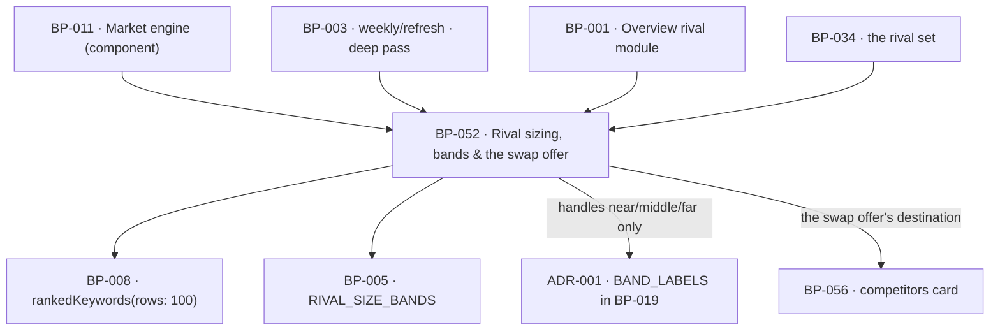

# BP-052 — Rival sizing, bands, and the swap offer

- Parent: BP-011
- Kind: **feature** — cut from REQ-096, a leaf under the market engine.

## Responsibility
Give every tracked rival a measured size beside the customer's own, band it at two
counts that stay reachable at every customer count including zero, and offer a swap
where a rival is out of the customer's league — without ever removing one. Research on
the DataForSEO endpoints and competing products' measurement practices is in
`registry/evidence/RESEARCH-dataforseo-endpoints.md` and
`registry/evidence/RESEARCH-competitor-visibility-measurement.md`.

## Module / boundary
`src/lib/market/sizing/` — `band.ts` (the pure banding function), `size.ts`
(`sizeRivals` over the monthly rival rows), `offer.ts` (the swap offer's state).
Paid path only: nothing here is reachable from BP-026's free-report card, and the
module makes no call the deep and monthly passes do not already make.

## Diagram


## Public interface
```ts
// src/lib/market/sizing/band.ts — pure, total, no I/O
export type RivalSizeBand = 'near' | 'middle' | 'far'          // internal handles (ADR-001)
export function bandRivalSize(a: { rivalRanked: number; ownRanked: number }): RivalSizeBand
//  near   : R <= max(RIVAL_SIZE_BANDS.nearFloor,   RIVAL_SIZE_BANDS.nearMultiple   × C)
//  middle : not near and R <= max(RIVAL_SIZE_BANDS.middleFloor, RIVAL_SIZE_BANDS.middleMultiple × C)
//  far    : above that

// src/lib/market/sizing/size.ts
export type RivalSize =
  | { domain: string; state: 'sized'
      rankedCount: number; band: RivalSizeBand; at: Date; current: boolean }
  | { domain: string; state: 'unsized'
      because: 'awaiting_deep_pass' | 'added_since_last_sizing' }
export function sizeRivals(c: CostContext, a: { rivals: string[]; ownRanked: number }):
  Promise<Measured<RivalSize[]>>            // one entry per input rival, in input order
export function dueForResizing(a: { lastMeasuredAt?: Date; now: Date }): boolean

// src/lib/market/sizing/offer.ts
export type SwapOffer =
  | { offered: false }
  | { offered: true; rival: string; destination: 'settings.competitors' }
export function swapOffer(s: RivalSize): SwapOffer            // offered iff state==='sized' && band==='far'
```

## Data model delta
None of its own. Each pass writes `report.rivalSizes = RivalSize[]` into that
scan's `scans.report jsonb`, so a band always travels with the date its counts were
measured (REQ-096 criterion 4) and a band is never a column that can go stale
independently of its evidence. No column, no table, no migration owned here.

## Error & edge behavior
- **A band is derived at read time from two stored counts and is never stored as a
  fact of its own** (Decisions 1). `report.rivalSizes` stores the counts, the date
  and the derived band together for that pass; re-derivation from the stored counts
  must reproduce the stored band, and a test asserts it.
- **Not sized yet is a state, never a blank and never a band** (criterion 5).
  `awaiting_deep_pass` is a rival settled at setup before the pass completed;
  `added_since_last_sizing` is one added afterwards, sized at the first measurement
  after they added it (criterion 3).
- **A stale band carries `current: false`** as well as its own earlier date, so a
  surface cannot render a size that could not be re-measured as a current
  measurement by simply omitting the date (criterion 4).
- **No band ever removes, hides, drops or stops measuring a rival** (criterion 7):
  `sizeRivals` returns exactly one entry per input rival in input order, and this
  module exports no function that filters, reorders or excludes one. The promise is
  held by the absence of a way to break it.
- **Monotonicity** (criterion 2, last sentence): for a fixed `ownRanked`,
  `bandRivalSize` is non-decreasing in `rivalRanked` under the order
  `near < middle < far`. A property test over the whole integer range asserts it.
- **Cold start** (criterion 8): at `C = 0` the floors carry the expression —
  `near` ≤ 100, `middle` 101–500, `far` > 500 — so all three are assignable. At
  every `C > 0` the multipliers differ (2 < 5), so the two bars never coincide.
  A property test asserts all three bands reachable at every `C` in 0…10,000.
- A rival whose rows could not be fetched keeps its previous `sized` entry with the
  earlier date and `current: false`; it never falls back to `unsized`, which would
  read as "we have never measured this" about a rival we have.
- `ownRanked` is the customer's own measured count from the **same pass**
  (criterion 1). A band mixing a rival's count from one pass with a customer count
  from another is refused at the call: `sizeRivals` takes both together and stamps
  one `at`.
- Nothing in this module reaches BP-026 or the free report. REQ-096's non-goal and
  BUILD §6.4's never-list ("per-rival `ranked_keywords` on the free path") are both
  held by the module graph, not by a runtime check.

## NFR budget
- **No new spend site.** Sizing reads the rows the paid deep and monthly passes
  already buy: `rankedKeywords(rows: 100)` per rival, `RANKED_RIVAL_ROWS`
  100 rows at 2.4¢ each, monthly (BUILD §6.3), inside `CAPS.DEEP_C` 150¢ and
  `CAPS.WEEKLY_C` 40¢. The customer's own count is the same `rankedKeywords@300`
  the pass already takes.
- `bandRivalSize` is pure and ≤ 1 µs; `sizeRivals` adds no latency beyond the rows
  it is handed.
- Cadence: `dueForResizing` is true at 30 days or more since the last measurement,
  the `CACHE_WINDOWS_D.rival` window BP-005 already pins — one number, not two.
- Observability: per rival, the two counts, the derived band, the measurement date,
  whether it was a re-measurement or a first sizing, and whether the swap offer
  fired.
- Pins needed from BP-005: `RIVAL_SIZE_BANDS { nearFloor: 100, nearMultiple: 2,
  middleFloor: 500, middleMultiple: 5 }` and `CACHE_WINDOWS_D.rival` — both already
  declared there.

## Decisions
1. **The band is derived, never stored as an independent column** — Status: accepted
   - Context: the two boundaries are pinned parameters chosen under rule 1.1
     (`registry/evidence/REQ-096.md`) and are expected to move before the behaviour
     is built on. A band stored as a column would have to be back-filled by a
     migration on every pin change, and until that migration ran the product would
     hold bands that its own constants disagree with.
   - Decision: `report.rivalSizes` stores the counts and the date; the band travels
     beside them for auditability and must re-derive identically. Moving a boundary
     re-renders every past measurement correctly with no migration, no
     re-measurement and no vendor call — exactly the reversal cost the evidence
     file claims.
   - Alternatives considered: a `rival_sizes` table with a `band` column —
     rejected, BUILD §10 admits a tenth table only for a rendered surface that
     needs one, and this one renders from the report blob; deriving the band at
     render time and storing nothing — rejected, criterion 4 requires the band to
     carry the date its size was measured, and a render-time derivation would reach
     for whichever counts were newest.
   - Cost of reversing: low today, high after the first paid customer — the counts
     are the evidence, and a stored band with no counts beside it cannot be
     re-derived when a boundary moves.
2. **`RivalSize` is a discriminated union, refining BP-011's four-field comment** — Status: accepted
   - Context: BP-011's interface comment describes the sized shape
     `{ domain, rankedCount, band, at }`. Criterion 5 requires a distinct,
     renderable "not sized yet" state that is neither a band nor a blank, and
     criterion 4 requires a stale band to be distinguishable from a current one.
   - Decision: the union above. Its `sized` arm carries exactly BP-011's four
     fields plus `current`; the `unsized` arm carries no band and no count, so a
     surface cannot print a band for a rival that has none.
   - Alternatives considered: `band: RivalSizeBand | null` — rejected, `null`
     cannot say which of the two unsized reasons applies and every call site must
     re-check it; omitting unsized rivals from the array — rejected, it silently
     shortens the rival list, which criterion 7 forbids.
   - Cost of reversing: low; a type change with no stored shape behind it beyond
     the report blob's version.
3. **The swap offer names a destination; it never changes the set** — Status: accepted
   - Context: criterion 6 requires a control that takes the customer to where they
     can replace the rival, and criterion 7 forbids the product narrowing the set
     on its own judgement. REQ-096 states the change happens at REQ-071's
     competitors card, on that requirement's terms.
   - Decision: `swapOffer` returns a destination handle. This module exports no
     mutation of the rival set at all, so "the product removed my rival" is not a
     bug that can be written here.
   - Alternatives considered: a one-click replace that swaps in the next candidate
     — rejected, REQ-096's non-goal forbids suggesting a specific replacement, and
     it would make the product the chooser.
4. **Handles here; words in `BAND_LABELS`** — Status: accepted, recorded in **ADR-001**
   - The reasoning spans BP-005, BP-011, BP-013 and BP-019 and is that ADR's; it is
     not restated here (rule 2.4). This node's obligation is the one line above:
     `RivalSizeBand` is `'near' | 'middle' | 'far'` and no customer-facing string
     is written in this module.

## Status grounds (rule 3.2)
Self-certified `approved` under rule 3.2. Grounds: cut on `/expand-requirement`
from **REQ-096**, `status: approved`, as are the four requirements it depends on
(REQ-026, REQ-029, REQ-041, REQ-071) — §3's blueprint gate. It satisfies exactly
that requirement, lives inside BP-011's boundary, and overlaps no sibling's globs.
Its two `rests-on` rows are open and neither blocks planning: the first bounds
`rankedCount`'s ceiling, the second bounds when a screen may be built, not when
the engine may be.

## Open questions
