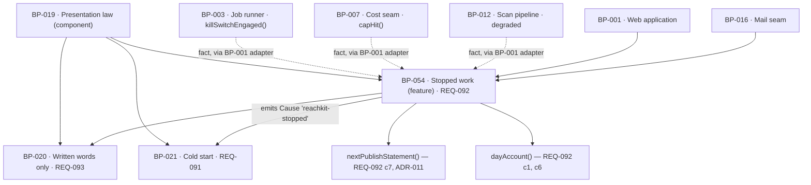

# BP-054 — When ReachKit stops its own work, every surface says so

- Parent: BP-019 (component — presentation law, `src/lib/presentation/`)
- Kind: **feature** — cut straight from REQ-092, a leaf under BP-019.

## Responsibility
Turn the fact that ReachKit itself did not do the day's work into one statement
that says it was ReachKit and not the market, says whether anything is needed
from the customer, always says either when the work resumes or that no time is
promised, names no internal cause, and outranks every other true reason a
publish is not scheduled.

## Module / boundary
`src/lib/presentation/stopped/` holds `WorkStop`, `stoppedWorkStatement()`,
`nextPublishStatement()`, `dayAccount()` and `stopCause()`.
`tests/presentation/stopped/**` holds this node's unit tests and the
stopped-state arm of the conformance sweep ADR-010 places across the block.

The module is **pure**: it takes a `WorkStop` and returns lines. It reads no
database, calls no job runner and imports nothing from `src/jobs/`, `src/lib/scan/`,
`src/lib/costs/` or `src/lib/publish/` — `structure.md` rule 6 fixes the
direction and BP-019's NFR budget fixes the purity. The facts are assembled by
BP-001's thin route adapters from those modules' existing readers and handed in.

It does **not** own: the wording of the calendar day's line (REQ-043 criterion
4's, held as a `CopyKey` in BP-020's registry); where the navigation's
next-publish line sits and how it is worded, or which causes it may name when
ReachKit has *not* stopped (REQ-040 criterion 4's closed set, that node's);
Overview's at-most-two alerts (REQ-041 criterion 5 — REQ-092's non-goal states
criterion 3 is neither of those); pages held because a destination is
disconnected or failing (REQ-074); the free scan's own bounds and refusals
(REQ-003); the one-line-per-place arbiter (BP-021's `account()`).

## Diagram


## Public interface
```ts
// ── src/lib/presentation/stopped/stop.ts ─────────────────────────────────────
/** The fact that ReachKit stopped its own work, in the only shape this node
 *  accepts. It carries **no cause field of any kind** — no cap, no spend amount,
 *  no error text, no system status. REQ-092 criterion 8 is unrepresentable
 *  rather than tested for: there is nothing here for a renderer to leak. */
export interface WorkStop {
  /** When ReachKit stopped. Used for "which days does this account for", never
   *  rendered as a cause. */
  since: Date
  /** REQ-092 criterion 4: the date the work is expected to resume, or an explicit
   *  statement that no time is promised. Not optional — "never neither" is the
   *  criterion, and an optional field is exactly how neither happens. */
  resumes: { on: Date } | { promised: false }
  /** REQ-092 criterion 2: whether anything is needed from the customer. The
   *  'nothing' arm is what makes "and when nothing is, says so" a rendered
   *  sentence rather than an omission. */
  needs: { kind: 'nothing' } | { kind: 'action'; key: CopyKey }
  /** REQ-092 criterion 6: the work was cut short but a page was still produced,
   *  so the day states that part of the measurement behind it was not done and
   *  is never presented as a complete pass. */
  partial: boolean
}

/** Classify the three stop shapes REQ-092 criterion 1 names, from facts BP-001's
 *  adapter read. Internal only — the returned handle is never rendered and never
 *  reaches a CopyKey. It exists so the resumption date can be derived per shape
 *  and so a stop can be logged where logging is allowed. */
export type StopShape = 'spend-ceiling' | 'halted' | 'step-failed'
export function stopCause(facts: {
  capHit: boolean; killSwitch: boolean; lastRun: 'ok' | 'degraded' | 'failed'
}): StopShape | null

// ── src/lib/presentation/stopped/statement.ts ────────────────────────────────
/** REQ-092 criteria 1, 2, 4 and 8. The one statement that ReachKit did not do
 *  the work. Every surface that says so says it through this function.
 *
 *  Replaced BP-019's withdrawn `stoppedWorkLine(a: { resumesOn?: Date })`, which
 *  this node does not ship; BP-019 decision 4 records the withdrawal and
 *  re-exports this signature. See Decisions 1. */
export function stoppedWorkStatement(stop: WorkStop): {
  /** "ReachKit did not do the work" — never "there was nothing worth publishing". */
  line: string
  /** REQ-092 criterion 2, always present: the action, or that nothing is needed. */
  needsLine: string
  /** REQ-092 criterion 4, always present: the resumption date, or that no time
   *  is promised. Never absent. */
  resumesLine: string
}

/** REQ-092 criterion 7. Every statement of when the next page publishes — the
 *  navigation's, the footer autopilot card's next-publish time, a mail's
 *  statement of what publishes next — renders through this one function.
 *  While `stop` is non-null it names ReachKit's stop and nothing else, whatever
 *  else is also true of the account. ADR-011 is why. */
export function nextPublishStatement(a: {
  stop: WorkStop | null
  /** The causes REQ-040 criterion 4 admits when ReachKit has not stopped —
   *  paused, nothing approved, no page planned. Ignored entirely when `stop` is
   *  non-null; that is the point, and it is asserted, not documented. */
  otherwise: { tag: 'paused' | 'nothing-approved' | 'none-planned' } | { tag: 'scheduled'; at: Date }
}): { line: string }

/** REQ-092 criteria 1 and 6, as the single account a date carries. Returns the
 *  `Cause` BP-021's `account()` arbitrates, never a line placed directly on a
 *  screen — so a stopped day cannot end up with two accounts. */
export function dayAccount(stop: WorkStop, pageProduced: boolean):
  | { tag: 'reachkit-stopped'; line: string }               // no page that day
  | { tag: 'reachkit-stopped'; line: string; partialPass: true }  // c6: page produced, pass incomplete
```

## Data model delta
None, and deliberately so. `structure.md` rule 3 fixes a closed set of migration
topics and holds no topic a stop record could claim; this node therefore derives
a `WorkStop` from records other nodes already store rather than minting an
unowned table. The first `rests-on` row above is where that rests.

## Error & edge behavior
- `WorkStop.resumes` has no absent state. REQ-092 criterion 4's "never neither"
  is a property of the type, so a caller cannot construct a stop that says
  neither a date nor that no time is promised.
- `WorkStop` carries no cause field. REQ-092 criterion 8's "no cap or spend
  amount, no error text and no system status detail appears anywhere in it" is
  therefore not a redaction step that can be skipped — the data is not in the
  argument. `StopShape` is computed from facts and consumed only to derive
  `resumes`; it is not a member of `WorkStop` and reaches no `CopyKey`.
- `nextPublishStatement` with a non-null `stop` ignores `otherwise` completely,
  including `otherwise.tag === 'paused'` when publishing genuinely *is* paused.
  This looks wrong and is load-bearing: ADR-011 states why and must be read
  before anyone "fixes" the precedence.
- `nextPublishStatement` with a null `stop` renders from `otherwise` alone and
  names one of REQ-040 criterion 4's closed causes. This node adds no cause to
  that set.
- `dayAccount` returns a `Cause`, never a placed line. A stopped day passes
  through BP-021's `account()` like every other empty place, so REQ-043
  criterion 5's "exactly one account" and REQ-092 criterion 1 cannot both be
  satisfied by two lines on the same date.
- A stop that is true and a customer instruction that is outstanding on the same
  date: the stop wins the arbitration and its `needs` arm must carry the
  instruction. `dayAccount` rejects the pair where `stop.needs.kind === 'nothing'`
  while an instruction is outstanding — an assertion, not a silent merge, because
  the alternative loses REQ-043 criterion 5's instruction behind REQ-092
  criterion 1's line. ADR-011 records the reconciliation.
- REQ-092 criterion 3's app-landing statement is not one of REQ-041 criterion
  5's at-most-two alerts and is not counted against that budget. REQ-092's own
  non-goal says so; the sweep asserts the alert count is unchanged when a stop
  is present.
- The statement stops rendering the moment the work resumes (criterion 3): the
  surface holds no stop state of its own, and a `null` `WorkStop` yields no
  statement anywhere. There is no dismissal, no cached banner and no "seen" flag
  that could keep it on screen or take it off early.
- REQ-092 criterion 5 — prepared pages survive the stop and publish on the
  normal schedule — is a property of BP-015's transition table: a stop writes no
  transition, so no prepared page is dropped or marked published. This node
  asserts it in the stopped-state sweep and implements none of it.
- Every line this node returns is a `CopyKey` from BP-020's registry. It writes
  no sentence, and none of the strings it needs is invented here.

## NFR budget
- Runtime: pure, allocation-bounded, no I/O, no clock read beyond the `Date`
  values handed in. Sub-microsecond.
- Freshness: a stop must appear on the app-landing screen within one page load
  of the fact becoming true (REQ-092 criterion 3, "without their having to open
  a calendar day or a settings screen"). This node is stateless, so the budget
  binds BP-001's adapter: the stop facts are read on the request that renders
  the screen, never from a cached snapshot older than that request.
- Authz: none of its own. It reads no session and its output does not vary with
  who is reading.
- Observability: this node logs nothing. `StopShape` is the handle a *producer*
  logs; a log line emitted from here would be a second home for the fact and a
  second place a cause could leak toward a surface.
- Conformance: the stopped-state arm of the sweep runs every route twice — stop
  present and stop absent — and asserts that no rendered text under a stop
  matches the internal-cause vocabulary (cap, spend, error, status, a currency
  amount, a stack frame). Budget 60 s on CI; this node's parameter, not a pin.

## Dependencies on other BP nodes
- **BP-020** — every line is a `CopyKey`; `COPY_META`'s `law: 'next-publish'`
  and `law: 'stopped-work'` tags are how the sweep enumerates the sites this
  node must be the sole producer for.
- **BP-021** — the `Cause` union and `account()`. This node imports from BP-021;
  BP-021 imports nothing from here (its `reachkit-stopped` arm carries an
  already-rendered line). One direction only, no cycle.
- **BP-019** (parent) — the module boundary.
- **Fact producers, at the adapter, not by import**: BP-003
  (`killSwitchEngaged()`), BP-007 (`capHit()`), BP-012 (scan `degraded` /
  `failed`), BP-015 (a publish step that failed). BP-001 and BP-016 assemble
  `WorkStop` from these and call in.
- **Reconciled with**: REQ-040's node (the navigation's line) and REQ-043's node
  (the day's line) — both render through `nextPublishStatement` and `dayAccount`
  respectively rather than minting their own.

## Decisions
1. **BP-019's `stoppedWorkLine(a: { resumesOn?: Date })` is not shipped, and this
   node logs a `blocked-by` on BP-019 rather than diverging silently** — Status: accepted
   - Context: BP-019's approved `## Public interface` declares
     `stoppedWorkLine(a: { resumesOn?: Date }): { line: string }`. REQ-092
     criterion 4 requires the statement to give "either the date the work is
     expected to resume or that no resumption time is promised — never neither".
     An optional `resumesOn` makes "neither" the default a caller reaches by
     omission, and the return type carries no place to say "no time promised".
     Criterion 2's "whether anything is needed from them" has no argument at all.
   - Decision: ship `stoppedWorkStatement(stop: WorkStop)`, whose `resumes` is a
     two-arm union and whose `needs` is a two-arm union, and record
     `blocked-by: [BP-019]` so the contradiction is visible in `blocked.md`
     rather than logged later as drift. The clearing edit is one line in
     BP-019's interface block, replacing that signature with this one.
   - **Cleared 2026-08-31.** BP-019's interface no longer declares
     `stoppedWorkLine`; it re-exports this node's `stoppedWorkStatement`,
     `nextPublishStatement` and `dayAccount`, and records the withdrawal as its
     own decision 4. `blocked-by` is now `[]` and this node's work orders are
     released. Nothing in this node's design changed.
   - Alternatives considered: ship both and treat BP-019's as a thin wrapper —
     rejected, the wrapper exports the exact hole the requirement forbids, and
     two functions for one capability is rule 7.1; ship the corrected signature
     silently — rejected, the librarian logs it as drift anyway and rule 2.3
     makes a conflict an edge, not a footnote.
   - Consequences: this node's three work orders were held until BP-019's
     interface line was corrected, and are now released. That is the gate working: writing them against
     a signature that permits a customer-visible violation is what the gate
     exists to stop. Reversal cost: none — the edge disappears when the line
     changes.
2. **The stop is derived from records that already exist; no new migration topic** — Status: accepted
   - Context: a stop is naturally a record ("ReachKit stopped at T for reason R,
     resuming at T′"). `structure.md` rule 3 fixes a closed set of migration
     topics and holds none this node could claim, and I may not add one.
   - Decision: derive `WorkStop` at read time from `killSwitchEngaged()`, the
     cap-hit ledger and the scan/publish run status, assembled by BP-001's
     adapter. The derivation rule lives in `stopCause()`, in one place.
   - Alternatives considered: a `workstops` topic and table — rejected here, not
     on the merits: it would require an edit to `structure.md`'s closed topic
     list, which is a decision for whoever owns that map. If the first `rests-on`
     row above is refuted — if any of the three facts turns out not to be
     readable per site per day — this decision is the one to revisit first, and
     the table is the answer.
     A cause field on `WorkStop` carrying the shape for the renderer to redact —
     rejected outright, redaction is a step that can be skipped and criterion 8
     is absolute.
   - Consequences: a stop is only as observable as the three underlying records.
     Reversal (adding the table) is a migration plus a change to `stopCause()`'s
     source, and no change to any statement this node produces.
3. **The precedence that makes ReachKit's stop outrank every other true reason,
   and the reconciliation with REQ-043 criterion 5's outstanding instruction,
   span this node, BP-021, REQ-040's node and REQ-043's node, and read as wrong
   on their face.** They are recorded as **ADR-011**, a landmine ADR, not here.

## Status grounds (rule 3.2)
Self-certified `approved` per rule 3.2. Grounds: cut from REQ-092, which is
`status: approved`; the gate "no blueprint from a non-approved requirement" is
met. `satisfies: [REQ-092]` written at creation. `code:` globs sit inside
BP-019's `src/lib/presentation/**` and `tests/presentation/**` boundary and
overlap no sibling's (`stopped/` is this node's alone). The node's `blocked-by: [BP-019]` (Decisions 1) was cleared on
2026-08-31 when BP-019's interface withdrew the contradicting signature; the
node's design is unchanged from approval. No customer-visible string is invented here.

## Open questions
