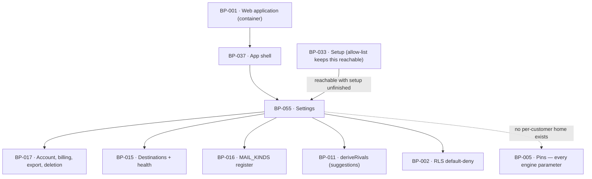

# BP-055 — Settings: the closed list of what is the customer's to decide

- Parent: BP-001
- Kind: **feature** — cut from REQ-070, a leaf under the web-application container.

## Responsibility
Offer exactly the fourteen settings and seven actions REQ-070 enumerates and
nothing else, reject any write outside that list without changing a stored value,
and make certain no measurement or spend parameter is offered anywhere by giving
none of them a per-customer home to be offered from.

## Module / boundary
`src/app/(account)/app/settings/` — the two-column screen, its panels and the
allow-list — and `src/app/api/settings/**`, the one write path. Every panel is a
thin adapter: billing, invoices, cancel, resume, export, unpublish-all and delete
are BP-017's; destination health and reconnect are BP-015's; notification toggles
render BP-016's `MAIL_KINDS` register; competitor suggestions come from BP-011.
What each setting *does* downstream is owned elsewhere — this node owns only that
the control is offered and that the write is bounded.

## Diagram


## Public interface
```ts
/** REQ-070 criterion 1's list, as a closed tuple. A key absent from it cannot be
 *  written, because `SettableKey` is derived from it and the handler validates
 *  against it before any row is touched. */
export const SETTABLE = [
  'category', 'competitors', 'domain',
  'mode', 'veto_hours', 'publish_time', 'time_zone', 'publishing_enabled',
  'destinations', 'voice_text', 'do_not_claim', 'notifications',
  'name', 'email',
] as const
export type SettableKey = (typeof SETTABLE)[number]
export type SettingsPatch = Partial<Record<SettableKey, unknown>>

/** REQ-070 criterion 2's list. Each is an action, not a setting; each delegates. */
export const ACTIONS = [
  'invoices', 'cancel', 'resume', 'sign_out', 'export', 'unpublish_all', 'delete_account',
] as const
export type ActionKey = (typeof ACTIONS)[number]

/** Criterion 4: an unknown key rejects the whole request and nothing is stored. */
export type PatchResult =
  | { ok: true; applied: readonly SettableKey[]; effective: 'now' | 'next_weekly' }
  | { ok: false; refused: 'unknown_key'; keys: readonly string[] }
  | { ok: false; refused: 'invalid_value'; key: SettableKey; reasonKey: CopyKey }
  | { ok: false; refused: 'not_owner' }
export function applySettings(a: { siteId: string; patch: SettingsPatch }): Promise<PatchResult>

// POST /api/settings — the only write path; siteId comes from the session.
export async function POST(req: Request): Promise<Response>

export function readSettings(siteId: string): Promise<SettingsModel>
export interface SettingsModel {
  market: { category: string; suggestions: readonly string[]; effectKey: CopyKey }
  competitors: readonly string[]                       // <= 5
  domain: string
  publishing: { mode: 'autopilot' | 'copilot'
                /** A whole multiple of 24 in [0, 168] — whole days 0 to 7
                 *  (REQ-073 c1). BP-057 is the validator and the one home of
                 *  the rule; this field is the value it produced. The comment
                 *  here read `0..168`, which admits 37 hours — a value the rule
                 *  refuses and no screen can render. */
                vetoHours: number
                publishTime: string; timeZone: string; enabled: boolean
                outcomeKey: CopyKey }                  // REQ-073 c2's written line for the selected pair
  /** **BP-058's `DestinationView`, entire — not a narrower copy** (decision 5,
   *  2026-09-02). This field read
   *  `{ id; kind; health }[]` until then, which dropped `reason`, `lastCheckedAt`,
   *  `heldPages`, `action` and `copy`: with those gone the panel could render
   *  neither REQ-074 criterion 1's last-checked date, nor criterion 2's written
   *  line and Reconnect action, nor — since ADR-086 — the
   *  `reconnect_other_account` action that a re-entered same credential must
   *  never be offered in place of. `readSettings` obtains it from
   *  `listDestinations(siteId)` and adds no field and drops none. */
  destinations: readonly DestinationView[]           // BP-058, imported not restated
  voice: { text: string }
  doNotClaim: readonly string[]
  notifications: readonly { kind: MailKind; on: boolean }[]   // from BP-016's MAIL_KINDS, stoppable only
  account: { name: string; email: string }
}
```

## Data model delta
None new. Every settable value already has a column: `sites.category`,
`sites.competitors`, `sites.domain`, `sites.mode`, `sites.veto_hours`,
`sites.publish_time`, `sites.voice_text`, `sites.do_not_claim`,
`destinations.*`, `users.name`, `users.email`; `sites.time_zone` and
`sites.publishing_enabled` are REQ-073's and REQ-056's deltas on the same topic.
**No column exists for any value in criterion 3** — no per-site question count,
locale, cadence, cap, row limit, freshness window, scoring weight or model
choice. That absence is the enforcement (decision 3).

## Error & edge behavior
- **An unknown key rejects the whole request.** Criterion 4 says the request "is
  rejected and no stored setting changes" — so validation runs over the entire
  patch before any write, and a patch mixing one valid and one invalid key writes
  nothing. Partial application is not a degraded success.
- **`siteId` comes from the session, never from the body** (criterion 5), and
  BP-002's RLS default-deny is the second lock. A change affects only that
  customer's own site's measurements, schedule and publishing.
- **Settings is reachable with setup unfinished** (REQ-025 criterion 5) through
  BP-033's `SETUP_INCOMPLETE_ALLOWLIST`; every one of criterion 2's seven actions
  works there, and cancelling behaves exactly as it does for a finished customer
  because it is the same BP-017 call with no setup-aware branch.
- **When a change takes effect is not this node's promise but is stated by it.**
  `effective` is `next_weekly` for `category`, `competitors` and `domain`
  (REQ-071 criteria 7 to 9 put all three at the next weekly re-measurement and
  never on save) and `now` for the rest, subject to REQ-073 criterion 4's rules
  for drafts already in review, which BP-015 applies.
- **Notification toggles are projected from `MAIL_KINDS`**, filtered to the kinds
  that register as stoppable. A mail kind added without a stoppability flag
  cannot render a toggle, and a stoppable kind cannot go unlisted — which is why
  the panel is not the three hand-written toggles of `BUILD.md` §4.7 (decision 4).
- **The veto window accepts whole days 0 to 7** (REQ-073 criterion 1) — that is,
  a whole multiple of 24 in `[0, 168]` hours, which is BP-057's validation and
  not a second copy of it here; a value outside refuses with `invalid_value` and
  a written line, storing nothing. This node stated the same fact twice and the
  two disagreed: the interface's `/* 0..168 */` admitted 37 hours. Corrected
  2026-08-31 by making the interface cite this line and this line cite BP-057.
- **Destination health is displayed, never inferred here**: `expired` is a state
  with a Reconnect action (BP-058), not an error, and the queue holds rather than
  looping. **A health probe that fails or times out is not an error on this
  screen either**: BP-058 returns the stored state and the stored
  `lastCheckedAt`, this node renders them, and the date the customer reads is
  then older than 24 hours and says so — which is the honest reading. No blank,
  no spinner that never resolves, and no vendor payload (REQ-074 criterion 7).
- **Export is always available**, including with setup unfinished and after
  cancellation, and is never partial (BP-017's contract).
- The danger zone's two actions state their consequence before running: unpublish
  all takes pages down, delete exports first and then takes down, never silently
  destroying (BP-017).
- A vendor or database error surfaces as one written line from the copy registry;
  no error payload reaches the response body.

## NFR budget
- p95 ≤ 400 ms for the screen where every destination's health is fresh; **≤ 4 s
  where it is not**, which is BP-058's own `listDestinations` budget (≤ 3.5 s
  when `ensureFreshHealth` re-checks, at most two destinations per site, 60 s
  debounce) plus this screen's own ≤ 400 ms of reads. **This screen makes a
  vendor call on the read path** — one DNS resolution or one authenticated REST
  read per stale destination — and it is REQ-074 criterion 1's promise, not an
  accident (decision 5). This line said "No measurement, no vendor call, no
  model call" until 2026-09-02 and was a second, contradicting copy of a budget
  BP-058 owns.
- No measurement and no model call: neither happens on any Settings path.
- `POST /api/settings` validates and writes in one transaction; p95 ≤ 250 ms.
- Authorisation: session plus site ownership on every read and write; RLS is the
  backstop, not the only check.
- Observability: one line per write carrying `siteId` and the applied **keys** —
  never the values, because `voice_text` and `do_not_claim` are the customer's
  own content and `email` and `name` are personal data.
- A discriminating test asserts `SETTABLE` is disjoint from the exported key set
  of `src/lib/config/constants.ts`: a pinned engine parameter that ever becomes
  settable fails it (criterion 3).

## Decisions

1. **The allow-list is a closed tuple and rejection is whole-request** — Status: accepted
   - Context: criterion 1 enumerates what may be changed and criterion 4 requires
     that an attempt to set anything else changes no stored setting.
   - Decision: `SETTABLE` is a readonly tuple, `SettableKey` derives from it, and
     `applySettings` validates every key in the patch before opening the
     transaction. Any unknown key refuses the request entire.
   - Alternatives considered: strip unknown keys and apply the rest — rejected,
     the customer is told the save succeeded while part of what they sent
     vanished, and criterion 4's "no stored setting changes" is broken; a
     deny-list — rejected, it defaults new fields to writable, which is how the
     first engine parameter becomes settable.
   - Consequences: adding a setting is a one-line diff in a file whose whole
     purpose is to be reviewed. Reversal re-opens the silent-strip failure.

2. **`siteId` is resolved from the session and never accepted from the body** — Status: accepted
   - Context: criterion 5 confines a change to the customer's own site.
   - Decision: the route reads the session, resolves the owned site, and passes
     it; the request body has no site field, so cross-site writes are
     unrepresentable rather than checked.
   - Alternatives considered: accept a `siteId` and authorise it — rejected, it
     is a check that can be forgotten where a missing field cannot;
     rely on RLS alone — rejected, rule 7.1's single owner still needs the
     application to know whose row it is writing for its audit line.

3. **Criterion 3 is enforced by the absence of a column, not by hiding a control** — Status: accepted
   - Context: criterion 3 requires that no control over any measurement or spend
     parameter is offered *anywhere in the product* and that each value is
     identical for every customer.
   - Decision: every such parameter lives only in `src/lib/config/constants.ts`
     (BP-005) and has no per-site column. There is nothing for a control to
     write, so an accidentally added control fails at compile time, and the
     disjointness test above fails the moment a pin becomes settable.
   - Alternatives considered: an "advanced settings" section behind a flag —
     rejected, REQ-070's non-goals exclude feature flags and a hidden control is
     still offered; per-site overrides defaulting to the constant — rejected, it
     makes next Monday's numbers incomparable with last Monday's for one customer,
     which is the harm the requirement's rationale names.
   - Consequences: a genuine need for a per-customer engine value is a
     requirement change, visible as one. That is the intended cost.

4. **The notifications panel renders the mail-kind register, not three fixed toggles** — Status: accepted
   - Context: `BUILD.md` §4.7 specifies "Notifications (3 toggles)". BP-016 already
     owns `MAIL_KINDS` and which kinds are stoppable.
   - Decision: the panel maps over the stoppable subset of `MAIL_KINDS`. Today
     that yields the three §4.7 shows; a fourth stoppable kind appears without a
     code change here, and an unstoppable kind can never appear as a toggle.
   - Alternatives considered: three hard-coded toggles — rejected, it is a second
     copy of the register (rule 2.4) and the copy is the one that goes stale, and
     a stoppable mail with no toggle is a customer who cannot stop a mail the
     product says they can.
   - Consequences: the panel's length is data-driven; the layout must tolerate a
     variable count, which BP-018's card does.

5. **A Settings read may make a network call, and the destinations field is
   BP-058's view entire** — Status: accepted (2026-09-02)
   - Context: this node declared its own five-field destination shape and a
     budget of "no vendor call". Both were second copies of facts BP-058 owns,
     and both were wrong. REQ-074 criterion 1 promises that the date the
     customer reads on the destinations list "is never more than 24 hours old
     **whether or not a publish was attempted in between**" — a property of what
     is on the screen at the moment it is read, which no background schedule can
     guarantee at read time. BP-058 already discharges it with `ensureFreshHealth`
     inside `listDestinations`, and WO-226 already ships it.
   - Decision: **yes — a Settings read may trigger a network call.** This node
     calls `listDestinations(siteId)` and puts `DestinationView[]` on
     `SettingsModel` unchanged. The freshness rule, the 60 s debounce, the probe
     and the ≤ 3.5 s budget stay BP-058's; this node states none of them and
     cites them.
   - Alternatives considered: keep the narrow copy and read stored health only
     — rejected, it is what stood, and it cannot render criterion 1's date
     honestly, criterion 2's line and action at all, or ADR-086's
     `reconnect_other_account`, which is a *union member* precisely so a surface
     that cannot render it fails to typecheck (BP-058's interface comment); a
     daily background refresh with no read-path probe — rejected, it makes the
     age of the displayed date a function of job lateness, so the criterion is
     met on a good day and silently broken on a bad one, and the failure is
     invisible because the screen still shows a date; probe asynchronously and
     patch the panel after paint — rejected, the customer then reads one state
     and acts on another, and REQ-074's whole shape is "a state the customer can
     fix", which requires the state and its action to arrive together.
   - Consequences: the Settings screen is no longer a pure database read, and
     its p95 has two numbers rather than one. That is the price of the promise;
     the bound is small because at most two destinations exist per site.
     **Cost of reversing:** one field type and one budget line here — but
     reversing it re-breaks REQ-074 criteria 1 and 2 on the one screen the
     requirement's user story names, which is why the narrow copy is not left
     in place under rule 2.2a: it is wrong, not merely inelegant.

## Status grounds (rule 3.2)
Self-certified `approved`. Grounds: cut from REQ-070, `status: approved`;
`satisfies: [REQ-070]`. Globs sit inside BP-001's boundary under
`src/app/(account)/app/settings/**` and `src/app/api/settings/**` — the api glob
matches the allow-listed path BP-001's own route table already names ("POST
/api/settings/* — closed allow-list, REQ-070 criterion 4") and overlaps no
sibling.

**Addendum, 2026-09-02 — decision 5.** Widening `SettingsModel.destinations` to
BP-058's `DestinationView` and correcting the NFR budget derive from **REQ-074
criteria 1 and 2**, and from **REQ-074 criterion 8** — added the same day, and
now the home of the cannot-publish occasion this screen must be able to render —
with **REQ-060 criterion 7** and **ADR-086** behind the
`reconnect_other_account` member. **This node's own ancestor, REQ-070, is
`approved` and unchanged**, and criterion 1's `destinations` entry is the same
setting it always was, so §3's blueprint gate is met for this node. REQ-074 is
`in-review` while criterion 8 goes through the owner's gate; nothing here was
cut from criterion 8 — this node renders BP-058's view and states none of the
occasion's rules — so the exposure is BP-058's and is recorded there. **The
contract WO-179 and WO-180 copy has moved** and both re-extract that field and
WO-179's "no vendor call" sentence; nothing else in this node changed.

## Open questions
