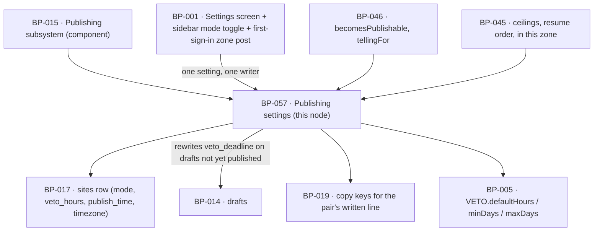

# BP-057 — Publishing settings: mode, veto window, publish time, time zone

- Parent: BP-015
- Kind: **feature** — a leaf cut straight from REQ-073: the four values that
  govern how and when a page goes out, and exactly what a change to them does to
  the drafts already in flight.

## Responsibility
Hold the single stored pair of publishing mode and veto window, the publish time
and the time zone it is read in, and apply a saved change to every draft not yet
published without ever shortening a window a customer is already inside.

## Module / boundary
`src/lib/publish/settings/` — inside BP-015's `src/lib/publish/**`, disjoint
from BP-045's `machine/`, `attempt/`, `switch/`, `ceilings/`, from BP-046's
`publishable/`, from BP-049's `verify/` and from `destinations/`:

| Path | Holds |
|---|---|
| `settings.ts` | Read, validate and save the four values. The only writer. |
| `apply.ts` | REQ-073 criterion 4's four rules, applied to drafts not yet published. |
| `clock.ts` | `nextPublishTimeAtOrAfter` — the publish time resolved in the customer's zone, including the two days a year it does not exist or exists twice. |

The **on/off publishing switch** is not here: it is BP-045's `switch/`, and
REQ-073's own non-goal says it is "not a third publishing mode". The **veto
deadline's meaning at expiry** is not here either: it is BP-046's. This node
owns the values and the moment a change to them lands.

## Diagram


## Public interface
```ts
// src/lib/publish/settings/settings.ts
export type Mode = 'autopilot' | 'copilot'

export interface PublishingSettings {
  mode: Mode
  vetoHours: number          // 0..168, always a whole multiple of 24
  publishTime: string        // 'HH:mm', 24-hour, read in `timezone`
  timezone: string           // IANA name
}

export function readPublishingSettings(siteId: string): Promise<PublishingSettings>

export function savePublishingSettings(
  siteId: string, patch: Partial<PublishingSettings>, by: Actor
): Promise<
  | { ok: true; settings: PublishingSettings; applied: { draftIds: string[]; retellOwed: string[] } }
  | { ok: false; invalid: readonly ('mode' | 'vetoHours' | 'publishTime' | 'timezone')[] }
>

/** REQ-073 criterion 2's one written line — the key, never the sentence. */
export type PairCopyKey =
  | 'settings.publishing.pair.autopilotWindow'
  | 'settings.publishing.pair.autopilotZero'
  | 'settings.publishing.pair.copilot'
export function explainPair(s: PublishingSettings): PairCopyKey

/** REQ-073 criterion 1: the zone the browser reported at first sign-in. Writes
 *  `sites.timezone` only while it is null — a zone the customer set is never
 *  overwritten — and validates `reported` with the same IANA check as a patch. */
export function adoptBrowserTimezone(siteId: string, reported: string):
  Promise<{ adopted: true } | { adopted: false; reason: 'already_set' | 'invalid' }>

// src/lib/publish/settings/apply.ts
/** REQ-073 criterion 4, as one pure function over one draft. */
export function newVetoDeadline(a: {
  state: State
  enteredReviewAt: Date
  currentDeadline: Date
  previous: PublishingSettings
  next: PublishingSettings
  changedAt: Date
}): Date

// src/lib/publish/settings/clock.ts
export function nextPublishTimeAtOrAfter(instant: Date, s: PublishingSettings): Date
```

## Data model delta
**None.** All four values already exist on `sites`: `mode(autopilot/copilot)`,
`veto_hours` and `publish_time` from `BUILD.md` §10, and `timezone` from BP-017's
`## Data model delta` ("`sites` — as §10, plus `timezone`"), migrated by WO-272
under BP-017's `*_sites*.sql` — BP-002's index only names that owner (REQ-073
criterion 3). This node writes those columns through BP-002's `db()` and claims
no migration.

The one write it makes outside `sites` is `drafts.veto_deadline` — an existing
`BUILD.md` §10 column — on drafts not yet published, per criterion 4. It also
clears BP-046's `drafts.told` for any draft whose governing pair changed, which
is how REQ-057 criterion 8's re-telling obligation is raised; the clearing is
this node's write, the telling is BP-046's.

## Error & edge behavior
- **One setting, one writer.** `savePublishingSettings` is the only function in
  the product that writes `sites.mode`; the Settings screen and the sidebar
  autopilot card both call it, so REQ-073 criterion 5's "the same single setting"
  is a fact about the module graph rather than a convention. A second writer is
  a rule 7.1 violation, not a review comment.
- **Validation is closed.** `mode` is the two-member union. `vetoHours` must be
  a whole multiple of 24 in `[0, 168]` — the screen offers whole days 0–7
  (`VETO.minDays`, `VETO.maxDays` in BP-005) and the column stores hours because
  `BUILD.md` §10 names it `veto_hours`; the conversion lives here and nowhere
  else. `publishTime` must be `HH:mm`. `timezone` must be an IANA name the
  runtime resolves. An invalid patch is refused whole — nothing is partially
  saved — and names which fields failed.
- **Criterion 4, as four rules over one draft**, in `newVetoDeadline`:
  1. A draft not yet published is in scope, including one already in review;
     a `published`, `skipped` or `unpublished` draft is untouched.
  2. A window already running is never shortened: the result is never earlier
     than `currentDeadline`.
  3. A draft in review whose window is lengthened keeps the later of the two
     expiry moments — `max(currentDeadline, enteredReviewAt + nextVetoHours)`.
  4. A draft in review whose window already expired **under Copilot** starts
     again at the moment of the change — `changedAt + nextVetoHours`. This is
     the limb that stops a switch to Autopilot from making a held draft
     publishable with no interval; where the customer has set a zero window, the
     interval the settings state is none, and REQ-057 criterion 7's
     unsuppressible telling is what stands in its place.
  Rule 4 is scoped to drafts still in `in_review`. A draft already in `approved`
  reached that state through an approval — the customer's, or an autopilot
  expiry — and a settings change does not revoke it; what changes for it is only
  when it publishes, through `nextPublishTimeAtOrAfter`.
- **A changed pair re-opens the telling.** Any saved change that alters the
  `GoverningPair` of a draft not yet published clears that draft's `told` record
  and returns it in `applied.retellOwed`. BP-046's `customer_told` guard then
  **holds** the draft until it has been told again (REQ-057 criterion 8) — so a
  settings change can delay a publication, and can never cause one the customer
  was not told about.
- **The first sign-in writes the zone, and this node does the writing** (REQ-073
  criterion 1). BP-001's authenticated shell posts the browser's resolved
  `Intl.DateTimeFormat().resolvedOptions().timeZone` once — on the first
  authenticated request of a session whose site has no zone — to an
  `src/app/api/**` adapter that calls `adoptBrowserTimezone`; it writes only
  while `sites.timezone` is null, so the column is null solely between
  provisioning (WO-126) and that request, an interval in which nothing that
  reads it runs, and a zone the customer chose on Settings is never overwritten
  by a later browser. Ownership derivation (rule 1.1): `settings.ts` is the four
  values' only writer and holds the one IANA validator; BP-061's `redeemLink`
  cannot carry the zone — a link opened from a mail client sends none — and
  BP-033's `SetupSubmission` is closed for REQ-025 criterion 1's sake, and a
  founder who signs in and abandons setup has still signed in. Reversal: one
  function and one call site move; no data effect.
- **The publish time is resolved in the customer's zone, always.** No code path
  falls back to the server's zone; the zone is present for every customer past
  first sign-in — the write above — and REQ-073's own `rests-on` (confirmed)
  says so.
  Two edge cases have one answer each, chosen here (rule 1.1) because the
  requirement fixes only the hour: a publish time that **does not exist** on a
  spring-forward day resolves to the first instant after the gap; a time that
  occurs **twice** on an autumn-back day resolves to the first of the two. Both
  keep "never at an hour other than the one the screen shows" true in the only
  direction that is possible, and both are asserted in tests against a fixed
  zone; reversal is a one-line change with no data effect.
- **The settings never touch the ceilings.** At most one publish a day and eight
  a week are BP-045's, read from BP-005's pins, and no value here can raise
  them (REQ-073's non-goal, REQ-070 criterion 3). This module exports no
  function that returns a rate.
- **Nothing that tunes the engine is here** (`BUILD.md` §4.7): no cadence, no
  question count, no model choice, no cap.
- **The calendar's next publication** (criterion 6) is composed by BP-001 from
  this node's `nextPublishTimeAtOrAfter` and BP-045's due-work and ceiling
  state. This node does not compute it, because a second implementation of
  "when does the next page go out" would be the second copy that disagrees.

## NFR budget
- `readPublishingSettings` p95 ≤ 10 ms; it is on every draft-view and calendar
  render and is cached per request, never across requests.
- `savePublishingSettings` p95 ≤ 300 ms including the re-deadline pass. The pass
  is bounded by drafts not yet published for one site, which the supply rule
  (`BUILD.md` §7) keeps in the tens; it runs in one transaction, so a change is
  never half-applied across drafts.
- `newVetoDeadline` is pure — no clock, no database — so every limb of criterion
  4 is testable at its boundary and the spring-forward and autumn-back cases are
  fixtures rather than flakes.
- Authz: through `db()` under RLS; a settings write is always attributable to a
  `customer` actor and is logged with the before and after pair, never with any
  other column of the site.

## Decisions
1. **Days on the screen, hours in the column, converted in one place** —
   Status: accepted
   - Context: REQ-073 criterion 1 offers "any whole number of days from 0 to 7";
     `BUILD.md` §10 names the column `veto_hours` and §9 states the default as
     24h.
   - Decision: `veto_hours` stays as specified, `vetoHours` is validated as a
     whole multiple of 24, and the days-to-hours conversion exists only in this
     module.
   - Alternatives considered: a `veto_days` column — rejected, it renames a
     specified column for no behaviour. Free-form hours — rejected, criterion 1
     says whole days and a 36-hour window is a state no screen can render.
   - Consequences: if a later requirement wants sub-day windows the validator
     relaxes and nothing else moves. Trivial to reverse.
2. **Criterion 4 is one pure function, not a branch in the save handler** —
   Status: accepted
   - Context: four interacting rules — in-scope, never-shortened, later-of-two,
     restart-under-copilot — that decide whether a customer keeps the interval
     they were promised.
   - Decision: `newVetoDeadline` takes the whole situation as data and returns
     one instant, with no I/O; the save handler maps it over the drafts.
   - Alternatives considered: applying the rules inside the update statement —
     rejected, it is the sort of logic that is copied into the next place a
     window is recomputed, and the two copies would diverge on the restart limb.
   - Consequences: one function to test exhaustively, and the save handler
     becomes a loop. Cheap to reverse and expensive to have got wrong.
3. **A settings change clears the telling rather than sending one** —
   Status: accepted
   - Context: REQ-057 criterion 8 requires the customer be told again before a
     draft publishes on a pair they were not told about.
   - Decision: this node clears `drafts.told`; BP-046 owns what is said and
     BP-045's guard owns the holding. Saving settings sends no mail.
   - Alternatives considered: sending the re-telling from the save handler —
     rejected, a customer stepping the window from 1 to 2 to 3 days would send
     three mails, and the obligation belongs to the moment before publishing,
     not to the moment of the change.
   - Consequences: the re-telling is sent by the same path as the first one, so
     there is one implementation of the telling. Reversal would create two.

## Status grounds (rule 3.2)
Self-certified `approved`. Grounds: cut from REQ-073, `status: approved`, so
§3's blueprint gate is met; one `satisfies` edge written at creation; `code:`
globs sit inside BP-015's `src/lib/publish/**` and overlap no sibling's; no new
migration is claimed, so structure.md rule 3's topic ownership is untouched. No
`blocked-by`: REQ-073's relationships to REQ-056, REQ-057 and REQ-070 are stated
non-goals and dependencies, not conflicts. 2026-09-03: `adoptBrowserTimezone`
was added under the same requirement (REQ-073 criterion 1), the same `satisfies`
edge and the same globs; no ground moved and the status stands.

## Open questions
