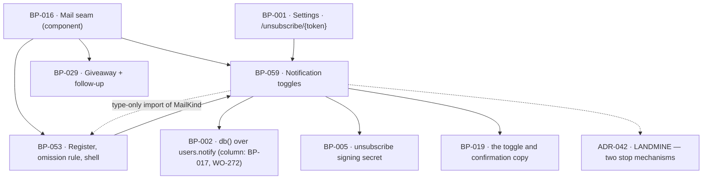

# BP-059 — Notification toggles for the three recurring mails

- Parent: BP-016
- Kind: **feature** — the leaf cut from REQ-075: which of the recurring mails a
  paying customer receives, and the one recurring send no setting reaches.

## Responsibility
Hold each customer's choice for the three recurring mails independently, answer
the send seam's question of whether this kind is switched off for this customer,
and resolve a per-kind unsubscribe link — without ever suppressing a mail
outside the three.

## Module / boundary
`src/lib/mail/notifications/` inside BP-016's `src/lib/mail/`. It reads and
writes `users.notify`, a column of BP-017's `## Data model delta` migrated by
WO-272 under BP-017's `*_users*.sql`.

It does **not** own: the Settings screen or the unsubscribe page, both surfaces
in `src/app/**` (BP-001, `structure.md` rule 1); the register of kinds and the
send seam that consults this node (BP-053); address-wide suppression, which is a
different mechanism for a different promise (BP-029, and ADR-042 states why the
two must not be merged); any migration — this node owns no migration topic, and
the reason is decision 4 below.

## Diagram


## Public interface
```ts
// src/lib/mail/notifications/index.ts
export type NotifyKind = 'draft-ready' | 'published' | 'weekly'
export const TOGGLABLE_KINDS: readonly NotifyKind[]        // exactly these three
export type NotifyPrefs = Readonly<Record<NotifyKind, boolean>>

/** A key absent from users.notify reads as on: never toggled is not the same
 *  fact as switched off, and the customer bought a product that mails them. */
export function readNotifyPrefs(userId: string): Promise<NotifyPrefs>

/** Writes one key. Never enqueues anything: criterion 4's mails missed while a
 *  toggle was off are not sent afterwards, and the way to guarantee that is to
 *  have no code path that could. */
export function setNotifyPref(a: {
  userId: string; kind: NotifyKind; on: boolean
}): Promise<NotifyPrefs>

/** The question BP-053 asks immediately before the vendor call. 'unreadable' is
 *  its own answer, not a false: decision 2 states why it stops the send. */
export function stoppedByPreference(a: {
  userId: string; kind: MailKind          // type-only import from the register
}): Promise<'send' | 'stopped' | 'unreadable'>

// src/lib/mail/notifications/unsubscribe.ts
export function unsubscribeTokenFor(a: { userId: string; kind: NotifyKind }): string
export function readUnsubscribeToken(token: string):
  | { userId: string; kind: NotifyKind }
  | { error: 'invalid' }
export function applyUnsubscribeToken(token: string): Promise<
  | { switchedOff: NotifyKind }
  | { error: 'invalid' }>                 // idempotent: a second use succeeds
```

## Data model delta
`users.notify jsonb` — BP-017's delta declares the column and WO-272 migrates
it; this node holds its shape and its meaning. The value is a sparse object over `NotifyKind`, default
`{}`. A missing key is on; an explicit `false` is off. There is no row per
preference and no second table: three booleans on the user who owns them.

No migration topic is claimed: `structure.md` rule 3 makes `users` BP-017's
token and rule 3a lets only BP-017's own leaves narrow it with a sub-token —
this node is BP-016's leaf — so the column is migrated as a component-level
column of BP-017's (decision 4).

## Error & edge behavior
- **The check happens at send, never at the event.** A draft still enters review
  and appears on the calendar, a published page still appears with its live URL,
  and the week's movement still appears on Overview, whatever these toggles say
  (criterion 2). Nothing in this node is consulted by BP-003's jobs or by the
  publishing state machine; the only caller is BP-053, immediately before the
  vendor call.
- **The unsuppressible send bypasses this node entirely.** BP-053 passes
  `suppressible: false` for the `draft-ready` mail generated under autopilot at a
  veto window of zero (REQ-057 c7), and the seam does not ask. The
  `draft-ready` toggle reaches every other draft-ready mail — criterion 1's and
  criterion 3's exception is one occasion, not one kind.
- **A preference that cannot be read stops the mail.** `'unreadable'` returns
  distinctly from `'stopped'` so the outage is visible in logs, and BP-053
  reports `reason: 'preference-unreadable'`. Decision 2 gives the derivation.
- **A non-togglable kind is always `'send'`.** `stoppedByPreference` takes a
  `MailKind`, not a `NotifyKind`, precisely so a caller cannot accidentally
  route `magic-link` or `account` through a preference lookup; the six other
  kinds return `'send'` without touching the store (criterion 3).
- **The unsubscribe token is kind-scoped and does one thing.** It switches off
  the single kind it was signed for, leaves the other two alone, and writes
  nothing to `email_suppressions` (criterion 5). It carries no expiry: a link in
  a mail found months later must still work, and an expired unsubscribe is a
  broken promise wearing a security control's clothes.
- **A GET on the unsubscribe address changes nothing.** BP-001's route renders a
  page naming the mail it will switch off; the write happens on the customer's
  confirmation. Mail-client and security-scanner link prefetch would otherwise
  switch off mail nobody chose to stop, which is a false reading of intent
  recorded as a customer's choice.
- Turning a toggle back on writes the key and nothing else: no backlog, no
  digest, no catch-up send (criterion 4).
- Every mail these toggles govern goes to the one address the account signs in
  with; this node holds no address of its own and offers no second recipient
  (REQ-077 c3, REQ-075's non-goal).

## NFR budget
- `stoppedByPreference` is one primary-key read of `users` per togglable send,
  on a path that already reads the user. Non-togglable kinds cost nothing.
- `setNotifyPref` is one jsonb key write; the choice holds on any device because
  it is stored on the user and never in a client (criterion 1).
- Authz: `readNotifyPrefs` and `setNotifyPref` run under the request-scoped
  client (`db()`, RLS applies), so a customer can only read and write their own.
  The unsubscribe token is the one unauthenticated capability, it is signed with
  a secret from BP-005, and the worst a forged one could do is switch off one
  of three mails for one account — which is why it may be unauthenticated at all.
- Observability: user id, kind, new value, and whether the change came from
  Settings or from a token. Never a recipient address in clear text.

## Decisions
1. **Three toggles, derived from the register and asserted, not counted twice** — Status: accepted
   - Context: criterion 1 fixes three toggles; BP-016's `MAIL_KINDS` marks three
     rows `stoppable: 'toggle'`. Two statements of one fact is rule 2.4's second
     copy.
   - Decision: `TOGGLABLE_KINDS` is the literal triple here, and a test in
     `tests/mail/notifications/` asserts it equals the set of register rows whose
     stoppability is `'toggle'`. A fourth togglable kind fails that test before
     it reaches a customer with a Settings screen that has three switches.
   - Alternatives considered: deriving `TOGGLABLE_KINDS` at run time from
     `MAIL_KINDS` — rejected, it makes this node import the register at run time
     while the register's seam already imports this node, and `structure.md`
     rule 6 makes a cycle between `src/lib/` modules a build failure. The type
     `MailKind` is imported type-only, which erases at compile time and creates
     no edge; the test imports both, which tests may.
   - Consequences: the triple appears in two places and one of them fails loudly
     when they disagree. Reversing to a run-time derivation reintroduces the
     cycle.
2. **A preference that cannot be read stops a togglable mail** — Status: accepted
   - Context: `readNotifyPrefs` can fail. The requirement does not rule the
     outage case, so this node rules it (rule 1.1).
   - Decision: fail closed for the three togglable kinds; every other kind, and
     any `suppressible: false` send, is unaffected and goes out.
   - Alternatives considered: fail open and send — rejected, a mail sent to a
     customer who switched it off cannot be recalled, and REQ-075's user story is
     that the mail is "the reason I cancel it"; a mail not sent has criterion 2's
     compensation already built — the event is still visible in the app — and
     criterion 4 resumes it at the next occurrence.
   - Consequences: a store outage is a quiet gap in three recurring mails rather
     than a loud violation of a customer's choice, and the log line distinguishes
     the two. It mirrors REQ-003 criterion 10's fail-closed capture and is the
     opposite of the scan limiter's fail-open, which is `BUILD.md` §11's
     deliberate asymmetry rather than an inconsistency.
3. **The unsubscribe link is kind-scoped, unexpiring, and confirmed** — Status: accepted
   - Context: criterion 5 promises one mail off and the other two unaffected, and
     `BUILD.md` §12's mails are read in clients that prefetch links.
   - Decision: an HMAC over `(userId, kind)` with no expiry; GET renders,
     confirmation writes.
   - Alternatives considered: one unsubscribe link per customer — rejected, it
     cannot satisfy criterion 5 and is the first step down ADR-042's path; an
     expiring token — rejected, the promise is about a mail the customer is
     holding, whenever they are holding it; one-click GET — rejected, prefetch
     turns a scanner into the customer.
   - Consequences: the confirmation page is one more surface for BP-001 and one
     more copy key for BP-019. Reversing to one-click means accepting silent
     unsubscribes from software the customer never touched.
4. **This node owns no migration** — Status: accepted
   - Context: `structure.md` rule 3 fixes the topic-token list; `users` is
     BP-017's token and this node is not BP-017's leaf, so it may hold neither
     the token nor a sub-token of it, and three sibling requirements add
     columns to `users` concurrently.
   - Decision: `users.notify` is a column of BP-017's `## Data model delta`,
     migrated by WO-272 under BP-017's `*_users*.sql` — BP-002's index names
     that owner ("`users` · BP-017 (leaf: BP-059)"); `code:` here claims no
     `supabase/migrations/**` glob.
   - Alternatives considered: minting a `*_notify*.sql` token — rejected, it is a
     token `structure.md` does not carry and this node may not amend that map;
     claiming `*_users*.sql` — rejected, it would collide with the nodes cut from
     REQ-077 and REQ-079 for the same table.
   - Consequences: the shape of `users.notify` is specified here and applied
     there, which is one indirection. It is the cheaper of the two, and the
     alternative is a scope conflict with two sibling nodes.

ADR-042 records the decision that spans this node and BP-029 — why the toggles
and address-wide suppression stay two mechanisms — and is not restated here.

## Status grounds (rule 3.2)
Self-certified `approved` per rule 3.2. Grounds: cut from REQ-075, which is
`status: approved` and whose own `rests-on` — that the three toggles are the
three recurring kinds — is already `confirmed`, so the node's scope needed no
ruling; one feature leaf under the approved component BP-016; `code:` is
repo-relative, bounded to one module directory and one test directory, and
overlaps no sibling's globs (ADR-040, and decision 4 above for the migrations).

## Open questions
