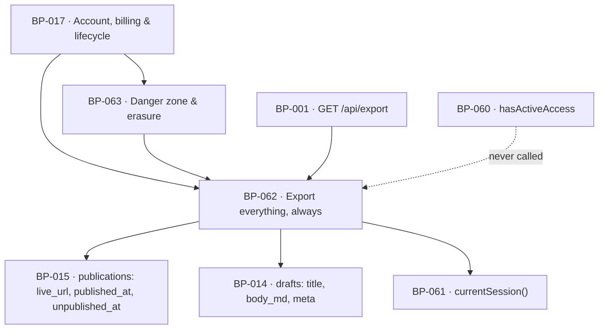

# BP-062 — Export everything, always

- Parent: BP-017
- Kind: **feature** — a leaf of the Epic → Feature → Capability tree, cut from
  REQ-078.

## Responsibility
Hand the customer every page ReachKit wrote for them as Markdown with its assets,
whatever the state of their subscription, complete or not at all.

## Module / boundary
`src/lib/account/export/` — the page inventory, the archive builder and the
all-or-nothing guarantee. It owns no migration topic: an export reads `drafts`,
`publications` and their assets and writes nothing.

Outside this boundary: `GET /api/export` is BP-001's signed-in download route;
the draft and publication records are BP-014's and BP-015's; the count and the
one refusal line are rendered from BP-019 copy keys. **This node never consults
BP-060's access gate** — that is the whole of REQ-078 criterion 2 and there is a
test that asserts the import does not exist.

## Diagram


## Public interface
```ts
/** REQ-078 criterion 1. A count of ReachKit's own rows — published, in review,
 *  vetoed and failed alike. It is NOT a `Measured<T>`: nothing about the world was
 *  measured to produce it, and wrapping it would make a dash possible where a
 *  number is always knowable (see decision 3). */
export function contentSummary(siteId: string): Promise<{ pages: number }>

/** REQ-078 criteria 2 and 3. Streams a zip. Never consults subscription state. */
export function exportEverything(siteId: string): Promise<
  | { ok: true; archive: ReadableStream<Uint8Array>; filename: string; pages: number }
  | { ok: false; reason: ExportFailure; lineKey: 'export.failed' }
>
export type ExportFailure = 'asset_unreadable' | 'record_unreadable' | 'timeout' | 'internal'

/** The archive's shape, exported so tests assert criteria 3 and 4 against a
 *  manifest rather than by unzipping in an assertion. */
export interface ExportManifest {
  pages: ReadonlyArray<{
    path: string                 // `pages/<slug>.md`, collision-suffixed, never a title
    title: string
    state: 'published' | 'in_review' | 'vetoed' | 'failed'
    publishedAt: Date | null     // criterion 4
    liveUrl: string | null       // criterion 4
    unpublishedAt: Date | null   // criterion 4, where no longer published
    assets: readonly string[]    // `assets/<page-slug>/<file>`
  }>
}
export function buildManifest(siteId: string): Promise<ExportManifest>
```

## Data model delta
None. No table, no column, no migration — this node's `code:` carries no
`supabase/migrations/**` glob and that is deliberate, not an omission.

## Error & edge behavior
- **All or nothing** (c5). The archive is assembled behind a boundary that either
  yields a complete zip or yields nothing: the manifest is built and every page
  body and every asset byte is resolved *before* the first byte of the zip reaches
  the response. A failure after streaming has begun aborts the HTTP response
  without a zip trailer, so the client sees a broken download rather than a short
  archive presented as complete — and the same failure returns `ok: false` on the
  retry.
- A page whose asset cannot be read fails the **whole** export
  (`asset_unreadable`). Skipping it and shipping the rest is precisely the partial
  archive c5 forbids.
- Front-matter per file carries the title, state, publish date, live URL and
  take-down date. A page that was never published carries nulls, not absent keys —
  a reader must be able to tell "not published" from "we forgot".
- File bodies are the stored `body_md` verbatim. Nothing is regenerated, re-rendered
  or model-touched at export time; an export is a copy, and a copy that differs from
  what was published is a defect.
- Slugs collide (two drafts, one title): `-2`, `-3` suffixes in manifest order, which
  is `created_at` ascending, so an export is byte-stable across runs.
- A site with zero pages exports an archive containing the manifest and no page
  files, and `contentSummary` returns 0. Zero is a true count, stated plainly — it
  is not an empty state and not a failure.
- Subscription state is never read: active, cancelled and lapsed take the identical
  code path. A lapsed customer reaches it through the sign-in link REQ-076 c5 keeps
  working (BP-032, BP-061).
- A **deleted** account is a different matter: after `deleted_at` is stamped, nothing
  is reachable through any product surface including this one (REQ-079 c7), which is
  enforced in BP-002's row policy, not by a check here.

## NFR budget
- Time to first byte ≤ 10 s for a site of 500 pages; the whole archive streamed
  within 120 s. Past 120 s the export fails with `timeout` and c5's line rather
  than trickling.
- Memory is bounded: page bodies are held to build the manifest; asset bytes are
  streamed through and never buffered whole. Peak heap ≤ 64 MB regardless of site size.
- No page-count ceiling and no size ceiling. A cap would be a page the customer
  paid for and cannot have, which is the lock-in REQ-078 exists to prevent.
- Authorisation: a session bound to the site's owner (BP-061's `currentSession`).
  There is no link, token or share URL — the export is a download taken while
  signed in (REQ-078 non-goal).
- Observability: one event per export carrying `siteId`, page count, byte count and
  outcome. A failure is an alert: this is the promise a departing customer tests.

## Decisions
1. **The export never reads the access gate, and a test asserts the absence of the
   import** — Status: accepted
   - Context: REQ-078 c2 — "never withheld on account of subscription state". A
     future reviewer adding "signed in AND active" to an authorisation helper would
     break it invisibly, since the ordinary customer is active.
   - Decision: `src/lib/account/export/**` may not import from
     `src/lib/account/billing/**`. Enforced by a lint rule and by a test that
     exports a site whose `paid_through` is in the past and asserts a complete
     archive.
   - Alternatives considered: a comment — rejected; a comment does not fail a build.
   - Consequences: an import that looks harmless fails CI with the requirement id in
     the message.
2. **Completeness is decided before the first byte is written** — Status: accepted
   - Context: c5 forbids handing over a partial archive presented as complete, and a
     streamed zip is complete-looking from its first byte.
   - Decision: resolve every record and every asset, then stream. A failure before
     streaming returns c5's line; a failure during streaming aborts the response
     without a valid zip trailer.
   - Alternatives considered: stream as you read and append an errors file — rejected,
     it is a partial archive with an apology inside it.
   - Consequences: time to first byte is worse and memory is bounded by manifest size,
     not by the archive. Accepted; correctness of this promise beats latency.
3. **The page count is a plain number, not a `Measured<T>`** — Status: accepted
   - Context: `Measured<T>` (BP-010) exists so an unmeasured value renders as a dash
     with a written line (REQ-004, BP-019). Every producer in this product returns it,
     so returning a bare number here looks like an oversight.
   - Decision: `contentSummary` returns `number`. A count of ReachKit's own rows is
     always knowable; it is a fact about our database, not a measurement of the world.
   - Alternatives considered: `Measured<number>` for consistency — rejected, it makes
     "we don't know how many pages we wrote for you" a representable state on the one
     screen where it would read as data loss.

## Status grounds (rule 3.2)
Self-certified `approved` per rule 3.2. Grounds: cut from REQ-078, `status:
approved`; `satisfies: [REQ-078]` and nothing else; `code:` globs sit inside
BP-017's and overlap no sibling's, and carry no migration glob because this node
adds no schema.

## Open questions
