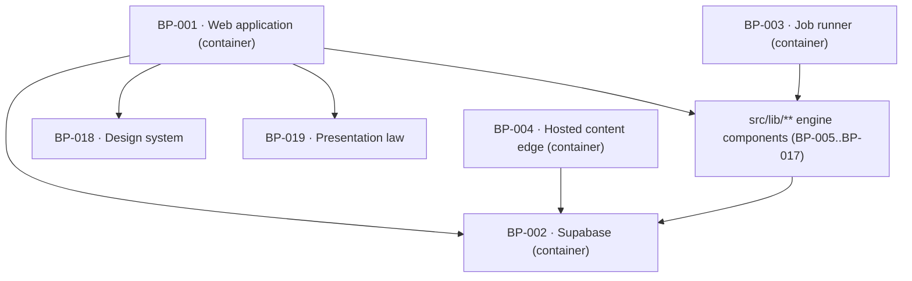

# BP-001 — Web application — the Next.js App Router container

- Parent: (root)
- Kind: **container** — the deployable Next.js unit that serves every surface a
  person reaches on a ReachKit address.

## Responsibility
Serve every ReachKit-addressed surface — landing, the public report, the price
surface, setup, the three app destinations and the draft view — as thin adapters
over the engine, holding no measurement, generation, publishing or billing logic
of its own.

## Module / boundary
`src/app/(public)/**` (landing, `/scan/{domain}`, `/pricing`, opt-out),
`src/app/(account)/**` (`/setup`, `/app`, `/app/draft/{id}`),
`src/app/api/**` (HTTP adapters), `src/app/layout.tsx`, `src/middleware.ts`.
It does **not** own `src/app/(hosted)/**`, which is BP-004's.

## Diagram


## Public interface
```
Routes (public)
  GET  /                                landing: one field, one submit
  GET  /scan/{domain}                   the one public report address
  POST /api/scan                        start a scan for a domain
  GET  /api/scan/{scanId}/progress      named stages, server-sent
  POST /api/report/{domain}/correct     one market correction per free scan
  POST /api/lead                        email for the finished page
  GET  /opt-out/{token}                 address-wide follow-up suppression
  GET  /pricing                         the scanless price surface

Routes (account, session required)
  GET  /setup                           three decisions, one submit
  POST /api/setup                       submit setup
  GET  /app                             redirects to Overview
  GET  /app/overview | /app/calendar | /app/settings
  GET  /app/draft/{draftId}
  PATCH/api/drafts/{id}                 autosaved Markdown edit
  POST /api/drafts/{id}/{approve|veto|skip}
  POST /api/settings/*                  closed allow-list, REQ-070 criterion 4
  GET  /api/export                      signed-in download
  POST /api/account/timezone            browser's resolved zone, once per session

Adapters (transport only)
  POST /api/stripe/webhook   -> account.handleStripeWebhook(rawBody, signature)
  ALL  /api/jobs/[[...slug]] -> jobs.serve()
```

**Surfaces this container owns directly, and what each delegates to.** Every
other route above is anchored by a leaf node's narrower glob (rule 2 /
ADR-091); these eight are anchored by this container's own glob and by nothing
else, which is correct ownership and was mistaken for none. Nine planners cut
227 work orders against leaves and cut none for these, because each looked for
a leaf and found the container. They are work orders against **this node**, and
the table is here so the next planner has the delegation target it needs and
does not re-derive it:

| Route / surface | Delegates to | Behind it |
|---|---|---|
| `GET /pricing` | BP-031's offer state, BP-030's checkout control, BP-005's price | REQ-021; BP-030 and BP-031 both name it as this container's surface |
| `POST /api/lead` | BP-029's lead capture and sequence start | REQ-010 |
| `POST /api/report/{domain}/correct` | BP-028's `correctionOffer`/`nextCorrectionState`, then BP-012's `runScan({ correctionOf })` | REQ-094 |
| `GET /api/export` | BP-062's `exportEverything` | REQ-078 |
| `POST /api/account/timezone` | BP-057's `adoptBrowserTimezone` — the zone's only writer; this shell posts the browser's resolved `timeZone` once per session from the account layout and the null guard is BP-057's, per WO-273 | REQ-073 c1 — the "browser reported at first sign-in" clause (BP-057 `## Error & edge behavior`: "The first sign-in writes the zone, and this node does the writing"). Added 2026-09-03 with WO-273; on the same footing as `GET /api/export` / WO-244. |
| `POST /api/drafts/{id}/{approve\|veto\|skip}` | BP-046's publishable predicate and BP-045's `transition` | REQ-045, REQ-057 |
| `POST /api/stripe/webhook` | BP-017's `handleStripeWebhook(rawBody, signature)` — signature verification inside, never here (decision 1) | REQ-024 |
| `GET /opt-out/{token}` | BP-029's address-wide suppression | REQ-010 c11 — the address-wide opt-out. This cell read **REQ-011** until 2026-08-31; REQ-011 is `status: superseded`, absorbed into REQ-010 verbatim as its criteria 9–13 on 2026-08-30, and REQ-011's own header says "cite REQ-010, not this file". `covers` already carried REQ-010, so it gains nothing here — only the citation was stale. |

**Why every requirement in the third column is in this node's `covers`
(2026-08-31).** Rule 5.4: `covers` means *that requirement's behaviour lives in
this module*, and it is not an authorising ancestor — `satisfies`, which this
node leaves empty, is. Each route above is a file under `src/app/api/**` or
`src/app/(public)/**`, both this container's own globs; the route existing, being
reachable, and being transport-only is behaviour that lives here and nowhere
else, even though the decision behind it is the delegate's. The column read
REQ-011, REQ-024, REQ-057 and REQ-078 while `covers` named none of them — a
divergence in one direction only, since REQ-010, REQ-021, REQ-045 and REQ-094
were already carried on exactly the same footing. Three were added; the fourth,
REQ-011, was not, because it is superseded and REQ-010 (already carried) is the
survivor that holds its criteria. `covers` is coverage, so a requirement may sit
on this node and on its delegate at once, and does.

None of these is a candidate for a new feature node. Seven are transport-only
adapters, which decision 1 fixes as this container's without exception; the
eighth, `/pricing`, is a rendered surface whose every input is another node's
and which BP-030 and BP-031 each name as "outside this boundary … BP-001's".
Cutting nodes for them would put a node between a route file and the one
function it calls.

## Data model delta
None. This container reads and writes exclusively through the components it
depends on; no route handler holds SQL.

## Error & edge behavior
- Every route under `src/app/(public)/**` renders without a session, a cookie or
  a payment.
- `/scan/{domain}` never resolves to a blank page, a 404 or an unhandled error:
  the route resolves to exactly one of stored report · scan running · removed ·
  cooldown · limit met · malformed domain, each with its own written line
  (BP-022's `## Error & edge behavior`, "**Resolution order.** Fixed here,
  exhaustive, evaluated top to bottom"). It read "BP-020's exhaustive table" at
  approval; BP-020 is REQ-093's written-words node and holds no such table.
- A signed-out request to `/setup` or `/app` asks for an address and says nothing
  about whether an account or a payment exists (REQ-020 criterion 5).
- Route handlers translate a component's typed failure into a written line from
  the copy registry (BP-019); a vendor error payload never reaches a response
  body (REQ-074 criterion 7, REQ-092 criterion 8).

## NFR budget
- p95 time-to-first-byte on a stored report ≤ 400 ms; the report is rendered
  from the stored blob and runs no measurement during server render (`BUILD.md`
  §3: "never during server render").
- No route handler holds a request open for a vendor call longer than 10 s;
  anything longer is a job (BP-003).
- Authorisation: default-deny. `src/app/(account)/**` requires a session;
  `src/app/(public)/**` explicitly declares itself public in one middleware
  allow-list, so a new account route cannot leak by omission.
- Observability: one structured request log line per route with route id, status,
  duration and — where one exists — scan id; never a payload.

## Decisions
1. **HTTP adapters belong to the web container without exception** — Status: accepted
   - Context: `src/app/api/stripe/webhook` and the Inngest serve endpoint are
     route files, but their logic belongs to BP-017 and BP-003. Globs cannot
     express "everything under `src/app/api/` except two paths", so either the
     web container owns all adapters or two nodes claim overlapping paths.
   - Decision: every file under `src/app/api/**` is BP-001's. Each is a
     transport-only adapter — read the request, call one exported function on
     the owning component, map the result to a response. Signature verification
     stays inside BP-017 (`handleStripeWebhook` takes the raw body and the
     signature header), so no security check lives in an adapter.
   - Alternatives considered: enumerate BP-001's api globs route by route —
     rejected, brittle in a greenfield repo where the route list is still
     growing, and the first forgotten glob is a file with no home;
     give `src/app/api/**` to no one and let each component glob its own routes
     — rejected, it puts framework concerns in three nodes and makes the
     middleware allow-list unownable.
   - Consequences: an adapter that grows logic is a review defect with an
     obvious test (a route file importing anything but its component's public
     interface). Reversing costs a re-globbing of two nodes and no code motion.
2. **The repo's root configuration files belong to this container** — Status:
   accepted (2026-08-31; `structure.md` rule 7 is not engaged)
   - Context: `structure.md` fixed the top-level *directory* set and named an
     owner for no root configuration **file**. `package.json`, `tsconfig.json`,
     `eslint.config.mjs`, `vitest.config.ts`, `postcss.config.mjs`,
     `.env.example` and `tests/setup.ts` appeared in no row, so the librarian's
     "a file on main with no home here" check had nothing to match them against —
     the exact hole rule 7.1 exists to close, arriving by omission rather than by
     contest. WO-001 assigned them here provisionally and raised it.
   - Decision: they are this node's, globbed above. This container already owns
     `next.config.ts` and **is** the deployable Next.js unit those files
     configure; the compiler, the linter, the test runner and the binding list
     are its build, not a second module. Rule 7 ("a new top-level directory
     requires an ADR") is not engaged: the directory set is unchanged and these
     are files inside it.
   - Alternatives considered: give each file to the node whose concern it most
     resembles — `vitest.config.ts` to nobody in particular, `.env.example` to
     BP-005 because it owns `env.ts` — rejected, it splits one toolchain across
     five owners and every one of them then edits `package.json`; a new
     "toolchain" node — rejected under rule 2.2a and 7.1, it owns no capability
     and no requirement is cut from it.
   - Consequences: **`eslint.config.mjs` is where the corpus's cross-module lint
     invariants land**, and this node is answerable for them. Three exist today
     and each names its source: `src/lib/**` may not import from `src/app/**`
     (`structure.md` rule 6); no import of `src/lib/db` internals outside
     `src/lib/db` (BP-002); no `fetch(` under `src/lib/**` outside BP-006 and
     BP-008 (BP-006's NFR). Two more are owed here by nodes that cannot reach
     this file. BP-062 states one **as a lint rule** in its own decision —
     `src/lib/account/export/**` may not import `src/lib/account/billing/**`
     ("Enforced by a lint rule and by a test that…") — and it is added verbatim.
     ADR-050 point 3 states the other as an invariant with a mutation test rather
     than as a lint rule — "BP-003, BP-012, BP-015 and BP-063 call it and compute
     no access predicate of their own" — and its lintable half is added here as
     the import restriction that makes the invariant hard to break by accident:
     nothing outside `src/lib/account/billing/**` may import
     `users.paid_through`'s reader or re-derive access from `plan_status`. The
     test stays ADR-050's; the import fence is this file's. An invariant stated
     in a blueprint and enforced nowhere is the "recorded, not enforced" case
     rule 3.3 names, and this is the one place in the repo where a cross-module
     rule can actually hold.
   - Cost of reversing: re-globbing one node. No code moves.
3. **Route groups, not a flat `src/app/`** — Status: accepted
   - Context: BP-004 must own a subtree of `src/app/` and the public/account
     split is also the authorisation boundary.
   - Decision: three route groups — `(public)`, `(account)`, `(hosted)` — with
     the authorisation rule attached to the group rather than to the route.
   - Alternatives considered: a flat tree with a per-route auth annotation —
     rejected, a new account route defaults to public, which is the failure mode
     rule 7.1 exists to prevent.
   - Consequences: moving a surface between public and paid is a directory move
     plus one middleware line.

## Status grounds (rule 3.2)
Self-certified `approved`. Grounds: this node is cut from the system's shape as
fixed by `00-project.md` ("Repo shape and entry points") and `BUILD.md` §1, not
from a single requirement, so `satisfies` is empty by rule 5.4 and every
requirement listed in `covers` carries `status: approved`. Gate "no blueprint
from a non-approved requirement" is met. The librarian audits.

## Open questions
