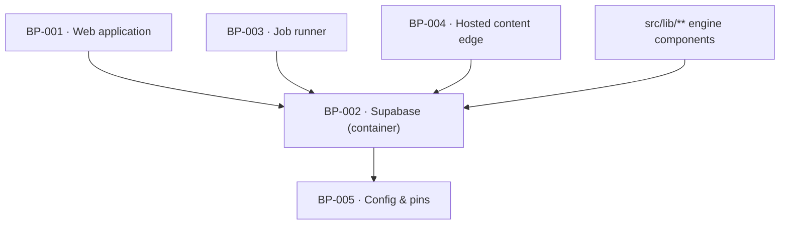

# BP-002 — Supabase — the Postgres, RLS and magic-link container

- Parent: (root)
- Kind: **container** — the managed database and auth service the whole product
  stores state in.

## Responsibility
Hold every row the product stores, deny access by default at the row level, and
expose exactly two clients — a request-scoped one that carries the caller's
identity and a server-only administrative one — so no other module chooses how
it reaches the database.

## Module / boundary
`supabase/` (config, baseline schema, RLS policies) and `src/lib/db/` (the two
clients, generated types, the migration conventions). Feature nodes write their
own topic-prefixed migrations into `supabase/migrations/`; this node owns the
baseline, the policies and the conventions they must follow.

## Diagram


## Public interface
```ts
// src/lib/db/index.ts — the only two ways to reach Postgres
export function db(): SupabaseClient<Database>        // request-scoped, RLS applies
export function dbAdmin(): SupabaseClient<Database>   // server-only, bypasses RLS
                                                      // throws if imported in a client bundle
export type { Database } from './types.generated'
```

## Data model delta
The nine tables of `BUILD.md` §10 as the baseline — `users`, `sites`, `scans`,
`opportunities`, `drafts`, `publications`, `destinations`, `fetches`, `leads` —
plus two the requirements force and `BUILD.md` §10's own test admits ("A 10th
table needs a rendered surface that reads it, specified first"):

| Table | Why it cannot be a column | Rendered surface that reads it |
|---|---|---|
| `domain_blocks` | REQ-002 criterion 3 removes a report for a **domain**, permanently and across every future scan; a scan-scoped column cannot bind a scan that does not exist yet. | `/scan/{domain}` renders the removal line and the address (REQ-001 criterion 18) |
| `email_suppressions` | REQ-010 criterion 11 stops follow-up **address-wide**, across every domain's sequence and every sequence a later delivery would start; a `leads` row is per scan. | `/opt-out/{token}` confirmation |

Column additions the requirements force are **not this node's migrations**. Each
lands under the topic token `structure.md` rule 3 assigns, written by the node
that specified the column; this node writes only `*_baseline*.sql`, `*_rls*.sql`
and `*_domainblocks*.sql`. One column is the exception, and it is stated here
because this node writes the file: `*_rls*.sql` adds `users.deleted_at timestamptz
null` as the precondition of the `deleted_at is null` condition **ADR-051** puts in
every request-scoped policy; the column's meaning, setting and purge stay BP-063's
(rule 2.4). The list below is an index of what the baseline must
be able to carry, with the owner named — it is not a second declaration of the
delta (rule 2.4), and where an entry and its owning node disagree, the owning
node is right:

| Column(s) | Forced by | Topic token · owner |
|---|---|---|
| `users.notify jsonb` | REQ-075 | `users` · BP-017 (leaf: BP-059) |
| `users.pending_email`, `pending_email_token_hash`, `pending_email_sent_at` | REQ-077 | `users_identity` · BP-061 |
| `users.deleted_at` | REQ-079 c7, ADR-051 | `rls` · this node creates it; BP-063 owns its meaning and setting |
| `users.purge_due_at` | REQ-079 c7 | `users_erasure` · BP-063 |
| `users.first_signed_in_at`, `checkout_session_id` | REQ-024 | `users_provisioning` · BP-032 |
| `users.stripe_subscription_id`, `paid_through`, `cancelled_at` | REQ-076 | `users_subscription` · BP-060 |
| `sites.timezone` | REQ-073 c3 | `sites` · BP-017 (leaf: BP-057) |
| `sites.publishing_enabled` | REQ-056 c9, REQ-079 c5 | `sites_erasure` · BP-063 |
| `scans.is_current`, partial unique on `(domain) where is_current` | REQ-001 c17 | `scans` · BP-012 |
| `scans.supersedes_scan_id`, `correction_state` | REQ-094 c5–c7 | `scans_verdict` · BP-028 |
| `destinations.last_checked_at`, `health_reason` | REQ-074 c1, c2 | `destinations` · BP-015 (leaf: BP-058) |
| `leads.domain`, `sequence_state`, `sequence_started_at`, `touch_count`, `next_touch_at`, `dropped_at` | REQ-010 c12, c13 | `leads` · BP-029 |

`publications` carries **no `verdict` column**, `BUILD.md` §10's key-column list
notwithstanding: a page's standing is a row per page per week in BP-051's
`page_verdicts`, because one column cannot answer REQ-063 c3's previous
measurement, c4's interval, or c6's "the date of the last verdict it did
receive", and its enum has no fourth value for `not_judgeable`. BP-051 decision 1
is the home of that reasoning; BP-015, which owns `*_publications*.sql`, states
the same exclusion at the migration.

## Error & edge behavior
- RLS is default-deny: a table with no policy is unreadable by anyone holding an
  anon or authenticated key. A migration that adds a table without a policy fails
  CI, so a new table cannot leak by omission.
- The public report is served by `dbAdmin()` from the server, never by an anon
  read of `scans` — `scans` carries `cost_cents` and the raw report blob, neither
  of which a stranger may read.
- A `dbAdmin()` import from a client component is a build error, not a runtime
  one.
- **Erasure is a tombstone, and unreachability is enforced here, in the policies
  — never by callers.** Every request-scoped policy that restricts a row to its
  owning user also carries the condition that the owning user's `deleted_at` is
  null, so a tombstoned account is invisible through `db()` across sign-in,
  export, every app surface, the hosted edge and every scheduled loop without any
  of them repeating a predicate. `dbAdmin()` bypasses RLS by design and is the
  narrow, named exception BP-063's deletion mail and the purge reach through.
  **No foreign key from `users` or `sites` carries `ON DELETE CASCADE`**, and a
  test asserts that against the applied schema: a cascade would take the rows
  REQ-079 criterion 6's mail is composed from and would turn a deleted
  customer's hosted address into a 404 where REQ-076 criterion 10 promises 410.
  The purge at 30 days is the only deleter. **ADR-051** is the decision and is a
  landmine — adding a cascade, "finishing" the delete path, or adding
  `deleted_at is null` to a caller's query all read as tidying up and all break
  it. That reasoning is not restated here (rule 2.4).
- A policy that lacks the `deleted_at is null` condition is a CI failure, not a
  review comment: the guarantee has one point of failure and the test fails when
  the condition is removed from **any** policy, not merely when the happy path
  passes.

## NFR budget
- Every query the app makes on a request path is indexed; the report read is one
  primary-key or one partial-index lookup.
- Connection use: the request-scoped client per request, the admin client as a
  module singleton in server code only.
- Observability: migration name, applied-at and checksum are the only schema
  facts logged; no row content is ever logged.

## Decisions
1. **Eleven tables, not nine, and both additions carry their surface** — Status: accepted
   - Context: `BUILD.md` §10 caps the model at nine tables and sets the bar for a
     tenth. REQ-002 and REQ-010 each state a fact whose lifetime and key are
     wrong for every existing table.
   - Decision: add `domain_blocks` and `email_suppressions`, each named with the
     rendered surface that reads it, per §10's own test.
   - Alternatives considered: a `removed_at` column on `scans` — rejected,
     REQ-002 criterion 3 must refuse a scan for a domain that has no scan row;
     a suppression flag on every `leads` row for the address — rejected, it is
     the same fact written N times and REQ-010 criterion 11 is exactly the case
     where the copies diverge.
   - Consequences: two more tables to police under RLS. Reversing means folding
     the facts back into columns and re-deriving them, which is a data migration,
     not a refactor.
2. **Migrations are topic-prefixed and topic-owned** — Status: accepted
   - Context: rule 7.1 wants one owner per path, but every feature node needs a
     schema change and one directory holds them all.
   - Decision: one migrations directory; each node globs `*_<topic>*.sql` for
     the topic tokens `structure.md` assigns it, and BP-002 owns the baseline,
     the policy files and `*_domainblocks*.sql` (REQ-002's table has no writer
     anywhere in the product, so no feature node can own its migration — BP-022
     records the absence of a writer as the enforcement). A migration whose name
     carries no assigned topic token fails the registry check.
     A component holds a token; its leaves narrow it with a sub-token
     (`*_users_erasure_*.sql` inside `*_users*.sql`) and the most specific
     declared glob owns the file — **ADR-091**.
   - Alternatives considered: BP-002 owns every migration — rejected, it makes
     BP-002 the bottleneck for every feature and hides the data-model delta from
     the node that specified it; per-node migration directories — rejected,
     Supabase applies one ordered directory.
   - Consequences: renaming a topic token is a rename of migration files already
     applied, which is why the token list is fixed in `structure.md` now.

3. The condition every request-scoped RLS policy carries so a deleted account is
   unreachable through `db()` for thirty days while its rows still exist, and the
   absence of `ON DELETE CASCADE` that keeps them there, span this node, BP-063,
   BP-062, BP-060 and BP-004, and read as an unfinished delete. They are
   recorded as **ADR-051**, a landmine ADR, not here.

## Status grounds (rule 3.2)
Self-certified `approved`. Grounds: cut from the charter's stack table ("DB +
auth | Supabase — Postgres, RLS default-deny, magic-link auth; `dbAdmin`
server-only") and `BUILD.md` §10, not from one requirement; `satisfies` is empty
by rule 5.4 and every `covers` requirement is `approved`.

## Open questions
