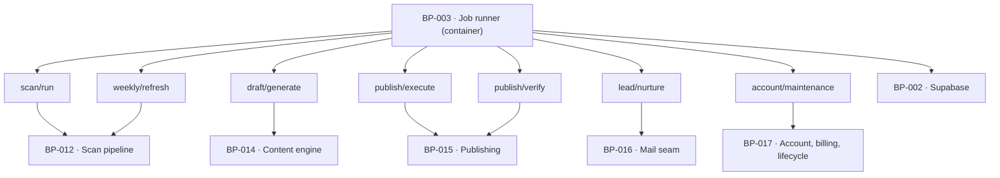

# BP-003 — Job runner — the seven scheduled and evented jobs

- Parent: (root)
- Kind: **container** — the runnable unit that executes work no request waits on.

## Responsibility
Run exactly the seven jobs below — `BUILD.md` §11's six plus the account
maintenance loop four approved criteria need and §11 has no row for — on their
stated triggers, idempotently
and under one kill switch, holding no domain logic of its own — each job is a
trigger, a bounded loop and one call into the engine.

## Module / boundary
`src/jobs/` — one file per job plus a registry. Served over HTTP by BP-001's
`/api/jobs` adapter. No job imports from `src/app/`.

## Diagram


## Public interface
```ts
// src/jobs/index.ts
export function serve(): { GET: Handler; POST: Handler; PUT: Handler }
export const jobs: readonly JobDefinition[]

// each job, exactly these seven ids — adding one is a change to this node
type JobId =
  | 'scan/run'          // on demand; tier is a parameter (free | deep | weekly)
  | 'draft/generate'    // daily, evening, per site, in the site's time zone
  | 'publish/execute'   // on approval or on window expiry
  | 'publish/verify'    // +24h after a publish
  | 'weekly/refresh'    // hourly tick, due per site-local Monday (ADR-060)
  | 'lead/nurture'      // event plus delay: 24h / 72h / 168h
  | 'account/maintenance'
      // every 15 minutes; one tick, five due-work queries, no domain logic here.
      // The four clock-triggered obligations no read path can serve:
      //   REQ-024 c5  BP-032.paymentsAwaitingSignIn  -> chaseSignIn
      //   REQ-024 c6  BP-032.paymentsWithoutAccounts -> backstopProvision
      //   REQ-076 c11 BP-060.sitesDueHostingEndNotice
      //   REQ-076 c10 BP-060.sitesDueHostingStop
      //   REQ-079 c7  BP-063.accountsDueForPurge     -> purgeAccount

export function killSwitchEngaged(): boolean   // reads KILL_SWITCH via BP-005
```

## Data model delta
None of its own. Every job's durable state is a row a component owns —
`scans.status`, `drafts.state`, `publications.verify`, `leads.next_touch_at`.
A job holds no queue table: the queue is the state machine.

## Error & edge behavior
- Every job is idempotent by a natural key stated in its own feature node —
  `(draft_id, destination_id)` for publish (BP-045, ADR-080), `(site_id,
  week_start)` for the weekly refresh (BP-050, ADR-060), `(lead_id,
  touch_index)` for nurture, and for `account/maintenance` the stamp each
  due-work query already reads (`first_signed_in_at`, `users.checkout_session_id`,
  `hosting_end_notice_at` / `hosting_end_reminder_at`, `purge_due_at`) — so an
  at-least-once delivery can never double-publish or double-mail.
- **`(lead_id, touch_index)` is per-touch dedupe inside a sequence, not the
  sequence key.** `leads` is keyed to `scan_id` (`BUILD.md` §10), so one address
  re-scanning one domain yields two lead rows and, under this key alone, two
  sequences of three touches — which REQ-010 criterion 13 forbids. The sequence
  is keyed `(lower(email), domain)` and enforced by BP-029's partial unique
  index; this job's key stops a redelivery of touch *n* inside a sequence that
  already exists. Two keys, two failures, and neither substitutes for the other.
- `account/maintenance` performs none of the five actions itself: each tick calls
  five due-work queries on BP-032, BP-060 and BP-063 and hands each returned
  subject straight back to the node that owns the rule. A tick that returns five
  empty sets is five indexed queries and no writes.
- The kill switch stops `scan/run`, `draft/generate` and `publish/execute`
  before any spend and before any write; it does not stop `publish/verify`
  (read-only) or `account/maintenance`. Halting maintenance would hold a purge
  REQ-079 criterion 7 dates, withhold a hosting notice REQ-076 criterion 11
  makes a precondition of going dark, and strand a paid founder outside their own
  account — three promises the switch was never meant to reach. `BUILD.md` §11
  scopes it to "scan+generate+publish" and this node keeps that scope. A day it stops is a day REQ-092 makes the product
  say so — never a silent skip.
- A job that exceeds its own budget stops and marks its subject `degraded`
  rather than throwing (`BUILD.md` §6.5: "Caps degrade … never throw").
- No job fans out across customers inside one invocation past a fixed
  concurrency; a slow site never starves the rest of Monday.

## NFR budget
- `weekly/refresh` must complete every active site inside the customer's own
  Monday (REQ-065 criterion 1). **The tick is hourly and due-ness is per site's
  own local Monday and local hour — `Mon 06:00 UTC` is not the trigger**, and
  `unique (site_id, week_start) where tier = 'weekly'` is what makes "exactly
  once" true rather than the schedule. **ADR-060** is why, and is a landmine:
  `BUILD.md` §11 says `Mon 06:00 UTC` in writing and restoring it silently
  measures every site west of UTC−6 in the wrong week. Read that file before
  changing this line.
- `draft/generate` runs the evening before the publish date in the site's zone
  and must finish before the veto window would start (REQ-057 criterion 1).
- `account/maintenance` fires every 15 minutes. Derivation (rule 1.1): the
  tightest obligation it carries is REQ-024 criterion 5's "when 15 minutes have
  passed since the charge", so the tick must divide that interval or the chase
  arrives late by up to a whole period; 15 minutes with a `charged_at + 15 min`
  predicate makes the mail land inside the first tick after the promise falls
  due. The three daily-or-slower obligations ride the same tick because each is
  guarded by its own stamp, so running them 96 times a day costs 96 indexed
  counts and writes nothing extra. Reversal: one cron expression, no migration.
- Observability: one log line per invocation carrying job id, subject id,
  outcome and duration; a `degraded` outcome carries which step degraded and
  never a vendor payload.

## Decisions
1. **Seven job ids, closed** — Status: accepted
   (amended 2026-08-31; the union as approved held `BUILD.md` §11's six)
   - Context: a job runner accretes jobs; `BUILD.md` §11 names six. Four approved
     criteria carry a clock trigger §11 has no row for — REQ-024 c5's 15-minute
     chase, REQ-024 c6's 24-hour backstop, REQ-076 c10 and c11's hosting stop and
     its two notices, and REQ-079 c7's 30-day purge. None of the four has a read
     path: each acts precisely when nobody is looking. Under the six-id union
     they were unschedulable, which means four criteria the owner approved would
     never have run and nothing would have failed.
   - Decision: add one member, `account/maintenance`, arriving with the trigger,
     the idempotency keys and the budget the closed union exists to force. It is
     one member, not four, because all four are the same shape — a due-work query
     guarded by a stamp — and BP-032 decision 4 ("this node exports the queries
     and the two actions; whether BP-003 runs them as one maintenance job or two
     is BP-003's to decide") hands the grouping here.
   - Alternatives considered: four members, one per obligation — rejected, four
     cron rows for one predicate shape and four places to forget the kill-switch
     scope; an open registry — rejected, the first unregistered job is the one
     with no cap and no kill switch; leaving them to a read path as BP-058 does
     for destination health — rejected, and that asymmetry is the point: a
     destination's last-checked date is read by a customer opening Settings,
     while a purge, a hosting stop and a chase to a founder who has *not* signed
     in have no reader to trigger them.
   - Consequences: cheap to reverse (narrow a union); the value is the friction.
2. **No `destination/health` job; the freshness REQ-074 c1 promises is a read-path
   guarantee** — Status: accepted
   - Context: BP-058 reported that a seventh job id was "the clean answer" but
     that it could not edit this node, and shipped an in-line refresh on the read
     path instead. This node now owns the ruling.
   - Decision: no such job. REQ-074 criterion 1 binds what the customer *reads* —
     "each connected destination shows its current state … and the date it was
     last checked, which is never more than 24 hours old" — and BP-058's in-line
     refresh makes that value fresh at the moment of the read by construction. A
     job would make the same promise true only if the job ran; the read path
     cannot be stopped out of, cannot fall behind and cannot be missed by a
     deployment. Criterion 6's mail to a customer who has **not** signed in rides
     `draft/generate`'s existing per-site daily loop, which is BP-058's decision
     and is left standing.
   - Alternatives considered: add `destination/health` anyway — rejected, it puts
     two producers on one fact (rule 7.1) and the read-path refresh would still be
     needed for the reader who arrives between ticks; move criterion 6's mail onto
     `account/maintenance` — rejected here, it is BP-058's decision and 2.2a says
     fix what is wrong, not what is inelegant.
   - Consequences: a Settings, Overview or calendar read may make a bounded
     network call. If that latency proves unacceptable in practice, adding the
     job later moves one call out of a loop and changes no data model — BP-058
     already records that reversal as low-cost.
3. **The queue is the state machine, not a table** — Status: accepted
   - Context: REQ-056 already defines ten states and fifteen transitions that
     fully determine what is due; a separate queue table would be a second copy
     of that fact (rule 2.4).
   - Decision: jobs select work by querying state, never by draining a queue.
   - Alternatives considered: a `job_queue` table — rejected, it is the second
     copy, and REQ-056 criteria 10 to 13 (held pages resume in order) become two
     sources of truth that will disagree the first time a publish is switched off.
   - Consequences: every due-work query must be indexed on `(state, scheduled_for)`.
     Reversing means introducing a queue and a reconciliation loop — expensive,
     which is why it is recorded here.

4. **The job platform is Inngest** — Status: accepted (parameter, rule 1.1;
   entry written 2026-08-31, choice taken by WO-013 as this node directed)
   - Context: this node's open question stood unresolved because `BUILD.md` §1
     leaves it open — "Jobs | **Inngest** (or Vercel cron + queue)". The node
     directed that the choice be "taken at M1 by the first work order under this
     node, recorded here as a decision entry at that point — not escalated". A
     work order may not edit a blueprint, so WO-013 took the choice, recorded the
     derivation in its own `rests-on`, and reported the owed entry. This is it.
   - Decision: **Inngest.** Derivation, from WO-013 and checked here: `BUILD.md`
     §1's stack table names Inngest in bold as the choice and the parenthetical
     as the alternative; and this node's own first `rests-on` already assumes
     at-least-once delivery with a durable retry and a per-function concurrency
     limit, which Inngest provides and a bare cron does not — so choosing cron
     would have meant building the queue half of "cron plus a queue" before any
     job could be written idempotent against it.
   - Alternatives considered: Vercel cron plus a queue — rejected on the
     `rests-on` above: it moves durable retry and concurrency into code this
     corpus would then own, for a platform difference no customer can observe.
   - Consequences: the platform is named in exactly one file
     (`src/jobs/client.ts`) so the reversal stays one file and one route.
     Decision 3 keeps the state machine as the queue, so no job body, no table
     and no migration depends on which platform triggers it.
   - Cost of reversing: the trigger layer only — one adapter file, one route, and
     the seven registrations. Low, and deliberately kept low by decision 3.

## Status grounds (rule 3.2)
Self-certified `approved`. Grounds: cut from `BUILD.md` §11 and the charter's
stack table ("Jobs | Inngest (or Vercel cron + queue)"), not from one
requirement; `satisfies` empty by rule 5.4, so §3's blueprint gate — "no blueprint from a non-approved
requirement" — reads no ancestor here. `covers` is coverage, never authorising
ancestry (rule 5.4), so these grounds assert nothing about the status of the
requirements this node covers; eight of the corpus's requirements are
`in-review` and none of them is this node's ancestor.
The seventh job id added 2026-08-31 is derived from four approved criteria named
in decision 1; it introduces no promise and changes no customer-visible string.

## Open questions
None. The one that stood here — Inngest versus Vercel cron plus a queue — was
taken by WO-013 as this node directed and is recorded as decision 4.
