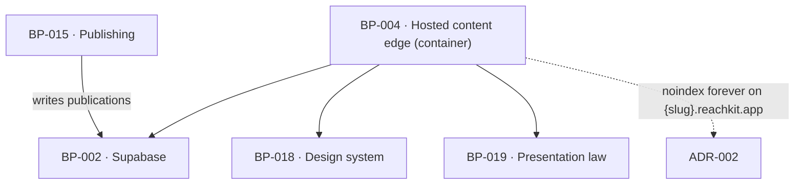

# BP-004 — Hosted content edge — customer-domain publishing surface

- Parent: (root)
- Kind: **container** — a distinct runtime surface, reachable only on customer
  domains and on the preview host, with its own indexing policy.

## Responsibility
Serve published pages statically at `content.{customer-domain}` keyed by Host
header, with the sitemap, canonical, schema and robots policy that make them
findable for the customer — and never for ReachKit.

## Module / boundary
`src/app/(hosted)/**` — the only part of `src/app/` BP-001 does not own. It
reads `publications`, `drafts` and `sites` through BP-002 and renders through
BP-018's one typographic template; it writes nothing.

Its leaf BP-047 anchors most of the files inside that directory — `layout.tsx`,
`resolve-host.ts`, `[slug]/**`, `robots.ts`, `sitemap.ts` and two test subtrees
— which was reported as this container governing almost nothing of its own. It
is not a defect and nothing is re-globbed: **rule 2 is exactly this shape** —
"a container or component anchors a directory; a leaf anchors the files it
specifies inside it, and the narrower glob owns the file." A container whose
sole leaf specifies most of its files owns the directory, the framework
conventions that arrive later (`not-found`, `error`, `route.ts` at the root),
and the tests outside the leaf's two subtrees. Splitting or narrowing either
node's globs to make the container look better fed would be the restructuring
rule 2.2a forbids, and would leave a file added tomorrow with no home.

## Diagram


## Public interface
```
GET  https://content.{customer-domain}/{slug}     one published page
GET  https://content.{customer-domain}/robots.txt served by us; blocks no general
                                                  crawler; names GPTBot, ClaudeBot,
                                                  OAI-SearchBot, Claude-SearchBot,
                                                  PerplexityBot, Google-Extended
GET  https://content.{customer-domain}/sitemap.xml every live page, and nothing else
GET  https://{slug}.reachkit.app/                 preview; noindex forever

Host resolution: Host -> sites.domain -> site; an unknown Host is 404, never a
fallback to another customer's content.
```

## Data model delta
None. Reads `publications.live_url`, `publications.unpublished_at`,
`drafts.body_md`, `sites.domain`.

## Error & edge behavior
- An unknown or unmapped Host returns 404 and never a ReachKit page.
- A page whose `publications.unpublished_at` is set is 410 Gone, not 404 and not
  a redirect.
- A site whose access ended more than 30 days ago returns 410 Gone at every
  address that served a page (REQ-076 criterion 10); a deleted account returns
  410 at the moment of deletion (REQ-079 criterion 6).
- No page on this surface renders any string the copy registry does not hold,
  except the page body, which is the one place generated prose is allowed
  (REQ-093 criterion 2).
- Serving is read-only: nothing on this surface can change a publication's state,
  so a crawler cannot advance the state machine.

## NFR budget
- Static render, p95 ≤ 200 ms at the edge; no database round trip on a cache hit.
- No JavaScript required to read the page: the 24-hour verification fetches it
  as a crawler that runs no scripts (REQ-062 criterion 1), so the page must be
  complete in its HTML.
- Cache invalidation on publish and on unpublish is immediate; a 410 must not be
  served from a stale cache and a takedown must not wait on a TTL.
- Observability: Host, slug, status and cache disposition per request; no
  customer identifier in a log line served from a customer's own domain.

## Decisions
1. **A separate container, not a route group of BP-001** — Status: accepted
   - Context: these pages are reachable only on customer domains, are the one
     surface a crawler is meant to index, and carry the opposite indexing policy
     to every ReachKit-addressed page.
   - Decision: own container, own robots and sitemap, own cache policy, no write
     path at all.
   - Alternatives considered: a route group inside BP-001 — rejected, one
     `robots.txt` cannot state two opposite policies, and the surface with the
     highest reputational consequence would inherit the app's middleware.
   - Consequences: two robots policies to keep straight, which ADR-002 exists to
     keep straight.
2. The indexing policy itself — report pages `noindex`, preview `noindex`
   forever, hosted customer pages indexable — spans this node, BP-001 and BP-002
   and is recorded as **ADR-002** (landmine), not here.

## Status grounds (rule 3.2)
Self-certified `approved`. Grounds: cut from `BUILD.md` §1 ("hosted-CMS pages
served from an edge route keyed by Host header") and §9, not from one
requirement; `satisfies` empty by rule 5.4, every `covers` requirement approved.

## Open questions
