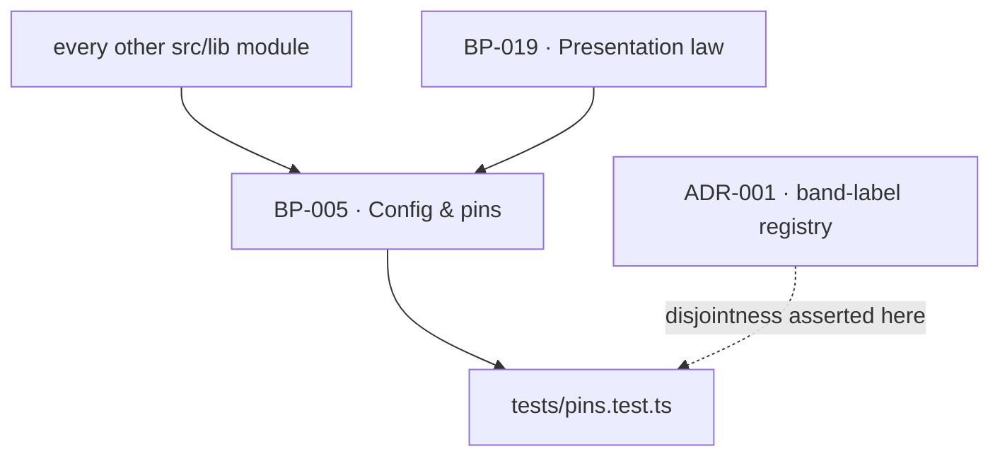

# BP-005 — Configuration and pinned constants

- Parent: BP-001 (executed inside every container)
- Kind: **component** — the single home for every number and every environment
  binding the product reads.

## Responsibility
Define once, and assert once, every pinned number in the specification and every
environment variable the product reads, so no coefficient, cap, floor,
denominator or threshold is ever written twice.

## Module / boundary
`src/lib/config/constants.ts` (values), `src/lib/config/env.ts` (bindings, parsed
and validated at boot), `tests/pins.test.ts` (assertions). Imported by every
other module; imports nothing.

## Diagram


## Public interface
```ts
// src/lib/config/constants.ts — grouped, frozen, exhaustively asserted
export const PRICE_BOOK: {
  RANKED_FREE_ROWS: 50;  RANKED_FREE_COST_C: 1.8
  RANKED_PAID_ROWS: 300; RANKED_PAID_COST_C: 4.8
  RANKED_RIVAL_ROWS: 100;RANKED_RIVAL_COST_C: 2.4
  COMPETITORS_DOMAIN_COST_C: 1.5; SUGGESTIONS_COST_C: 1.8
  SERP_LIVE_C: 0.2; SERP_STD_C: 0.06
  CHATGPT_SCRAPE_STD_C: 0.12; AI_MODE_LIVE_C: 0.2; AI_MODE_STD_C: 0.06
}
export const CAPS: { FREE_C: 12; DEEP_C: 150; WEEKLY_C: 40; DRAFT_C: 45 }
export const BATTERY: { QUESTIONS: 12; TARGET_SERPS_MAX: 13; MEASURED_PAGES_MAX: 25; COMPETITORS_MAX: 5 }
export const SERP_LOCATION: { location: 'United States'; language: 'en' }
export const PLATFORM_DOMAINS: readonly string[]        // closed list, BUILD §6.1
export const CACHE_WINDOWS_D: { own: 7; rival: 30; serp: 30; suggestions: 30 }
export const FREE_BOUNDS: { scansPerIpPerHour: 5; inFlightPerIp: 1; scansPerDay: 200 }
export const TIMING: { reportTargetS: 60; reportCeilingS: 90; deepReleaseMin: 10; progressHeartbeatS: 30 }
export const WINNABILITY: { qualifyFloor: 500; qualifyMultiple: 5; nearFloor: 100; nearMultiple: 2 }
export const RIVAL_SIZE_BANDS: { nearFloor: 100; nearMultiple: 2; middleFloor: 500; middleMultiple: 5 }
/** `BUILD.md` §5's four score bands, as lower bounds on a 0–100 score:
 *  "Bands: 0–24 Invisible · 25–49 Hard to find · 50–74 Findable · 75–100
 *  Dominant". BP-024's `bandOf(score)` says "thresholds are BP-005 pins" and
 *  had none to read; this is that pin. Boundaries only — the four *words* are
 *  BP-019's `SCORE_BANDS` (decision 2). Named `SCORE_BAND_BOUNDS` and not
 *  `SCORE_BANDS`, which is already BP-019's `CopyKey` map. */
export const SCORE_BAND_BOUNDS: {                          // BP-024 · REQ-004 c1 · BUILD §5
  invisible: 0; 'hard-to-find': 25; findable: 50; dominant: 75
}
export const GENERATION: { brandGapChars: 300; duplicateThreshold: 0.85; regenerations: 1 }
export const SUPPLY: { deepTarget: 30; shortThreshold: 7 }
export const VETO: { defaultHours: 24; minDays: 0; maxDays: 7 }
export const RATE_LIMITS: { publishesPerDay: 1; publishesPerWeek: 8 }
export const RETENTION_D: { erasure: 30; hostedAfterAccess: 30; removalSlaWorkingDays: 5 }
export const NURTURE_H: readonly [24, 72, 168]

// ── Added 2026-08-31 (decision 3). Every entry below is traced to the node and
//    the criterion that asked for it; none is minted here, and none is a
//    customer-visible string.
//
// The free report and the market chain
export const SELECTION: {                                  // BP-025 · REQ-006 · BUILD §6.7 step 3
  volumeFloorPerMonth: 50
  intentWeights: { decision: 3; solution: 3; problem: 2; informational: 1 }
  minDecision: 4; minSolution: 3; maxRivalBrand: 3; maxHowTo: 2
}
export const COHERENCE: { minMeasuredSearches: 3; shareDivisor: 4; minAppearances: 2 }
                                                            // BP-028 · REQ-094 c2 · BUILD §6.7 step 5
export const CORRECTION: { perScan: 1; retries: 1; offerMaxAgeDays: 7 }
                                                            // BP-028 · REQ-094 c5–c7
export const SEVERITY_THRESHOLDS: {                        // BP-027 · REQ-009 c8
  blocked_readers:   { mid: 1; high: 3 }                    // 0 = low; 1–2 mid; >= 3 high
  missing_pages:     { mid: 1; high: 10 }
  unquotable_pages:  { mid: 1; high: 2 }
}
/** ADR-022's single closed list of AI reader user-agent tokens. One set, one
 *  name: the blocked-readers count (BP-024), the paste block (BP-027) and the
 *  hosted robots policy (BP-004/BP-047) all read this and nothing else.
 *  ADR-090 folds BP-047's `AI_CRAWLERS` into this name and records that
 *  REQ-059 criterion 4 states the membership verbatim. Nothing is populated
 *  here from memory (rule 1.2); `tests/pins.test.ts` asserts the value against
 *  that clause, quoted. An empty list fails the pins test. */
export const AI_READER_AGENTS: readonly string[]           // ADR-022, ADR-090

// The free path's own bounds
export const FREE_RESCAN_WINDOW_D: 7                        // BP-023 · BUILD §6.4
export const FAILURE_COOLDOWN_H: 24                         // BP-023 · BUILD §6.4
export const HOURLY_WINDOW_H: 1                             // BP-023 · BUILD §11 bounds
export const DAILY_WINDOW_H: 24                             // BP-023 · BUILD §11 bounds
export const DEEP_HEARTBEAT_S: 15                           // BP-036 d5 · REQ-029 c1 (half of 30)

// Opportunities, supply and verdicts
export const EFFORT_BY_TYPE: {                              // BP-040 d3
  answerable_page: 0.2; expand_page: 0.3; refresh_page: 0.3
  answer_page: 0.5; keyword_page: 0.5; comparison_page: 0.6; format_page: 0.7
}                                                           // `unblock` is unranked
export const FIT_WEIGHT: { winnable: 1.0; reach: 0.5; 'not-yet': 0 }    // BP-040 d3
export const SUPPLY_TARGET_DEPTH: 30                        // BP-041 d4 · REQ-095 c1
export const SUPPLY_SHORT_BELOW: 7                          // BP-041 d4 · REQ-095 c5
export const TOO_EARLY_WEEKS: 3                             // BP-051 d4 · REQ-063 c2

// Generation
export const SHINGLE_SIZE: 5                                // BP-042 · REQ-050 c9
export const NEAR_DUPLICATE_MAX: 0.85                       // BP-042 · REQ-050 c9 · BUILD §8
export const MACHINE_ADDRESS_PATTERNS: readonly RegExp[]    // BP-042 · REQ-050 c8
export const CLAIM_RECHECK_SWEEP_MAX: 25                    // BP-043 · REQ-053

// Publishing, destinations and verification
export const PUBLISH_RETRY_BACKOFF_MIN: readonly [5, 30, 180]   // BP-045 · REQ-056 c4
export const DESTINATION_HEALTH_MAX_AGE_H: 24               // BP-058 · REQ-074 c1
export const VERIFY: { coverageFloor: 0.95; userAgent: string } // BP-049 · REQ-062
                                                            // userAgent is a machine token, not customer copy
/** ADR-083 · BP-048 · REQ-060 c6. The slug of the one term BP-048 puts on every
 *  post it creates in a customer's WordPress, so the customer can bring them all
 *  up together in their own wp-admin. Unlike every other pin in this file its
 *  **value is owner-owed, not derived**: it is a customer-visible string (§1's
 *  rights table). **Corrected 2026-09-01 (ADR-084 Decision 5):** this comment
 *  read "visible on the customer's own public site the moment they publish the
 *  draft themselves". The owner ruled that ReachKit publishes every post live in
 *  one call, so the term is public **from the moment of delivery**, and it is
 *  ReachKit's act rather than the customer's that makes it so. The escalation is
 *  unchanged in substance and stronger in ground — it was a consequence the
 *  customer opted into, and is now one ReachKit imposes — and it also produces a
 *  public tag archive at `/tag/<slug>/` on their own domain. Owed sooner, not
 *  re-opened. It is pinned here so it has one home and reversal is one edit — not
 *  because this node may choose it. The pins test asserts it is present and
 *  non-empty; it cannot assert a value nobody has ruled. */
export const WORDPRESS_STAMP_SLUG: string                   // BP-048 · REQ-060 c6 · owner-owed
// The weekly clock
export const WEEK_START: 'monday'                           // REQ-065 c1; not a tunable, pinned so it is stated once
export const WEEKLY_DUE_HOUR_LOCAL: 6                       // ADR-060 · site-local, never UTC

/** The price. **ADR-052 decision point 1** names these three by name as pins in
 *  this file, asserted in `tests/pins.test.ts`; BP-030's data-model delta cites
 *  them by name as the reason the €49, its currency and its interval are not
 *  columns; BP-001's `/pricing` row delegates to "BP-005's price". Three nodes
 *  read this pin and it was not declared here — added 2026-08-31 (decision 5).
 *
 *  Nothing here is chosen. `4900` is REQ-022 criterion 1's "€49 per month" in
 *  minor units and criterion 4's "€49 in euro … never converted to a local one",
 *  transcribed; the *number a customer reads* and the sentence that carries it
 *  are the owner's (constitution §1) and live in BP-019's registry under
 *  BP-030's `PRICE_COPY_KEYS`, never here.
 *
 *  **Read ADR-052 before touching any of the three.** The Stripe Price behind
 *  `env.STRIPE_PRICE_ID` is `tax_behavior: 'inclusive'`, and ADR-052 point 3
 *  makes a startup check refuse to boot when the live Price's `unit_amount`,
 *  `currency`, `recurring.interval` or `tax_behavior` differs from these pins.
 *  These constants are one half of that comparison; changing one without the
 *  Price object is a boot failure by design, and changing the amount at all is
 *  a change to what the product promises and is the owner's alone. */
export const PRICE_EUR_CENTS: 4900        // ADR-052 p1 · BP-030 · REQ-022 c1, c4
export const PRICE_CURRENCY: 'eur'        // ADR-052 p1 · BP-030 · REQ-022 c4
export const PRICE_INTERVAL: 'month'      // ADR-052 p1 · BP-030 · REQ-022 c1, c2

// Account lifecycle
export const SETUP_REMINDER_OFFSETS_H: readonly [24, 72, 168]   // BP-033 · REQ-025 c6
export const EMAIL_CHANGE_TTL_H: 24                         // BP-061 d2 · REQ-077 c4
export const SIGNIN_LINK_TTL_H: 24                          // BP-061 d2 (chosen)
export const ERASURE_DAYS: 30                               // BP-063 · REQ-079 c7
export const DANGER_TICKET_TTL_MINUTES: 30                  // BP-063
export const HOSTED_RETENTION_DAYS: 30                      // BP-060 · REQ-076 c10
export const HOSTING_END_REMINDER_DAYS: 7                   // BP-060 · REQ-076 c11
export const MAINTENANCE_TICK_MINUTES: 15                   // BP-003 d1 · REQ-024 c5
export const NURTURE_MAX_TOUCHES: 3                         // BP-029 · REQ-010 c9
export const SEQUENCE_START_DEADLINE_DAYS: 7                // BP-029 · REQ-010 c12
export const FIRST_PAGE_RETRY_WINDOW_H: 24                  // BP-029 · REQ-010 c8
export const FIRST_PAGE_RETRY_MINUTES: readonly [5, 30, 120, 360, 720, 1440]  // BP-029 d4

/** Overview's headline goal **values** (BP-038). Numbers only: BP-038's `GOALS`
 *  pairs each with its copy key and is the one home of the pairing, so this file
 *  stays free of `CopyKey` and keeps importing nothing.
 *  Three of the four are derived from values `BUILD.md` §4.5 and §5 already pin.
 *  The fourth — `pages_published` — had no source in the corpus and is a number
 *  a customer reads, so it was the owner's, not the system's. **Ruled
 *  2026-08-31: 30**, meaning a month of daily pages — the product's own promise
 *  of one page a day, sustained for a month. It is no longer optional, and
 *  BP-038 renders that tile's goal like the other three. */
export const GOAL_VALUES: {
  searches_appeared_in: number; ai_answers: number; score: number
  pages_published: 30           // owner ruling, 2026-08-31 — a month of daily pages
}

// src/lib/config/env.ts
export const env: Readonly<Env>   // parsed and validated at module load; a
                                  // missing binding is a boot failure, not a
                                  // runtime undefined
// `Env` is `BUILD.md` §15's list plus one binding the corpus forces and §15 has
// no row for:
//   HOSTED_EDGE_CNAME_TARGET — the hostname a customer points
//   `content.{their-domain}` at (BP-035, BP-047, BP-058 · REQ-028 c2, REQ-059
//   c2). It is one deployment-scoped hostname, so it is a binding rather than a
//   constant: it differs between preview and production, and a value that
//   differs by deployment is exactly what `env` is for. It is rendered inside a
//   DNS record the founder copies, not spoken by the product, so it is not a
//   customer-visible string. Reversal: one binding.
```

## Data model delta
None.

## Error & edge behavior
- `env` throws at boot on a missing or malformed binding; there is no default
  and no fallback, so a deployment cannot start half-configured.
- Every constant is `as const` and frozen; nothing mutates a pin at runtime and
  no setting anywhere in the product overrides one (REQ-070 criterion 3).
- `tests/pins.test.ts` asserts each value against the source clause it was pinned
  from, by quotation, not by line number (rule 5.3).

## NFR budget
- Zero runtime cost; the module is data.
- The pins test runs in under a second and is the first check in CI, so a drifted
  constant fails before anything expensive runs.

## Decisions
1. **Grouped frozen objects, not loose exports** — Status: accepted
   - Context: `BUILD.md` §6.1 pins a price book and a dozen other numbers appear
     across §5 to §9; loose exports make "is this pinned?" unanswerable.
   - Decision: one named group per source section, each frozen, each with a
     matching assertion block in `tests/pins.test.ts` that quotes its source.
   - Alternatives considered: a JSON file read at boot — rejected, it loses the
     type and lets a value change without a test failing.
   - Consequences: adding a spend site means adding a price-book row before it
     ships, which is what the charter's cost envelope asks for.
2. **Band boundaries live here; band words do not** — Status: accepted
   - Context: REQ-047 criterion 10 and REQ-096 criterion 2 each state two counts
     and three bands. The counts are parameters (rule 1.1 — the system's); the
     words are customer-visible strings (the owner's).
   - Decision: `WINNABILITY` and `RIVAL_SIZE_BANDS` hold the counts here; the six
     words live in BP-019's `BAND_LABELS`, and `tests/pins.test.ts` asserts their
     disjointness. The reasoning spans four nodes and is **ADR-001**.
   - Alternatives considered: keeping the words here too — rejected, it would put
     an owner decision inside the system's file and make the disjointness check
     invisible to the surfaces that render the words.
   - Consequences: two files move together when a band changes; the test that
     binds them is the thing that makes that safe.

3. **Every pin a feature node asked for is declared here, traced to its asker** — Status: accepted
   - Context: `structure.md` rule 5 says a number in two files is wrong and puts
     it here; forty-four feature nodes were cut in one pass and each recorded the
     pins it needs as a `rests-on` row or a decision entry in its own file, none
     of which could edit this one. A pin that exists only in the asking node is
     the second copy rule 5 exists to prevent, arriving by omission.
   - Decision: the block added above declares each one with the node and the
     criterion that asked for it, so `tests/pins.test.ts` can assert every value
     against a quoted source clause (rule 5.3) and a reader can answer "who needs
     this" without a grep. Values already derived and justified in the asking
     node are carried, not re-derived (rule 2.4): the derivation stays where its
     author wrote it and this file holds the value.
   - Alternatives considered: let each node declare its own constants — rejected,
     that is the N-registries failure `structure.md` rule 5 names; declare them
     with no attribution — rejected, an unattributed pin cannot be retired when
     its asker is, and cannot be asserted against a source.
   - **Not declared, deliberately:** the removal address REQ-002 criterion 1
     requires the report to name. It is a customer-visible string — the owner's
     by the decision-rights table, not a parameter — and it stays outstanding
     rather than guessed. **Also outstanding and also not here:** whether
     anything records receipt of a removal request.
   - **Discharged 2026-08-31 by owner ruling.** Four of the five values this
     entry listed as outstanding were ruled. The six band words and REQ-009's
     three severity words landed in BP-019's `BAND_LABELS` and `SEVERITY` (not
     here — decision 2 stands: the band *boundaries* are here and the band words
     are not). Overview's `pages_published` goal value is a number, not a string,
     so it lands here: `GOAL_VALUES.pages_published = 30`.
   - **Added in the same pass:** `SCORE_BAND_BOUNDS`. Not an owner ruling and not
     newly chosen — `BUILD.md` §5 states the four boundaries and BP-024's
     `bandOf` already cited them as pins in this file, which had no entry for
     them. Declaring them here is decision 1 and `structure.md` rule 5 applied to
     a number that would otherwise be written in `bands.ts` alone.
   - Consequences: adding a pin is an edit to this file and a failing pins test
     until its source clause is quoted. That friction is the point.
4. **`AI_READER_AGENTS` is the one name; `AI_CRAWLERS` is not a second set** — Status: accepted
   - The reasoning spans BP-004, BP-024, BP-027 and BP-047 and amends ADR-022, so
     it is **ADR-090**, not here.
5. **The three price pins are declared here** — Status: accepted (2026-08-31)
   - Context: three artifacts already read a price pin out of this file and this
     file declared none. ADR-052 point 1: "`PRICE_EUR_CENTS = 4900`,
     `PRICE_CURRENCY = 'eur'`, `PRICE_INTERVAL = 'month'` are pins in
     `src/lib/config/constants.ts` (BP-005), asserted in `tests/pins.test.ts`".
     BP-030's data-model delta names the same three and cites this node. BP-001's
     `/pricing` delegation row reads "BP-005's price". A planner opening this file
     for the price found nothing and would have minted it wherever it was needed —
     the exact second home BP-030 decision 4 was written to prevent.
   - Decision: declare them, under the price group above, traced to ADR-052 point
     1 and to REQ-022 criteria 1 and 4. This is decision 3's rule applied to a pin
     that was asked for and never landed, not a new pin: every value is
     transcribed, none is chosen, and no customer-visible *string* enters this
     file — the sentence a founder reads stays in BP-019's registry under
     `PRICE_COPY_KEYS`.
   - Alternatives considered: **correct BP-001's delegation cell to point at
     `env.STRIPE_PRICE_ID` instead** — rejected, the env binding is the *identity*
     of a Price object in Stripe and carries no amount a test can assert; it is
     precisely the drift ADR-052 point 3's startup check exists to catch, and the
     check needs both halves. **Leave the amount in BP-030 alone, since BP-030
     builds the Checkout Session** — rejected, BP-030 decision 4 already rules
     "this module holds neither, only the binding", and pins live here by decision
     3 without exception.
   - Consequences: `tests/pins.test.ts` gains three assertions quoting REQ-022
     criterion 1, and ADR-052 point 3's boot check has something to compare
     against.
   - Cost of reversing: three lines here. The Price object in Stripe is the
     expensive half and it is ADR-052's, not this file's.

## Status grounds (rule 3.2)
Self-certified `approved`. Grounds: cut from the charter's repo table
("`src/lib/config/constants.ts` | **Every** pinned number in the specification")
and `BUILD.md` §6.1, not from one requirement; `satisfies` empty by rule 5.4,
so §3's blueprint gate — "no blueprint from a non-approved
requirement" — reads no ancestor here. `covers` is coverage, never authorising
ancestry (rule 5.4), so these grounds assert nothing about the status of the
requirements this node covers; eight of the corpus's requirements are
`in-review` and none of them is this node's ancestor.

**Status grounds addendum, 2026-09-01 (rule 3.2).** One change on 2026-09-01:
`WORDPRESS_STAMP_SLUG`'s comment, corrected under ADR-084 Decision 5. No pin's
value changed and no pin was added or removed. The corrected sentence describes
what REQ-060 criterion 1 now promises, and that requirement is `status:
in-review` — settled after two review rounds with zero open `REVIEW(...)` lines
and unsigned. §3's gate reads no ancestor here (`satisfies` is empty), so it is
literally silent; stated anyway, because the comment asserts something about a
customer's site that is true only if the owner ratifies the inversion. The pin's
**value** remains owner-owed and is owed sooner than before.

## Open questions
