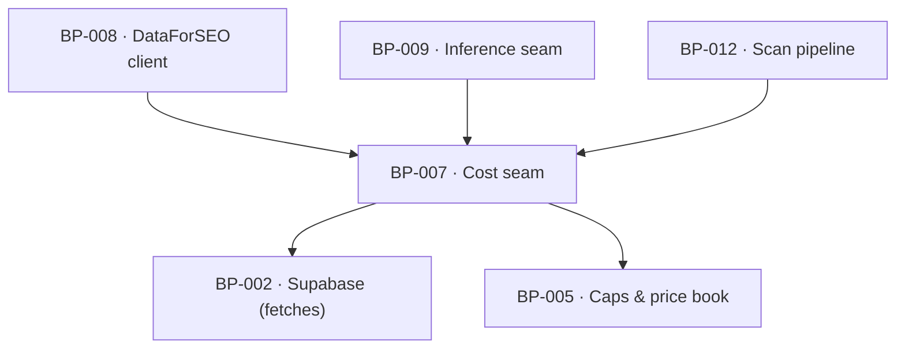

# BP-007 — Cost seam — ledger, cache and raw store in one

- Parent: BP-001
- Kind: **component** — the money boundary every paid call passes through.

## Responsibility
Run every vendor and model call inside a per-scan cost context that reads cache
first, ledgers what was spent whether or not the call succeeded, and degrades the
scan at its cap instead of throwing. Research on the DataForSEO endpoints and pricing
is in `registry/evidence/RESEARCH-dataforseo-endpoints.md`.

## Module / boundary
`src/lib/costs/` and the `fetches` table, which is ledger, cache and raw store in
one (`BUILD.md` §6.5). BP-008 and BP-009 are its only callers for spend; BP-012
opens and closes the context.

## Diagram


## Public interface
```ts
export type CapName = 'FREE' | 'DEEP' | 'WEEKLY' | 'DRAFT'

export function withCostContext<T>(
  ctx: { scanId: string; cap: CapName; policyVersion: number },
  body: (cost: CostContext) => Promise<T>
): Promise<T>

export interface CostContext {
  /** Cache-first, ledger-always. `fresh` false means the payload came from cache
   *  and cost nothing. An empty payload is always a miss; there is no negative
   *  cache. */
  recordFetch<P>(call: {
    source: string           // vendor endpoint or model id
    cacheKey: string
    freshnessDays: number
    costCents: number
    run: () => Promise<P>
  }): Promise<{ payload: P; fresh: boolean; costCents: number } | { skipped: 'cap' }>

  capHit(): boolean          // re-checked between calls in any multi-call step
  spentCents(): number
  degraded(): boolean
}
```

## Data model delta
`fetches` — `id, scan_id, source, cache_key, policy_version, cost_cents,
payload jsonb, created_at`, unique on `(source, cache_key, policy_version)` for
the cache read, indexed on `scan_id` for the ledger read. No second table: the
ledger, the cache and the raw store are one row.

## Error & edge behavior
- **Caps degrade, never throw.** At the cap, `recordFetch` returns
  `{ skipped: 'cap' }` and the context is marked degraded; the caller records the
  outstanding measurement as *not attempted* (REQ-004 criterion 9), never as 0.
- Money already spent is always ledgered — a call that succeeds at the vendor and
  fails on parse still writes its row.
- The cache is keyed `source + key + policyVersion`. Bumping the policy version
  is how a changed derivation invalidates its cache; nothing is deleted.
- An empty payload is a miss and is retried on the next scan; there is no
  negative cache, so "0 rows" is billed once per scan and never remembered as an
  answer (`BUILD.md` §6.4).
- A free scan of a domain measured less than 7 days ago serves the stored report
  and opens no context at all — the cheapest possible path is not a cache hit but
  no scan.

## NFR budget
- One cache read per call, indexed; the seam adds under 5 ms per call.
- A free scan's context must not exceed 12¢, a deep pass 150¢, a weekly 40¢, a
  draft 45¢ — enforced here, not assumed anywhere else.
- Observability: every row is the audit trail; a per-scan roll-up
  (`spentCents`, `degraded`) is written to `scans.cost_cents` and
  `scans.status` at close. No cost figure is ever rendered to a customer
  (REQ-003 non-goal, REQ-092 criterion 8).

## Decisions
1. **`skipped: 'cap'` is a value, not an exception** — Status: accepted
   - Context: REQ-003 criterion 11 requires the ceiling to hold "whether or not a
     driver of the score depends on it", and REQ-004 criterion 9 requires the
     result to read as *not measured*, never as 0 and never as an error.
   - Decision: the cap outcome is a third arm of the return type, so a caller
     cannot handle it by accident.
   - Alternatives considered: throwing a `CapExceeded` — rejected, `BUILD.md`
     §6.5 says caps degrade and never throw, and a throw at the wrong depth
     discards the measurements already paid for.
   - Consequences: every multi-call step carries an explicit cap branch, which is
     also where the "stopped early" written line is produced.
2. **One table for ledger, cache and raw store** — Status: accepted
   - Context: three tables would state one fact three times (rule 2.4) and make
     "what did this scan cost" a join.
   - Decision: `fetches` as specified by `BUILD.md` §6.5, with the payload kept.
   - Alternatives considered: separate `cache` and `spend_ledger` — rejected,
     they diverge the first time a cached call is re-billed.
   - Consequences: `fetches` grows fast and needs a retention policy; the payload
     of a deleted account is purged with the account (REQ-079 criterion 7).

## Status grounds (rule 3.2)
Self-certified `approved`. Grounds: cut from `BUILD.md` §6.5 ("Every vendor/LLM
call runs inside a per-scan cost context … one `fetches` table is ledger + cache
+ raw store"), not from one requirement; `satisfies` empty by rule 5.4, every
`covers` requirement approved.

## Open questions
