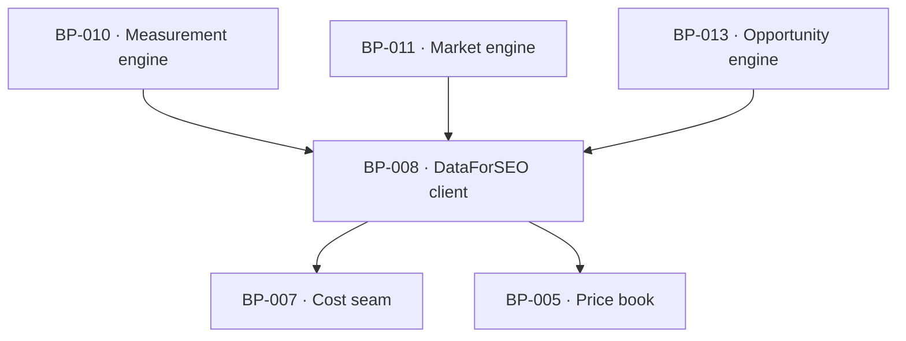

# BP-008 — Search-data vendor client — the closed DataForSEO endpoint list

- Parent: BP-001
- Kind: **component** — the typed boundary to the one search-data vendor.

## Responsibility
Expose exactly the DataForSEO endpoints `BUILD.md` §6.3 admits, each already
priced, cached and cost-contexted, and make every endpoint on the never-list
unreachable from application code.

## Module / boundary
`src/lib/vendors/dataforseo/` — one function per admitted endpoint, plus the
response parsers that turn a vendor payload into the product's own types. No
other module constructs a vendor URL.

## Diagram


## Public interface
```ts
// Every call takes the CostContext; none can be made outside one.
export function rankedKeywords(c: CostContext, a: { domain: string; rows: 50|100|300 }): Promise<Measured<RankedRow[]>>
export function keywordSuggestions(c: CostContext, a: { seed: string; rows: 50 }): Promise<Measured<SuggestionRow[]>>
export function competitorsDomain(c: CostContext, a: { domain: string }): Promise<Measured<CompetitorRow[]>>
export function serpOrganic(c: CostContext, a: { query: string; mode: 'live'|'std' }): Promise<Measured<SerpResult>>
  // SerpResult carries organic top-10 AND the ai_overview item with its
  // reference domains — the free AI matrix rides here at 0c extra
export function aiMode(c: CostContext, a: { query: string; mode: 'live'|'std' }): Promise<Measured<AiAnswer>>       // paid battery only
export function llmScraper(c: CostContext, a: { query: string; mode: 'std' }): Promise<Measured<AiAnswer>>          // paid battery only

// Every call is fixed to SERP_LOCATION (Google US / en) and depth 10.
```

## Data model delta
None of its own; payloads land in `fetches` through BP-007.

## Error & edge behavior
- **The never-list is enforced by absence**: SERP depth > 10, search operators,
  clickstream flags, `load_async_ai_overview`, Labs historical endpoints,
  per-rival `ranked_keywords` on the free path, a fourth engine, per-draft
  re-probing and AI Keyword Data have no function to call.
- Zero rows is a legal, billed result and returns a measured empty array —
  never `unmeasured`. A vendor error, a timeout or an unparseable payload
  returns `unmeasured` with its reason, so REQ-004's trichotomy survives the
  vendor boundary intact.
- `mode: 'live'` is permitted only where a human is waiting; the deep pass and
  the free scan pass `'live'`, every scheduled job passes `'std'`. The mode is a
  required argument precisely so a scheduled caller cannot inherit `'live'` by
  default.
- Credentials come from BP-005's `env` and never appear in a log, a payload or an
  error message.

## NFR budget
- 12 live SERPs for the free battery complete within the 60-second promise at
  bounded concurrency; the free path makes **zero** AI Optimization calls
  (`BUILD.md` §6.2).
- Free battery ≤ 6.3¢ target, 12¢ cap; weekly paid battery 2.2¢.
- Observability: endpoint, rows returned, cost, cache hit or miss, duration.

## Decisions
1. **One function per admitted endpoint; the never-list has no function** — Status: accepted
   - Context: `BUILD.md` §6.4's never-list is a policy, and a policy expressed as
     a comment is a policy that ships.
   - Decision: express the closed list as the module's exported surface. A call
     the product may not make is a compile error, not a review finding.
   - Alternatives considered: a generic `dataforseo(endpoint, params)` with a
     runtime allow-list — rejected, it moves a build-time guarantee to runtime
     and makes "which datasets does the product pull" unanswerable by reading
     one file.
   - Consequences: adding an endpoint means adding a price-book row and a
     function, which is exactly the friction the charter's cost envelope asks
     for.
2. **`mode` is required, never defaulted** — Status: accepted
   - Context: live-mode creep is one of the charter's four named cost dangers.
   - Decision: no default; every call site states whether a human is waiting.
   - Alternatives considered: default `'std'` — rejected, a defaulted parameter
     is invisible at the call site and the free path's 60-second promise depends
     on the opposite choice.
   - Consequences: noisier call sites, which is the point.

## Status grounds (rule 3.2)
Self-certified `approved`. Grounds: cut from `BUILD.md` §6.1 to §6.4 (the price
book, the AI-visibility ruling and the never-pull list), not from one
requirement; `satisfies` empty by rule 5.4, so §3's blueprint gate — "no blueprint from a non-approved
requirement" — reads no ancestor here. `covers` is coverage, never authorising
ancestry (rule 5.4), so these grounds assert nothing about the status of the
requirements this node covers; eight of the corpus's requirements are
`in-review` and none of them is this node's ancestor.

## Open questions
