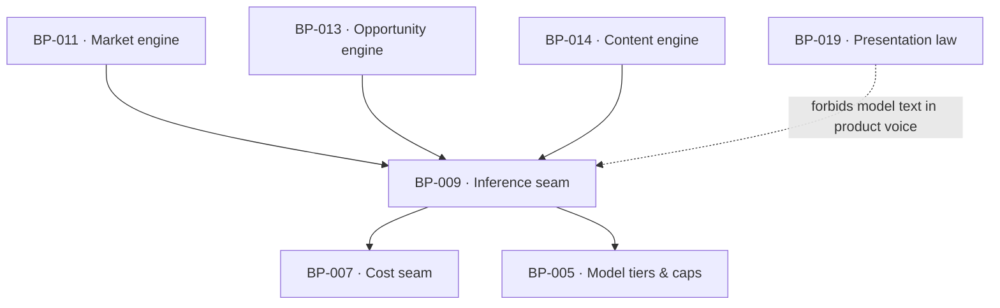

# BP-009 — Inference seam — the one llm() call site registry

- Parent: BP-001
- Kind: **component** — the only place a language model is called.

## Responsibility
Make every model call go through one function with a declared call site, a
declared model tier, a declared cost and a typed output — so the closed set of
things a model is allowed to touch is readable in one file and enforced by the
type system.

## Module / boundary
`src/lib/llm/` — the seam, the model tiers, the prompt templates and the call-site
union. Callers are BP-011 (profile, question phrasing), BP-013 (opportunity
typing) and BP-014 (brief, outline, draft, answerability pass, claim check).

## Diagram


## Public interface
```ts
export type LlmCallSite =
  | 'profile'            // nano · homepage+pricing text -> business profile (BUILD 6.7 step 1)
  | 'question-phrasing'  // nano · a selected search -> a question's wording (step 4)
  | 'opportunity-typing' // haiku · label/classify an already-derived opportunity
  | 'brief' | 'outline'  // nano
  | 'draft'              // haiku · grounded draft
  | 'answerability'      // haiku · answerability + SEO pass
  | 'claim-check'        // nano

export function llm<T>(c: CostContext, call: {
  site: LlmCallSite
  input: unknown
  schema: ZodType<T>          // output is parsed or the call failed
  tier: 'nano' | 'haiku'
}): Promise<Measured<T>>
```

## Data model delta
None; every call is ledgered in `fetches` through BP-007 with the call site as
its `source`.

## Error & edge behavior
- A response that does not parse against the schema is `unmeasured` with reason
  `unparseable`, retried at most once inside the caller's own budget, and never
  silently coerced.
- **The model touches vocabulary, never selection** (`BUILD.md` §6.7): the seam
  refuses to be given a selection decision by construction — `profile` and
  `question-phrasing` return words, and the twelve searches are chosen by
  BP-011's deterministic scorer before either call is made.
- Model unavailability degrades the caller; every product-voice string still
  renders because none of them comes from here (REQ-093 criterion 5).
- No call site outside the union exists; adding one is a change to this node and
  to REQ-093's admissions.

## NFR budget
- Nano ~0.3¢ per profile call; a day of content ~6.5¢ against a 45¢ cap.
- p95 latency: nano ≤ 3 s, haiku ≤ 20 s; the free scan's single nano call sits
  inside the 60-second promise.
- Observability: call site, tier, tokens in and out, cost, duration, parse
  outcome; never the prompt or the completion in a log.

## Decisions
1. **A closed call-site union rather than free-form prompts** — Status: accepted
   - Context: REQ-093 makes "where may model text appear" a customer promise, and
     the answer must be checkable by reading one file.
   - Decision: the union is the answer, and every member maps to one of REQ-093's
     admissions or to text no reader ever sees (brief, outline, claim check).
   - Alternatives considered: a generic prompt helper — rejected, it makes the
     promise unverifiable and puts the burden on review.
   - Consequences: an eighth call site is a requirement change, not a code change.

## Status grounds (rule 3.2)
Self-certified `approved`. Grounds: cut from the charter's stack table
("Inference | … behind one `llm()` seam with per-call cost logging") and
`BUILD.md` §8, not from one requirement; `satisfies` empty by rule 5.4, every
`covers` requirement approved.

## Open questions

- [ ] REVIEW(conflict with BP-025): the NFR budget reads "the free scan's
      **single** nano call", and this node's own `LlmCallSite` union carries two
      sites the free path exercises — `'profile'` (BUILD §6.7 step 1) and
      `'question-phrasing'` (step 4). BP-025 decision 2 settles it: "two nano
      calls per scan, ≈0.6¢ rather than ≈0.3¢", because "step 3 — deterministic
      selection — sits between step 1 and step 4, so the phrasing call cannot be
      issued before its input exists", and BP-011's NFR budget carries the
      corrected free-scan headline of 6.6¢ that follows. The line here is the
      pre-correction reading and is the third home of a figure two other nodes
      have already moved.
- [ ] REVIEW(gap): "a day of content ~6.5¢ against a 45¢ cap" is `DATA-COSTS.md`
      §4's total, and that total includes a row this corpus does not spend:
      "Near-duplicate check vs published set | Embeddings | ~0.1¢". This node's
      `LlmCallSite` union has no embedding site and no `tier` for one, and
      BP-042 does the check with BP-005's `SHINGLE_SIZE: 5` and
      `NEAR_DUPLICATE_MAX: 0.85` — shingle overlap, own compute, 0¢. The
      divergence runs in the cheap direction and costs nothing to leave; what
      costs something is that the seam quotes a per-day figure assembled from a
      call it cannot make, so nobody reading this budget can tell which of its
      seven rows the seam is actually enforcing against `CAPS.DRAFT_C`. State
      the six calls this node does make and what each is budgeted at.
