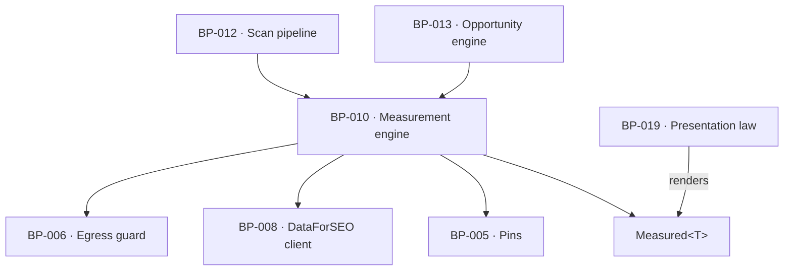

# BP-010 — Measurement engine — drivers, score, and the measured/zero/unmeasured trichotomy

- Parent: BP-001
- Kind: **component** — the deterministic core that turns fetched HTML and vendor
  rows into the numbers every surface reads.

## Responsibility
Turn raw fetched HTML and vendor rows into the four drivers, the score and its
band — deterministically, with no JavaScript execution — and classify every
result as measured, measured-zero or unmeasured at the point it is produced, so
no downstream surface has to guess which it was.

## Module / boundary
`src/lib/measure/` — the parsers (headings, answer blocks, evidence density,
schema, OG), the four drivers, the score, the bands, and the `Measured<T>` type
the whole product carries. It fetches through BP-006, buys rows through BP-008,
and renders nothing.

## Diagram


## Public interface
```ts
/** The trichotomy REQ-004 makes a customer promise. Every stored number and every
 *  rendered number in the product is one of these three. */
export type Measured<T> =
  | { kind: 'measured';   value: T; at: Date }
  | { kind: 'zero';       value: T; at: Date }           // read it; it contained none
  | { kind: 'unmeasured'; reason: 'undeterminable' | 'not_attempted'; at: Date }
      // 'undeterminable' = REQ-004 criterion 6 (nothing returned / unreadable / no answer)
      // 'not_attempted'  = REQ-004 criterion 9 (90s ceiling or spend ceiling)

/** The four **measured quantities** the parsers and vendor rows produce. These
 *  are not the three drivers a customer is shown. `BUILD.md` §5 composes the
 *  score as Foundations x Answerability x Presence, where Presence is itself
 *  `max(1, sqrt(SearchPresence x AIPresence))`; REQ-004 criterion 2 says "the
 *  three drivers it is composed of" and `BUILD.md` §4.1 says "three driver
 *  mini-bars". So `searchPresence` and `aiPresence` are sub-measures and never
 *  a factor. The composing triple is BP-024's `ScoreFactors`, derived from this
 *  by `factorsOf`. Four fields are kept here because collapsing them at
 *  measurement would lose which of the two failed (BP-024 decision 1).
 *  **Since 2026-09-03 no factor value is shown to anyone** — the owner removed
 *  the three driver bars (`OWNER-QUESTIONS.md` item 4; BP-024 decision 6), so
 *  the triple composes the score and names the factor holding it down, and
 *  reaches no surface as a number. Nothing about what is measured or stored
 *  here changes. */
export interface Drivers {
  foundations:    Measured<number>   // 0-100; a read generic noindex on the home doc is a measured 0
  answerability:  Measured<number>   // 0-100, floored at 1
  searchPresence: Measured<number>   // sub-measure of Presence, never shown alone
  aiPresence:     Measured<number>   // sub-measure of Presence, never shown alone
}
export function measureDomain(c: CostContext, a: {
  domain: string; tier: 'free' | 'deep' | 'weekly'; pages?: string[]
}): Promise<{ drivers: Drivers; onPage: OnPageFacts; robots: Measured<RobotsPolicy> }>

/** Four measured quantities to the three shown, score-composing factors. */
export function factorsOf(d: Drivers): ScoreFactors                       // BP-024
export function presenceOf(d: Pick<Drivers, 'searchPresence' | 'aiPresence'>): Measured<number>
export function computeScore(f: ScoreFactors): Measured<{ score: number; band: BandHandle }>
export type BandHandle = 'invisible' | 'hard-to-find' | 'findable' | 'dominant'  // internal handles
  // `computeScore` took `Drivers` and returned `Band` at approval. BP-024, the
  // node cut from REQ-004, ships `computeScore(f: ScoreFactors)` and
  // `BandHandle`; one symbol in `src/lib/measure/score.ts` cannot carry two
  // signatures, and BP-024's is the one bound to the requirement. See decision 3.

/** REQ-050 criterion 9's comparison set, without a fresh fetch at generation
 *  time: the rendered text of every page this engine measured for a site, read
 *  back from BP-007's `fetches` row — which is ledger, cache and raw store in
 *  one, so the bytes are already there and cost nothing to re-read. BP-042
 *  rests on this; decision 4 is why it is an export here and not a re-fetch
 *  there. */
export function readMeasuredText(a: { siteId: string; scanId?: string }):
  Promise<Array<{ url: string; text: string; measuredAt: Date }>>
```

## Data model delta
Writes `scans.score`, `scans.drivers jsonb` and the measurement sections of
`scans.report jsonb` (versioned blob). No per-section tables (`BUILD.md` §10).

## Error & edge behavior
- **Determinism is a test, not an aspiration**: the same HTML measured twice
  produces byte-identical output (`BUILD.md` §16 milestone 2). No JS execution,
  no clock in the parse, no locale-dependent collation.
- Empty denominators read 0, never null (`BUILD.md` §5): a page with no headings
  scores `zero`, not `unmeasured`.
- A home document read successfully that tells every reader not to index it is a
  measured 0 for Foundations and forces the score to 0 with its band word — it is
  never a "—" (REQ-004 criterion 7).
- `computeScore` returns `unmeasured` if any driver it composes is `unmeasured`,
  and never estimates from the drivers that were measured (REQ-004 criteria 3
  and 9).
- Nothing is carried over from an earlier scan of the same domain; every value
  belongs to the scan whose date the report carries (REQ-004 criterion 12).

## NFR budget
- Whole-domain measurement (home, detected pricing page, robots) inside 15 s at
  p95; up to 25 measured pages on the paid path at bounded concurrency.
- Zero vendor cost for parsing and scoring; the only spend is BP-008's rows.
- Observability: per-driver outcome kind and duration; a `not_attempted` driver
  logs which ceiling stopped it.

## Decisions
1. **`Measured<T>` is the product's number type, not an internal detail** — Status: accepted
   - Context: REQ-004 is the single home for the null-vs-zero rule, and its
     failure mode — rendering an outage as 0 — is a false public accusation about
     somebody's site. Any design where a driver is `number | null` re-opens it,
     because `null` cannot say *why*.
   - Decision: one three-armed type, produced at measurement, stored as produced,
     and rendered by BP-019. Nothing between the parser and the pixel widens it
     to `number | null`.
   - Alternatives considered: `number | null` plus a sibling reason field —
     rejected, the two fields drift and the second one is optional at every call
     site; a thrown error for unmeasurable inputs — rejected for BP-006's reason.
   - Consequences: every arithmetic site handles three arms. That is the cost;
     the benefit is that REQ-004's promise is enforced by the compiler on
     surfaces that do not exist yet.
2. **The score formula and its sub-measures live here, not in config** — Status: accepted
   - Context: `BUILD.md` §5 gives a formula; BP-005 holds numbers.
   - Decision: the coefficients that are numbers (band thresholds, the
     answerability floor, the direct-answer character window) are pins in BP-005;
     the formula's shape is code here, covered by a fixture suite per driver.
   - Alternatives considered: a configurable scoring pipeline — rejected,
     `BUILD.md` §17 forbids engine-tuning settings and REQ-070 criterion 3
     requires the value be identical for every customer.

3. **Four measured quantities, three shown factors, and one `computeScore`** — Status: accepted
   (amends this node's interface as approved)
   - Context: `Drivers` had four fields and `computeScore` took them, while
     REQ-004 criterion 2 and `BUILD.md` §4.1 both say three, and `BUILD.md` §5
     composes the score from Foundations, Answerability and Presence. BP-024
     reported that the type as named "will read as promising four bars to whoever
     implements the header strip", derived `ScoreFactors` from it, and could not
     edit this file.
   - Decision: keep four fields — they are what the parsers produce, and
     collapsing them here would lose which of `searchPresence` and `aiPresence`
     failed, which REQ-004 criterion 3 needs — and say so in the type's own
     documentation instead. `computeScore` takes `ScoreFactors`, matching BP-024
     verbatim, because one exported symbol cannot carry two signatures and the
     node bound to the requirement wins.
   - Alternatives considered: rename `Drivers` to `Measures` — rejected, BP-024's
     approved interface names `Drivers` in four places and a rename would move a
     contract for a naming gain (rule 2.2a); ship four bars — rejected, it
     contradicts REQ-004 criterion 2 and REQ-004's non-goals bar a sub-score
     dashboard.
   - Consequences: `Band` is renamed `BandHandle` to match BP-024. Reversal is a
     type alias.
4. **The measured text is re-readable from this node, not re-fetched at generation** — Status: accepted
   - Context: REQ-050 criterion 9 compares a candidate page against "every page
     on the customer's own site the product has published or measured". BP-042
     recorded an open `rests-on` that this engine stores or can re-read that
     text; without an export it would either re-fetch the customer's site during
     generation — a second read of pages already read, on the customer's own
     server, at draft time — or keep a second copy of the text under
     `src/lib/generate/`.
   - Decision: `readMeasuredText` is the export. Nothing new is stored: BP-007's
     `fetches` row already holds the payload (`ledger + cache + raw store in
     one`), and this function is the read of it keyed by the site's scans.
   - Alternatives considered: a fresh fetch at generation — rejected, it spends
     egress and time on bytes already bought and can disagree with the
     measurement the page was derived from; a `page_texts` table — rejected, it
     is a second copy of `fetches.payload` and `BUILD.md` §10's tenth-table test
     is not met.
   - Consequences: the comparison set reaches back only as far as the `fetches`
     rows for the site's scans. That is the same horizon the measurement itself
     has, which is the honest one. Reversal: delete the export and re-fetch —
     cheap in code, and it re-opens both costs above.

## Status grounds (rule 3.2)
Self-certified `approved`. Grounds: cut from `BUILD.md` §5 and §16 milestone 2,
not from one requirement; `satisfies` empty by rule 5.4, every `covers`
requirement approved. REQ-004's own feature node (partition table) satisfies it;
this node supplies the type and the arithmetic it rests on.

## Open questions

None.

## Log
- 2026-09-03 amended — architect — `/decide`, owner ruling on `OWNER-QUESTIONS.md` item 4: one interface comment corrected — the score's composing triple is no longer "the three drivers a customer is shown" (BP-024 decision 6 removed the bars). No interface, measurement, pin or `satisfies` change.
