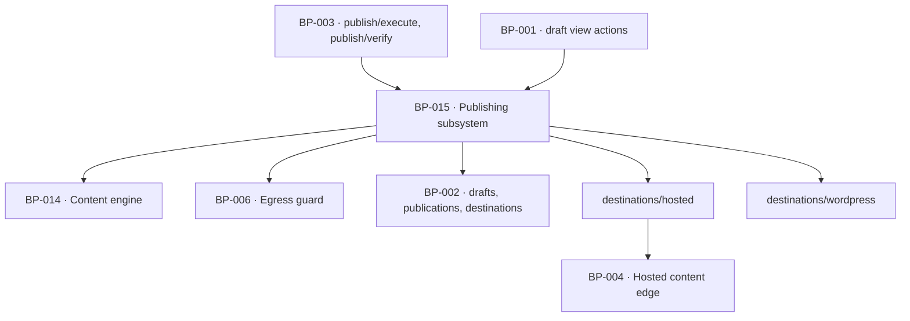

# BP-015 — Publishing subsystem — state machine, destinations, idempotency and verification

- Parent: BP-001
- Kind: **component** — the machine that moves a page from planned to live on
  somebody else's site.

## Responsibility
Hold every page in exactly one of ten states, permit exactly fifteen transitions,
decide when a page becomes publishable, hand it to a destination at most once,
carry each destination's health, and verify a day later that the page is really
there.

## Module / boundary
`src/lib/publish/` — the state machine, the publishable rule, the scheduler, the
ceilings and the switch; `src/lib/publish/destinations/` — the hosted and
WordPress adapters, credential encryption, health checks and the 24-hour
verification. The pages themselves are served by BP-004.

## Diagram


## Public interface
```ts
export type State = 'planned' | 'generating' | 'in_review' | 'approved'
                  | 'publishing' | 'published' | 'skipped' | 'failed'
                  | 'needs_attention' | 'unpublished'

/** Exactly fifteen edges. Any other move is refused with the state unchanged. */
export const TRANSITIONS: readonly (readonly [State, State])[]
export function transition(draftId: string, to: State, by: Actor, reason?: string):
  Promise<{ ok: true; state: State } | { ok: false; refused: 'not_a_transition' | 'guard'; state: State }>

/** REQ-057 criterion 2's single rule, in one place. The four reasons are exactly
 *  that criterion's four conjuncts and the union is closed; a fifth would be a
 *  change to the criterion (BP-046 decision 1).
 *
 *  `claim_recheck` is BP-043's `claimRecheckOutstanding(draftId)`, called from
 *  inside this function and from nowhere else. REQ-053 criterion 5's promise —
 *  that no approval, schedule or retry puts a page carrying a forbidden claim on
 *  the customer's site — is enforced at this one call site, and nothing inside
 *  BP-043 can compel it. Removing the call passes every test BP-043 owns.
 *
 *  `unsaved_edit` is unreachable server-side by construction and that is
 *  deliberate, not dead code: text that failed to save is not in the store, so
 *  the observable predicate is the claim-check hash (BP-044 decision 2). The arm
 *  is kept because it is one of the four conjuncts REQ-057 criterion 2 states in
 *  writing, and a union that silently drops one stops being that criterion. */
export function becomesPublishable(d: DraftView):
  { publishable: true; at: Date } | { publishable: false; because: 'window' | 'unapproved' | 'unsaved_edit' | 'claim_recheck' }

/** REQ-057 criterion 8's precondition, which is **not** one of criterion 2's
 *  four: "no page publishes at all without their having been told, on the pair
 *  it actually publishes under". A separate predicate and a separate guard
 *  (`customer_told`) on the edge into `publishing`; BP-046 owns both and is
 *  where the pair, the telling and the record live. A page held for want of a
 *  telling is not a page that failed criterion 2's test. */
export function toldCurrentPair(d: DraftView):
  { told: true } | { told: false; owed: Telling; because: 'never_told' | 'pair_changed' }

export function publish(a: { draftId: string; destinationId: string }):
  Promise<{ ok: true; publicationId: string; liveUrl?: string }
        | { ok: false; reason: string; retryable: boolean }>
  // idempotent on (draft_id, destination_id): a retry can never create a second post

export function verifyLive(publicationId: string):
  Promise<{ reachable: Measured<boolean>; indexable: Measured<boolean>
            sitemap: Measured<boolean>; aiReadable: Measured<boolean>; checkedAt: Date }>

/** `DestinationAdapter` is **declared by BP-045**, in
 *  `src/lib/publish/types.ts`, which BP-045's `code:` names as an exact glob and
 *  therefore owns under structure.md rule 2 / ADR-091. Read the signature there;
 *  it is not restated here.
 *
 *  It was restated here until 2026-08-31, and the two copies had already
 *  diverged: this one wrote `deliver(page, cfg)` where BP-045 writes
 *  `deliver(page, cfg, idempotencyKey)`. An adapter implementer reading this
 *  parent node would have built a two-argument `deliver` and failed the
 *  idempotency contract ADR-080 exists to protect — a second post in a
 *  customer's site on any retry whose outcome we never recorded. That is rule
 *  2.4's second copy diverging, caught before code. The restatement is withdrawn
 *  rather than corrected: correcting it leaves two homes and the next divergence
 *  is a matter of time. `health` is likewise BP-045's, returning BP-058's
 *  `DestinationHealth`, which is `'ok' | 'expired' | 'error'` — the inline union
 *  this node used to write was equal, and equal is not the same as single-homed.
 *
 *  What is this node's, and stays here, is that the registry of adapters and the
 *  two implementations are BP-058's and BP-048's, and that `servesPublicly` is
 *  the population boundary for REQ-063 criterion 1's weekly verdicts and the
 *  24-hour verification — a field on the adapter, never a `kind === 'hosted'`
 *  test at a caller, so a third adapter cannot join the judged population by
 *  defaulting into it (decision 3 below). */
export type { DestinationAdapter, DeliveryResult, UnpublishResult } from './types'
```

## Data model delta
`drafts.state`, `drafts.veto_deadline`, `drafts.scheduled_for`;
`publications` as `BUILD.md` §10 with a unique index on
`(draft_id, destination_id)` — the idempotency guarantee is the index, not the
code path — plus `delivery_state` and `failure_reason` (BP-045), and **no
`verdict` column**. `BUILD.md` §10 lists `verdict(working/too_early/not_working)`
there; one column cannot answer REQ-063 criterion 3's previous measurement,
criterion 4's interval, or criterion 6's "the date of the last verdict it did
receive", and its enum has no fourth value for `not_judgeable`. A page's standing
is a row per page per week in **BP-051's `page_verdicts`**, unique on
`(publication_id, week_start)`, insert-only. BP-051 decision 1 is the home of
that reasoning; this migration's job is to not create the second one. A test
asserts the column's absence, because adding it back reads as a denormalisation
win and would give the product two answers to "did this page work".

`destinations` with `config jsonb` (credentials encrypted at rest, never logged),
`health`, `health_reason` and `last_checked_at`. **No foreign key into
`publications` carries `on delete cascade`** from `drafts`, `destinations` or
`sites` — ADR-080 and ADR-051 both turn on that absence, and the whole-account
purge is the only path permitted to delete a `publications` row.

## Error & edge behavior
- The fifteen transitions are data, and `transition` refuses anything else with
  the state unchanged. `skipped` and `unpublished` are terminal.
  `needs_attention → publishing` is guarded to a draft that passed every hard
  rule; `needs_attention → generating` is guarded to a draft that never entered
  review and only when the customer starts it — so REQ-053's bound on automatic
  regeneration cannot be raised by a state move.
- **No page publishes at all without the customer having been told, on the pair
  it actually publishes under** (REQ-057 criterion 8). That is a precondition on
  the edge into `publishing` and is *not* one of `becomesPublishable`'s four
  reasons: it is `toldCurrentPair` plus the `customer_told` guard. A page owed a
  telling is held, not published untold, and a mail send that fails holds it —
  which is the correct failure, because the alternative is publishing in the
  customer's name with no telling at all.
- Retry only while the reason is one a repeated attempt could clear, at most
  three times, then `needs_attention`. No page rests in `failed` with neither a
  retry scheduled nor that move made — except while publishing is switched off,
  when the retry is **withheld and the page held**, becoming due again on resume.
- The switch takes effect at the moment it is recorded: no attempt begins after
  it for any page. An attempt already under way runs to a known outcome and the
  customer is shown that outcome truthfully (REQ-056 criterion 12).
- Ceilings hold independently and whatever the settings say: ≤1 publish per
  calendar day, ≤8 per calendar week, counted in the customer's own zone. A
  resumed backlog drains at that rate and never catches up in a burst.
- A WordPress delivery reaches `published` in the sense of **delivered**: its
  record names the site and the delivery date and no live address, and it is out
  of scope for the 24-hour verification, which needs an address (REQ-060, REQ-062).
- A broken destination is a state, not an error loop: health is checked at least
  every 24 hours whether or not a publish was attempted, credentials and vendor
  payloads never reach a screen, a mail or an export.
- Unpublish is available for as long as a page is published; on the hosted
  destination it is removed and its address returns 410 (BP-004). On WordPress
  the product stops treating it as live either way, and what it does inside the
  customer's site is **scoped by liveness** (ADR-081): a post ReachKit itself
  made live is returned to draft there; a post it created but never made live is
  named for the customer and not touched. Both arms are BP-048's.

## NFR budget
- Publish attempt p95 ≤ 10 s; verification is a job, never a request.
- Encryption at rest for `destinations.config`, key from BP-005's `env`; the
  ciphertext is never returned by any read path used by a surface.
- Observability: every transition logged with from, to, actor and reason — the
  transition log is how a customer's "what held this page" line is answered
  without a vendor payload.

## Decisions
1. **The transition table is data and the guards are explicit** — Status: accepted
   - Context: REQ-056 criteria 1 and 2 enumerate ten states and fifteen
     transitions and make "any other attempted change is refused" a promise.
   - Decision: `TRANSITIONS` is a frozen array asserted in a test against the
     requirement's own list; guards for the three conditional edges are named
     functions, not conditions buried in a caller.
   - Alternatives considered: a switch statement per call site — rejected, it
     puts the closed set in N places and the sixteenth transition arrives as a
     one-line edit nobody reviews.
   - Consequences: adding a state is a requirement change first. Reversing this
     is cheap; the value is that the corpus's most enumerated promise has one home.
2. **Idempotency is a unique index on `(draft_id, destination_id)`** — Status:
   accepted, **amended by ADR-080**
   - Context: REQ-056 criterion 5 covers a retry of an attempt "whose outcome was
     never confirmed" — the case application logic gets wrong.
   - Decision: insert the publication row first inside the same transaction that
     claims the attempt; a conflicting insert means the page is already there.
   - Alternatives considered: an application-level "have we published this?"
     check — rejected, it loses exactly the race the requirement names.
   - **Amendment (ADR-080).** "A conflicting insert means the page is already
     there", read literally, is `on conflict do nothing` — which would refuse the
     legitimate retry REQ-056 criterion 4 promises, because the conflicting row
     may be a *claimed* attempt that never delivered. ADR-080 fixes the clause to
     `on conflict (draft_id, destination_id) do update … where
     publications.delivery_state <> 'delivered'`: it refuses only against a
     delivered row. It also adds the retention rule this entry leaves unstated —
     a publication row is never deleted to reflect an outcome — and the
     destination-side marker that is the other half of the guarantee at a site we
     do not own. ADR-080 is a landmine file: every one of the tidy-ups it forbids
     reads as housekeeping and none of them makes a test fail. That reasoning is
     not restated here (rule 2.4).
3. **Two destination adapters behind one interface, no plugin registry** — Status: accepted
   - Context: `BUILD.md` §17 defers Webflow, Shopify, Ghost, Framer and Notion.
   - Decision: a union of two, not a registry — a third adapter is a requirement
     change, and the union means every switch over destination kind is exhaustive.
   - The adapter also declares `servesPublicly`, which is the population boundary
     for REQ-063 criterion 1's weekly verdicts and for the 24-hour verification.
     Expressed as a `kind === 'hosted'` test at each caller it would default a
     third adapter into the judged population; expressed on the adapter, a third
     adapter cannot ship without answering the question. BP-051 rested on this
     and could not add it.
4. **`becomesPublishable` is the one call site of `claimRecheckOutstanding`** — Status: accepted
   - Context: BP-043 recorded an open `rests-on` that this function consults it
     "before every hand-off — veto expiry, customer approval, publish time,
     automatic retry and customer-started retry alike", and that REQ-053 criterion
     5's promise "is enforced at that one call site and nowhere else; nothing in
     this node can compel it".
   - Decision: the `claim_recheck` conjunct **is** that call, made inside
     `becomesPublishable`, and every hand-off into `publishing` goes through the
     predicate rather than around it. `DraftView.claimRecheckOutstanding` is the
     value that call produces, not a second source a caller may pre-fill with a
     stale answer.
   - Alternatives considered: a guard on the state edge alone — rejected, an
     automatic retry can reach `publishing` from `failed` without re-evaluating
     the predicate, which is one of the five hand-offs BP-043 names; a check
     inside the generation pipeline — rejected, it would run before the edit that
     re-opens the re-check.
   - Consequences: a discriminating test deletes the call and asserts a page with
     an outstanding re-check publishes — the mutation check §8 requires, because
     nothing else in the corpus fails when the call is removed.

## Status grounds (rule 3.2)
Self-certified `approved`. Grounds: cut from `BUILD.md` §9, not from one
requirement; `satisfies` empty by rule 5.4, every `covers` requirement approved.

## Open questions
None. The one that stood here — REQ-056 criterion 16 against REQ-079 criterion 4
— was ruled on 2026-08-31 and is **ADR-081**: unpublish is scoped by liveness.
BP-048's `blocked-by` and BP-063's are discharged with it.
