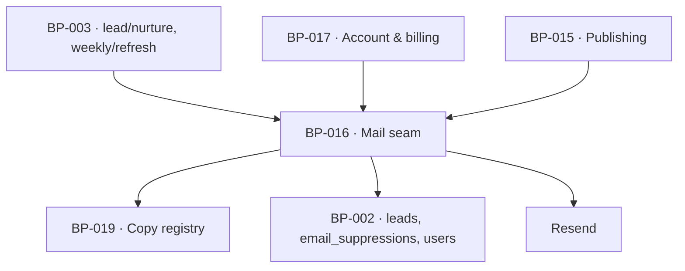

# BP-016 — Mail seam — one sendEmail(), one shell, and the register of kinds

- Parent: BP-001
- Kind: **component** — the only way the product speaks to an inbox.

## Responsibility
Send every mail through one seam and one branded shell with a plain-text
alternative, hold the register of which kinds exist and which the customer may
stop, apply suppression before delivery, and schedule the bounded sequences a
lead may receive.

## Module / boundary
`src/lib/mail/` — the seam, the shell, the per-kind templates, the register, the
suppression check and the sequence scheduler. Every string it renders comes from
BP-019's copy registry; the one exception is the delivered page body in
`first-page`, which is page content.

## Diagram


## Public interface
```ts
/** The register REQ-064's non-goal assigns to this blueprint: which kinds exist,
 *  which requirement names each kind's occasions, and whether the customer may
 *  stop it. REQ-064's non-goal registers "at least" its eight names and says
 *  "Adding a kind is a change to that table" — this table — so a ninth row is a
 *  change to this node alone. Where one requirement states more than one
 *  separately-stoppable occasion — REQ-010 does, three times — `occasionsFrom`
 *  names the criterion, because the requirement id alone cannot make REQ-064
 *  criterion 6's legality test decidable per row (decision 2). */
export const MAIL_KINDS = {
  'magic-link':     { occasionsFrom: 'REQ-024, REQ-077', stoppable: false },
  'first-page':     { occasionsFrom: 'REQ-010 criterion 3', stoppable: false },
  'first-page-unavailable':
                    { occasionsFrom: 'REQ-010 criteria 7 and 8', stoppable: false },
  'nurture':        { occasionsFrom: 'REQ-010 criterion 9',  stoppable: 'opt-out' },
  'draft-ready':    { occasionsFrom: 'REQ-057',          stoppable: 'toggle',
                      unsuppressibleWhen: 'autopilot at a veto window of zero (REQ-057 criterion 7)' },
  'published':      { occasionsFrom: 'REQ-062',          stoppable: 'toggle' },
  'weekly':         { occasionsFrom: 'REQ-063, REQ-065', stoppable: 'toggle' },
  'setup-reminder': { occasionsFrom: 'REQ-025',          stoppable: false },
  'account':        { occasionsFrom: 'REQ-024, REQ-074, REQ-076, REQ-077, REQ-079', stoppable: false },
} as const
export type MailKind = keyof typeof MAIL_KINDS

export function sendEmail(m: {
  kind: MailKind; to: string; subject: CopyKey; blocks: MailBlock[]
  suppressible?: false        // REQ-057 criterion 7's one send
}): Promise<{ sent: true; id: string } | { sent: false; reason: 'suppressed' | 'vendor'; retryUntil?: Date }>

/** REQ-010 criterion 12's scheduling rule, which the requirement hands to this
 *  blueprint: one sequence per address at a time, in delivery order, a waiting
 *  sequence dropped if it has not begun within 7 days of its own page's delivery. */
export function scheduleSequence(a: { email: string; domain: string; deliveredAt: Date }): Promise<void>
export function suppressAddress(email: string, cause: 'opt_out' | 'subscribed'): Promise<void>
```

## Data model delta
None of this component's own. The two tables the seam reads are declared and
migrated by the leaf that specified them, BP-029, under the `leads` and
`suppressions` topic tokens — `email_suppressions` (`email` lowercased as the
key, `cause`, `at`), checked before every send of a `stoppable` kind,
address-wide and cross-domain; and the `leads` sequence columns that bound a
follow-up to 14 days after delivery. This node declared the same two globs and
the same columns at approval; that was one fact in two homes (rule 2.4) and the
globs are withdrawn here rather than in the leaf, because the leaf is where the
columns' meaning is stated. BP-002 decision 1 remains the home of *why* the two
tables exist rather than columns.

## Error & edge behavior
- **A `MailBlock` whose value could not be measured is omitted entirely** — no
  zero, no dash, no placeholder (REQ-064 criterion 1); a measured zero renders as
  zero (criterion 2); a measured-empty list states its empty result in one line
  (criterion 3). The omission rule lives in the block renderer so no template can
  forget it.
- Every mail carries a plain-text alternative; a template without one fails a test.
- Suppression is checked at send, not at schedule, so an opt-out taken between
  scheduling and delivery still stops the mail.
- Delivery of the mail the founder is owed (`first-page`, or the written line
  saying why it is not coming) is retried for 24 hours from the first attempt and
  then abandoned; nothing is shown or recorded as delivered that was not
  (REQ-010 criterion 8).
- Lead capture **fails closed**: if this seam or its store is unavailable, the
  submission is refused in writing and no confirmation of delivery is shown
  (REQ-003 criterion 10). That is the opposite of the scan limiter, which fails
  open — the asymmetry is `BUILD.md` §11's and is deliberate.
- No marketing, newsletter or promotional mail exists: a send whose `kind` is
  outside `MAIL_KINDS` does not compile.

## NFR budget
- `magic-link` within 60 seconds of a completed payment (REQ-024 criterion 1).
- Suppression check adds one indexed lookup per send.
- Observability: kind, recipient hash, suppression outcome, vendor id, retry
  count. Never a body, never a recipient address in clear text in a log.

## Decisions
1. **The register is a typed constant in this node, not prose in a requirement** — Status: accepted
   - Context: REQ-064's non-goal explicitly assigns "which requirement names each
     kind's occasions and where each kind's stoppability is recorded" to "one
     table the mail blueprint holds" — a cross-artifact check no requirement's
     prose can carry.
   - Decision: `MAIL_KINDS` is that table, typed, with `sendEmail` keyed to it,
     and a test asserts every row names at least one approved requirement.
   - Alternatives considered: a documentation table — rejected, it cannot make an
     unregistered send impossible; per-requirement duplication — rejected by rule
     2.4.
   - Consequences: the register is built to the requirement's non-goal as
     written; if `/decide` moves the rule back into a criterion, the constant
     becomes its projection rather than its home.
2. **A ninth kind, `first-page-unavailable`, and `occasionsFrom` names a criterion** — Status: accepted
   - Context: REQ-010 criterion 8 says the founder is owed one of **two** things —
     "the page itself where the page was written, and criterion 7's message where
     it was not" — and criterion 7 makes the second unstoppable on its own
     grounds ("a message they cannot stop, because it closes the request they
     made"). The register as approved carried one row, `first-page`, whose
     `occasionsFrom` read `REQ-010`. Two mails on one row means REQ-064 criterion
     6's test — "the occasion it was sent on is one a requirement in this corpus
     states" — reads as satisfied for a mail whose occasion no row ever named.
     BP-029 reported it, declared the row in its own node and owns its template
     directory (`src/lib/mail/templates/first-page-unavailable/**`).
   - Decision: add `'first-page-unavailable': { occasionsFrom: 'REQ-010 criteria
     7 and 8', stoppable: false }`, and narrow the three REQ-010 rows to the
     criterion rather than the requirement — those are the rows where one
     requirement states three separately-stoppable occasions and the requirement
     id alone cannot say which row means which. Rows whose requirement states one
     occasion keep the requirement id; narrowing them all would be a restatement
     with no test behind it.
   - Alternatives considered: send it as a `first-page` mail with different
     blocks — rejected for the reason above, and the two carry different content
     rules (one carries a page body, one carries a written cause line); send it
     as an `account` mail — rejected, the recipient has no account, which is the
     whole of the trade REQ-010 describes.
   - Evidence for admitting a ninth row at all: REQ-064's non-goal says the
     register "registers **at least**" its eight names, and "Adding a kind is a
     change to that table". Nine rows does not contradict it. REQ-079's non-goal
     calls them "the eight kind names there" — a count that is now one short;
     that is a restatement in a requirement of a fact this table owns, reported
     to the analyst, not edited here (rule 2.4).
   - Consequences: `MailKind` is nine members. Reversal is low in code and high
     in meaning — folding the two kinds back together re-opens the
     mis-registration above.
3. **Address-wide suppression is its own table** — Status: accepted
   - Context: REQ-010 criterion 11 stops "every sequence for every other domain,
     and any sequence a future delivery would otherwise start" — a fact about an
     address, not about a lead row.
   - Decision: `email_suppressions` keyed by address; `leads` never holds the
     suppression flag.
   - Alternatives considered: a flag on every `leads` row for that address —
     rejected, N copies of one fact, and the copy that matters is the one a
     future scan has not created yet.

## Status grounds (rule 3.2)
Self-certified `approved`. Grounds: cut from `BUILD.md` §12 and the charter's
stack table ("Email | Resend, behind one `sendEmail()` seam"), not from one
requirement; `satisfies` empty by rule 5.4, so §3's blueprint gate — "no blueprint from a non-approved
requirement" — reads no ancestor here. `covers` is coverage, never authorising
ancestry (rule 5.4), so these grounds assert nothing about the status of the
requirements this node covers; eight of the corpus's requirements are
`in-review` and none of them is this node's ancestor.

## Open questions
None. The one that stood here — REQ-064's three unresolved `REVIEW` lines about
this seam — is closed: REQ-064's `## Open questions` is empty as of 2026-09-01
(`requirements/history/REQ-029-041-060-064-071-2026-09-01-review-lines-closed.md`),
and the one half that was live, REQ-079's quotation of a count of kind names
criterion 6 does not carry, is gone from REQ-079, REQ-074 and REQ-077 alike.
Decision 2's own note that the count was "now one short" is therefore spent; the
register still holds nine rows and the requirement still says "at least".
