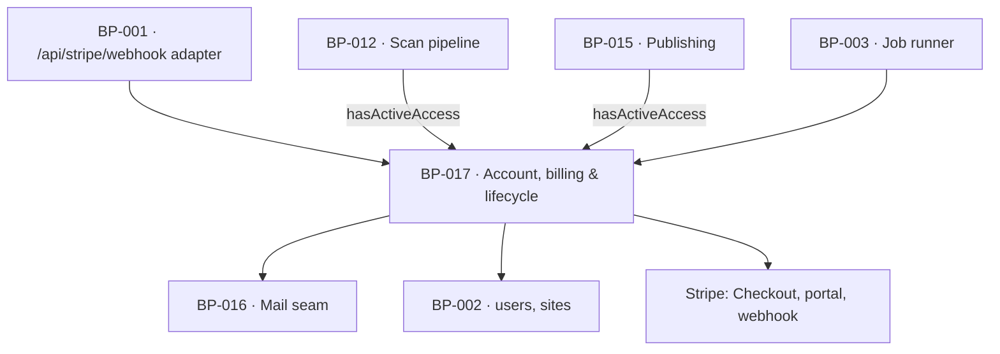

# BP-017 — Account, billing and lifecycle — payment, identity, access, export and erasure

- Parent: BP-001
- Kind: **component** — everything about who the customer is, what they have paid
  for, and what they take with them.

## Responsibility
Turn a completed payment into exactly one account, carry the single active-access
gate every scheduled loop reads, hold magic-link identity and its safe
transfer, and make export, unpublish-all and erasure work whatever the state of
the subscription.

## Module / boundary
`src/lib/account/` — Stripe checkout sessions, the signature-verified webhook and
provisioning, the portal link, the paid-through and access gate, sessions and
email change, the content export, account deletion and the 30-day purge. It owns
`users` and `sites`.

## Diagram


## Public interface
```ts
export function createCheckoutSession(a: { scanId?: string; returnTo: string }): Promise<{ url: string }>
export function handleStripeWebhook(rawBody: Buffer, signature: string):
  Promise<{ handled: true; event: string } | { handled: false; reason: 'signature' | 'unknown_event' }>
export function provisionFromPayment(paymentId: string):
  Promise<{ userId: string; siteId: string; created: boolean }>   // idempotent on the payment

/** The one access gate REQ-076 criterion 8 defines and every scheduled loop reads. */
export function hasActiveAccess(siteId: string): Promise<boolean>
export function portalLink(userId: string, returnTo: string): Promise<{ url: string }>

export function requestMagicLink(email: string): Promise<
  | { sent: true }
  | { sent: false; answer: 'payment_held_account_opening' | 'no_account' }>
export function beginEmailChange(userId: string, next: string): Promise<{ ok: true } | { ok: false; reason: 'in_use' | 'invalid' }>

export function exportEverything(siteId: string):
  Promise<{ ok: true; archive: ReadableStream } | { ok: false; reason: string }>   // never partial
export function unpublishEverything(siteId: string): Promise<UnpublishAllResult>
export function deleteAccount(userId: string): Promise<void>   // export first, then take down, then stamp
```

## Data model delta
`users` — as `BUILD.md` §10, plus `notify jsonb`, `pending_email`,
`pending_email_token_hash`, `pending_email_sent_at`, `deleted_at`,
`paid_through`, `vat_number`, `billing_country`.
`sites` — as §10, plus `timezone`, `publishing_enabled`.
Provisioning is idempotent on the Stripe payment id (unique index), which is what
makes "the same payment reported to us again" produce no second account, no
second site and no second deep pass.

## Error & edge behavior
- The signature-verified webhook is the **only** provisioning path; a claimed
  payment we cannot verify as ours creates nothing (REQ-024 criterion 2).
- Three backstops behind the one-minute magic link: a chase at 15 minutes if
  nobody signed in, and a guarantee that an account exists and a link has been
  sent within 24 hours of a charge (REQ-024 criteria 5 and 6). The 24-hour
  backstop is a job, so a webhook that never arrived cannot leave a paying
  founder with nothing.
- `hasActiveAccess` is true while `paid_through` has not passed and false once it
  has — whether or not the subscription was cancelled and whether or not the
  latest renewal was paid. Refunds, chargebacks and `past_due` are deferred by
  owner ruling and no code path invents behaviour for them.
- Export is all-or-nothing: a partial archive is never returned as complete
  (REQ-078 criterion 5), and it works for an active, cancelled or lapsed
  customer with no end date.
- Deletion order is fixed and irreversible-safe: produce and hand over the export
  → take live pages down → end the subscription → stamp `deleted_at` (every
  surface unreachable at once) → purge at 30 days, including the grounding
  passages copied from the customer's own pages.
- Hosted serving stops 30 days after the paid-through date, with two notices; a
  deletion stops it at once and that window never begins.

## NFR budget
- Webhook handled in ≤ 3 s; provisioning and the magic-link send inside the
  60-second promise.
- No card data, no Stripe secret and no session token ever reaches a log.
- Authorisation: every function except `createCheckoutSession`,
  `handleStripeWebhook` and `requestMagicLink` requires a session bound to the
  user it acts on.

## Decisions
1. **One component for payment and identity, not two** — Status: accepted
   - Context: on this product the payment *is* the account creation (REQ-024), the
     paid-through date *is* the access gate (REQ-076 criterion 8), and deletion
     ends both. Splitting billing from identity would put one lifecycle across two
     modules and give the access gate two possible homes.
   - Decision: one module, one `hasActiveAccess`, one deletion path.
   - Alternatives considered: separate `billing/` and `auth/` — rejected under
     rule 7.1: "active access" is one capability and two owners would each
     implement it.
   - Consequences: a larger module than most. Its feature nodes partition it by
     surface, and the shared gate stays single-owner.
2. **Provisioning idempotent on the payment id at the database level** — Status: accepted
   - Context: REQ-024 criterion 3 covers the same payment reported twice and a
     genuine second purchase, and requires exactly one account either way.
   - Decision: unique index on the payment id; the second insert conflicts and
     the handler sends the `account` mail rather than provisioning.
   - Alternatives considered: an application check — rejected, webhooks are
     at-least-once and the check races itself.

## Status grounds (rule 3.2)
Self-certified `approved`. Grounds: cut from `BUILD.md` §13 and §4.7, not from one
requirement; `satisfies` empty by rule 5.4, every `covers` requirement approved.

## Open questions
