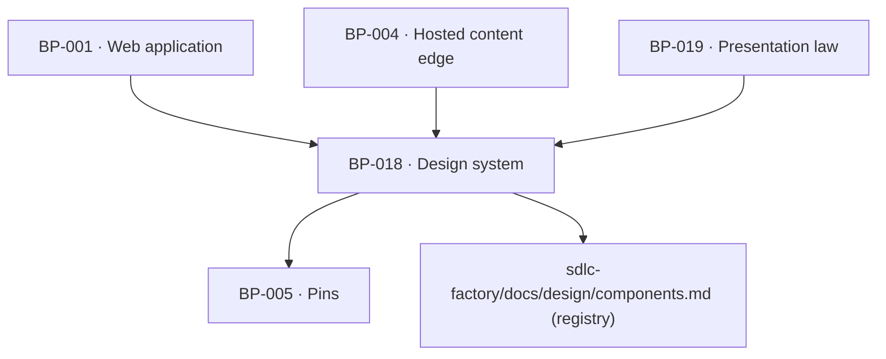

# BP-018 — Design system — tokens, the registered component set and the closed chart inventory

- Parent: BP-001
- Kind: **component** — the visual vocabulary every surface is built from.

## Responsibility
Hold the daisyUI 5 theme tokens of `BUILD.md` §2.1 exactly as specified, the
registered component set, the five-chart closed inventory and the two fonts — so
no surface invents a colour, a widget or a chart form.

## Module / boundary
`src/ui/theme.css` (the three-state theming), `src/ui/components/**` (registered
components only), `src/ui/charts/**` (the five inline-SVG charts),
`tailwind.config.ts` (the token-to-daisyUI mapping), `src/ui/fonts.ts`.
It renders nothing product-specific and holds no copy — every string is passed in
from BP-019.

## Diagram


## Public interface
```ts
// Registered components only — daisyUI primitives plus the five allowed customs.
export { Btn, Card, Badge, Alert, Stat, Tabs, Table, Progress, Toggle, Steps,
         Join, Collapse, Input, Divider, Kbd } from './components'
// The five custom surfaces BUILD §2.2 admits, and no others:
export { CalendarGrid, DayPanel, AiDotMatrix, Sidebar } from './components/custom'
// The closed chart inventory — a sixth chart form needs a design artifact first.
export { GrowthLine, PresenceBars, AiDotMatrixChart, RivalSparkline, WeekStrip } from './charts'

export type Tone = 'ok' | 'warn' | 'bad' | 'neutral' | 'accent'
// Series colours are `chart-you` and `chart-rival` only; Tone is for state and
// is never used for a series.
```

## Data model delta
None.

## Error & edge behavior
- Three-state theming: bare `:root` is light, the dark media query is guarded
  with `:root:not([data-theme="light"])`, and `:root[data-theme="dark"]` is the
  explicit toggle. **No colour is ever defined only inside a dark block** — a
  token missing from `:root` fails a test.
- Every numeral, date, URL, search query and code-like string renders in
  JetBrains Mono with `tabular-nums`; a numeral in the UI font is a defect.
- Rival strength renders neutral, never as an alarm tone: `Tone` is not
  accepted by the rival series props at all, so REQ-008 criterion 6 cannot be
  broken by a prop.
- Every bar and point is direct-labelled with name and value; identity is never
  colour-alone, and no chart component accepts a legend-only mode.
- No emoji anywhere; a lint rule enforces it.

## NFR budget
- Fonts self-hosted via `@fontsource`; no third-party font request from a
  customer's own domain (BP-004 renders with the same fonts).
- Charts are inline SVG with hand-sized viewBoxes — no chart library, so no
  runtime dependency ships to the browser for a five-chart inventory.
- Accessibility: colour is never the only carrier of meaning (bands and
  severities are words — REQ-004 criterion 4, REQ-009 criterion 1); the token
  pairs are the CVD-checked ones from `BUILD.md` §2.4 and are not re-derived.

## Decisions
1. **The component set is closed and registered, and the registry is the factory's** — Status: accepted
   - Context: rule 7.3 requires UI to use named tokens and registered components,
     and `BUILD.md` §2.2 already closes the list ("daisyUI components only — no
     bespoke widgets") with five named custom exceptions.
   - Decision: the module exports exactly that set; a new component enters
     `sdlc-factory/docs/design/components.md` as `proposed` with its data
     contract and states before it can be exported.
   - Alternatives considered: an open components directory — rejected, the first
     unregistered widget is the one that re-implements a card with different
     spacing and the design system stops being one.
2. **The design system holds no copy** — Status: accepted
   - Context: REQ-093 requires every product sentence to be a written string with
     one home; a component with a default label would be a second home.
   - Decision: no component has a default string. Every label, empty state and
     tooltip is a required prop supplied from BP-019's copy registry.
   - Alternatives considered: sensible defaults — rejected, a default is a
     product sentence nobody wrote and nobody can find.

## Status grounds (rule 3.2)
Self-certified `approved`. Grounds: cut from `BUILD.md` §2 and the charter's
stack table, not from one requirement — no approved requirement states the design
system, which is why `satisfies` is empty and the M1 work orders hang off this
node directly. Every `covers` requirement is approved.

## Open questions
