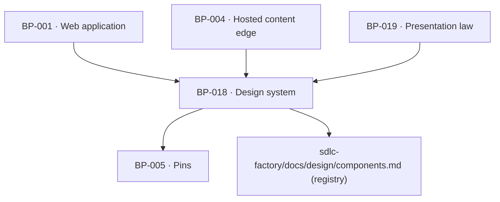

# BP-018 — Design system — tokens, the registered component set and the closed chart inventory

- Parent: BP-001
- Kind: **component** — the visual vocabulary every surface is built from.

## Responsibility
Hold the daisyUI 5 theme tokens of `BUILD.md` §2.1 exactly as specified, the
registered component set, the five-chart closed inventory and the two fonts — so
no surface invents a colour, a widget or a chart form.

## Module / boundary
`src/ui/theme.css` (the three-state theming), `src/ui/components/**` (registered
components only), `src/ui/charts/**` (the five inline-SVG charts),
`src/ui/layout/**` (the three bands and the `Surface` root — ADR-093),
`tailwind.config.ts` (the token-to-daisyUI mapping), `src/ui/fonts.ts`, and the
layout conformance suite at `tests/ui/layout/**`.
It renders nothing product-specific and holds no copy — every string is passed in
from BP-019.

The suite lives here rather than in the container whose tree it sweeps for the
same reason ADR-010 put the cold-start sweep in BP-021: it is stated in this
node's vocabulary — the bands, the spacing steps, the type floor. Its *runner*
(a real browser driver as a dev dependency and a script) is BP-001's root
toolchain, not this module's.

## Diagram


## Public interface
```ts
// Registered components only — daisyUI primitives plus the five allowed customs.
export { Btn, Card, Badge, Alert, Stat, Tabs, Table, Progress, Toggle, Steps,
         Join, Collapse, Input, Divider, Kbd } from './components'
// The five custom surfaces BUILD §2.2 admits, and no others:
export { CalendarGrid, DayPanel, AiDotMatrix, Sidebar } from './components/custom'
// The closed chart inventory — a sixth chart form needs a design artifact first.
export { GrowthLine, PresenceBars, AiDotMatrixChart, RivalSparkline, WeekStrip } from './charts'

export type Tone = 'ok' | 'warn' | 'bad' | 'neutral' | 'accent'
// Series colours are `chart-you` and `chart-rival` only; Tone is for state and
// is never used for a series.

// ── Layout (ADR-093). Three bands, closed; a fourth is an ADR, not a query. ──
export const BANDS = ['compact', 'medium', 'wide'] as const
export type Band = (typeof BANDS)[number]

/** What this surface does in one band. No optional member: a surface that has
 *  nothing to say at a band says so with `same-as-below`, which is a decision
 *  someone made rather than a field someone forgot. */
export type Arm =
  | { kind: 'same-as-below' }
  | { kind: 'columns'; count: 1 | 2 | 3 }
  | { kind: 'declared'; note: string }

/** Every screen root is a `Surface`. `arms` is required and has no default, so
 *  a screen that declares no band behaviour fails to compile — not a test.
 *  `Surface` renders no chrome and is not a widget: BUILD.md §2.2's closed set
 *  of five custom components is untouched by it. */
export function Surface(p: {
  arms: Record<Band, Arm>
  children: React.ReactNode
}): JSX.Element
```

## Data model delta
None.

## Error & edge behavior
- Three-state theming: bare `:root` is light, the dark media query is guarded
  with `:root:not([data-theme="light"])`, and `:root[data-theme="dark"]` is the
  explicit toggle. **No colour is ever defined only inside a dark block** — a
  token missing from `:root` fails a test.
- Every numeral, date, URL, search query and code-like string renders in
  JetBrains Mono with `tabular-nums`; a numeral in the UI font is a defect.
- Rival strength renders neutral, never as an alarm tone: `Tone` is not
  accepted by the rival series props at all, so REQ-008 criterion 6 cannot be
  broken by a prop.
- Every bar and point is direct-labelled with name and value; identity is never
  colour-alone, and no chart component accepts a legend-only mode.
- No emoji anywhere; a lint rule enforces it.
- **Text is never shrunk to fit, and there is no step below the floor**
  (ADR-093 decision 3). The floor for rendered text is the bottom of
  `--t-eyebrow-size`'s range; text inside an SVG `viewBox` is coordinate space
  and exempt (`tokens.md` §7). A component that cannot carry its label at the
  floor renders a **different registered state** — fewer elements, or a narrower
  registered arm — never the same elements smaller.
- **No value is truncated, at any width** (ADR-093 decision 4). The set is the
  one the mono numeral utility already routes: numerals, dates, URLs, search
  queries and code-like strings. A *name* may truncate where the truncation is
  declared and registered; a value may not, and no allow-list entry can grant
  it one.
- **In a row pairing a graphic with a value, the text is rigid and the graphic
  is flexible.** The graphic carries its own named minimum and the row wraps
  when the minimum plus the text no longer fits. `.rk-chart { width: 100% }` on
  a flex child is the inversion this refuses: it makes the chart's base the
  whole row and the customer's number pays for it.
- Every inset between content and its box edge is a named spacing step, never a
  raw value. Which step is right for a given card is the preview gate's
  (rule 7.3), not this module's.

## NFR budget
- Fonts self-hosted via `@fontsource`; no third-party font request from a
  customer's own domain (BP-004 renders with the same fonts).
- Charts are inline SVG with hand-sized viewBoxes — no chart library, so no
  runtime dependency ships to the browser for a five-chart inventory.
- Accessibility: colour is never the only carrier of meaning (bands and
  severities are words — REQ-004 criterion 4, REQ-009 criterion 1); the token
  pairs are the CVD-checked ones from `BUILD.md` §2.4 and are not re-derived.
- **Layout conformance (ADR-093 decision 6).** `tests/ui/layout/**` enumerates
  routes from the App Router tree and renders each at five widths — 320, the
  three bands, and each boundary minus one pixel — at a viewport 480 CSS px
  tall (ADR-093 decision 6, amended 2026-09-03), asserting: no horizontal
  document scroll; every border box contained in its containing block's padding
  box; `scrollWidth <= clientWidth` and `scrollHeight <= clientHeight` on every
  text-bearing element outside the declared truncation allow-list, with a
  truncated **value** failing whether allow-listed or not; and computed
  `font-size` at or above the floor. It ships **one fixture route that overflows
  on purpose and must fail** — under a DOM with no layout engine every metric is
  `0`, `0 <= 0` holds everywhere, and the suite reports a clean sweep over a
  corpus it never measured. A green run in which the canary also passes is a
  failed run.
- Rule 3.3: nothing in this repository enforces a failing suite — no CI, no
  branch protection, no hook. A layout failure is recorded, not enforced, until
  one exists (ADR-093 `rests-on`).

## Decisions
1. **The component set is closed and registered, and the registry is the factory's** — Status: accepted
   - Context: rule 7.3 requires UI to use named tokens and registered components,
     and `BUILD.md` §2.2 already closes the list ("daisyUI components only — no
     bespoke widgets") with five named custom exceptions.
   - Decision: the module exports exactly that set; a new component enters
     `sdlc-factory/docs/design/components.md` as `proposed` with its data
     contract and states before it can be exported.
   - Alternatives considered: an open components directory — rejected, the first
     unregistered widget is the one that re-implements a card with different
     spacing and the design system stops being one.
2. **The design system holds no copy** — Status: accepted
   - Context: REQ-093 requires every product sentence to be a written string with
     one home; a component with a default label would be a second home.
   - Decision: no component has a default string. Every label, empty state and
     tooltip is a required prop supplied from BP-019's copy registry.
   - Alternatives considered: sensible defaults — rejected, a default is a
     product sentence nobody wrote and nobody can find.
3. **The layout law is ADR-093's, and this node holds its vocabulary and its
   suite** — Status: accepted
   - Context: the owner ruled on 2026-09-02 that nothing may be cut off and that
     the whole system must work at every screen size. The design system had no
     breakpoint and no border width, and the type scale had a hole exactly where
     the clipping was.
   - Decision: the bands, `Surface`, the type floor and the conformance suite
     live here; the reasoning, the band table, the calendar and day-panel arms
     and the landmines are ADR-093's and are not restated (rule 2.4). `design/`
     owes the two breakpoint values, a border-width token, registration of
     `--t-sm`/`--t-xs`, a maximum content width above `wide`, and a
     `components.md` row for `Surface`.
   - Alternatives considered: leave responsiveness to each surface — rejected,
     twelve of thirteen surface nodes had no viewport arm at all and a
     convention with no owner is not a contract.

## Status grounds (rule 3.2)
Self-certified `approved`. Grounds: cut from `BUILD.md` §2 and the charter's
stack table, not from one requirement — no approved requirement states the design
system, which is why `satisfies` is empty and the M1 work orders hang off this
node directly. Every `covers` requirement is approved.

## Open questions

- [ ] REVIEW(conflict with PROJECT): this node owns both `BUILD.md` §2.4's
      "every bar and point is direct-labelled (name + value)" and the closed
      chart inventory, and it states no order between §2.4 and `00-project.md`
      standing law 2. Read as a rule about which measurements must be drawn,
      §2.4 licenses exactly what the law refuses: the report's three driver
      mini-bars, the AI matrix's per-row fraction and the gap module's five
      sparklines each satisfy §2.4 while rendering a number that answers no
      customer question. The order the charter fixes, because a standing law
      binds every artifact under it: the **law decides whether a mark is drawn,
      §2.4 decides how a drawn mark is labelled** — so §2.4 reads "every mark
      that is rendered carries its name and its value", never "every measurement
      is rendered as a mark". Recorded with the screen-by-screen findings in
      `design/meaning-over-data.md`; this line asks this node to state the order
      once rather than leave each surface to rediscover it.
