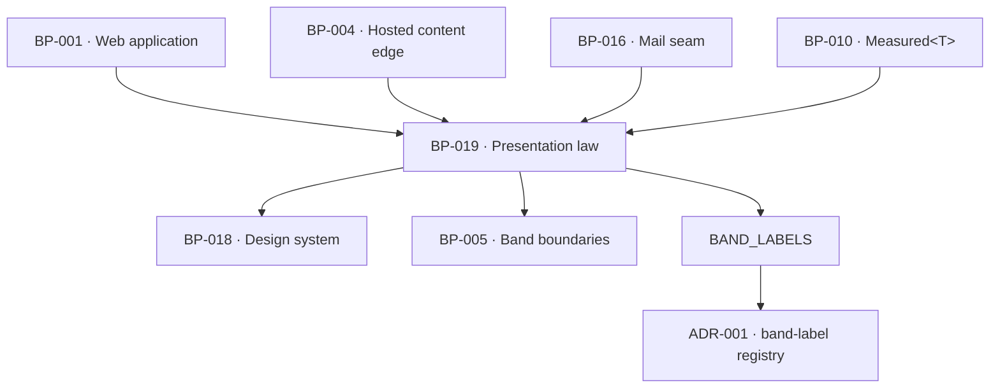

# BP-019 — Presentation law — the copy registry, the Measured renderer and the band labels

- Parent: BP-001
- Kind: **component** — the layer that makes the corpus's four cross-cutting laws
  hold on surfaces that do not exist yet.

## Responsibility
Hold every sentence the product speaks in its own voice, render `Measured<T>` so
an unmeasured input can never appear as a zero, supply the one written line an
empty-at-cold-start place must carry, identify generated text as page content,
and own the customer-facing band labels.

## Module / boundary
`src/lib/presentation/` — the copy registry, the `Measured<T>` renderers, the
cold-start line helper, the generated-content label, the stopped-work statement
and `BAND_LABELS`. Used by BP-001, BP-004 and BP-016; it renders through BP-018
and holds no layout of its own.

Three leaves own subtrees inside this boundary and this component owns none of
their files. Each is named below by the glob its own front-matter declares,
because the most specific declared glob owns the path (ADR-091):

| Leaf | Owns |
|---|---|
| BP-020 | `copy/` **and** `generated/` — two subtrees, not one — plus `tests/presentation/copy/**` and `tests/presentation/generated/**` |
| BP-021 | `place/` in `src/`; in `tests/`, both `presentation/place/**` and `presentation/coldstart/**`. `coldstart/` is a **test** tree only and has no `src/` counterpart |
| BP-054 | `stopped/`, plus `tests/presentation/stopped/**` |

This component's own files inside the boundary are the three no leaf claims:
`bands.ts` (`BAND_LABELS`, `SCORE_BANDS`, `SEVERITY`), `measured.ts`
(`renderMeasured`) and `index.ts`, the barrel.

## Diagram


## Public interface
```ts
/** Every sentence the product speaks. A string literal in a surface is a lint
 *  error; REQ-093 criterion 1 is enforced by the absence of any other source. */
export type CopyKey = keyof typeof COPY
export const COPY: Readonly<Record<string, string>>
export function copy(key: CopyKey, vars?: Record<string, string | number>): string

/** REQ-004's trichotomy, rendered. There is no other way to put a measurement on
 *  a screen or in a mail. */
export function renderMeasured<T>(m: Measured<T>, o: {
  format: (v: T) => string
  unmeasuredLine: CopyKey        // differs by reason: undeterminable vs not_attempted
}): { text: string; isDash: boolean; line?: string }

/** REQ-091 criterion 2: no blank, dash or placeholder stands where a value would
 *  sit; the one line says they have no presence yet and what will fill it. */
export function emptyStateLine(place: PlaceKey): { line: string }

/** REQ-093 criterion 2: model text appears only as a page's content, identified
 *  as that page, and where the page is not yet written, identified as proposed. */
export function generatedLabel(a: { pageTitle: string; written: boolean }): { label: string }

/** REQ-092 criteria 1, 2, 4 and 8: what a surface says when ReachKit stopped its
 *  own work — never an internal cause, always either a resumption date or an
 *  explicit "no time promised", and always whether anything is needed from the
 *  customer. The shape is BP-054's and is declared there; this component
 *  re-exports it and adds nothing. Decision 4 below records why the earlier
 *  `stoppedWorkLine(a: { resumesOn?: Date }): { line: string }` was withdrawn. */
export type { WorkStop } from './stopped'
export { stoppedWorkStatement, nextPublishStatement, dayAccount } from './stopped'
// Through the leaf's own entry point, never `./stopped/stop` or
// `./stopped/statement`. The symbols reaching a consumer are identical; the
// difference is that BP-054 may move a symbol between its two files without
// editing this component's barrel, which it does not own. Corrected 2026-08-31
// on WO-250's report; the same holds for `./copy`, `./generated` and `./place`.
// stoppedWorkStatement(stop: WorkStop):
//   { line: string; needsLine: string; resumesLine: string }
// — `stop.resumes` is `{ on: Date } | { promised: false }` and `stop.needs` is
//   `{ kind: 'nothing' } | { kind: 'action'; key: CopyKey }`. Both are total
//   unions with no absent arm, which is what makes REQ-092 criterion 4's
//   "never neither" and criterion 2's "when nothing is, says so" properties of
//   the type rather than tests on a renderer.

/** The band-label registry. Two sets, six words, asserted disjoint (ADR-001).
 *  The six words were ruled by the owner on 2026-08-31 and are transcribed
 *  below; the keys are this node's, the strings are the owner's. */
export const BAND_LABELS: {
  winnability: Record<'winnable' | 'reach' | 'not-yet', CopyKey>
  rivalSize:   Record<'near' | 'middle' | 'far', CopyKey>
}
// winnability (REQ-047 c10)   winnable → band.winnability.winnable → "Winnable"
//                             reach    → band.winnability.reach    → "Reach"
//                             not-yet  → band.winnability.notYet   → "Not yet"
// rivalSize (REQ-096 c2, c9)  near     → band.rivalSize.near       → "Similar size"
//                             middle   → band.rivalSize.middle     → "Larger"
//                             far      → band.rivalSize.far        → "Much larger"

export const SCORE_BANDS: Record<'invisible'|'hard-to-find'|'findable'|'dominant', CopyKey>
// invisible → "Invisible" · hard-to-find → "Hard to find" · findable → "Findable"
// · dominant → "Dominant" — REQ-004 c1's own words, transcribed, never chosen.

/** REQ-009 c8's three levels, **ascending in the count**: index 0 is the level a
 *  problem measured at 0 carries and index 2 the most severe, so "of any two
 *  reports the one with the larger count never carries the lower severity" is a
 *  property of the tuple's order. BP-027's handles `low | mid | high` index it
 *  in that order. Ruled by the owner on 2026-08-31. */
export const SEVERITY: readonly [CopyKey, CopyKey, CopyKey]
// low  → severity.low  → "Minor"
// mid  → severity.mid  → "Worth fixing"
// high → severity.high → "Critical"
```

## Data model delta
None. This layer reads; it stores nothing.

## Error & edge behavior
- `renderMeasured` has no arm that produces `0` from an `unmeasured` value and no
  arm that produces `—` from a `zero`. The two failure modes REQ-004 exists to
  prevent are unrepresentable rather than tested for.
- `copy` fails at build time on a missing key: an unwritten sentence is a
  compile error, not a blank on a screen.
- `emptyStateLine` requires a `PlaceKey`, and the `PlaceKey` union is exhaustive
  over every module a surface renders — so a new module that holds nothing yet
  cannot ship without a line (REQ-091 criterion 2's reach to "screens added
  later").
- Where a sibling requirement already fixes a place's line — Overview's chart
  before the first weekly measurement, a calendar date carrying no page — that
  fixed line is the one line, and the registry holds it once. Two lines on one
  place is a test failure, because REQ-043 criterion 5 and REQ-091's non-goal
  both forbid a second account.
- A model-produced string reaching `copy()` is impossible by type: `COPY` is a
  frozen literal object, and generated text travels only through
  `generatedLabel` and the page body.
- The three severity levels are a fixed triple, ordered, and monotone in the
  count — the same three words on every report (REQ-009 criterion 8).

## NFR budget
- Zero runtime cost beyond a string lookup; no interpolation engine.
- Every string is available with the language models unavailable (REQ-093
  criterion 5) — the registry is a literal, not a fetch.
- Observability: none. This layer logs nothing; it is pure.

## Decisions
1. **The copy registry is the enforcement of REQ-093, not documentation of it** — Status: accepted
   - Context: REQ-093 binds "every text the product renders or sends … including
     surfaces added after this requirement". A rule that lives in review dies at
     the first hurried surface.
   - Decision: one frozen registry, a lint rule banning string literals in JSX
     and mail templates, and BP-018 components with no default strings. The three
     mechanisms together make the requirement structural.
   - Alternatives considered: an i18n library — rejected, `BUILD.md` §17 defers
     localisation and the machinery would invite runtime string sources;
     per-surface constants files — rejected, they are N registries and the
     question "where is this sentence written" stops having one answer.
   - Consequences: every copy change is a code change. That is the intended cost
     of the owner owning customer-visible strings.
2. **The four cross-cutting laws live here as mechanism, and in three feature
   nodes as behaviour** — Status: accepted
   - Context: REQ-091, REQ-092, REQ-093 and REQ-004's null-vs-zero partition each
     govern every surface. They could be distributed into every surface node or
     concentrated here.
   - Decision: concentrated. One `Measured` renderer, one copy registry, one
     empty-state helper, one stopped-work line; the surface nodes consume them
     and never re-implement them. REQ-004's partition is produced at measurement
     (BP-010's `Measured<T>`) and rendered here — the type crosses the whole
     product precisely so neither end can widen it.
   - Alternatives considered: distribute the laws into each surface's feature
     node — rejected, it is fifteen implementations of one capability (rule 7.1),
     and a law that must hold on "screens added later" has no owner to inherit
     from.
   - Consequences: this node is on the critical path of every surface, so it is
     built at M1 before the screens it serves. Reversing means re-implementing
     four laws per surface, which is the outcome the requirements were written to
     avoid.
4. **`stoppedWorkLine(a: { resumesOn?: Date })` is withdrawn and replaced by
   BP-054's `stoppedWorkStatement(stop: WorkStop)`** — Status: accepted
   (amends decision 2 of this node as it stood at approval)
   - Context: the withdrawn signature made REQ-092 criterion 4's forbidden third
     outcome reachable by omission — an absent `resumesOn` says neither a date
     nor that no time is promised — and its `{ line: string }` return had nowhere
     to put "no resumption time is promised". Criterion 2's "whether anything is
     needed from them, and when nothing is, says so" had no argument and no
     return field at all. BP-054 reported both and logged `blocked-by: [BP-019]`
     rather than diverge silently.
   - Decision: this component exports BP-054's shape verbatim and declares no
     second signature. `WorkStop.resumes` and `WorkStop.needs` are two-arm unions
     with no absent state, so the criterion is enforced by the type at every call
     site, including surfaces that do not exist yet — which is the same mechanism
     decision 2 chose for `Measured<T>`.
   - Alternatives considered: keep `stoppedWorkLine` as a thin wrapper over the
     new function — rejected, the wrapper re-exports exactly the hole the
     requirement forbids and puts one capability in two functions (rule 7.1);
     widen the old signature in place to `resumesOn: Date | null` — rejected,
     `null` cannot distinguish "no time is promised" (a statement the customer
     reads) from "we did not fill this in", which is the same `number | null`
     failure BP-010 decision 1 rejects.
   - Consequences: BP-054's `blocked-by: [BP-019]` is discharged by this entry
     and its three work orders are released. Reversing means reintroducing an
     optional field on a customer-visible promise; the cost is the promise.
5. The band-label registry itself — six words across two sets produced by two
   different engines, asserted disjoint in a third node's test — spans nodes no
   single blueprint owns and is recorded as **ADR-001**, not here.
6. **The nine owner-owed words landed on 2026-08-31; the disjointness assertion
   passes on them** — Status: accepted (transcription of an owner ruling, not a
   choice)
   - The six band words and the three severity words are the owner's under
     constitution §1 and stood outstanding on BP-020's, BP-027's, BP-040's and
     BP-052's `rests-on` rows since those nodes were cut. They are recorded
     above and those four rows are discharged.
   - **ADR-001 point 3, checked before recording.** Winnability renders
     {Winnable, Reach, Not yet} — three distinct terms. Rival size renders
     {Similar size, Larger, Much larger} — three distinct terms. The
     intersection of the two rendered sets is **empty**, so REQ-096 criterion
     9's "no term rendered for a rival's band is a term rendered for a target's
     winnability band" holds and `tests/pins.test.ts`' assertion passes on these
     nine words. It no longer skips: `BAND_LABELS` now exists and disagrees with
     nothing (WO-007's skip condition is spent).
   - **One transcription note, deliberately not smoothed.** REQ-047 criterion 10
     writes the third band as "Not-yet"; the rendered term the owner ruled is
     **"Not yet"**, without the hyphen. The hyphenated form stays the *internal
     handle* (`'not-yet'`, BP-040's `Winnability`) and the unhyphenated form is
     the only thing a customer ever reads. Both are correct in their own place
     and neither is a typo for the other; REQ-047's own rationale ("the band
     words … are the customer's to be told") is what makes the criterion's
     spelling a label rather than the string.
   - The severity triple is **not** part of ADR-001's disjointness assertion —
     ADR-001 constrains the two band sets only, and REQ-009 criterion 8 asks for
     distinctness and monotonicity within one set, which the tuple's order gives.
   - Cost of reversing: nine strings in the registry. Nothing derives from them
     and nothing is stored under them.

## Status grounds (rule 3.2)
Self-certified `approved`. Grounds: cut from `BUILD.md` §0.3, §2.5 and §6.6's
cold-start law, not from one requirement; `satisfies` empty by rule 5.4 — the
three law requirements are satisfied by feature nodes beneath this component —
and every `covers` requirement is approved.

## Open questions
