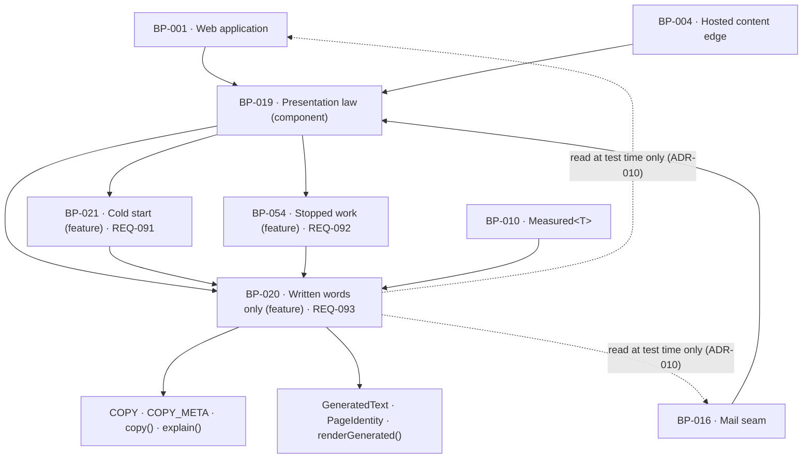

# BP-020 — Written words only, and generated text identified as page content

- Parent: BP-019 (component — presentation law, `src/lib/presentation/`)
- Kind: **feature** — cut straight from REQ-093, a leaf under BP-019.

## Responsibility
Make the product's own voice a closed set of written strings that no model can
enter, and make model-produced text renderable only bound to the page it belongs
to and to whether that page is written or merely proposed.

## Module / boundary
`src/lib/presentation/copy/` holds `COPY`, `COPY_META`, `copy()` and `explain()`.
`src/lib/presentation/generated/` holds the `GeneratedText` wrapper,
`PageIdentity`, `renderGenerated()` and `renderQuestion()`. Both are pure: no
network, no database, no session, no clock. `tests/presentation/copy/**` and
`tests/presentation/generated/**` hold the two conformance suites ADR-010 places
here.

It does **not** own: `renderMeasured()` and `Measured<T>` rendering (BP-019's,
cut from REQ-004); the *content* of the twelve questions' provenance line
(REQ-006's node — this node owns only the admission gate that makes a question's
wording unrenderable without it); the draft-under-review label (REQ-045's, named
as a non-goal by REQ-093); `PLACES` and the one-line arbiter (BP-021's); the
stopped-work statement (BP-054's).

## Diagram


## Public interface
```ts
// ── src/lib/presentation/copy/keys/<partition>.ts ────────────────────────────
/** The sentences and their metadata are written **one partition file per owning
 *  module** — twelve of them: `report.ts`, `overview.ts`, `calendar.ts`,
 *  `draft.ts`, `settings.ts`, `setup.ts`, `publish.ts`, `danger.ts`, `mail.ts`,
 *  `offer.ts`, `bands.ts`, `laws.ts` — each exporting a frozen
 *  `{ key: [string, CopyMeta] }` block for its own module and nothing else.
 *  `offer.ts` (BP-030's and BP-031's price and offer sentences) is the twelfth,
 *  added by the planner under rule 1.1 with its derivation and reversal cost in
 *  WO-041 and confirmed here on 2026-08-31; this comment named eleven until then.
 *  See decision 5: this is what keeps two parallel work orders off one file. */
export const REPORT_COPY: CopyPartition    // and one such export per partition
export type CopyPartition = Readonly<Record<string, readonly [string, CopyMeta]>>

// ── src/lib/presentation/copy/registry.ts ────────────────────────────────────
/** Every sentence the product speaks in its own voice, composed from the closed
 *  partition list. A frozen object literal in the bundle — not a fetch, not a
 *  template store, not an i18n catalogue — so REQ-093 criterion 5 holds with
 *  every model unavailable. This file is written **once**, with every partition
 *  named, and is not appended to block by block. */
export const COPY: Readonly<Record<CopyKey, string>>
export type CopyKey = keyof typeof COPY

/** The parallel, exhaustive metadata map, projected from the same partitions.
 *  `Record<CopyKey, CopyMeta>` is total, so a key added without meta is a
 *  compile error — this is the hook every law in this block is driven off, and
 *  the reason no law has to be remembered. Because both maps are projected from
 *  one partition entry, "a key without meta" is now unrepresentable rather than
 *  merely checked. */
export const COPY_META: Readonly<Record<CopyKey, CopyMeta>>

export interface CopyMeta {
  /** Which cross-cutting law, if any, governs this sentence. The conformance
   *  suites enumerate their own scope from this tag rather than from a list a
   *  developer maintains — so **every arm of this union has at least one key
   *  tagged with it**, or the suite that enumerates from it silently has no
   *  scope (constitution rule 5.5, in code rather than in a generated view).
   *  `next-publish` and `stopped-work` are `laws.ts`'s five and five;
   *  `no-presence-yet` is the `place.*` keys in the surface partitions;
   *  `unmeasured` is `laws.ts`'s three (decision 6). A tag with no member is a
   *  test failure in `tests/presentation/copy/registry.test.ts`, not a comment. */
  law?: 'next-publish' | 'stopped-work' | 'no-presence-yet' | 'unmeasured'
  /** Named text slots and what each accepts. A slot of kind 'measured' may be
   *  filled only through `explain()`; `copy()` refuses such a key. */
  slots: Readonly<Record<string, 'text' | 'date' | 'measured'>>
  /** The requirement clause that fixes what this sentence must say. */
  fixedBy: string           // e.g. "REQ-092 c4"
}

// ── src/lib/presentation/copy/copy.ts ────────────────────────────────────────
/** A sentence carrying no measurement. Signature is BP-019's, verbatim. */
export function copy(key: CopyKey, vars?: Record<string, string | number>): string

/** REQ-093 criterion 4. The only way a number reaches a sentence. Each slot is
 *  a `Measured<T>` — never a raw number — so a value that was estimated,
 *  recomputed for display or produced by a model is not of the argument's type,
 *  and the scan date travels with it. There is no reader, session or persona
 *  parameter, so the words cannot change with who is reading. */
export type ExplainKey = { [K in CopyKey]: HasMeasuredSlot<K> extends true ? K : never }[CopyKey]
export function explain<K extends ExplainKey>(
  key: K,
  slots: { [S in MeasuredSlotOf<K>]: { value: Measured<unknown>; format: (v: never) => string } },
  vars?: Record<string, string>
): {
  text: string
  /** Every scan date behind the values in this sentence. Empty is impossible:
   *  `ExplainKey` has at least one measured slot. */
  measuredAt: readonly Date[]
  /** True when any slot rendered as "—". The sentence still renders. */
  hasUnmeasured: boolean
}

// ── src/lib/presentation/generated/text.ts ───────────────────────────────────
/** Model output, wrapped at the point it is read out of storage. An unwrapped
 *  string is the product's own voice by construction; there is no widening
 *  cast in this module and no `GeneratedText` constructor that takes a literal. */
export interface GeneratedText { readonly source: 'model'; readonly text: string }
export function fromStored(column: GeneratedColumn, value: string): GeneratedText
export type GeneratedColumn =
  | 'drafts.body' | 'drafts.title' | 'drafts.slug' | 'drafts.description'
  | 'opportunities.proposed_title' | 'opportunities.proposed_slug'
  | 'questions.wording'

/** REQ-093 criterion 2. A written page carries all four fields; a proposed page
 *  carries a title and a slug and **has no description arm at all** — the
 *  requirement admits none, so none is representable. */
export type PageIdentity =
  | { state: 'written';  pageId: string;        title: GeneratedText; slug: GeneratedText
      body: GeneratedText; description?: GeneratedText }
  | { state: 'proposed'; opportunityId: string; title: GeneratedText; slug: GeneratedText }

/** The one sink for model text. It cannot be called without the identity of the
 *  page the text belongs to, and it returns the label and the text as one value,
 *  so a caller cannot render the text and drop the label. */
export function renderGenerated(
  field: GeneratedText,
  page: PageIdentity
): { label: string; text: string; proposed: boolean }

/** BP-019's declared helper, unchanged: the label alone, for a caller that
 *  already holds a `renderGenerated` result and needs its label separately. */
export function generatedLabel(a: { pageTitle: string; written: boolean }): { label: string }

// ── src/lib/presentation/generated/question.ts ───────────────────────────────
/** REQ-093 criterion 3. The wording of one of the twelve questions is admitted
 *  only on the condition that the search it was derived from is shown with it —
 *  so this returns an ordered pair the surface renders whole. There is no
 *  function that returns the wording alone. The *content* of `provenance` is
 *  REQ-006 criterion 9's and is built by that requirement's node; this node
 *  owns only that the pair cannot be split. */
export function renderQuestion(q: {
  wording: GeneratedText
  provenance: string          // supplied by REQ-006's node, already rendered
}): readonly [{ role: 'question'; text: string }, { role: 'provenance'; text: string }]
```

## Data model delta
None. This node reads strings out of a frozen literal and out of columns other
nodes own; it stores nothing and adds no migration topic.

## Error & edge behavior
- A missing `CopyKey` is a compile error, not a blank on a screen. `COPY` is a
  literal and `CopyKey` is `keyof typeof COPY`, so an unwritten sentence cannot
  be referenced.
- A `CopyKey` present in `COPY` and absent from `COPY_META` is a compile error:
  `COPY_META` is typed `Record<CopyKey, CopyMeta>`, which is total.
- `copy()` called with a key whose meta declares a `'measured'` slot fails —
  at type level via `ExplainKey`'s complement, and at run time with a thrown
  error naming the key. REQ-093 criterion 4's rule that every value in an
  explanation was read from a stored measurement is thereby a call-site type
  error rather than a review comment.
- `explain()` renders a slot whose `Measured` is `unmeasured` through BP-019's
  `renderMeasured` — as "—", never as 0, never omitted, never substituted. The
  sentence still renders and `hasUnmeasured` is true. REQ-004's trichotomy is
  not re-implemented here.
- `explain()` has no session, reader or persona parameter. Two readers of the
  same account get byte-identical text — REQ-093 criterion 4's last clause is
  made unrepresentable rather than tested for.
- `fromStored()` is the only constructor of `GeneratedText` and takes a
  `GeneratedColumn`. There is no overload accepting a literal, so a hand-written
  sentence cannot be laundered into the generated arm to escape criterion 1, and
  a model string cannot arrive without declaring which column it came from.
- A proposed page has no description: the `proposed` arm of `PageIdentity` has
  no such field, so REQ-093's "a proposed page has no description in the source,
  so criterion 2 admits none" cannot be violated by a caller.
- With every language model unavailable, `COPY` renders unchanged (it is a
  bundle literal) and `renderGenerated` renders whatever `fromStored` read from
  storage. Neither path calls BP-009. This node does not import `src/lib/llm/`
  at all, and the conformance suite asserts that absence.
- Long model text in a surface slot that is not a page body is a defect
  (constitution rule 7.3). `renderGenerated` returns `text` untruncated; the
  decision to truncate belongs to the surface, and the suite asserts that no
  `GeneratedText` reaches a slot whose `PageIdentity` is absent.
- Customer-written text — a brand voice description, an edited draft — is
  neither `COPY` nor `GeneratedText`. It is passed through as the customer's own
  and is named as a non-goal by REQ-093; the suite's allow-list names the columns
  it comes from.

## NFR budget
- Runtime: one property read per `copy()`; `explain()` is O(slots). No
  interpolation engine, no parser, no catalogue load. Zero network, zero I/O.
- Availability: independent of BP-009 and of any vendor. REQ-093 criterion 5
  holds because the registry is data in the bundle.
- Bundle: `COPY` ships whole to every surface. Budget 32 KB uncompressed for the
  registry; past that it is split by surface prefix and the suite is unchanged
  (the enumeration is over keys, not over files).
- Security/authz: none of its own — it holds no customer data. It must never be
  given a session argument, and the suite asserts no export takes one.
- Observability: none. This node logs nothing; a log line here would be a second
  home for a sentence.
- Conformance suite: budget 120 s wall clock for the string-literal sweep plus
  the generated-text flow gate over the surface globs, on CI. The number is this
  node's, not a product pin (see Decisions 3).

## Dependencies on other BP nodes
- **BP-019** (parent component) — `renderMeasured`, and the `src/lib/presentation`
  boundary itself.
- **BP-010** — the `Measured<T>` type, type-only, for `explain()`.
- **Consumers**: BP-001, BP-004 and BP-016 render only through this node.
  BP-021 and BP-054 build every line they emit from a `CopyKey` here.
- **Test-time only** (no import, no cycle): the suite reads the source trees of
  BP-001, BP-004, BP-016 and BP-018. ADR-010 records why that direction is safe.

## Decisions
1. **`COPY_META` is a parallel exhaustive map, not a widened `COPY`** — Status: accepted
   - Context: the three law nodes each need to enumerate their own scope — which
     sentences are next-publish statements, which are cold-start lines. The
     obvious move is to make `COPY` a map of records rather than a map of
     strings.
   - Decision: leave `COPY: Readonly<Record<CopyKey, string>>` exactly as BP-019
     declares it, and add `COPY_META: Readonly<Record<CopyKey, CopyMeta>>`
     beside it. `Record<CopyKey, …>` is total, so the two maps cannot drift: a
     key with no meta does not compile.
   - Alternatives considered: widen `COPY` to `Record<CopyKey, CopyEntry>` —
     rejected, it contradicts an approved parent interface for no gain the
     totality of a `Record` does not already give; a separate tag list per law —
     rejected, three lists a developer must remember to append to is the
     forgettable law this block exists to avoid.
   - Consequences: two literals to keep beside each other, kept honest by the
     compiler. Reversal is mechanical (merge the maps) and cheap.
2. **A number reaches a sentence only as a `Measured<T>`** — Status: accepted
   - Context: REQ-093 criterion 4 requires every value inside an explanation to
     have been read from a stored measurement carrying its scan date. Checked at
     review, this fails the first time someone interpolates a computed
     percentage.
   - Decision: `copy()` refuses keys with measured slots; `explain()` takes
     `Measured<unknown>` per slot and returns the dates it used. A raw `number`
     is not assignable, so the violation is a type error at the call site.
   - Alternatives considered: narrow `copy()`'s `vars` to a branded union —
     rejected, it contradicts BP-019's approved signature and a brand on a
     `string` is assignable back to `string`, so it would not hold; a runtime
     provenance check — rejected, it fires in production where the sentence is
     already on a screen.
   - Consequences: display-only arithmetic must be done by whoever produced the
     `Measured`, not by the sentence. That is the intent. Reversing it re-opens
     the estimate-in-a-sentence path, which is invisible in review.
3. **The 120 s conformance budget is this node's parameter, not a product pin** — Status: accepted
   - Context: rule 1.1 requires the number be chosen and its reversal cost
     recorded. `structure.md` rule 5 sends every number that appears twice to
     `src/lib/config/constants.ts` (BP-005).
   - Decision: 120 s, declared once in `tests/presentation/copy/budget.ts`,
     because it appears in no product code path and a CI budget is not a pinned
     product number; putting it in `constants.ts` would make `tests/pins.test.ts`
     assert a fact about CI hardware.
   - Alternatives considered: a pin in BP-005 — rejected as above; no budget at
     all — rejected, a suite that grows unbounded gets disabled, and a disabled
     suite is exactly how a path-glob law dies.
   - Consequences: if the sweep exceeds it, the fix is to shard by surface glob,
     not to raise the number silently. Reversal cost: one line.
4. The enforcement mechanism these interfaces rest on — path-glob conformance
   suites over the surface tree rather than call-site discipline — spans this
   node, BP-021, BP-054 and the surface trees of BP-001, BP-004 and BP-016, and
   amends BP-019's `## Decisions` entry 1. It is recorded as **ADR-010**, not
   here.

5. **The registry is partitioned per module; `registry.ts` is written once and
   never appended to** — Status: accepted (2026-08-31)
   - Context: as this node stood, `src/lib/presentation/copy/registry.ts` was
     created by one work order and appended to by every later block that owns a
     sentence. Planners across nine blocks reported the same consequence: work
     orders that are otherwise independent all write one file, so they cannot run
     in parallel and every one of them conflicts with every other. That is a
     structural defect, not a scheduling inconvenience.
   - Decision: one partition file per owning module under
     `src/lib/presentation/copy/keys/`, each exporting its own frozen
     `CopyPartition`; `registry.ts` names the closed partition list, spreads it
     into `COPY` and `COPY_META`, and is written **once**, at the time this
     module is created, with every partition present — empty ones included. A
     block then fills only its own file. A *new* partition is one line in
     `registry.ts`, and the work order that adds it is by construction the only
     one touching it.
   - The one-registry law is not weakened. `COPY` is still one frozen object,
     `CopyKey` is still `keyof typeof COPY`, `copy()` still fails at build time
     on a missing key, and the string-literal lint still has one legal source.
     BP-019 decision 1 rejected "per-surface constants files" because they are N
     registries and "where is this sentence written" stops having one answer;
     that objection is to N *registries*, and this is one registry with N
     *sources*, composed at build time in a single file a reader opens to see all
     of them at once.
   - Alternatives considered: **one file with a documented ordering constraint**
     — rejected, an ordering constraint on a file eleven work orders append to is
     a merge conflict with a policy attached, and it serialises the whole copy
     surface behind whichever block is slowest; **a directory the build globs at
     compile time** — rejected, an implicit registry cannot be read, a
     mistyped filename silently contributes nothing, and it defeats the
     exhaustiveness `COPY_META` is built on; **keys declared beside the surfaces
     that render them** — rejected, that is BP-019 decision 1's N registries and
     puts customer-visible strings where the design system's
     no-default-strings rule cannot reach them.
   - Consequences: the partition list is closed at creation, which means a node
     added later touches `registry.ts` once. That is the residual sharing and it
     is bounded to one line by one work order. Pairing each key's string with its
     `CopyMeta` inside the partition entry also makes "a key without meta" — the
     failure decision 1 exists to catch — unrepresentable rather than checked.
   - Cost of reversing: collapse the partitions back into one literal. Low in
     code, and it re-creates the contention this decision removes.

6. **The `unmeasured` law's keys live in `laws.ts`, not in a thirteenth
   partition** — Status: accepted (2026-08-31)
   - Context: `CopyMeta.law` declares four cross-cutting laws and only three had
     any key. `'unmeasured'` had none, so a conformance suite enumerating its
     scope from the tag enumerated nothing and passed — the empty-index failure
     rule 5.5 names, arriving in code. Meanwhile REQ-004 criterion 6 ("one
     written line names which driver was missing") and criterion 9 ("one written
     line states it was not measured because the scan stopped early") are two
     sentences BP-019's `renderMeasured` takes as its `unmeasuredLine: CopyKey`
     argument, and neither key existed anywhere in the corpus — WO-064 and WO-066
     both instruct an implementer to render "REQ-004 criterion 6's key" against
     nothing.
   - Decision: three keys in `src/lib/presentation/copy/keys/laws.ts`, tagged
     `law: 'unmeasured'`, with no slots — `renderMeasured` passes no `vars`, so a
     slot would be unfillable at the only call site that takes these keys:
     - `unmeasured.undeterminable` — `fixedBy: "REQ-004 c6"`, **owner-owed**
     - `unmeasured.not-attempted` — `fixedBy: "REQ-004 c9"`, **owner-owed**
     - `unmeasured.dash` — `fixedBy: "REQ-004 c2"`, value `—`, **not** owner-owed:
       a transcription of the character REQ-004 criteria 2, 3, 6, 9 and 10 write
       themselves, on the same footing as REQ-004 criterion 1's four score-band
       words, and the reason no dash literal appears anywhere in
       `src/lib/presentation/`.
     The two owner-owed sentences are not written here or anywhere in this
     corpus: they are the owner's under constitution §1, they land empty in
     `OWNER_OWED`, and `copy()` throws naming the key until the owner writes them
     (WO-041's representation). This node ships the keys and their meta; it
     invents no sentence.
   - Why `laws.ts` and not a thirteenth partition: `laws.ts` is already defined
     as "the sentences the four cross-cutting laws are made of, which no single
     surface owns", and `unmeasured` is the fourth of exactly those four laws.
     Putting them anywhere else means a reader looking for a cross-cutting law's
     sentences has two places to look, which is what decision 5's per-module rule
     exists to prevent — the module owning these sentences is *the law*, and the
     law's module is `laws.ts`.
   - Alternatives considered: **a thirteenth partition, `measured.ts`** —
     rejected, it costs one import and one spread in `registry.ts`, a file
     decision 5 fixes as written-once by one author, and buys a separation
     between three keys and the twelve beside them that serve the same kind of
     owner (no surface). The reason to pay that price would be a second author
     needing the file in parallel; `laws.ts` has exactly two work orders on it
     (WO-041 seeds it, WO-249 adds these three, and WO-249 depends on WO-041), so
     the contention decision 5 was written against does not arise here.
     **Keys in the surface partitions that render an unmeasured value** —
     rejected outright: it is one law in N places and it makes the tag's
     enumeration a walk over every partition, which is the list-a-developer-
     maintains the tag replaced.
   - Consequences: the `law` union's four arms are all inhabited, so a suite that
     enumerates from the tag has real scope for each. Two owner-owed strings join
     the outstanding set; that is the intended blocking point and it blocks copy,
     not structure.
   - Cost of reversing: move three entries between two partition files, plus one
     import and one spread if the destination is new. Low; no consumer changes,
     because a `CopyKey` does not name its partition.

## Status grounds (rule 3.2)
Self-certified `approved` per rule 3.2. Grounds: cut from REQ-093, which is
`status: approved`; the gate "no blueprint from a non-approved requirement" is
met. `satisfies: [REQ-093]` written at creation. `code:` globs sit inside
BP-019's `src/lib/presentation/**` and `tests/presentation/**` boundary and
overlap no sibling's (`copy/`, `generated/` are this node's alone). No
customer-visible string is invented here: the registry ships keys, and the nine
words that were outstanding when this node was cut were ruled by the owner on
2026-08-31 (BP-019 decision 6); the `rests-on` row above is discharged. The
librarian may refuse retroactively.

## Open questions
