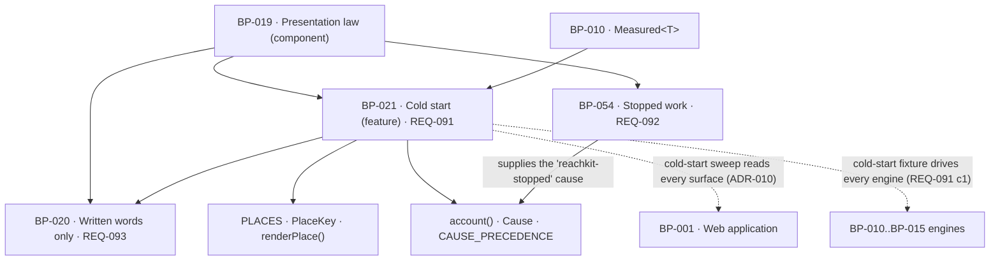

# BP-021 — Cold start: no blanks, no placeholders, no invented fillers

- Parent: BP-019 (component — presentation law, `src/lib/presentation/`)
- Kind: **feature** — cut straight from REQ-091, a leaf under BP-019.

## Responsibility
Make every place a value or a module could sit a named, registered place that
either holds real measurements of this customer's own domain or carries exactly
one written line saying they have no presence yet and what will fill it — and
make a blank, a dash, a placeholder, a hidden module and a borrowed benchmark
each unreachable rather than merely forbidden.

## Module / boundary
`src/lib/presentation/place/` holds `PlaceKey`, `PLACES`, `emptyStateLine()`,
`renderPlace()`, the `Cause` union, `CAUSE_PRECEDENCE` and the `account()`
arbiter. `tests/presentation/place/**` holds the registry's own unit tests.
`tests/presentation/coldstart/**` holds the cold-start conformance suite of
ADR-010 — the fixture domain, the route sweep and the provenance assertion.

The sweep exercises every engine at once and could argue for a top-level
`tests/coldstart/**`. It is placed under `tests/presentation/` instead, because
`structure.md` rule 4 gives `tests/<module>/**` to that module's owner and the
law it asserts is this module's; a top-level test directory owned by a component
that is not the one under test would be a path with a disputable owner, which
rule 2 of the same map forbids.

It does **not** own: whether an absence is a measured zero or unmeasured
(REQ-004, BP-010 and BP-019's `renderMeasured`); what a mail says when a section
is unmeasurable or empty (REQ-064's node — REQ-091's non-goal hands the inbox
away); the wording of any place's line (the owner's, held as `CopyKey`s in
BP-020's registry); the stopped-work statement (BP-054's); how rivals, targets
or questions are derived (BP-011, BP-013).

## Diagram


## Public interface
```ts
// ── src/lib/presentation/place/places.ts ─────────────────────────────────────
/** Every place a value or a module can sit, named `<surface>.<module>.<slot>`
 *  in lowercase-kebab segments. Total over the rendered surface: a place a
 *  screen renders that is not here fails the cold-start sweep by name. */
export type PlaceKey = string & { readonly __place: unique symbol }
export const PLACES: Readonly<Record<PlaceKey, PlaceSpec>>

export interface PlaceSpec {
  /** The one line this place carries when the customer has no presence yet.
   *  It must say both things REQ-091 criterion 2 requires: that they have no
   *  presence yet, and what will fill it. Its words are the owner's. */
  line: CopyKey
  /** What this place holds when it is not empty. `'module'` is a place with no
   *  value position at all — a list with no entries, a chart with no series —
   *  which REQ-091 criterion 2 reaches explicitly. */
  holds: 'value' | 'list' | 'series' | 'module'
  /** Where a sibling requirement already fixes this place's wording, the clause
   *  that fixes it. That fixed line is the place's one line; this node adds no
   *  second. A `fixedBy` place still has to satisfy criterion 2's two things —
   *  asserted, not assumed. */
  fixedBy?: string        // e.g. "REQ-041 c3", "REQ-043 c3"
}

// ── src/lib/presentation/place/render.ts ─────────────────────────────────────
/** BP-019's declared signature, verbatim. The line for a place holding nothing
 *  because the customer has no presence yet. */
export function emptyStateLine(place: PlaceKey): { line: string }

/** The one renderer for a place. A surface asks for a place, not for a value;
 *  the emptiness decision is made here and never at the call site. `value` of
 *  `null`, `[]`, or a `Measured` that is `unmeasured` is not a blank — it is a
 *  cause, and `account()` turns it into exactly one line. */
export type Place<T> =
  | { state: 'filled';    place: PlaceKey; value: T }
  | { state: 'accounted'; place: PlaceKey; line: string; cause: CauseTag }
export function renderPlace<T>(
  place: PlaceKey,
  value: T | readonly [] | null,
  causes?: readonly Cause[]
): Place<T>

// ── src/lib/presentation/place/account.ts ────────────────────────────────────
/** The closed set of reasons a place holds nothing. Adding a cause is an edit to
 *  this file, which is where the precedence lives — so a new cause cannot be
 *  added without meeting the ordering (ADR-011). Arms that carry a `line` are
 *  produced by another node and handed in, which is what keeps this module free
 *  of a dependency on BP-054 and the graph acyclic. */
export type Cause =
  | { tag: 'reachkit-stopped';    line: string }   // BP-054's stoppedWorkStatement
  | { tag: 'customer-instruction'; line: string }  // REQ-047 c5, via REQ-043 c5's node
  | { tag: 'named';               line: string }   // any cause a requirement names, REQ-043 c4
  | { tag: 'unrecognised' }                        // a cause no requirement names
  | { tag: 'supply-exhausted' }                    // REQ-043 c3, and only ever this
  | { tag: 'no-presence-yet' }                     // REQ-091 c2, the baseline account
export type CauseTag = Cause['tag']

export const CAUSE_PRECEDENCE: readonly CauseTag[] = [
  'reachkit-stopped', 'customer-instruction', 'named',
  'unrecognised', 'supply-exhausted', 'no-presence-yet',
] as const

/** Total over `Cause`. Returns exactly one line for a place holding nothing —
 *  REQ-091 criterion 2's "exactly one written line" and REQ-043 criterion 5's
 *  "exactly one account of itself" are the same function call. Ordering and the
 *  stopped-work invariant are ADR-011's. */
export function account(
  place: PlaceKey,
  causes: readonly Cause[]
): { line: string; cause: CauseTag }
```

## Data model delta
None. This node stores nothing and adds no migration topic. The cold-start
fixture in `tests/presentation/coldstart/**` seeds through BP-002's existing tables and owns
no schema of its own.

## Error & edge behavior
- `renderPlace` with `null`, `[]`, or an `unmeasured` `Measured` returns the
  `accounted` arm. There is no arm producing a blank, a bare dash outside
  `renderMeasured`'s trichotomy, an ellipsis, an em-dash placeholder, a spinner,
  or `undefined`. REQ-091 criterion 2's forbidden renderings are not tested for;
  they are absent from the return type.
- No `renderPlace` result carries `state: 'hidden'`. A module holding nothing
  stays on the screen carrying its line — REQ-091's non-goal forbids removing,
  hiding or deferring it, so the type has no way to say so.
- A place whose `holds` is `'module'` has no value position at all and always
  resolves to the `accounted` arm until it has entries or a series. A list with
  no entries and a chart with no series are therefore accounted, not empty.
- `account()` never returns the `supply-exhausted` line for an `unrecognised`
  cause. The two are distinct arms and `unrecognised` outranks
  `supply-exhausted` in `CAUSE_PRECEDENCE`, so REQ-043 criterion 3's "no date
  emptied by any other cause, whether or not a requirement names that cause,
  ever carries that line" holds by construction and does not depend on the
  caller classifying correctly.
- `account()` with an empty `causes` array returns the `no-presence-yet` line.
  There is no path returning nothing: the last element of `CAUSE_PRECEDENCE` is
  always available, and every `PlaceSpec` carries a `line`.
- `PLACES` is typed `Record<PlaceKey, PlaceSpec>` over a `PlaceKey` union
  generated from the registry's own literal, so a spec-less place does not
  compile and a `PlaceKey` cannot be constructed from an arbitrary string.
- A place with `fixedBy` still has its line asserted against REQ-091 criterion
  2's two obligations in `tests/presentation/place/**`. REQ-091's non-goal is
  explicit that "a fixed line that names no presence and no filler fails
  criterion 2 rather than escaping it".
- REQ-091 criterion 3 — no estimate, benchmark, cohort or category average
  standing where the customer's own measurement would sit, and no manufactured
  rival, target, question or opportunity — is enforced by the cold-start sweep's
  provenance assertion: for the fixture domain, every rendered numeric value
  must trace to a `Measured` whose domain is the fixture's and whose `at` is the
  fixture scan's date. A cohort average has no such provenance and fails by
  origin, not by looking wrong.
- REQ-091 criterion 1 — every derivation runs to completion for a domain that
  ranks for nothing — is asserted by running the whole pipeline against the
  fixture and requiring every stage to return, including stages that legitimately
  return empty (REQ-029 c4, REQ-047 c3). A stage that throws, blocks or is
  skipped for want of prior presence fails the suite by stage name. This node
  owns the fixture and the assertion; the engines own passing it.
- A cold start is never accounted for as a measurement that could not be taken.
  `no-presence-yet` is a `Cause`, not a `Measured` reason, and the two vocabularies
  do not intersect — REQ-091 criterion 2's last sentence and REQ-004 criterion 8
  are the same separation, made at the type level.

## NFR budget
- Runtime: `renderPlace` and `account` are O(|causes|) over a six-member union
  with no allocation beyond the returned object. `PLACES` is a frozen literal.
- Authz: none of its own; it renders what it is handed and reads no session.
- Observability: none in production. The cold-start sweep emits a per-place
  report naming every place it exercised and every place it found rendered but
  unregistered — the coverage statement rule 5.5 requires of anything that can
  be silent by omission.
- Cold-start sweep budget: 180 s wall clock on CI for the full route sweep plus
  the pipeline run against the fixture, with vendor and model seams stubbed. The
  number is this node's parameter (Decisions 3), not a product pin.
- Volume: `PLACES` is expected in the low hundreds of entries at v1. It is a
  literal; there is no lookup cost worth budgeting.

## Dependencies on other BP nodes
- **BP-020** — every line is a `CopyKey`; `COPY_META`'s `law: 'no-presence-yet'`
  tag is how this node enumerates its own sentences.
- **BP-019** (parent) — `renderMeasured` for the `filled` arm's values.
- **BP-010** — `Measured<T>`, type-only.
- **BP-054** hands this node the `reachkit-stopped` cause. The dependency runs
  one way only: BP-054 imports `Cause` from here, and this node imports nothing
  from BP-054. That is why the arm carries a rendered `line` rather than a
  `WorkStop`.
- **Consumers**: BP-001 and BP-004 render every module through `renderPlace`.
- **Test-time only** (no import, no cycle): the sweep drives BP-010 to BP-015
  and reads BP-001's and BP-004's route trees. ADR-010 records why.

## Decisions
1. **The arbiter is one total function over a closed `Cause` union, owned here** — Status: accepted
   - Context: REQ-091 criterion 2 demands exactly one line per empty place;
     REQ-043 criterion 5 demands exactly one account per empty date; REQ-092
     criterion 7 demands ReachKit's stop outrank other reasons. Three
     requirements, three nodes, one slot on the screen.
   - Decision: one `account()` in this node, total over a closed union, with an
     explicit precedence constant. Every node with a cause registers an arm here.
   - Alternatives considered: each node writes its own line and the surface picks
     — rejected, that is two accounts on one date the first time two causes are
     true at once, which REQ-043 criterion 5 forbids and nobody would notice;
     an open extension registry — rejected, an open set cannot be ordered
     totally, and the ordering is the whole property.
   - Consequences: adding a cause is an edit to this file, which is deliberate —
     the edit puts the author in front of the precedence. Reversal means
     distributing the ordering, which is the failure mode.
   - The ordering itself and its stopped-work invariant span this node, BP-054,
     REQ-040's node and REQ-043's node, and are recorded as **ADR-011**.
2. **A surface asks for a place, not for a value** — Status: accepted
   - Context: REQ-091 criterion 2 binds "screens added later". A rule stated as
     "remember to render an empty state" is forgotten by the first hurried screen.
   - Decision: `renderPlace(place, value)` is the only sanctioned way a value or
     a module reaches a surface, and its return type has no blank arm. The
     emptiness decision is made inside this module, once.
   - Alternatives considered: type-level enforcement by making BP-018's
     components accept `Place<T>` instead of raw props — rejected, `src/ui/`
     would then import from `src/lib/presentation/` while BP-019 already depends
     on BP-018, which is the dependency cycle `structure.md` rule 6 calls a build
     failure; per-surface empty-state components — rejected, N implementations of
     one capability (rule 7.1).
   - Consequences: enforcement is the conformance sweep of ADR-010 rather than
     the compiler. That is weaker and is stated plainly rather than assumed away.
3. **The cold-start fixture is one domain, and the 180 s sweep budget is this
   node's** — Status: accepted
   - Context: rule 1.1 — choose the parameter, record the derivation and the
     reversal cost. REQ-091's customer is "a founder whose site ranks for
     nothing", which is one shape, not a matrix.
   - Decision: one fixture domain that resolves in DNS, serves a readable home
     document, ranks for nothing and is cited in no AI answer — the exact shape
     REQ-091's user story names — plus one degenerate variant whose home document
     could not be read, to keep the `no-presence-yet` and `unmeasured` accounts
     visibly distinct. Sweep budget 180 s, declared in
     `tests/presentation/coldstart/budget.ts`.
   - Alternatives considered: a matrix of cold-start shapes — rejected, the
     variants that matter are REQ-004's trichotomy, which is BP-019's to test;
     no budget — rejected, an unbounded sweep gets disabled and a disabled sweep
     is how this law dies.
   - Consequences: a cold-start shape outside those two is not exercised. Adding
     one is a fixture file, not a redesign. Reversal cost: low.

## Status grounds (rule 3.2)
Self-certified `approved` per rule 3.2. Grounds: cut from REQ-091, which is
`status: approved`; the gate "no blueprint from a non-approved requirement" is
met. `satisfies: [REQ-091]` written at creation. `code:` globs sit inside
BP-019's boundary (`src/lib/presentation/place/**`, `tests/presentation/place/**`)
all three inside `tests/presentation/` and `src/lib/presentation/`. No sibling
claims any of the three. No
customer-visible string is invented here: every line is a `CopyKey` whose value
is the owner's.

## Open questions
