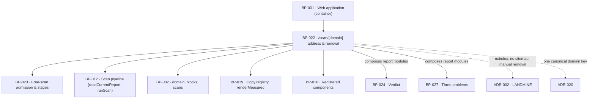

# BP-022 — `/scan/{domain}` — the one public address, what loads there, and removal

- Parent: BP-001
- Kind: **feature** — cut from REQ-001 and REQ-002; the leaf that owns the landing
  field, the report address, and everything that decides what loads there.

## Responsibility
Turn one submitted value into the single canonical report address for a domain,
resolve every visit to that address into exactly one of a closed set of readable
states — never a blank page, a 404 or an unhandled error — and honour a removal
record by serving the removal line and its address to everyone and starting a
scan for no one.

## Module / boundary
Inside BP-001's `src/app/(public)/**` and `src/app/api/**`. This node owns the
landing page, the report route, the private `_address/` folder holding the state
resolver and the state→view mapping, and the two API adapters the free path
needs. It owns **no** report module: the verdict strip (BP-024), the three
problem cards and the DIY sections (BP-027), the AI-answers and Google-presence
cards, the correction control, the free-page card and the pricing card are
sibling nodes' — this node owns the shell that decides whether a body renders at
all, and the order the modules sit in (`BUILD.md` §4.1).

It holds no engine logic (`structure.md` rule 1): the resolver composes calls to
BP-023, BP-012 and BP-002 and branches on their results.

## Diagram


## Public interface

```
Routes
  GET  /                                    landing: one text input, one submit, nothing else
  GET  /scan/{domain}                       the one public report address
  POST /api/scan                            { value: string } — start, or name what is wrong
  GET  /api/scan/{scanId}/progress          SSE; the stream is BP-023's `progress()`
```

```ts
// src/app/(public)/scan/[domain]/_address/resolve.ts
// Exactly one arm. REQ-001 criterion 5's "never a blank page, a 404 or an
// unhandled error" is discharged by the union being closed and total.
export type AddressState =
  | { kind: 'malformed';  problem: DomainProblem }                       // REQ-001 c4
  | { kind: 'removed' }                                                  // REQ-002 c3, REQ-001 c18
  | { kind: 'scanning';   scanId: string }                               // REQ-001 c9, REQ-003 c1/c7
  | { kind: 'starting';   startOnFirstFrame: true }                      // REQ-001 c9 + BUILD §3
  | { kind: 'refused';    refusal: Refusal }                             // REQ-003 c12, no stored report
  | { kind: 'cooldown';   failedAt: Date }                               // REQ-001 c16, no stored report
  | { kind: 'report'
      report: StoredReport                                               // REQ-001 c11/c12
      control: AddressControl                                            // exactly one, or none
      notice: AddressNotice | null }                                     // at most one written line

/** REQ-001 criterion 16: "exactly one control that starts a new measurement is
 *  offered beside it … never a second control alongside it." A sum type, so two
 *  controls on one report is unrepresentable rather than tested for. */
export type AddressControl =
  | { kind: 'none' }
  | { kind: 'rescan';           because: 'incomplete' | 'age' }          // REQ-001 c14 / c15
  | { kind: 'retry' }                                                    // REQ-001 c16
  | { kind: 'correction_retry' }                                         // REQ-094 c7 — that node's arm

/** At most one line beside the report. REQ-094 c7 forbids a second line beside
 *  REQ-001 c16's, so this is a sum too. */
export type AddressNotice =
  | { kind: 'incomplete';  unmeasured: readonly UnmeasuredPart[] }       // REQ-001 c14
  | { kind: 'measurement_failed'; failedAt: Date }                       // REQ-001 c16
  | { kind: 'refused';     refusal: Refusal }                            // REQ-003 c12, stored report

export function resolveAddress(a: {
  rawDomain: string
  network: NetworkKey                    // BP-023
}): Promise<AddressState>

// src/app/(public)/scan/[domain]/_address/canonical.ts — routing only
/** 308s any non-canonical written form of a domain to the one address for it
 *  (REQ-001 c2). The parse itself is BP-023's `parseDomain`; this is the
 *  redirect policy that keeps one address per domain. */
export function canonicalRedirect(rawSegment: string): { redirectTo: string } | null

// src/app/api/scan/route.ts
export type StartScanResponse =
  | { ok: true;  location: string; scanId: string }
  | { ok: false; problem: DomainProblem }                                // REQ-001 c3, HTTP 422
```

## Data model delta
None of its own. This node **reads**:

- `scans` via BP-012's `readCurrentReport(domain)` and BP-023's admission —
  never with its own SQL, and never through an anon client: the public report is
  served by `dbAdmin()` from the server (BP-002), because `scans` carries
  `cost_cents` and the raw report blob.
- `domain_blocks` via BP-023's admission — the `removed` arm of `Admission` is
  the only way this node learns a domain is removed.

It writes nothing. In particular it holds **no** insert into `domain_blocks`:
REQ-002 criterion 4 ("never at ReachKit's own initiative") and REQ-002's
no-self-service non-goal are enforced by the absence of a writer anywhere in the
product, not by a permission check. The migration owning that table is BP-002's
(`supabase/migrations/*_domainblocks*.sql`); this node adds no migration.

## Error & edge behavior

**Resolution order.** Fixed here, exhaustive, evaluated top to bottom. It is not
the admission order (that is BP-012's, restated by nobody): admission answers
*may a scan start*, this answers *what loads*.

| # | Condition | State | Grounds |
|---|---|---|---|
| 1 | the address segment does not parse (`parseDomain` fails) | `malformed` | REQ-001 c4 |
| 2 | the segment parses but is not the canonical form | 308 to the canonical address | REQ-001 c2 |
| 3 | a `domain_blocks` row exists for the domain | `removed` | REQ-002 c3, REQ-001 c18 |
| 4 | a scan of this domain is running | `scanning` | REQ-001 c9, REQ-003 c7 |
| 5 | a current stored report exists | `report` (+ control, + notice) | REQ-001 c12 |
| 6 | a scan of this domain failed producing no report < 24 h ago | `cooldown` | REQ-001 c16 |
| 7 | admission refuses | `refused` | REQ-003 c12 |
| 8 | otherwise | `starting` | REQ-001 c9 |

Row 3 is above every other row for ADR-002's reason and REQ-002 criterion 3's:
a removed domain is shown to nobody and scanned for nobody, and no cooldown,
limit or stored report may override that. Row 5 is above row 6 and row 7 because
both REQ-001 criterion 16 and REQ-003 criterion 12 say the stored report stays
readable *and* carries the line beside it — so the failure and the refusal are
`notice`s on a `report`, not states of their own, whenever a report exists.

**The control, derived once (REQ-001 c13–c16).** Evaluated in this order, first
match wins, so exactly one control is ever produced:

| # | Condition on the stored report | Control |
|---|---|---|
| 1 | a correction of this report ran and produced no report, and its one retry is unspent | `correction_retry` (REQ-094 c7 — that node owns its behaviour; this node reserves the arm and renders no second control beside it) |
| 2 | a measurement of this domain failed producing no report < 24 h ago | `retry` |
| 3 | age ≥ `FREE_RESCAN_WINDOW_D` | `rescan{ because: 'age' }` |
| 4 | incomplete, and this scan was not itself started from an incomplete report's offer (`scans.from_incomplete_rescan` false) | `rescan{ because: 'incomplete' }` |
| 5 | otherwise | `none` |

Row 4's second clause is REQ-001 criterion 14's "made once and does not chain",
read as a fact about the scan rather than as a re-derivation from a predecessor
that may itself have been superseded. BP-023 sets the column.

**Everything else.**
- The `starting` arm renders the progress shell and the client posts
  `/api/scan` on first frame — never during server render (`BUILD.md` §3, BP-001's
  NFR). The post is idempotent on the canonical domain, so a double mount, a
  refresh mid-scan and two tabs all join the one running scan rather than
  starting a second (REQ-003 c7's same-domain arm).
- Nothing is asked between the domain and the report: no route in this node
  reads a session, sets a cookie, or renders a gate (REQ-001 c6, c10). The
  report link carries no token and no expiry, and is not bound to the visitor who
  first opened it (REQ-001 c11).
- Every response from `/scan/{domain}` — report, removal line, malformed line,
  refusal, cooldown, progress — carries `noindex` as both a meta tag and an
  `X-Robots-Tag` header, and no sitemap the product publishes names a report
  address (REQ-001 c8). ADR-002 is why; do not remove it without reading that
  file.
- A malformed submission on the landing page responds 422 with `problem`; the
  form re-renders in place with the value intact and one written line from the
  copy registry (REQ-001 c3). Without JavaScript the same POST responds 303 to
  the canonical address on success and re-renders the landing with the line on
  failure — the promise holds without a client runtime.
- A well-formed domain that does not resolve is accepted here and fails in the
  scan (REQ-001 c3, second sentence). This node never calls `resolvesInDns`.
- Every written line is a `CopyKey` resolved through BP-019. This node contains
  no string literal a person reads (REQ-093 c1), including the removal address,
  which is one key in the registry and is composed nowhere.
- A `removed` address serves its line with HTTP 200, not 404 or 410: REQ-001
  criterion 5 forbids a 404 at a report address, and the line is the readable
  thing REQ-002 criterion 3 requires. (BP-004's 410 policy is for unpublished
  customer pages and does not reach here.)

## NFR budget
- Time to first byte on the `report` arm: BP-001's ≤ 400 ms p95 stands; this
  node's contribution is at most three indexed reads — the `domain_blocks`
  lookup, the `scans` partial-index lookup for `is_current`, and BP-023's
  admission — and no vendor call on any render path.
- The resolver is pure given those three reads: no measurement, no LLM call, no
  outbound fetch during server render.
- Authorisation: none, deliberately and structurally. Every path in this node is
  in `src/middleware.ts`'s public allow-list (BP-001) and reads through
  `dbAdmin()` server-side only.
- Observability: one structured line per resolution carrying route id, the
  `AddressState.kind`, the `AddressControl.kind`, the domain and, where one
  exists, the scan id. Never a payload, never an IP — the network key is already
  hashed by BP-023.
- Volume: the report read is the hottest path in the product (every share of
  every link). It is cacheable per canonical domain only where no control or
  notice depends on the visitor; because `refused` and `scanning` do, the render
  is not shared across visitors and no CDN cache is set on `/scan/{domain}`.

## Decisions

1. **The address resolves through one closed union, and the control is a sum
   type** — Status: accepted
   - Context: REQ-001 criterion 5 promises a report address never ends in a blank
     page, a 404 or an unhandled error; criterion 16 promises exactly one control
     that starts a new measurement, "never a second control alongside it"; REQ-094
     criterion 7 adds a fourth possible control and forbids a second written line
     beside criterion 16's. Eight conditions × four controls × three notices is a
     space no review can check by reading.
   - Decision: `AddressState`, `AddressControl` and `AddressNotice` are closed
     unions with first-match derivation tables above; the renderer is a total
     switch, and the compiler refuses a new condition that nobody mapped.
   - Alternatives considered: a flags-and-booleans view model (`hasReport`,
     `canRescan`, `canRetry`, `isRemoved`) — rejected, it is exactly the shape in
     which two controls render at once and nobody notices; per-condition early
     returns in the page component — rejected, the order becomes implicit in
     control flow and REQ-002 criterion 3's precedence stops being visible.
   - Consequences: adding REQ-094's correction control is one arm and one row,
     added by that node without touching this node's other arms. Reversing means
     re-deriving eight conditions in a component, which is the state this
     decision exists to prevent.

2. **Removal precedes everything the address could otherwise show** — Status: accepted
   - Context: rows 3 to 8 of the resolution table are all reachable for the same
     domain at the same moment: a removed domain can also be in failure cooldown,
     can also hold a stored report, and its visitor can also have met an hourly
     limit.
   - Decision: `domain_blocks` is row 3, above the stored report and above every
     limit, mirroring BP-012's admission order for the same reason.
   - Alternatives considered: check limits first so the visitor learns the
     cheapest fact first — rejected, it tells a domain's owner "try again in an
     hour" about a report that will never be served again, which is the harm
     REQ-002 criterion 3 exists to prevent; hide only the report and still allow
     a scan — rejected, criterion 3 says "starts no scan for anyone".
   - Consequences: a removal is total and immediate at read time, with no cache
     to invalidate. Reversing it would make the removal promise conditional on
     which other state a domain happened to be in.

3. **`/api/scan` responds with a location, and the client navigates; it never
   renders a report** — Status: accepted
   - Context: REQ-001 criterion 2 requires every written form of a domain to end
     at one address. If the POST rendered a report inline, the address bar would
     hold `/` and criterion 7's copy-link promise would have nothing to copy.
   - Decision: the API is a canonicaliser and a starter. Its success response is
     the canonical location; the report is only ever served by `GET
     /scan/{domain}`.
   - Alternatives considered: a server action that renders the report in place —
     rejected for the reason above and because it would put a second render path
     on the report, which is a second copy of the resolution table.
   - Consequences: one extra navigation on the landing path, and one render path
     for reports everywhere in the product.

4. **The canonical domain key spans this node, BP-023, BP-002 and BP-017** and is
   recorded as **ADR-020**, not here (rule 2.2's file test). The `noindex`
   policy, the absent sitemap and v1's unauthenticated manual removal are
   **ADR-002**'s; this node implements them and restates none of their reasoning.

## Status grounds (rule 3.2)
Self-certified `approved`. Grounds: cut on `/expand-requirement` from REQ-001 and
REQ-002, both `status: approved`, so the gate "no blueprint from a non-approved
requirement" is met. Both requirements hand this node their exhaustive-mapping
non-goals explicitly — REQ-001's last non-goal ("the exhaustive mapping of every
state a report address can be in … the blueprint's") and REQ-003's ordering
non-goal — and the resolution and control tables above are that mapping. Every
customer-visible string is a `CopyKey`; none is invented here. The librarian
audits.

## Open questions
