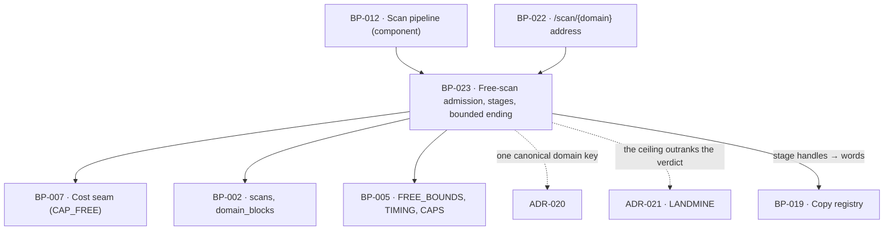

# BP-023 — Free-scan admission, named stages, and the bounded ending

- Parent: BP-012
- Kind: **feature** — cut from REQ-003; the leaf that decides whether a free scan
  may start, what the waiting visitor is told while it runs, and how it ends.

## Responsibility
Admit or refuse a free scan against the free path's five bounds in one fixed
order, name every stage the running scan advances through, and end every free
scan at a bounded moment — a report inside the ceilings, or a written refusal, or
a written failure — with nothing left running and nothing left unsaid.

## Module / boundary
Inside BP-012's `src/lib/scan/`, as four named files: `domain.ts` (the one
canonical domain parser, ADR-020), `admission.ts` (the fixed order, the refusals
and the slot claim), `stages.ts` (the stage handles and the progress stream) and
`ceilings.ts` (the 60-second target, the 90-second hard stop, and the wiring of
BP-007's spend cap into a bounded ending). It renders nothing and speaks no
sentence: every refusal and every stage leaves this node as a handle, and BP-019
turns it into words.

Two criteria of REQ-003 are discharged outside this node and are named here so
neither goes missing: criterion 3 (the report replacing the progress view without
a reload) is BP-022's client behaviour over this node's stream, and criterion 10
(lead capture failing closed) is BP-016's, on the submission path REQ-010 owns.
This node states the asymmetry — limiter fails open, lead capture fails closed —
and owns only the open side.

## Diagram


## Public interface

```ts
// ── src/lib/scan/domain.ts — ADR-020 ───────────────────────────────────────
/** The product's one domain key. Produced only by `parseDomain`; every
 *  domain-keyed row, URL segment, cache key and counter uses this value. */
export type CanonicalDomain = string & { readonly __canonicalDomain: unique symbol }

export type DomainProblem =
  | 'empty' | 'not_a_hostname' | 'ip_literal' | 'no_public_suffix' | 'too_long'

export type DomainParse =
  | { ok: true;  domain: CanonicalDomain }
  | { ok: false; problem: DomainProblem }

/** Accepts every written form REQ-001 criterion 2 names — scheme or none, `www`
 *  or none, trailing path, any letter case, trailing dot, IDN — and returns one
 *  value for all of them. Does not resolve DNS and does not fetch. */
export function parseDomain(raw: string): DomainParse

// ── src/lib/scan/admission.ts ──────────────────────────────────────────────
/** Opaque, salted, non-reversible. REQ-003 counts by network; no raw address is
 *  stored or logged anywhere in the product. */
export type NetworkKey = string & { readonly __networkKey: unique symbol }
export function networkKeyOf(forwardedFor: string | null): NetworkKey

/** Verbatim BP-012's declared union — the refusal reasons and their fields are
 *  that node's contract and are not restated differently here. */
export type Admission =
  | { admit: true }
  | { refuse: 'hourly';       retryAfterSeconds: number }
  | { refuse: 'in_flight';    sameDomain: boolean; runningScanId?: string }
  | { refuse: 'daily';        retryAfterSeconds: number }
  | { refuse: 'switched_off' }
  | { refuse: 'cooldown';     retryAfterSeconds: number }
  | { refuse: 'removed' }

/** Idempotent and free of side effects: BP-022 calls it on every render of a
 *  report address, and a render must never consume an allowance. */
export function admitFreeScan(a: {
  domain: CanonicalDomain; network: NetworkKey
}): Promise<Admission>

/** The consuming form. One transaction: re-evaluates the same order, inserts the
 *  `scans` row that *is* the in-flight record, and returns its id — so two
 *  simultaneous submissions cannot both pass. */
export function claimFreeScanSlot(a: {
  domain: CanonicalDomain; network: NetworkKey
  fromIncompleteRescan: boolean          // REQ-001 c14's once-only bound
}): Promise<{ claimed: true; scanId: string } | { claimed: false; refusal: Admission }>

// ── src/lib/scan/stages.ts ─────────────────────────────────────────────────
/** Internal handles. Every word a visitor reads is BP-019's (REQ-093 c1). */
export type StageName =
  | 'reading_your_site'        // own fetches: home + detected pricing page
  | 'reading_access_rules'     // robots.txt and the home document's reader rules
  | 'reading_your_market'      // profile + keyword_suggestions → market set + the 12 questions
  | 'checking_your_presence'   // ranked_keywords@50
  | 'asking_the_twelve'        // 12 live organic SERPs, with their AI overviews
  | 'scoring'                  // drivers, score, band, problems, first page
export const STAGES: readonly StageName[]      // exactly the six above, in order

export type StageEvent =
  | { stage: StageName; done: boolean }
  | { heartbeat: true }                                   // ≥ every 30 s
  | { ending: Ending }                                    // terminal; the stream then closes
export function progress(scanId: string): AsyncIterable<StageEvent>

// ── src/lib/scan/ceilings.ts ───────────────────────────────────────────────
/** REQ-003's "bounded moment", made total. A free scan reaches exactly one. */
export type Ending =
  | { kind: 'report'; complete: true;  stoppedReason: 'complete' }
  | { kind: 'report'; complete: false; stoppedReason: 'time_ceiling' | 'spend_ceiling' }
  | { kind: 'no_report'; stoppedReason: 'failed' }

/** The deadline every stage and every multi-call step re-checks, exactly as
 *  BP-007's `capHit()` is re-checked between calls. */
export interface Bounds {
  expired(): boolean                 // now ≥ startedAt + TIMING.reportCeilingS
  remainingMs(): number
  capHit(): boolean                  // delegates to the CostContext, CAP_FREE
  stopNow(): 'time_ceiling' | 'spend_ceiling' | null
}
export function withFreeBounds<T>(
  a: { scanId: string; startedAt: Date },
  body: (b: Bounds) => Promise<T>
): Promise<{ result: T | null; ending: Ending }>
```

## Data model delta
One migration, `supabase/migrations/*_scans_freepath*.sql`, adding to `scans`
(the table is BP-012's; the baseline and the `is_current` /
`supersedes_scan_id` / `correction_state` / `stopped_reason` columns are already
declared there and are not restated):

| Column | Type | Why |
|---|---|---|
| `network_hash` | `text null` | the counter REQ-003 criteria 6 and 7 are evaluated over; null for paid tiers. Indexed `(network_hash, created_at desc)` |
| `finished_at` | `timestamptz null` | REQ-003 criterion 2's p95 is a claim about elapsed time; without an end stamp it cannot be checked from data |
| `from_incomplete_rescan` | `boolean not null default false` | REQ-001 criterion 14's "made once and does not chain", set at claim time and read by BP-022 |

`scans.status` gains `failed` alongside `running / done / degraded`. A `failed`
scan never becomes `is_current`, so REQ-001 criterion 17's "leaves the previous
report and its date unchanged" holds by the partial unique index BP-012 already
owns rather than by application logic.

**No new table.** The three bounds are counted from `scans` rows: in-flight is
`status = 'running' and network_hash = k`; hourly is a count over
`created_at > now() - HOURLY_WINDOW_H`; daily is the same count without the
network predicate over `DAILY_WINDOW_H`. `BUILD.md` §10 sets the bar for a new
table at "a rendered surface that reads it", and a rate-limit table has none.

## Error & edge behavior

**The admission order is BP-012's and is evaluated here** — removed → cooldown →
switched off / daily ceiling → in-flight → hourly. It is not re-derived in this
node; the reasoning lives in BP-012's `## Decisions` (rule 2.4). What this node
adds is what each step reads and what it returns:

| Step | Read | Refusal | Time promised |
|---|---|---|---|
| removed | `domain_blocks` by canonical domain | `removed` | none — REQ-002 c3 promises no return |
| cooldown | latest `failed` scan of this domain | `cooldown` | `FAILURE_COOLDOWN_H` less elapsed |
| switched off | `env.KILL_SWITCH` | `switched_off` | none — REQ-003 c8 forbids promising one |
| daily | count over `DAILY_WINDOW_H` vs `FREE_BOUNDS.scansPerDay` | `daily` | until the 200th-newest scan ages out |
| in-flight | `running` scan for this network | `in_flight` + `sameDomain` | none; the visitor is returned to it or refused |
| hourly | count for this network over `HOURLY_WINDOW_H` | `hourly` | until the 5th-newest ages out |

- Every `retryAfterSeconds` is an **elapsed duration**, never a clock time:
  REQ-003's third assumption is confirmed — a free visitor has no account and so
  no timezone we may name a time in.
- `in_flight` with `sameDomain: true` is not a refusal the visitor reads; BP-022
  returns them to the running scan (REQ-003 c7). With `sameDomain: false` they
  are refused in writing and are never shown a scan or report of a domain they
  did not ask for.
- **The limiter fails open** (REQ-003 c9): any error reading the counts returns
  `{ admit: true }`, and the failure is logged as such. The one exception is the
  `removed` step — a `domain_blocks` read that errors refuses, because failing
  open there would serve a removed report, which REQ-002 criterion 3 forbids
  absolutely and REQ-003 criterion 9's promise (a scan proceeds) does not reach.
- A market correction consumes nothing: it runs inside the scan it corrects
  (REQ-003 c6, c11 and REQ-094 c3), so it never calls `claimFreeScanSlot` and
  opens no second cost context. That seam is BP-012's and REQ-094's node's; this
  node only guarantees the claim is the single consumption point.

**Stages.** The six handles are one per dataset boundary of `BUILD.md` §6.3's
free-scan list, so a stage advances exactly when a unit of measurable work
finishes (REQ-003 c1) rather than on a timer. `STAGES` is exhaustive and ordered;
the stream emits `{stage, done:false}` on entry and `{stage, done:true}` on exit,
a `heartbeat` at least every 30 s so a slow third-party server never reads as a
stuck page, and exactly one `ending` before closing. A stage the ceilings cut off
emits no `done:true` and its outputs are recorded `unmeasured / not_attempted`
(REQ-004 c9) — never 0, and never simply absent.

**The bounded ending.** `withFreeBounds` guarantees exactly one `Ending`:
- `stopNow()` is re-checked between stages and between calls inside any
  multi-call stage, the same discipline BP-007 states for `capHit()`.
- At `TIMING.reportCeilingS` (90 s) measuring stops and everything outstanding is
  `not_attempted`; the report of what was measured is stored. No visitor waits
  past 90 s (REQ-003 c5) — including when the delay is the scanned domain's own
  server, because BP-006's per-fetch timeout is bounded well inside the deadline
  and the deadline is checked regardless of what is blocking.
- At `CAP_FREE` the same happens for money. The ceiling is never exceeded to
  finish outstanding work, **including work a driver of the score depends on**
  (REQ-003 c11). Why that must stand, and why computing a partial score instead
  looks like a fix and is not, is **ADR-021** — read it before "improving" this.
- `no_report` is reached only when every driver ended `unmeasured` with reason
  `undeterminable` and no ceiling was reached: we attempted everything and could
  determine nothing. A ceiling always produces a report, however little it holds
  (REQ-003 c11's "never an error, a hang, or a refusal").
- A refused scan produces no `scans` row at all, so it "produces no report of its
  own" (REQ-003 c6) and cannot become anyone's current report.

## NFR budget
- Free scan: p95 ≤ `TIMING.reportTargetS` (60 s) start-to-readable-report over
  any 100 consecutive free scans of reachable domains; hard stop at 90 s; ≤
  `CAPS.FREE_C` (12¢) ledgered, against `BUILD.md` §6.3's expected ~6.3¢, so the
  cap is headroom rather than the operating point.
- `admitFreeScan` is on the render path of every report address: two indexed
  counts and two point lookups, budget ≤ 15 ms p95, and it opens no transaction.
- `claimFreeScanSlot` is one serialisable transaction; concurrent claims from one
  network resolve to one `running` row by the in-flight predicate, not by a lock
  the application holds.
- Observability: one line per admission carrying the decision, the step that
  produced it, the network key (hashed) and the domain; one line per stage
  transition; one line per ending carrying `stoppedReason`, elapsed ms, cents
  spent and whether the cost context degraded. REQ-003 criterion 2 is checkable
  from `scans(created_at, finished_at, tier)` alone — that is why `finished_at`
  exists.
- No spend, cost or cap figure is ever put where a visitor can read it (REQ-003's
  non-goal): the ledger is logged and stored, never returned from `progress()`.

## Decisions

1. **The counters are `scans` rows, not a rate-limit store** — Status: accepted
   - Context: REQ-003 needs three counts (hourly per network, one in-flight per
     network, a daily total) and a 24-hour failure cooldown per domain.
     `BUILD.md` §10 caps the model and sets the bar for a new table at "a rendered
     surface that reads it".
   - Decision: derive all four from `scans`, adding `network_hash` and
     `finished_at`. The in-flight bound becomes `status = 'running'`, which is the
     same fact the pipeline already maintains.
   - Alternatives considered: an in-memory or edge KV counter — rejected, it
     forgets on deploy and would let the daily ceiling reset silently, and it
     makes REQ-003 criterion 2 uncheckable; a dedicated `rate_limits` table —
     rejected under §10's bar, and it introduces a second record of "a scan is
     running" that can disagree with `scans.status`, which is the drift rule 2.4
     exists to prevent.
   - Consequences: the counts cost two indexed aggregates per admission, which the
     budget above absorbs. Reversing is a migration plus a new writer; nothing
     about the refusal contract changes.

2. **Both windows are rolling, not calendar** — Status: accepted (parameter, rule 1.1)
   - Context: `BUILD.md` §11 says "5 free scans/IP/h" and "200 free scans/day"
     without fixing the window's shape, and REQ-003 criterion 8 requires the daily
     refusal to state "how long until it resumes".
   - Decision: both windows roll — hourly over the last 60 minutes, daily over the
     last 24 hours — and `retryAfterSeconds` is the time until the oldest scan
     inside the window ages out.
   - Alternatives considered: a fixed UTC day boundary — rejected, it would tell a
     visitor a clock time in a timezone they never gave us, contradicting REQ-003's
     confirmed third assumption, and it stacks 200 scans against the first minutes
     after midnight.
   - Consequences: the daily count is an aggregate rather than a counter read.
     Reversal cost: one predicate and one pin; no stored data changes shape.

3. **A network is an IPv4 address or an IPv6 /64, hashed with `IP_HASH_SALT`** — Status: accepted (parameter, rule 1.1)
   - Context: REQ-003 counts by network address; `BUILD.md` §15 provides
     `IP_HASH_SALT` and nothing else about how an address becomes a key.
   - Decision: take the first entry of `x-forwarded-for`; for IPv6 truncate to the
     /64 prefix before hashing, because a single subscriber is routinely handed a
     whole /64 and counting full addresses would hand one household an unbounded
     allowance. Store only the HMAC.
   - Alternatives considered: the full IPv6 address — rejected for the reason
     above; a cookie or fingerprint — rejected, REQ-001 criterion 6 promises the
     report renders with no cookie and no prior visit, and a bound the visitor can
     clear is not a bound.
   - Consequences: several founders behind one office network share one allowance
     — REQ-003's own second assumption, inherited above, not a new one. Reversing
     the prefix width is one constant; already-stored hashes would not be
     comparable across the change, so the counters reset once.

4. **`failed` means nothing was determined, not "something was missing"** — Status: accepted (parameter, rule 1.1)
   - Context: REQ-003 criterion 4 and REQ-001 criterion 16 need a scan that
     "produces no report", while criteria 5 and 11 insist that a scan stopped by a
     ceiling always produces one. The boundary between them is not stated.
   - Decision: the ending is `no_report / failed` exactly when no ceiling was
     reached and every driver ended `unmeasured` with reason `undeterminable`.
     Any `not_attempted` anywhere means a ceiling acted, and a ceiling always
     yields a report.
   - Alternatives considered: "the home document could not be fetched" — rejected,
     it names one input and would need rewriting whenever the driver set changes,
     and it would call a scan failed that still measured the market; "any driver
     unmeasured" — rejected, it contradicts REQ-004 criterion 11's promise that a
     partially failed scan still renders everything it measured.
   - Consequences: a domain that answers nothing at all produces no row that could
     become current, so REQ-001 criterion 17's "leaves the previous report
     unchanged" needs no special case. Reversing changes which visitors see a
     retry rather than an incomplete report; no data migration.

5. **`admitFreeScan` checks and `claimFreeScanSlot` consumes** — Status: accepted
   - Context: REQ-003 criterion 12 requires the refusal to be *shown at the report
     address on load*. If the render consumed an allowance, opening a page would
     spend a scan.
   - Decision: two functions. BP-012's declared `admitFreeScan` keeps its return
     type verbatim and becomes the side-effect-free check; the consuming
     transaction is this node's addition.
   - Alternatives considered: one function with a `dryRun` flag — rejected, the
     default is whichever the first caller chose and the dangerous case is the
     silent one.
   - Consequences: the order is evaluated twice on a starting scan. It is four
     indexed reads, and the second evaluation inside the claim transaction is what
     makes two simultaneous submissions resolve to one scan.

6. **This node narrows two parameter types of BP-012's declared signature** —
   Status: accepted
   - Context: BP-012 declares `admitFreeScan(a: { domain: string; network: string })`.
     ADR-020 makes the canonical domain a branded type, and the network key is a
     salted hash that must never be a bare string a caller can compose.
   - Decision: implement with `domain: CanonicalDomain` and `network: NetworkKey`,
     both subtypes of `string`; the return type is BP-012's union unchanged.
   - Alternatives considered: keep `string` and validate inside — rejected, it
     moves a compile-time guarantee to a runtime check on the hottest path and
     leaves `runScan(domain: string)` able to receive `WWW.Example.COM/`.
   - Consequences: this is a deliberate refinement of a published interface, and
     the librarian should see it as such rather than as drift. BP-012's blueprint
     is another node's file and is not edited here; the divergence is reported.

7. **The stage set is six, cut at dataset boundaries** — Status: accepted (parameter, rule 1.1)
   - Context: REQ-003 criterion 1 requires named stages that "advance as work
     completes"; `BUILD.md` fixes no stage list.
   - Decision: one stage per dataset boundary in `BUILD.md` §6.3's free-scan list,
     giving the six handles above. Each boundary is a point where a measurable
     artefact exists, so "advances as work completes" is a fact rather than an
     animation.
   - Alternatives considered: three coarse stages — rejected, the 12-SERP stage
     dominates the wait and a single label over it reads as stuck, which is the
     abandonment REQ-003 exists to prevent; a per-call stage — rejected, twelve
     identical rows is a progress bar wearing labels.
   - Consequences: adding a free-path dataset adds a stage and a copy key.
     Reversing is a rename in one array plus the registry.

8. **The spend ceiling outranking the verdict** spans this node, BP-024 and
   BP-007, and reads as a defect to whoever meets it first; it is recorded as
   **ADR-021** (landmine), not here. **The canonical domain key** is **ADR-020**.

## Status grounds (rule 3.2)
Self-certified `approved`. Grounds: cut on `/expand-requirement` from REQ-003,
`status: approved`, so the gate "no blueprint from a non-approved requirement" is
met. REQ-003's ordering non-goal hands the evaluation order to the blueprint and
BP-012 already fixed it; this node implements it and adds no second copy. Every
refusal and stage leaves this node as a handle, so REQ-093 criterion 1 is not
reachable from here. The two criteria discharged elsewhere are named in
`## Module / boundary` rather than left implicit. The librarian audits.

## Open questions
