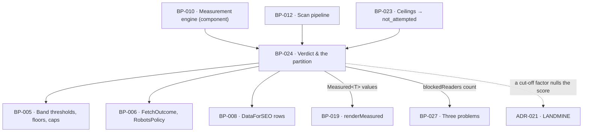

# BP-024 — The verdict: score, band, drivers, and the measured/zero/unmeasured partition

- Parent: BP-010
- Kind: **feature** — cut from REQ-004; the leaf that produces the value the top
  of the report is made of, and the partition every other number in the product
  inherits.

## Responsibility
Classify every outcome of a scan into exactly one of measured value, measured
zero and unmeasured-with-its-reason at the moment it is produced, compose the
three factors the score is made of from those classifications, and emit one
`Verdict` — score, band, three factors, domain, measurement date — that no
downstream surface can widen, estimate from, or read as a zero.

## Module / boundary
Inside BP-010's `src/lib/measure/`, as five named files: `measured.ts` (the
`Measured<T>` type BP-010 declares, its constructors and its total combinators),
`partition.ts` (the exhaustive input→outcome classification and the input→factor
dependency map), `score.ts` (`BUILD.md` §5's arithmetic over `Measured` values),
`bands.ts` (the four thresholds and their handles) and `verdict.ts` (the value
the header strip is rendered from).

It produces values and renders none. The header strip itself is a registered
component (BP-018) composed by BP-022's shell and written through BP-019's
`renderMeasured`; no sentence and no band word is written here.

## Diagram


## Public interface

```ts
// ── src/lib/measure/measured.ts ────────────────────────────────────────────
/** BP-010 declares this type; this node produces it and owns its combinators.
 *  Every stored and rendered number in the product is one of the three arms. */
export type Measured<T> =
  | { kind: 'measured';   value: T; at: Date }
  | { kind: 'zero';       value: T; at: Date }
  | { kind: 'unmeasured'; reason: UnmeasuredReason; at: Date }
export type UnmeasuredReason = 'undeterminable' | 'not_attempted'

/** The only constructors. There is no `Measured.of(number | null)`: a nullable
 *  number cannot say why, and the whole point of REQ-004 is that it must. */
export function measured<T>(value: T, at: Date): Measured<T>
export function measuredZero<T>(zero: T, at: Date): Measured<T>
export function unmeasured<T>(reason: UnmeasuredReason, at: Date): Measured<T>

/** Total combinators. Arithmetic never leaves the type, so no call site can
 *  reach a raw number by accident and no reason is lost on the way. */
export function mapMeasured<A, B>(m: Measured<A>, f: (a: A) => B): Measured<B>
export function combine<A extends readonly Measured<unknown>[], B>(
  parts: A, f: (values: Values<A>) => B
): Measured<B>          // unmeasured if any part is unmeasured — see `worseReason`
export function worseReason(a: UnmeasuredReason, b: UnmeasuredReason): UnmeasuredReason

// ── src/lib/measure/partition.ts ───────────────────────────────────────────
/** The exhaustive classification REQ-004's last non-goal hands to the blueprint.
 *  One function, one closed input union, one arm each — a new input cannot ship
 *  without a classification. */
export type ScanInput =
  | 'home_document' | 'pricing_document' | 'access_rules'
  | 'business_profile' | 'market_suggestions'
  | 'own_ranked_rows' | 'question_serps'
export type InputOutcome =
  | { read: true;  empty: boolean }        // we read it; `empty` = it contained none of what we counted
  | { read: false; because: 'undeterminable' }
  | { read: false; because: 'not_attempted' }
export function classify(input: ScanInput, o: InputOutcome, at: Date): Measured<null>

/** REQ-004 criterion 6's second sentence — "an input no driver depends on never
 *  withholds the score" — is this map, not a judgement at each call site. */
export const FEEDS: Readonly<Record<ScanInput, readonly ScoreFactorName[]>>

/** Section-level outcome, for REQ-004 criterion 10. A section whose data could
 *  not be retrieved is absent and named; it is never an empty card. */
export type SectionName = 'verdict' | 'ai_answers' | 'google_presence' | 'problems' | 'first_page'
export function sectionOutcome(s: SectionName, inputs: Readonly<Record<ScanInput, InputOutcome>>):
  { present: true } | { present: false; reason: UnmeasuredReason }

// ── src/lib/measure/score.ts and bands.ts ──────────────────────────────────
/** The three the score is composed of, and the three the report shows beside it
 *  (REQ-004 c2, `BUILD.md` §4.1's "three driver mini-bars"). `Presence` is the
 *  geometric mean of BP-010's `searchPresence` and `aiPresence`, floored at 1
 *  (`BUILD.md` §5) — those two are sub-measures, not shown factors. */
export type ScoreFactorName = 'foundations' | 'answerability' | 'presence'
export type ScoreFactors = Readonly<Record<ScoreFactorName, Measured<number>>>

export function presenceOf(d: Pick<Drivers, 'searchPresence' | 'aiPresence'>): Measured<number>
export function factorsOf(d: Drivers): ScoreFactors
export function computeScore(f: ScoreFactors): Measured<{ score: number; band: BandHandle }>
export type BandHandle = 'invisible' | 'hard-to-find' | 'findable' | 'dominant'
/** Thresholds are BP-005's `SCORE_BAND_BOUNDS`
 *  ({ invisible: 0, 'hard-to-find': 25, findable: 50, dominant: 75 }), imported,
 *  never written here — `structure.md` rule 5. This comment previously said
 *  "thresholds are BP-005 pins" against a BP-005 that declared none: its band
 *  decision covers winnability and rival size only, so the four boundaries the
 *  whole free report turns on had no owner. They are `BUILD.md` §5's, verbatim:
 *  "Bands: 0–24 Invisible · 25–49 Hard to find · 50–74 Findable · 75–100
 *  Dominant". */
export function bandOf(score: number): BandHandle

// ── src/lib/measure/verdict.ts ─────────────────────────────────────────────
/** What the top of the report is made of. There is no tier field and no
 *  `forFree` parameter anywhere in this file: REQ-004 criterion 5's "no part …
 *  hidden, blurred, rounded down, locked, or marked as available on payment" is
 *  discharged by there being nothing to pass that could hide anything. */
export interface Verdict {
  domain: CanonicalDomain
  measuredAt: Date                       // one date; every figure under it is this scan's
  scoreAndBand: Measured<{ score: number; band: BandHandle }>
  factors: ScoreFactors
  /** REQ-004 criterion 3: name every factor with no value and, for each, which
   *  of the two reasons applies. Empty when the score could be computed. */
  missing: readonly { factor: ScoreFactorName; reason: UnmeasuredReason }[]
  /** REQ-004 criterion 6, the "no driver depended on it" case, and criterion 10. */
  unmeasuredElsewhere: readonly { input: ScanInput; reason: UnmeasuredReason }[]
  /** Read here because REQ-009 criteria 1, 3 and 4 are a rendering of a
   *  measurement this node performs; BP-027 renders it and computes nothing. */
  blockedReaders: Measured<number>
}
export function verdictOf(a: {
  domain: CanonicalDomain; measuredAt: Date
  drivers: Drivers; inputs: Readonly<Record<ScanInput, InputOutcome>>
  robots: Measured<RobotsPolicy>
}): Verdict
```

## Data model delta
One migration, `supabase/migrations/*_scans_verdict*.sql`, on BP-012's `scans`
table. It adds no column; it adds one constraint and one shape rule:

- `scans.report jsonb` gains a `verdict` object holding the whole `Verdict`
  above, with every number in its three-armed form. This is the authority.
- `scans.score numeric null` (already in `BUILD.md` §10, kept because the Overview
  growth chart and the weekly delta read it as a scalar) is written **only** from
  `verdict.scoreAndBand`: the numeric value on the `measured` and `zero` arms,
  `null` on the `unmeasured` arm.
- A check constraint ties the two so they cannot disagree:
  `check ((report->'verdict'->'scoreAndBand'->>'kind' = 'unmeasured') = (score is null))`.
  Without it the scalar column is a second copy of the verdict, and a second copy
  is how a `null` meaning "we could not measure" becomes a `null` meaning
  "nobody wrote it yet".

`scans.drivers jsonb` holds BP-010's four sub-measures in their `Measured` form;
the three shown factors are derived, not stored twice.

## Error & edge behavior

**The classification, exhaustively.** Every arm of `InputOutcome` maps to exactly
one arm of `Measured`, and the map is total:

| Input outcome | Result | Grounds |
|---|---|---|
| read, and it contained some of what we counted | `measured` | — |
| read, and it contained none of what we counted | `zero` — never `—`, never "unknown", never a missing section | REQ-004 c7 |
| read successfully, and it gates nothing (access rules present, nothing disallowed) | `zero` with its denominator | REQ-004 c7 |
| read successfully, and it gates every reader | `measured` — a value, not a gap | REQ-004 c7 |
| could not tell whether it exists: nothing returned, unreadable, or a data source did not answer | `unmeasured / undeterminable` | REQ-004 c6 |
| never attempted: the 90-second ceiling or the free path's spend ceiling stopped first | `unmeasured / not_attempted` | REQ-004 c9, REQ-003 c5 and c11 |

Reading is the whole of the line between rows 5 and 6 on one side and rows 2 and
3 on the other. A denominator of zero reads 0 (`BUILD.md` §5): a page with no
headings scores `zero`, not `unmeasured`.

**Which input feeds which factor (`FEEDS`).** REQ-004 criterion 6 withholds the
score only where a factor depended on the failed input, so the dependency must be
written down once:

| Input | Feeds (directly) | Feeds (through another input) |
|---|---|---|
| `home_document` | foundations, answerability | — |
| `pricing_document` | answerability | — |
| `access_rules` | foundations | — |
| `business_profile` | — | market_suggestions → question_serps → presence |
| `market_suggestions` | — | question_serps → presence |
| `own_ranked_rows` | presence (SearchPresence's `ranked`) | — |
| `question_serps` | presence (SearchPresence's `top10share`, AIPresence) | — |

Dependency is transitive, and `FEEDS` is closed over that transitivity. Two
things a scan does that feed **no** factor and therefore never withhold the
score: the wording of the twelve questions (selection is deterministic,
`BUILD.md` §6.7 — the model touches vocabulary only) and the rival derivation and
its platform partition (`BUILD.md` §6.6, counted over SERPs already bought). A
failure in either leaves the score standing and is named in
`unmeasuredElsewhere`.

**The score.**
- `computeScore` returns `unmeasured` if any of the three factors is
  `unmeasured`, and returns no band, no estimate and no interpolation from the
  factors that were measured (REQ-004 c3, c9, c12). This is BP-010's decision 1
  in its arithmetic form, not a second rule.
- The reason it carries when factors disagree is `undeterminable`
  (`worseReason` orders `undeterminable` above `not_attempted`) — see decision 3.
- A home document the scan **read** that tells every reader not to index it is
  Foundations `measured 0`, and `∛(0 × A × P) = 0`, so the score is 0 with the
  band word 0 carries (`invisible`) and never a `—` (REQ-004 c7, `BUILD.md` §5).
  There is no override anywhere: the arithmetic already produces it, and a
  special case would be a second place the rule could be edited. "Every reader"
  means a generic directive — `meta robots` or `X-Robots-Tag` scoped to all
  agents. A directive naming particular agents is not this; it feeds
  `blockedReaders` (REQ-009 c3) and leaves Foundations to its own arithmetic.
- Answerability is floored at 1 and Presence at 1 (`BUILD.md` §5). A floor
  applies only to a `measured` or `zero` arm; it never manufactures a value from
  an `unmeasured` one.
- A domain measured successfully that appears in none of the searches measured
  and is cited in none of the AI answers that appeared is `zero` throughout
  (REQ-004 c8) — a cold-start site scores, honestly, low.
- Where **no** AI answer appeared on any of the twelve, the citation denominator
  is empty: `mentionRate` and `citationRate` are measured zeros with denominator
  0, AIPresence floors at 1, and the report states the denominator (`BUILD.md`
  §6.2). A question with no AI answer is a muted cell, never a miss.
- Nothing is carried over from an earlier scan of the same domain, and no
  default, estimate or last-known-good value stands in for anything (REQ-004
  c12). The `Verdict` carries one `measuredAt` and every value inside it carries
  the same `at`; a value whose `at` differs from the verdict's is a test failure.

**Determinism.** The same inputs produce a byte-identical `Verdict` (`BUILD.md`
§16 milestone 2). `measuredAt` is passed in, never read from a clock inside this
node, so the determinism test does not need a frozen clock to be honest.

## NFR budget
- Pure computation: no I/O, no clock, no locale-dependent collation, no vendor
  cost. Whole-verdict computation ≤ 5 ms for one domain.
- The partition is on the path of every number the product will ever show, so its
  cost is a per-value allocation and nothing more — `Measured<T>` is a plain
  discriminated union, not a class.
- Observability: per-factor outcome kind, and for every `unmeasured` result the
  reason and the input that produced it; a `not_attempted` result logs which
  ceiling stopped it (BP-023's `stoppedReason`).
- Authorisation: none — this node holds no I/O. It never reads a session and
  never learns whether the reader has paid, which is what makes REQ-004
  criterion 5 structural rather than reviewed.

## Decisions

1. **The report shows three factors, and they are not BP-010's four `Drivers`** —
   Status: accepted
   - Context: REQ-004 criterion 2 says "the three drivers it is composed of" and
     `BUILD.md` §4.1 says "three driver mini-bars", while `BUILD.md` §5's formula
     composes the score from Foundations, Answerability and Presence — where
     Presence is itself `max(1, √(SearchPresence × AIPresence))`. BP-010's
     `Drivers` interface has four fields, which are the four measured quantities.
   - Decision: `ScoreFactors` is the shown, score-composing triple and is derived
     here from BP-010's four; `searchPresence` and `aiPresence` are sub-measures
     that never appear as factors. `missing` is reported over factors, so a
     visitor is told "Presence" could not be measured rather than being shown a
     fourth bar they were never promised.
   - Alternatives considered: show four bars — rejected, it contradicts both
     REQ-004 criterion 2 and `BUILD.md` §4.1, and REQ-004's non-goals forbid a
     sub-score dashboard; rename BP-010's `Drivers` to three fields — rejected,
     the four quantities are what the parsers produce and collapsing them at
     measurement would lose which of the two failed.
   - Consequences: one derivation, in one file, from four to three. Reversing is
     a type change in this node only. BP-010's blueprint is another node's file
     and is not edited here; the naming tension is reported instead.

2. **A dependency map, not a judgement per call site** — Status: accepted
   - Context: REQ-004 criterion 6 makes the score's fate depend on whether "a
     driver it is composed of depended on that input", and criterion 9 does the
     same for cut-off work. Left implicit, that question is answered afresh
     wherever a failure is handled.
   - Decision: `FEEDS` is a total, transitively closed map from the closed
     `ScanInput` union to factors, and it is the only thing consulted. A new input
     does not compile until it has a row.
   - Alternatives considered: derive the dependency at runtime from which factors
     came back unmeasured — rejected, it cannot distinguish "this input feeds no
     factor" from "this input feeds a factor that failed for another reason", and
     criterion 6's last sentence is exactly that distinction; a comment naming the
     dependencies — rejected, prose does not fail a build.
   - Consequences: adding the paid path's inputs (rival rows, ChatGPT, AI Mode) is
     a row each. Reversing means re-scattering the question, which is the state
     this decision exists to leave.

3. **`undeterminable` outranks `not_attempted` when a factor's inputs disagree** —
   Status: accepted (parameter, rule 1.1)
   - Context: Presence composes two sub-measures. One can be `undeterminable`
     (a data source did not answer) while the other is `not_attempted` (a ceiling
     cut it off). REQ-004 criterion 3 admits exactly two written lines for a
     missing factor and demands the one that "applies", not a compound.
   - Decision: `worseReason` returns `undeterminable` whenever either part is
     `undeterminable`.
   - Alternatives considered: `not_attempted` wins — rejected, it tells a founder
     "we did not get to it" about work we did attempt and could not determine,
     which understates what we know; render both lines — rejected, criterion 3
     names one reason per factor and REQ-092's one-line discipline forbids the
     second line beside it.
   - Consequences: a founder is told the stronger, always-true claim: we tried and
     could not determine it. Reversing is one function and its fixture; no stored
     data changes.

4. **`scans.score` stays, with a check constraint rather than a convention** —
   Status: accepted
   - Context: `BUILD.md` §10 pins a scalar `score` column that the growth chart
     and weekly delta read, while the authority is a three-armed value inside the
     report blob. Two records of one fact is precisely rule 2.4's failure.
   - Decision: keep the column as a projection of the blob, written only from it,
     and let the database refuse a row where they disagree.
   - Alternatives considered: drop the column and read the blob — rejected, the
     growth chart's weekly series would become a jsonb scan over every scan of a
     site; keep it and rely on one writer — rejected, "one writer" is a promise
     nothing enforces, and the value it protects is a customer-visible verdict.
   - Consequences: any future writer of `scans.score` fails loudly at insert.
     Reversing is dropping one constraint, which would silently re-open the drift.

5. **The ceiling case** — a factor cut off by the spend ceiling nulling the whole
   score while six of twelve cents sit unspent — reads as a defect and is
   load-bearing across this node, BP-023 and BP-007. It is **ADR-021**, not an
   entry here. **The closed AI-reader agent list** the `blockedReaders` count is
   computed over spans this node, BP-004, BP-005 and BP-027 and is **ADR-022**.

## Status grounds (rule 3.2)
Self-certified `approved`. Grounds: cut on `/expand-requirement` from REQ-004,
`status: approved`, so the gate "no blueprint from a non-approved requirement" is
met. REQ-004's last non-goal hands "the exhaustive classification of every scan
outcome into one of these cases, and which driver each input feeds" to the
blueprint; the classification table and `FEEDS` are that, and nothing in this node
restates a criterion as a rule. No customer-visible string appears here: the four
band words reach a screen only through BP-019's `SCORE_BANDS`. The librarian
audits.

## Open questions

- [ ] REVIEW(conflict with PROJECT): decision 1 settles that three
      `ScoreFactors` are shown rather than BP-010's four, but not whether three
      factor *values* should reach a surface at all. `BUILD.md` §4.1's "three
      driver mini-bars" and REQ-004 criterion 2 together put three named 0–100
      numbers in front of a stranger while REQ-004's non-goals forbid explaining
      any of them, so this node's output renders arithmetic where
      `00-project.md` standing law 2 asks for meaning. The derivation is this
      node's either way; what is at issue is whether `ScoreFactors` reaches the
      report as three bars or as the one factor holding the score down —
      `missing` already proves the type can carry a per-factor verdict without a
      per-factor bar. See REQ-004's line and `OWNER-QUESTIONS.md` item 4.

## Log
- 2026-09-03 reviewed — architect — the `REVIEW(conflict with PROJECT)` line above is the blueprint-side twin of `OWNER-QUESTIONS.md` item 4 (a customer-visible verdict, the owner's under §1's rights table): left standing, no second home minted, no change.
