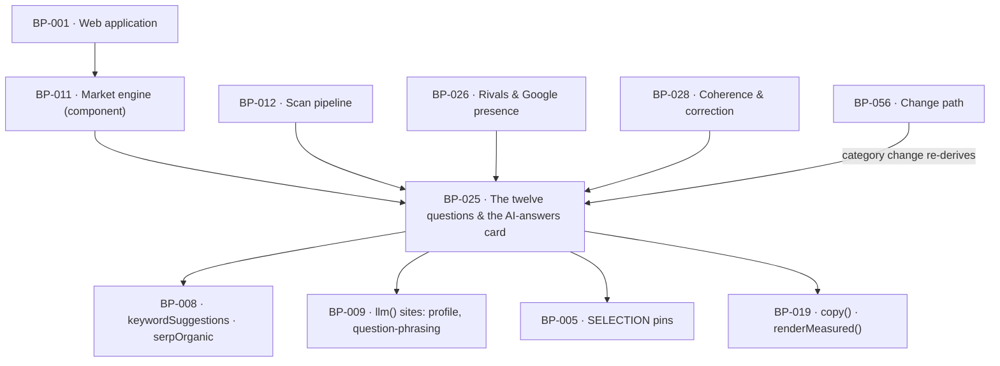

# BP-025 — The twelve questions and the AI-answers card

- Parent: BP-011
- Kind: **feature** — cut from REQ-006, a leaf under the market engine.

## Responsibility
Turn a domain's own pages into a measured market set, select and word the searches
that stand for it deterministically, and assemble the AI-answers card's data with
its denominator carried beside every count. Research on the DataForSEO endpoints,
competing products' measurement practices, and AI-answer stability is in
`registry/evidence/RESEARCH-dataforseo-endpoints.md`,
`registry/evidence/RESEARCH-competitor-visibility-measurement.md`, and
`registry/evidence/RESEARCH-ai-answer-stability.md`.

## Module / boundary
`src/lib/market/questions/` — `profile.ts` (§6.7 step 1), `market-set.ts` (step 2),
`select.ts` (step 3), `phrase.ts` (step 4) and `matrix.ts` (the card's view model).
It buys through BP-008, words through BP-009, pins through BP-005, and renders
nothing: the report page is a thin adapter over `buildAiAnswersCard` (structure.md
rule 1). It owns no other directory; rival derivation is BP-026's, coherence is
BP-028's.

## Diagram


## Public interface
```ts
// src/lib/market/questions/profile.ts — BUILD §6.7 step 1
export interface Profile {
  category: string                      // buyer vocabulary, never the site's marketing language
  job: string
  offeringType: string
  audienceTerms: readonly string[]      // 2–4
  namedRivals: readonly string[]        // rivals the site itself names
  vocabulary: readonly string[]         // the relevance guard's support set
  brandTokens: readonly string[]        // the own-brand drop set
}
export function deriveProfile(c: CostContext, a: { home: string; pricing?: string }): Promise<Measured<Profile>>

// src/lib/market/questions/market-set.ts — step 2
export interface SuggestionRow { keyword: string; volume: number }
export function deriveMarketSet(c: CostContext, a: { seeds: string[] }): Promise<Measured<SuggestionRow[]>>

// src/lib/market/questions/select.ts — step 3. Deterministic; takes no CostContext.
export type Intent = 'decision' | 'solution' | 'problem' | 'informational'
export interface SelectedSearch {
  keyword: string; volume: number; intent: Intent; score: number; rank: number
}
export function selectTwelve(a: { profile: Profile; market: SuggestionRow[] }): SelectedSearch[]
export function classifyIntent(keyword: string, p: Profile): Intent | 'own_brand'
/** The one intent classifier's weight, exported because BP-040's ranking uses
 *  the same classification the twelve were selected by — one classification in
 *  the product, not two (rule 2.4; BP-011 decision 2). Returns
 *  `SELECTION.intentWeights[intent]` (3 decision · 3 solution · 2 problem ·
 *  1 informational) and 0 for `own_brand`, which is dropped. The second
 *  parameter is required: the own-brand drop set and the relevance vocabulary
 *  are the profile's, so there is no one-argument form.
 *
 *  `structure.md` and `capabilities.md` both listed this as one of this
 *  module's entry points and this section omitted it until 2026-08-31. */
export function intentWeight(keyword: string, p: Profile): number
export function stemKey(keyword: string): string          // near-duplicate collapse key
export function passesRelevanceGuard(keyword: string, p: Profile): boolean

// src/lib/market/questions/phrase.ts — step 4
export interface Question {
  id: string                            // stable within a scan; the matrix keys on it
  text: string                          // the wording only
  search: SelectedSearch                // carried, never returned by the model
  phrasing: 'template' | 'model'
}
export function phraseQuestions(c: CostContext, a: { selected: SelectedSearch[] }): Promise<Measured<Question[]>>

// src/lib/market/questions/matrix.ts — REQ-006's card, assembled from SERPs already bought
export type AnswerCell =
  | { kind: 'answered'; citedDomains: readonly string[]; namesCustomer: boolean }
  | { kind: 'no_answer' }
  | { kind: 'unmeasured'; reason: 'undeterminable' | 'not_attempted' }
export interface AiAnswersCard {
  measuredSearches: number              // n — REQ-006 criterion 1's denominator
  answeredSearches: number              // m of n — AI answers appeared on m
  customerCitations: number             // over m, never over n
  rows: readonly { question: Question; cell: AnswerCell }[]
}
export function buildAiAnswersCard(a: {
  questions: Question[]; serps: Measured<SerpResult>[]; ownDomain: string
}): AiAnswersCard
```

Invariants `buildAiAnswersCard` holds, asserted in `tests/market/questions/`:
`measuredSearches === rows.filter(r => r.cell.kind !== 'unmeasured').length` ·
`answeredSearches === rows.filter(r => r.cell.kind === 'answered').length` ·
`customerCitations <= answeredSearches` · `rows.length === questions.length` ·
every `row.question.search` is a member of the `SelectedSearch[]` the scan measured.

## Data model delta
None of its own. Writes the `market`, `questions` and `answers` sections of
`scans.report jsonb` (BUILD §10's one blob per scan); the table and its migration
glob are BP-012's. The blob sections this node writes:
`report.market = { profile, suggestions, totalVolume }`,
`report.questions = SelectedSearch & Question pairs in rank order`,
`report.answers = AnswerCell per question id`. No new column, no new table, no
migration owned here.

## Error & edge behavior
- **Fewer than twelve is a complete result, never a shortfall.** The volume floor
  (50/mo), the own-brand drop, the relevance guard, the near-duplicate collapse and
  the composition constraints may each leave the set short; nothing is invented,
  repeated or padded to reach twelve (REQ-006 criteria 1 and 8). `selectTwelve`
  returns `SelectedSearch[]` of length 0…12 and has no code path that duplicates.
- **The model cannot change what a question stands for.** `Question.search` is
  carried from the selection; the `question-phrasing` schema BP-009 parses admits
  only `{ id, text }`, so a model returning a keyword has produced an unparseable
  response, not a re-selection (REQ-006 criterion 13).
- **A failed phrasing degrades to the template form, never to a missing question.**
  A dropped question would change criterion 1's denominator, which is the one
  number the whole card is read against. `phrasing: 'template'` records which
  happened.
- Composition constraints (≥4 decision, ≥3 solution, ≤3 rival-brand, ≤2 how-to) are
  applied as caps and floors over the ranked list, and are *relaxed in one fixed
  order* when the market cannot satisfy them — floors first, since a floor that
  cannot be met means the market yielded fewer than twelve, which is legal.
- Near-duplicate collapse compares `stemKey`: content tokens stemmed, stop-words,
  punctuation, plural form and word order removed, highest volume kept
  (REQ-006 criterion 12).
- A SERP that returned no `ai_overview` is `no_answer`, excluded from both counts
  (criterion 2). An `ai_overview` that cites no domain is `answered` with
  `citedDomains: []` — "named no brand", not an empty list (criterion 11).
- **Since ADR-094 (2026-09-03 owner ruling), every free-matrix SERP call sets
  `loadAsyncAiOverview: true`**, so a `no_answer` cell means Google served no
  AI answer at all — never an unfetched asynchronous one — closing the gap
  `RESEARCH-dataforseo-endpoints.md` §2.3 found in the un-flagged call.
- A SERP the scan never bought is `unmeasured / not_attempted` and lowers `n`; it
  is never counted as a place the customer was ignored (criteria 1 and 10).
- Citation matching is a registrable-domain match over the `references` payload
  (BUILD §6.3, "Brand mentions/citations = string match over references"), using
  BP-026's `registrableDomain` so the customer's own domain matches on `www.` and
  on a `content.` subdomain alike.
- `deriveProfile` returning `unmeasured` (unreadable home page) yields no market
  set and no questions; the report carries the trichotomy through, and BP-028
  reports the missing category rather than guessing one.

## NFR budget
- Free path spend: `keyword_suggestions` 1.8¢ + 12 live SERPs, `loadAsyncAiOverview:
  true` since ADR-094 — 2.4¢ where Google served no asynchronous overview to
  fetch, up to 4.8¢ worst case (evidence: `RESEARCH-dataforseo-endpoints.md`
  §2.3) — + **two** nano calls ≈ 0.6¢ (see Decisions 2): 4.8¢ typical, ~7.2¢
  worst case for this node's own spend — inside `CAPS.FREE_C` 12¢ together with
  F4's 1.8¢ (bought by BP-010, not this node).
- Latency: profile ≤ 3 s (nano), suggestions ≤ 3 s, 12 live SERPs at bounded
  concurrency inside the 60-second promise; `selectTwelve` is pure and ≤ 5 ms.
- **Determinism**: the same profile and the same market rows return the same
  searches in the same order, byte-identical, on every run and every machine —
  a fixture test, not an aspiration.
- Observability: profile outcome kind, suggestion row count, selected count and
  which constraint bound it, phrasing fallbacks, per-cell outcome kind.
- Pins this node needs from BP-005 (`constants.ts`, asserted in `tests/pins.test.ts`):
  `SELECTION: { volumeFloorPerMonth: 50; intentWeights: { decision: 3; solution: 3; problem: 2; informational: 1 }; minDecision: 4; minSolution: 3; maxRivalBrand: 3; maxHowTo: 2 }`.
  `BATTERY.QUESTIONS` (12) already exists there.

## Decisions
1. **Selection is a pure function of two inputs and takes no `CostContext`** — Status: accepted
   - Context: BUILD §6.7 ("selection is deterministic and auditable end to end —
     the LLM touches vocabulary, never selection") and REQ-006 criterion 13 make
     provenance a customer promise. BP-011's `## Decisions` entry 1 fixed the
     signature; this node is where it is enforced.
   - Decision: `selectTwelve(a: { profile, market })` — no context, no clock, no
     I/O. Anything that would need a network call is not selection.
   - Alternatives considered: an LLM re-ranker over the ~50 suggestions — rejected,
     it makes the provenance line unfalsifiable; a volume-only ranking — rejected,
     §6.7 states decision and solution intent must beat raw volume.
   - Consequences: selection quality rests entirely on the intent-weight patterns
     and the relevance guard, both pins, both tunable without touching a promise.
   - Cost of reversing: low in code, high in trust — the provenance line beside
     every question is the thing REQ-006 exists to make checkable.
2. **The free path makes two nano calls, not one** — Status: accepted
   - Context: BUILD §6.7 step 4 reads "Phrase as questions (nano, **same call as
     step 1**)", but step 3 — deterministic selection — sits between step 1 and
     step 4, so the phrasing call cannot be issued before its input exists. BP-009
     already encodes the split as two call sites, `'profile'` and
     `'question-phrasing'`.
   - Decision: two nano calls per scan, ≈0.6¢ rather than ≈0.3¢. The free-path
     estimate moves from BUILD §6.3's ~6.3¢ to ~6.6¢, against a 12¢ cap.
   - Alternatives considered: phrase all ~50 suggestions in the profile call and
     discard the unused wordings — rejected, it pays for 38 discarded phrasings and
     lets the model see the candidate set before selection runs, which is exactly
     the coupling §6.7 forbids; template-only phrasing with no model call —
     rejected, §6.7 step 4 gives the model the wording and the templates cover only
     the "best X" / "X vs Y" shapes.
   - Consequences: one more pinned price-book line item and 0.3¢; nothing else.
   - Cost of reversing: none — it is a call-site count, not a stored fact.
3. **A phrasing failure falls back to the template, never drops the question** — Status: accepted
   - Context: criterion 1's denominator is the number of searches *measured*, and
     a question is the visible face of a measured search. Dropping one silently
     changes the denominator every other number on the card is read against.
   - Decision: `phrasing: 'template' | 'model'` on every question; the template
     form always exists because it is derived from the keyword shape.
   - Alternatives considered: render the raw keyword — rejected, criterion 9
     already shows the keyword beside the question, so the question would read as
     a duplicate of its own provenance line; omit the row — rejected as above.
   - Cost of reversing: low; `phrasing` is a report-blob field, not a column.
4. **The free matrix's SERP calls set `loadAsyncAiOverview: true`** — Status: accepted
   - Context: without the flag, an AI Overview Google serves asynchronously
     (which the vendor calls "frequent") returns `ai_overview: null`,
     indistinguishable from no AI answer at all — REQ-006 criterion 2's cell
     was silently false on such a search. Owner ruling, 2026-09-03
     (`OWNER-QUESTIONS.md` item 1, verbatim): "the free report loads
     asynchronous AI Overviews (`load_async_ai_overview`), the cost stays
     inside the 12¢ cap; the card counts Google's actual AI answers."
   - Decision: `phrase.ts`'s twelve SERP calls (through BP-008's `serpOrganic`)
     pass `loadAsyncAiOverview: true`. Recorded at **ADR-094 (landmine)**, since
     it corrects a line `BUILD.md` §6.2/§6.4 still states in writing and spans
     this node, BP-007 and BP-008.
   - Alternatives considered: keep the 0¢ rule and add a caveat to criterion 6
     disclosing that the card counts only answers Google had cached — the
     other half of `OWNER-QUESTIONS.md` item 1, and the owner did not take it;
     no REQ-006 text changes as a result of this decision.
   - Consequences: NFR budget's worst case for this node's own spend rises from
     ~4.8¢ to ~7.2¢ (see NFR budget); the ledger records the surcharge-inclusive
     price on every flagged call regardless of DataForSEO's own refund
     (ADR-094 Decision 3), so recorded spend never under-counts actual spend.
   - Cost of reversing: one boolean at one call site; the trust cost of
     reversing is ADR-094's to state.

## Status grounds (rule 3.2)
Self-certified `approved` under rule 3.2. Grounds: cut on `/expand-requirement`
from **REQ-006**, which is `status: approved` — the one gate a blueprint must
clear (§3, "No blueprint from a non-approved requirement"). It satisfies exactly
that requirement, its module boundary is a sub-directory of the boundary
`registry/structure.md` gives BP-011, and it overlaps no sibling's `code:` glob.
The librarian may refuse retroactively.

## Open questions

- [ ] REVIEW(conflict with PROJECT): the dot matrix's per-row `n/{m}`
      (`BUILD.md` §4.1 module 2) states as a fraction what the row's fill
      already states, and states it against a denominator — `m`, the searches
      that produced an AI answer — which is not the denominator the rest of the
      report is read against. REQ-006 criterion 1 makes both numbers explicit
      precisely because they differ; putting the smaller one on every row asks a
      stranger to reconcile two denominators before the card means anything,
      which is `00-project.md` standing law 2's zero-knowledge limb. Criterion 3
      requires only that the cited domains be named and the customer's own row
      show whether they were among them, and criterion 1 already states the
      customer's count once against both numbers — so the per-row fraction is
      this node's to drop and needs no ruling.

## Log
- 2026-09-03 amended — architect — `/decide`: decision 4 added (free-matrix SERP calls set `loadAsyncAiOverview: true`), NFR budget and one Error & edge behavior bullet updated — per **ADR-094** (landmine, owner ruling 1). `satisfies: [REQ-006]` unaffected; no REQ-006 text changed.
- 2026-09-03 reviewed — research/ux-simplification — UX audit of `BUILD.md` §4 against `00-project.md` standing law 2: one `REVIEW(conflict with PROJECT)` line raised on the matrix's per-row `n/{m}`. No decision, interface or status changed; no preview redrawn.
