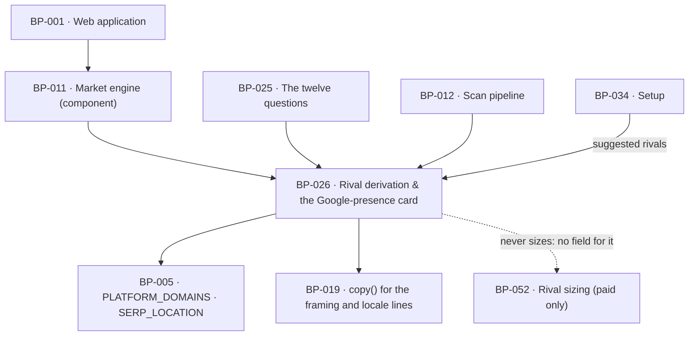

# BP-026 — Rival derivation and the Google-presence card

- Parent: BP-011
- Kind: **feature** — cut from REQ-008, a leaf under the market engine.

## Responsibility
Derive the rival set by counting over the twelve SERPs the scan already bought,
and assemble the Google-presence card as a share of those same twelve searches, so
the contrast still means something when the customer's own number is zero. Research on
the DataForSEO endpoints, competing products' measurement practices, and AI-answer stability is in
`registry/evidence/RESEARCH-dataforseo-endpoints.md`,
`registry/evidence/RESEARCH-competitor-visibility-measurement.md`, and
`registry/evidence/RESEARCH-ai-answer-stability.md`.

## Module / boundary
`src/lib/market/rivals/` — `derive.ts` (the §6.6 partition and score), `domains.ts`
(registrable-domain normalisation and the platform partition) and `presence.ts`
(the card's view model). It buys nothing: it reads `SerpResult`s BP-025's chain
already paid for. Rival *sizing* is BP-052's directory and is not reachable from
here; the rival *set the customer keeps* is BP-034's.

## Diagram


## Public interface
```ts
// src/lib/market/rivals/domains.ts
export function registrableDomain(hostOrUrl: string): string | null   // eTLD+1, lower-cased
export function isPlatformDomain(host: string): boolean               // BP-005's closed list
export function isOwnDomain(host: string, ownDomain: string): boolean // www. and content. included

// src/lib/market/rivals/derive.ts — BUILD §6.6, zero extra cost
export interface RivalCandidate {
  domain: string
  top10Appearances: number
  aiCitations: number
  score: number                    // top10Appearances + 2 × aiCitations
}
export function deriveRivals(a: { serps: SerpResult[]; ownDomain: string }):
  { rivals: RivalCandidate[]; sources: string[] }   // rivals: top 5 by score; sources: platform hits

// src/lib/market/rivals/presence.ts — REQ-008's card
export interface PresenceCard {
  measuredSearches: number                                   // the one denominator
  totalMonthlyVolume: Measured<number>
  you: { domain: string; top10Count: number }
  rivals: readonly { domain: string; top10Count: number }[]  // ≤ 5, score order
  absentFrom: readonly {
    keyword: string; volume: number; topHolder: string | null
  }[]                                                        // ≤ 5, biggest volume first
  framing: 'shown' | 'suppressed_no_rivals'
}
export function buildPresenceCard(a: {
  serps: Measured<SerpResult>[]; selected: SelectedSearch[]
  ownDomain: string; rivals: RivalCandidate[]
}): PresenceCard
```

`PresenceCard` has **no** field for a rival's ranked count, size, band, revenue,
traffic value, funding, headcount or projected return, and no field a severity or
warning level could be written into. REQ-008 criteria 6 and 10 are held by the
absence of a place to put the violation, not by a review (see Decisions 1).

## Data model delta
None of its own. Writes `report.rivals = RivalCandidate[]` and
`report.sources = string[]` into `scans.report jsonb`; the platform-hit `sources`
list is stored and not rendered in MVP (BUILD §6.6, "a v1.1 Standing module"). No
column, no table, no migration owned here.

## Error & edge behavior
- **Cold start is the path, not a branch.** The derivation counts over the market's
  SERPs and never reads the customer's own rankings, so the output is identical at
  0 and at 10,000 ranked searches (BUILD §6.6). `you.top10Count === 0` renders as a
  measurement against the same denominator as every rival (REQ-008 criterion 2),
  never as an error and never as a ratio.
- Fewer than five rivals is a legal result. Zero rivals sets
  `framing: 'suppressed_no_rivals'`, the surface shows one written line, and
  criterion 9's framing line is not drawn — a line that says these domains compete
  for the same searches is false when there are none (REQ-008 criteria 5 and 9).
- The customer's own domain is stripped before scoring, matching on `www.` and on
  the `content.` publishing subdomain, so a customer's own hosted page never
  becomes their own rival.
- Platform domains partition to `sources` and never to `rivals`; the list is
  BP-005's closed `PLATFORM_DOMAINS` and a domain absent from it is a product
  domain by default — the open-world side is the rival side, which is the side a
  human reviews.
- Ties are broken deterministically: `score` desc, then `aiCitations` desc, then
  `top10Appearances` desc, then domain ascending. Chosen here (rule 1.1) because
  §6.6 fixes the score and not the order among equals; without it the rival chips
  reorder between two runs over identical SERPs.
- `absentFrom` lists only searches whose SERP was **measured** and in whose top ten
  the customer does not appear; an unmeasured SERP is neither an absence nor a
  presence. `topHolder` is `null` where the top position is a platform domain.
- `totalMonthlyVolume` is `Measured` because it sums only the searches measured; a
  scan that stopped early sums fewer and says so rather than reporting a total for
  searches it never priced (REQ-008 criterion 3).
- Every figure on the card comes from a call made at `SERP_LOCATION` (Google US /
  `en`). BP-008 exposes no per-call locale parameter, so criterion 8 cannot be
  broken by this node; criterion 7's disclosure line is unconditional on every
  report and is rendered by the report surface from BP-019's copy registry.

## NFR budget
- **0¢.** Nothing here buys anything; it counts over SERPs BP-025's chain already
  paid for (BUILD §6.6, "Zero extra cost").
- `deriveRivals` and `buildPresenceCard` are pure and complete in ≤ 10 ms for 12
  SERPs × 10 results.
- Determinism: identical `SerpResult[]` in, byte-identical card and rival order out.
- Observability: candidate count before and after the platform partition, rival
  count kept, framing state.
- Pins needed from BP-005: `PLATFORM_DOMAINS`, `BATTERY.COMPETITORS_MAX` (5),
  `SERP_LOCATION` — all already declared there.

## Decisions
1. **The card type has no field for anything the free path may not measure** — Status: accepted
   - Context: REQ-008 criterion 10 forbids the framing line attributing any size,
     funding, headcount, customer count or ranking count to a rival, and forbids
     any revenue, traffic or outcome figure. BUILD §6.4's never-list forbids the
     measurement that would make such a claim true (per-rival `ranked_keywords` on
     the free path), and `registry/evidence/REQ-008.md` records that any adjective
     of scale there would be an invented measurement (rule 1.2).
   - Decision: `PresenceCard` carries occupancy counts, volumes and the framing
     *state* only. A rival's ranked count has no field to travel in, so a surface
     cannot render one and a future contributor cannot add one without editing this
     interface — which is the moment the requirement gets read.
   - Alternatives considered: an optional `rivalSize?` field left unset on the free
     path — rejected, an optional field is set by the first paid surface that finds
     it convenient and the free report inherits it silently; a runtime assertion —
     rejected, it moves a compile-time guarantee to a code path that must be
     exercised to fire.
   - Consequences: the paid Overview rival module (REQ-041, REQ-096) composes
     BP-052's `RivalSize` beside this card rather than inside it.
   - Cost of reversing: low in code, high in effect — it re-opens the exact claim
     the requirement's honesty bound exists to prevent, and nothing fails when it
     is re-opened.
2. **The framing line is a state on the card, not a sentence in this module** — Status: accepted
   - Context: criterion 9 requires one written line; the words are customer-visible
     strings and therefore the owner's (constitution §1), held in BP-019's registry
     (REQ-093).
   - Decision: this node emits `framing: 'shown' | 'suppressed_no_rivals'` and the
     surface renders `copy(...)`. No sentence is written here.
   - Alternatives considered: returning the line text — rejected, it puts owner copy
     inside an engine module where BP-018's no-default-strings rule cannot reach it.
3. **Ties among equal-scoring rivals are broken here, and the order is a pin of
   behaviour rather than of value** — Status: accepted
   - Context: §6.6 fixes `score = top10Appearances + 2 × aiCitations` and "top 5 by
     score" and says nothing about equals; a market of near-identical incumbents
     produces ties routinely.
   - Decision: the four-key order above, deterministic and total.
   - Alternatives considered: leaving the sort unstable — rejected, BP-011's own
     determinism budget and REQ-008's "same figures on every render" both fail;
     alphabetical only — rejected, it discards the AI-citation weighting §6.6 chose.
   - Cost of reversing: none stored; it changes which fifth rival is shown.

## Status grounds (rule 3.2)
Self-certified `approved` under rule 3.2. Grounds: cut on `/expand-requirement`
from **REQ-008**, `status: approved` (§3's blueprint gate). It satisfies exactly
that requirement, lives inside BP-011's boundary as `registry/structure.md`
defines it, and its globs overlap no sibling node.

## Open questions

- [ ] REVIEW(conflict with PROJECT): `PresenceCard.totalMonthlyVolume` exists to
      render REQ-008 criterion 3's `{N}/mo` footnote — a number with no
      comparator on the card and no reader action turning on it, which
      `00-project.md` standing law 2 refuses. It is the one field on this
      interface that decision 1's own argument condemns: decision 1 holds
      REQ-008 criteria 6 and 10 "by the absence of a place to put the
      violation", and while a place exists the figure renders. The card keeps
      criterion 3's whole promise without it — `measuredSearches` is the
      denominator, `you.top10Count` the presence, and criterion 3's "exactly
      once" rule is what forbids the footnote restating the second. Removing the
      field waits on `OWNER-QUESTIONS.md` item 6; see REQ-008's line.
