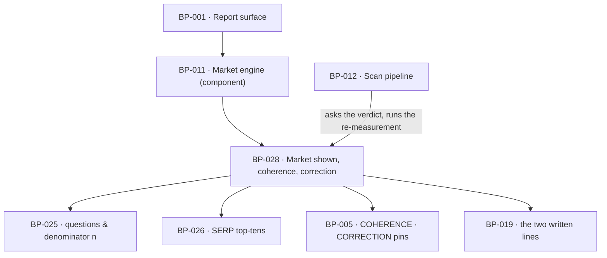

# BP-028 — The market shown, coherence judged, one correction per free scan

- Parent: BP-011
- Kind: **feature** — cut from REQ-094, a leaf under the market engine.

## Responsibility
Decide what the report says about the market it measured in — the category on its
face, whether the searches agree with it, and whether a correction is still on
offer — as pure functions of one stored report, so a reader always gets a route
and never gets a verdict the arithmetic fixed in advance.

## Module / boundary
`src/lib/market/coherence/` — `check.ts` (the three-valued verdict and its
threshold), `offer.ts` (what the report's face shows and whether the control is
drawn), `state.ts` (the correction state machine and the scope a correction
re-measures). Every export is pure over a caller-supplied `ReportFacts` and a clock; the
re-measurement itself is BP-012's `runScan({ correctionOf })`, which this module
**calls into no part of** (see Decisions 3).

## Diagram


## Public interface
```ts
// src/lib/market/coherence/check.ts
export type CoherenceVerdict =
  | { verdict: 'coherent' }
  | { verdict: 'incoherent'; threshold: number; best: number }
  | { verdict: 'unjudgeable'; measuredCount: number }
export function checkCoherence(a: { serps: SerpResult[]; measuredCount: number }): CoherenceVerdict
/** max(2, ceil(n / 4)) — a share of what was measured, never an absolute count. */
export function coherenceThreshold(measuredCount: number): number

// src/lib/market/coherence/offer.ts
/** What this node needs from a stored report, supplied by its caller.
 *  Deliberately not BP-012's `StoredReport`: even a type-only import of it would
 *  put a src/lib/market → src/lib/scan edge into the build graph and close the
 *  cycle rule 6 forbids (Decisions 3). */
export interface ReportFacts {
  scanId: string
  measuredAt: Date
  category: string | null                    // null where the scan never reached one
  correctionState: CorrectionState
  domainRemoved: boolean
}
export type CategoryOnReport =
  | { shown: true; category: string }
  | { shown: false; reason: 'not_reached' }        // REQ-004 c6/c9's line stands there instead
export function categoryOnReport(report: ReportFacts): CategoryOnReport

export type CorrectionOffer =
  | { offered: true;  as: 'first' | 'retry' }
  | { offered: false; because: 'used' | 'exhausted' | 'in_progress' | 'report_too_old' | 'domain_removed' }
export function correctionOffer(a: { report: ReportFacts; now: Date }): CorrectionOffer

// src/lib/market/coherence/state.ts
/** Six members, not five. `running` and `running_retry` are both *running*
 *  states and differ only in which attempt is in flight, because
 *  `(running, produced_no_report)` must yield `failed_once` on a first attempt
 *  and `exhausted` on the retry — one pair, two results, which a total function
 *  cannot produce. Decision 2 records why the attempt count is in the state
 *  rather than in `ReportFacts`. */
export type CorrectionState =
  | 'none' | 'running' | 'failed_once' | 'running_retry' | 'used' | 'exhausted'
export type CorrectionEvent =
  | 'submitted' | 'refused_before_run' | 'produced_report' | 'produced_no_report'
export function nextCorrectionState(a: { current: CorrectionState; event: CorrectionEvent }):
  { next: CorrectionState } | { refused: 'already_running' | 'already_used' }
// The whole table, and the exhaustive switch is over exactly these pairs:
//   none         + submitted          -> running
//   running      + produced_report    -> used
//   running      + produced_no_report -> failed_once
//   failed_once  + submitted          -> running_retry
//   running_retry+ produced_report    -> used
//   running_retry+ produced_no_report -> exhausted
//   any          + refused_before_run -> current, unchanged (costs no attempt)
//   running | running_retry + submitted        -> refused 'already_running'
//   used | exhausted        + submitted        -> refused 'already_used'
//   used | exhausted | none | failed_once + produced_(no_)report -> unreachable,
//     and a compile error rather than a fall-through arm.

/** What a correction re-measures and what it carries forward. BP-012 reads this
 *  constant rather than deciding the scope itself, so no correction can re-read
 *  the domain's own pages by accident (REQ-094 criterion 3). */
export const CORRECTION_SCOPE: {
  reDerive:     readonly ['market', 'questions', 'ai_answers', 'google_presence', 'rivals', 'score']
  carryForward: readonly ['foundations', 'answerability', 'on_page', 'robots']
}
```

## Data model delta
None of its own. `scans.correction_state` already exists as a column BP-002's
baseline declares for REQ-094 criteria 5 to 7 and BP-012's migration glob owns;
this node is the canonical home of that column's **value domain** — the six
`CorrectionState` members and the transitions between them — and BP-012 stores
the string. The column is text and the domain is this node's, so decision 2a's
sixth member needs no migration. `scans.supersedes_scan_id` (BP-002) carries criterion 4's replacement.
No column, no table, no migration owned here.

## Error & edge behavior
- **Three verdicts, not two.** Below `COHERENCE.minMeasuredSearches` (3) the check
  has no input: with fewer than three measured top-tens no domain can reach the
  threshold whatever they contain, so a coherent and an incoherent market produce
  the identical result. `unjudgeable` says so, and the reader still gets the
  correction control (REQ-094 criterion 2; derivation in
  `registry/evidence/REQ-094.md`).
- **The threshold rescales with the denominator**: `max(2, ceil(n / 4))` over the
  `n` searches actually measured (REQ-006 criterion 1's denominator). At `n = 12`
  it returns 3, exactly BUILD §6.7 step 5's clause; at `n = 4` it returns 2, where
  the absolute 3 would demand a domain in nearly every top ten and tell a coherent
  thin market it had been read wrongly.
- The category is shown on the face of every report less than 7 days old and older
  alike; only the *control* expires at 7 days, where REQ-001 criterion 15's re-scan
  takes over and criterion 6 gives that re-scan a correction of its own.
- Where the scan never reached a category — it stopped early, or the pages a
  category is inferred from were unreadable — `categoryOnReport` returns
  `shown: false`, nothing is guessed, and the control is still offered: correcting
  supplies the category the scan never reached (criterion 1).
- A **refusal before the correction ran** (free scanning paused or off, a scan
  already running for that network) consumes neither attempt: `nextCorrectionState`
  maps `refused_before_run` to the current state unchanged. The reader is told
  which limit was met by BP-012's `Admission`, not by this node.
- A **second submission while one is running** is refused as
  `already_running` — a distinct outcome from `already_used`, because criterion 5
  binds the two to different written lines. It is refused from **both** running
  states: a submission during the retry is `already_running`, not
  `already_used`, because the retry has not been spent until it returns.
- The retry is spent **by being taken**, not by succeeding: a run that produced no
  report moves `running → failed_once` on the first attempt and
  `running_retry → exhausted` on the second. A correction whose re-measurement
  stopped early **did** produce a report and moves to `used` (criterion 7's last
  sentence).
- `correctionOffer` reads `running` and `running_retry` alike as
  `{ offered: false; because: 'in_progress' }`; `failed_once` is the only state
  that offers `{ offered: true; as: 'retry' }`.
- `correctionOffer` reads only the stored report and a clock. It never queries the
  scan pipeline, so a report renders its offer correctly even when scanning is
  switched off — the refusal happens at submission, where the reason exists.

## NFR budget
- **0¢ and no I/O.** Every export is a pure function over facts the caller reads
  off the report; the verdict is computed at render time, so moving a threshold re-renders
  correctly against every report already stored, with no migration and no
  re-measurement.
- Latency: ≤ 1 ms for 12 SERPs × 10 results.
- A correction's own cost and clock are BP-012's: it belongs to the scan it
  corrects, spends no further allowance, and re-runs steps 2–5 at ~4.2¢ (10.5¢
  worst case) against `CAPS.FREE_C` 12¢.
- Observability: verdict, threshold, best appearance count, offer outcome, each
  state transition with its event.
- Pins read from BP-005 (`constants.ts`, asserted in `tests/pins.test.ts`):
  `COHERENCE: { minMeasuredSearches: 3; shareDivisor: 4; minAppearances: 2 }` and
  `CORRECTION: { perScan: 1; retries: 1; offerMaxAgeDays: 7 }`. Both are declared
  in BP-005's public interface, attributed to this node (BP-005 decision 3); the
  "not yet listed, reported to the parent" note this line carried is spent.

## Decisions
1. **The threshold is a pinned expression, not a pinned number** — Status: accepted
   - Context: BUILD §6.7 step 5 states "no domain appears in ≥3 of the 12 top-10s"
     — an absolute count against a fixed denominator of twelve. REQ-006 criterion 1
     makes a market that yields fewer than twelve a legal *complete* result, so the
     denominator is variable and the absolute count is not the same test at two
     denominators.
   - Decision: `coherenceThreshold(n) = max(2, ceil(n / 4))`, with the two operands
     pinned in BP-005 (`shareDivisor: 4`, `minAppearances: 2`) and the arithmetic
     in code here. REQ-094 criterion 2 already rules this; the derivation is in
     `registry/evidence/REQ-094.md` and is not restated (rule 2.4).
   - Alternatives considered: the literal absolute 3 at every denominator —
     rejected, it fires on coherent thin markets; a floor of twelve measured
     searches before judging at all — rejected in the same evidence file, it
     silences the prompt exactly on the markets a homepage inference most often
     reads wrongly.
   - Cost of reversing: low — two pins and a render-time computation; no stored
     figure, no schema, no vendor call, no customer-visible string.
2. **The correction is a six-state machine with one refusal that costs nothing** — Status: accepted
   (amended 2026-08-31: five states could not express the retry run — see 2a)
   - Context: criteria 5, 6 and 7 distinguish four outcomes a naive "attempts
     used" counter conflates: used, running, failed-once-retry-available, and
     refused-before-running. An earlier reading that spent an attempt on a refusal
     would take the reader's correction away to pay for our own pause.
   - Decision: the `CorrectionState` union above, with `refused_before_run` a
     no-op transition, and `nextCorrectionState` total over the product of states
     and events — an unhandled pair is a compile error, not a fall-through.
   - Alternatives considered: an integer `attempts` column — rejected, it cannot
     express "running" and cannot distinguish a refusal from a failure; deriving
     the state from the scan history at read time — rejected, a correction that
     started and crashed leaves no history row to derive from.
   - Cost of reversing: low; one stored string on a report the product already
     stores.

2a. **`running_retry` is a sixth member, and the attempt count stays out of
   `ReportFacts`** — Status: accepted (amends decision 2 as it stood at approval)
   - Context: as approved, this node required `nextCorrectionState` to be total
     over states × events with an unhandled pair a compile error, and required
     `produced_no_report` to reach `failed_once` from a first attempt and
     `exhausted` from a retry. Both runs were `running`, so one pair had to
     produce two results. `ReportFacts` carries no attempt count, and the node
     that reported this could not proceed without one of the two. It blocked
     WO-081.
   - Decision: split the running state. `running` is the first attempt in flight
     and `running_retry` is the second; every other transition is unchanged, and
     the table is written out in the interface above so the exhaustive switch has
     a source to be asserted against.
   - Alternatives considered:
     (a) **an `attempts: 0 | 1 | 2` field on `ReportFacts`** and one `running`
     state — rejected: it puts the machine's own memory outside the machine, so
     the function stops being a function of the state and a caller can hand it a
     stale count. It is the "integer attempts column" decision 2 already
     rejected, re-entering by a side door;
     (b) **redefine which state `produced_no_report` applies to** — let the retry
     run while the state stays `failed_once` and move `failed_once +
     produced_no_report → exhausted` — rejected: it makes the retry run
     indistinguishable from a report sitting idle after one failure, so a second
     submission during the retry would have to be refused `already_used` when
     criterion 5 binds that outcome to a different written line. This node's own
     `already_running` clause depends on the retry being a running state;
     (c) **an `exhausted_running` pseudo-state entered on the retry's return** —
     rejected as (b) with an extra name.
   - Consequences: `scans.correction_state` admits one more string value. No
     migration (the column is text and the value domain is this node's), no
     schema change, and `CORRECTION.retries: 1` still bounds the machine — a
     seventh state would mean a second retry, which is a pin change and a
     requirement question.
   - Cost of reversing: one member and two rows of the table. The cost of *not*
     making it was a work order that could not be written.

3. **This node is pure and BP-012 calls into it, never the reverse** — Status: accepted
   - Context: `registry/structure.md` rule 6 makes a cycle between `src/lib/`
     modules a build failure. The correction *policy* is market knowledge and the
     correction *run* is pipeline work; putting the run here would make
     `src/lib/market/ → src/lib/scan/` and close a cycle with BP-012's existing
     dependency on BP-011.
   - Decision: every export here is pure. `runScan({ correctionOf })` — already
     BP-012's declared interface — reads `correctionOffer`, `nextCorrectionState`
     and `CORRECTION_SCOPE` and does the work. The arrow is one-way.
   - Alternatives considered: an orchestrating `applyCorrection()` here that calls
     the pipeline — rejected as the cycle above; sequencing the two calls in the
     route handler — rejected, `structure.md` rule 1 keeps engine logic out of
     `src/app/**`.
   - Consequences: `CORRECTION_SCOPE` exists as a named constant precisely so the
     boundary between "what this node decides" and "what BP-012 executes" is a
     value both sides can be tested against.

## Status grounds (rule 3.2)
Self-certified `approved` under rule 3.2. Grounds: cut on `/expand-requirement`
from **REQ-094**, `status: approved`, as are the three requirements it depends on
(REQ-001, REQ-003, REQ-006) — §3's blueprint gate. It satisfies exactly that
requirement, lives inside BP-011's boundary, and overlaps no sibling's globs.

## Open questions
