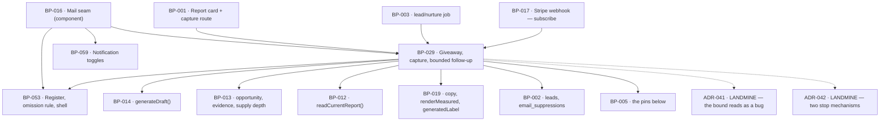

# BP-029 — The giveaway page, lead capture, and bounded per-domain follow-up

- Parent: BP-016
- Kind: **feature** — the leaf cut from REQ-010, the trade of a finished page for
  an address and everything that may follow it.

## Responsibility
Trade one finished page for one email address: state the offer the report card
renders, capture the address and fail closed when it cannot, write and deliver
that one page or say in writing why it is not coming, and run at most three
follow-ups per domain per address — one sequence at a time, in delivery order,
stopped address-wide the moment they opt out or subscribe.

## Module / boundary
`src/lib/mail/leads/` inside BP-016's `src/lib/mail/`, plus the three template
directories for the kinds this node owns (`first-page`,
`first-page-unavailable`, `nurture`) under the per-kind partition ADR-040 fixes.
It owns the `leads` and `suppressions` migration topics (`structure.md` rule 3).

It does **not** own: the report's free-page card, which is a surface in
`src/app/(public)/**` (BP-001) that renders `firstPageOffer()`; the capture
route handler, a thin adapter in `src/app/api/**` (BP-001, `structure.md`
rule 1); the shell, the block renderer and the send seam (BP-053); the
`lead/nurture` trigger and its schedule (BP-003, which calls
`advanceSequences()` and holds no logic of its own); the writing of the page
itself (BP-014).

## Diagram


## Public interface
```ts
// src/lib/mail/leads/offer.ts
/** What the report's free-page card states, and whether it renders at all.
 *  Criterion 6's "no page is offered" is the { offered: false } arm — the card
 *  is absent and no control renders, rather than a card with an empty slot. */
export function firstPageOffer(scanId: string): Promise<
  | { offered: false }
  | { offered: true
      title: string                    // BP-014's proposed title — model text (REQ-093 c2)
      pagesFound: number               // the N of "page 1 of N"
      targetQuery: string
      volume: Measured<number>         // omitted from card and mail when unmeasured
      rival: Measured<string>          // REQ-091 c3: unmeasured renders as its written line
      format: OpportunityType }>       // BP-013's closed enum

// src/lib/mail/leads/capture.ts
/** Criterion 1's control accepts an address and nothing else. Criterion 3's
 *  delivery is enqueued, never awaited: the visitor's confirmation states the
 *  address was accepted, which is the only thing true at that moment. */
export function captureLead(a: {
  scanId: string
  email: string
}): Promise<
  | { captured: true; leadId: string }
  | { captured: false; reason: 'invalid-address' | 'unavailable' }>   // REQ-003 c10

// src/lib/mail/leads/giveaway.ts — one lead, one page, once
export type FirstPageFailure =
  | 'no-page-to-write'      // the current report no longer offers one (see rests-on 1)
  | 'writing-failed'        // BP-014 could not produce a page
  | 'writing-refused'       // hard rules or claim check refused it (BP-014)
  | 'delivery-failed'       // the 24-hour window closed on the page itself

export function deliverFirstPage(leadId: string): Promise<
  | { delivered: 'page' }
  | { delivered: 'unavailable-notice'; cause: FirstPageFailure }
  | { delivered: 'none'; cause: FirstPageFailure }>   // c8's window closed on both

// src/lib/mail/leads/sequence.ts — criteria 9 to 13
/** BP-016's declared entry point, realised here. Keyed by (lower(email), domain):
 *  a second delivery of the same domain's page to the same address starts
 *  nothing (criterion 13). Starts nothing at all for a suppressed address
 *  (criterion 11's last limb). */
export function scheduleSequence(a: { email: string; domain: string; deliveredAt: Date }): Promise<void>

/** BP-016's declared entry point, realised here. Ends every running and every
 *  waiting sequence for the address and blocks every future one. Never touches
 *  users.notify — that is BP-059's, and ADR-042 states why the two must not
 *  become one. */
export function suppressAddress(email: string, cause: 'opt_out' | 'subscribed'): Promise<void>

/** The lead/nurture job body (BP-003). Sweeps first, then releases, then sends:
 *  a waiting sequence past its own deadline is dropped even on an invocation
 *  that releases nothing, so the stored state is never a lie about what is due. */
export function advanceSequences(now: Date): Promise<{
  dropped: number; released: number; sent: number
}>

// src/lib/mail/leads/optout.ts
export function optOutTokenFor(email: string): string                 // signed, no expiry
export function applyOptOutToken(token: string): Promise<
  | { email: string }
  | { error: 'invalid' }>                                             // idempotent
```

Pins are BP-005's and imported, never redeclared here (`structure.md` rule 5):
`NURTURE_TOUCH_HOURS = [24, 72, 168]`, `NURTURE_MAX_TOUCHES = 3`,
`SEQUENCE_START_DEADLINE_DAYS = 7`, `FIRST_PAGE_RETRY_WINDOW_HOURS = 24`,
`FIRST_PAGE_RETRY_MINUTES = [5, 30, 120, 360, 720, 1440]`. Each is asserted in
`tests/pins.test.ts`.

## Data model delta
Migration topic `leads`:

| Column | Why |
|---|---|
| `domain text not null` (lowercased) | The sequence's natural key is `(lower(email), domain)` and a unique index cannot reach through `scan_id` to `scans.domain`. |
| `sequence_state` `waiting \| running \| finished \| dropped \| stopped` | Criterion 12's four lifetimes. Set once when a sequence is created; every later value is terminal. Never returns to null. |
| `sequence_started_at`, `next_touch_at`, `touch_count`, `dropped_at` | Named in BP-016's data-model delta; realised here. |
| `page_delivered_at` | The anchor criterion 12 measures the 7-day start deadline from — its own page's delivery, not the lead's creation. |
| `first_page_state` `pending \| written \| sent \| notice_sent \| abandoned` | Criterion 8's two things the founder may be owed and the one terminal state where neither arrived. |
| `first_page_first_attempt_at`, `first_page_attempts`, `first_page_failure` | The 24-hour window is measured from the first attempt (criterion 8), so the first attempt's time is a stored fact. |

Indexes: `unique (lower(email), domain) where sequence_state is not null` — this
index **is** criterion 13; `(sequence_state, next_touch_at)` for the job's
due-work query; `(lower(email), page_delivered_at)` for release ordering.

Migration topic `suppressions`: `email_suppressions` as BP-002 specifies —
`email` (lowercased, primary key), `cause`, `at`. Insert is idempotent on the
primary key, so a second opt-out click writes nothing and still confirms.

`leads.converted_at` is stamped by BP-017's webhook (`BUILD.md` §13); this node
reads it and calls `suppressAddress(email, 'subscribed')` from the same
transition, so criterion 10 does not depend on the webhook remembering to.

## Error & edge behavior
- **Capture fails closed** (REQ-003 c10): the confirmation is shown only after
  the `leads` row commits. Store unavailable, or the write fails, and the
  submission is refused with a written line; nothing is enqueued and nothing is
  confirmed. This is the opposite of the scan limiter, which fails open —
  `BUILD.md` §11's asymmetry, and BP-016 records that it is deliberate.
- **The page goes to one address** (c3): the send is addressed from the lead row
  the submission created. There is no list, no batch and no second recipient.
- **A suppressed address that submits still receives its page** (c3 against
  c11): `first-page` is a `stoppable: false` kind, so BP-053's send-time
  suppression check does not reach it — but `scheduleSequence()` starts nothing.
  ADR-041 states why the honest-looking fix here is the wrong one.
- **Every lead-directed mail carries the opt-out** (c11) — the page, the
  unavailable notice and each of the three touches. `stoppable: false` governs
  whether suppression blocks the send, not whether the mail carries a way to
  stop what comes next; the page has already been asked for, and the opt-out in
  it stops the follow-up, not the page.
- **Criterion 7's message names its cause**: one `FirstPageFailure` member per
  cause, each mapped to one `CopyKey` in BP-019's registry
  (`mail.firstPageUnavailable.<cause>`). A cause with no key is a compile error,
  which is what makes "and why" enforceable rather than aspirational. Where the
  founder is still on the report, the same key renders in place; where they are
  not, it is the `first-page-unavailable` mail.
- **Retry** (c8): whichever of the two exists is retried at
  `FIRST_PAGE_RETRY_MINUTES` from the first attempt and abandoned at 24 hours.
  `first_page_state` reaches `abandoned` and no surface and no record says
  delivered. A permanent rejection from the vendor ends the window early rather
  than spending six attempts on an address that will never accept mail.
- **One sequence at a time** (c12): `advanceSequences` sweeps waiting sequences
  whose `page_delivered_at + 7d` has passed to `dropped`, then releases the
  oldest surviving waiting sequence for an address that has none running, then
  sends every due touch. Last touch is at most 7d + 168h after delivery, which
  is the 14-day bound the criterion states — the bound is arithmetic on two
  pins, not a separate check that could disagree with them.
- **Opt-out and subscribe release nothing** (c12's last sentence): both set every
  running and waiting sequence for the address to `stopped`; no waiting sequence
  is ever released afterwards, because `scheduleSequence` and the release step
  both refuse an address present in `email_suppressions`.
- **A second delivery of the same domain's page** (c13) inserts a `leads` row for
  the new scan with `sequence_state` null; the unique index makes a second
  sequence for that `(address, domain)` unrepresentable rather than merely
  untested.
- An address that is invalid in form is refused at capture with the
  `invalid-address` reason and no row is written; nothing about it is retried.
- The opt-out token carries no expiry and applying it twice is a success both
  times: a link in a mail a founder finds a year later must work.

## NFR budget
- `captureLead` is one insert; p95 under 300 ms. Writing the page and sending it
  never happen on the visitor's request (`BUILD.md` §4.2 spends ~7¢ per
  identified lead, and it is spent in the job, not the request).
- One `generateDraft()` call per lead, ever. A retry under criterion 8 re-sends
  what was written; it never re-writes it, so an abandoned delivery costs one
  generation and not seven. This is also why "no regeneration of the page on
  request" is enforceable at the cost seam rather than in review.
- `advanceSequences` selects on `(sequence_state, next_touch_at)`; at most one
  sequence per address is ever running, so the address-fan-out of the job is
  bounded by the number of distinct addresses due, not by the number of leads.
- Authz: every one of these entry points runs server-side. The opt-out token is
  the only capability a stranger holds, and it can do exactly one thing —
  suppress the address it is signed for.
- Observability: lead id, domain, sequence state transition, touch index, drop
  reason, suppression outcome, retry count, `FirstPageFailure` cause. Never an
  address in clear text (BP-016's budget), never a page body.

## Decisions
1. **The sequence's natural key is `(lower(email), domain)`, and `leads` gains a `domain` column so an index can say so** — Status: accepted
   - Context: `BUILD.md` §10 keys `leads` to `scan_id`, so one address scanning
     one domain twice produces two rows. Criterion 13 caps that domain's touches
     to that address at three however many times the page is delivered.
   - Decision: denormalise `domain` onto `leads` and enforce criterion 13 with
     `unique (lower(email), domain) where sequence_state is not null`. Sequence
     state is set once and never cleared, so `finished`, `dropped` and `stopped`
     block a second sequence exactly as `running` does.
   - Alternatives considered: keying the sequence to `lead_id` — rejected, it is
     the key BP-003's error section names for nurture idempotency and it
     under-constrains criterion 13 by exactly one re-scan; a check in
     `scheduleSequence` alone — rejected, a check is a race and this is a
     uniqueness claim, which the database can hold and application code cannot.
   - Consequences: `leads.domain` must be written at capture from the scan and
     is thereafter read-only. Reversing means dropping an index that is the sole
     enforcement of a criterion, so the reversal is a behaviour change wearing a
     schema change's clothes.
2. **A ninth mail kind, `first-page-unavailable`** — Status: accepted
   - Context: criterion 8 states the founder may be owed one of **two** things —
     "the page itself where the page was written, and criterion 7's message
     where it was not" — and criterion 7 makes the second unstoppable on its own
     grounds ("it closes the request they made"). BP-016's `MAIL_KINDS`
     registers eight rows and has no row for the second thing; REQ-064's
     non-goal registers "at least" its eight by name.
   - Decision: `'first-page-unavailable': { occasionsFrom: 'REQ-010',
     stoppable: false }` is the ninth row, and this node owns its template
     directory and its per-cause copy keys.
   - Alternatives considered: sending it as a `first-page` mail with different
     blocks — rejected, the register's `occasionsFrom` would then name one
     occasion for two occasions and REQ-064 criterion 6's legality test would
     read as satisfied for a mail no criterion had checked; sending it as an
     `account` mail — rejected, the recipient has no account, which is the whole
     point of the trade.
   - Consequences: the row must land in BP-016's `MAIL_KINDS`, which this node
     may not edit. Until it does, `sendEmail` cannot be called with this kind and
     the node's `blocked-by` is not the right instrument — the register is a
     one-line addition inside its owner, reported rather than forced. Reversal
     cost is low in code and high in meaning: folding the two kinds back together
     re-opens exactly the mis-registration above.
3. **Confirmation follows the commit, and nothing else on the request path** — Status: accepted
   - Context: criteria 3 and 7 both forbid confirming a delivery that did not
     happen, and REQ-003 criterion 10 forbids confirming a capture that did not
     happen.
   - Decision: the request confirms that the address was accepted — a fact true
     at commit — and never that the page was sent. Writing and sending happen in
     the job.
   - Alternatives considered: writing and sending inline so the confirmation can
     be honest about delivery — rejected, it puts a ~7¢ model call and a vendor
     round trip on a stranger's request and turns every vendor blip into a
     refused capture.
   - Consequences: the founder's confirmation and the mail's arrival are separate
     events, which is why criterion 7 needs the in-place line *and* the mail.
4. **The retry schedule is six attempts inside a 24-hour window** — Status: accepted
   - Context: criterion 8 fixes the window at 24 hours from the first attempt and
     says nothing about how the attempts inside it are spaced (rule 1.1).
   - Decision: `FIRST_PAGE_RETRY_MINUTES = [5, 30, 120, 360, 720, 1440]` — six
     retries after the first attempt, the last landing on the window's edge.
   - Alternatives considered: a fixed hourly retry (24 attempts) — rejected, 23
     of them fall inside outages that resolve in minutes and each costs a vendor
     call; three attempts — rejected, it abandons inside the first hour of a
     vendor outage while the promise still has 23 hours left to run.
   - Consequences: a pin in BP-005 asserted in `tests/pins.test.ts`; changing the
     spacing is a one-line change with no schema consequence.
5. **The offer is data; the card is BP-001's** — Status: accepted
   - Context: criterion 1 describes a rendered card, but this node lives in the
     mail module and `structure.md` rule 1 forbids engine logic in `src/app/`.
   - Decision: `firstPageOffer()` returns the six facts and the `{ offered:
     false }` arm; BP-001 renders them through BP-019 and holds no rule about
     when a card appears.
   - Alternatives considered: the surface deciding whether to render the card
     from an opportunity count — rejected, it is criterion 6's promise stated a
     second time, in the one place rule 2.4 says it must not be.
   - Consequences: the card and the mail read the same offer, so "page 1 of N"
     cannot say one thing on screen and another in the inbox.

Two decisions in this node's subject earned files rather than sections and are
not restated here: ADR-041 (the follow-up bound and the three places where
undoing it looks like a fix) and ADR-042 (why address-wide suppression and the
per-kind toggles must stay two mechanisms). ADR-040 fixes the per-kind template
partition this node's `code:` globs sit in.

## Status grounds (rule 3.2)
Self-certified `approved` per rule 3.2. Grounds: cut from REQ-010, which is
`status: approved`; the node is a single feature leaf under the approved
component BP-016 with no scope overlapping a sibling's globs (ADR-040); every
`satisfies` and `covers` target is approved; `code:` is repo-relative and bounded
to `src/lib/mail/leads/`, three template directories, two owned migration topics
and one test directory. No blueprint gate in §3 is unmet: the requirement is
approved, no `blocked-by` is open against it, and the two assumptions it rests on
are recorded as `open` rather than assumed away.

## Open questions
