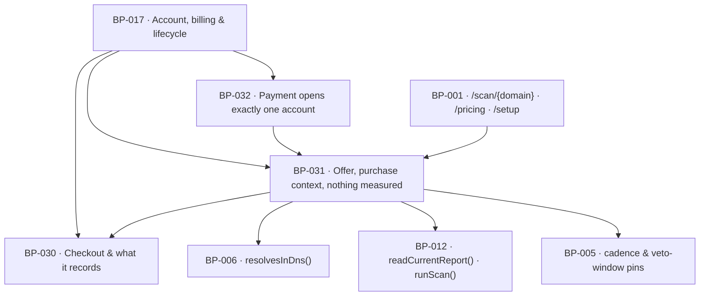

# BP-031 — The offer surface, what a purchase carries in, and an account with nothing measured

- Parent: BP-017
- Kind: **feature** — a leaf of the Epic → Feature → Capability tree, cut from
  REQ-021.

## Responsibility
Derive the one offer's terms once so every surface that carries it states the same
thing, resolve what a completed purchase carries into setup, admit or refuse the
site address the account will use, and answer — for every screen — whether this
account has anything measured yet.

## Module / boundary
`src/lib/account/offer/` — `offerTerms()`, `offerAvailable()`, `purchaseContext()`,
`admitSiteAddress()`, `setSiteDomain()` and `siteMeasurementState()`. It owns the
`sites_provisioning` migration topic: the site's domain, when it was set, and which
scan (if any) the purchase came in with.

Outside this boundary: the report page and `/pricing` that render the offer and the
`/setup` screen that asks the three decisions are BP-001's surfaces; the sentences
are BP-019's; the DNS test is BP-006's `resolvesInDns()`; the deep pass is BP-012's
`runScan()`. This node states what those surfaces must be told, and refuses on
their behalf; it renders nothing.

## Diagram


## Public interface
```ts
/** REQ-021 criterion 2's closed list, in the order every surface states it.
 *  Values are pins (BP-005); words are copy keys (BP-019, REQ-093). The list is
 *  derived once so criterion 4's "on the same terms" is a type, not a habit. */
export interface OfferTerms {
  priceKeys: typeof PRICE_COPY_KEYS               // from BP-030
  rows: readonly [
    { key: 'offer.cadence.page';        value: number },  // pages written per day
    { key: 'offer.cadence.measure';     value: 'weekly' },
    { key: 'offer.cadence.movement';    value: 'weekly' },
    { key: 'offer.veto.window';         value: number },  // default veto hours
  ]
  cancelKey: 'offer.cancel_self_service'
  startKey:  'offer.start'
}
export function offerTerms(): OfferTerms

/** REQ-021 criterion 3: the offer arrives with the report and never before it. */
export function offerAvailable(scan: { status: 'running' | 'done' | 'degraded' | 'failed' }):
  { show: true } | { show: false; because: 'scan_not_finished' }

/** REQ-021 criteria 6 and 7. Resolves BP-030's origin into the domain the account
 *  is provisioned with, or none. A `pricing` origin resolves to `null` and never
 *  to a domain guessed from the payer's email or billing details. */
export function purchaseContext(sessionId: string):
  Promise<{ domain: string; fromScanId: string } | { domain: null; fromScanId: null }>

/** REQ-021 criterion 9. Reaching is exactly "resolves in DNS" — the same test a
 *  rival domain meets (REQ-026 c8) — so new, thin, unbuilt, coming-soon and
 *  fetcher-blocking sites are all accepted. */
export function admitSiteAddress(input: string): Promise<
  | { ok: true; domain: string }                                  // registrable, lowercased, no scheme/path
  | { ok: false; reason: 'not_a_domain' | 'does_not_resolve'; lineKey: 'setup.domain.unreachable' }
>

/** REQ-021 criteria 6 and 8. The one write that fixes the account's site address,
 *  whether confirmed from a report or typed at setup. Idempotent per site. */
export function setSiteDomain(siteId: string, domain: string):
  Promise<{ ok: true; domain: string; measurementReset: boolean }
        | { ok: false; reason: 'does_not_resolve' | 'not_admitted' }>

/** REQ-021 criteria 11 and 12 — the single gate every setup and app screen asks
 *  before it presents any number. True whenever no completed pass exists for the
 *  site's CURRENT domain, including the case where the buyer replaced the domain
 *  the report behind their purchase measured. */
export function siteMeasurementState(siteId: string): Promise<
  | { state: 'nothing-measured-yet'; sinceDomainSetAt: Date }
  | { state: 'measured'; scanId: string; measuredAt: Date }
>
```

## Data model delta
`sites` (additive, `*_sites_provisioning_*.sql`):
- `domain text null` — null until setup for a scanless purchase (BUILD §13,
  "domain null if scanless — asked at setup")
- `provisioned_from_scan_id uuid null references scans(id)` — the report behind the
  purchase, or null. Never back-filled from a later scan.
- `domain_set_at timestamptz null` — the instant `setSiteDomain` last changed the
  domain. `siteMeasurementState` compares this against the newest completed
  `scans` row for the same `(site_id, domain)`; a domain replaced after a report
  makes the account one with nothing measured yet without deleting anything.
- partial unique index on `(user_id)` — one site per account (REQ-021 non-goal).

No column stores "has this account been measured". It is derived from `scans`, so
it cannot go stale (rule 5.1's reasoning applied to a row).

## Error & edge behavior
- `offerAvailable` returns `show: false` for `running` **and** for `failed`. A
  degraded pass still produced a report (REQ-029 c3), so `degraded` shows the offer.
- `admitSiteAddress` normalises before testing: strips scheme, path, port,
  userinfo and a leading `www.`, lowercases, and IDNA-encodes. `localhost`, bare
  IPs, and any label without a public suffix fail as `not_a_domain` before any DNS
  lookup — this is the same input the egress guard (BP-006) will later be pointed
  at, and an unresolvable-by-construction address must never reach it.
- A DNS lookup that errors (timeout, SERVFAIL) is **not** a refusal of the
  customer's own address: it retries once, and on a second failure returns
  `does_not_resolve` with the same written line. There is no third state on this
  screen; a founder refused here has criterion 10's way out (help, cancel, and
  their typed address and every prior answer still present — the draft-state
  persistence is BP-001's `/setup` form, which this node does not own).
- `purchaseContext` never reads the payer's email domain or billing address. There
  is no code path from a Stripe field to a site domain, and a test asserts the
  absence by construction: `purchaseContext` takes only `sessionId` and returns
  either the scan's domain or `null`.
- Replacing the domain sets `domain_set_at` and therefore flips
  `siteMeasurementState` to `nothing-measured-yet` (REQ-021 c12). The replaced
  domain's report is untouched and stays live at its own public address
  (REQ-001 c11) — this node deletes no scan.
- Setup being unfinished blocks nothing else: this node exposes no gate that
  Settings, cancellation or export consult (REQ-021 c10; REQ-076 c3).

## NFR budget
- `offerTerms()` is pure and synchronous; it makes no query. `offerAvailable` is
  pure. Both are asserted identical across the report surface and `/pricing` by one
  test, which is how criterion 4 is discriminated.
- `admitSiteAddress` p95 ≤ 1.5 s including one DNS retry; hard ceiling 4 s, after
  which `does_not_resolve`.
- `siteMeasurementState` p95 ≤ 30 ms — every app screen calls it before rendering
  a number, so it is one indexed query on `(site_id, domain, status)`.
- Authorisation: `setSiteDomain` and `siteMeasurementState` require a session bound
  to the site's owner. `offerTerms` and `offerAvailable` are public.

## Decisions
1. **"Nothing measured yet" is derived from the current domain, never stored** —
   Status: accepted
   - Context: REQ-021 c12 makes the answer turn on a *comparison* — the account's
     domain against the domain a report measured — and a buyer can change the
     domain at setup and again from Settings (REQ-070 c1).
   - Decision: `siteMeasurementState` derives from `scans` keyed on the site's
     current domain. No `measured` boolean exists to be left true.
   - Alternatives considered: a `sites.has_measurement` flag cleared on domain
     change — rejected; one missed clear presents another domain's score as this
     account's, which is precisely the harm c12 names.
   - Consequences: every screen pays one indexed query. Cheap, and it cannot lie.
2. **Reaching means resolving in DNS, and nothing more** — Status: accepted
   - Context: REQ-021 c9 fixes the test verbatim and enumerates what must still be
     accepted: new, thin, unbuilt, coming-soon, blocking our fetcher.
   - Decision: `admitSiteAddress` calls BP-006's `resolvesInDns()` and no other
     check. No HTTP fetch, no status-code test, no content test, no robots read.
   - Alternatives considered: a HEAD request to confirm the site answers — rejected,
     it refuses exactly the customers c9 names and takes their money first.
   - Consequences: an address that resolves but serves nothing is accepted and the
     deep pass will measure very little. That is the intended outcome, and REQ-021
     c11's cold-start presentation is what the founder then sees. **Do not "improve"
     this by adding a liveness check.**
3. **The offer's terms are one derivation with two renderers** — Status: accepted
   - Context: REQ-021 c4 requires the scanless price surface to state the same terms
     as the offer at the end of a report. Two surfaces stating one promise is how a
     promise diverges.
   - Decision: `OfferTerms` is the single source; both surfaces render it; the cadence
     numbers are BP-005 pins and the words BP-019 copy keys.
   - Alternatives considered: each surface composing its own copy — rejected under
     rule 2.4.
4. **The veto-window row states the pinned default, not the customer's setting** —
   Status: accepted (parameter, rule 1.1)
   - Context: the offer is read before an account exists, so no customer setting is
     available; BUILD §4.1's spec row reads "24h veto" and REQ-070 c1 makes the veto
     window a per-customer setting defaulting to 24h.
   - Decision: `offerTerms().rows` reads `VETO_WINDOW_DEFAULT_HOURS` from BP-005.
   - Consequences: if the default pin ever changes, the offer changes with it, which
     is correct. Reversal cost: none — one pin reference.

## Status grounds (rule 3.2)
Self-certified `approved` per rule 3.2. Grounds: cut from REQ-021, `status: approved`;
`satisfies: [REQ-021]` and nothing else; `code:` globs sit inside BP-017's and
overlap no sibling's. REQ-021's own open `rests-on` row is carried forward here
rather than discharged.

## Open questions
