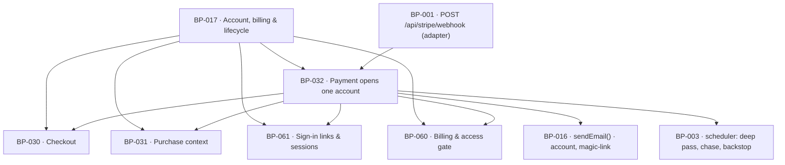

# BP-032 — A completed payment, and nothing else, opens exactly one account

- Parent: BP-017
- Kind: **feature** — a leaf of the Epic → Feature → Capability tree, cut from
  REQ-024.

## Responsibility
Turn a signature-verified completed payment into exactly one account, one site and
one running subscription, get a sign-in link to the address that paid inside 60
seconds, and guarantee by two backstops that no charge ever leaves a founder with
nothing.

## Module / boundary
`src/lib/account/provisioning/` — Stripe signature verification, the event router,
`provisionFromPayment`, the sign-in request policy (`requestMagicLink`), and the
two due-work queries the scheduler drives (15-minute chase, 24-hour backstop). It
owns the `users_provisioning` migration topic.

Outside this boundary: the `POST /api/stripe/webhook` route is a transport-only
adapter (BP-001, `structure.md` rule 1) that hands this node the raw body and the
signature header; token issuance, redemption and sessions are BP-061's; the mail
shell and the `MAIL_KINDS` register are BP-016's; the subscription's own lifecycle
events are BP-060's handlers; the deep pass is BP-012's, queued through BP-003.

## Diagram


## Public interface
```ts
/** The only provisioning path. Verifies the signature against
 *  STRIPE_WEBHOOK_SECRET, then routes. An event whose signature does not verify
 *  creates nothing and is not retried (REQ-024 c2). */
export function handleStripeWebhook(rawBody: Buffer, signature: string): Promise<
  | { handled: true; event: string }
  | { handled: false; reason: 'signature' | 'unknown_event' }
>

/** The closed router. `checkout.session.completed` is this node's;
 *  every `customer.subscription.*` and `invoice.*` row delegates to BP-060.
 *  An event type absent from this map is `unknown_event` — never a 500. */
export const STRIPE_EVENTS: Readonly<Record<string, 'provision' | 'subscription' | 'ignore'>>

/** Idempotent on the Checkout Session id AND on the lowercased paying address.
 *  `created: false` with `duplicate: 'replay' | 'second_purchase'` is the normal,
 *  expected outcome of REQ-024 criterion 3 — not an error. */
export function provisionFromPayment(sessionId: string): Promise<{
  userId: string
  siteId: string
  created: boolean
  duplicate?: 'replay' | 'second_purchase'
}>

/** REQ-024 criteria 4 and 5, and REQ-020 criteria 4 and 5 — one function, three
 *  branches, because they are three answers to one request and rule 7.1 admits
 *  one owner. Never consults access: a customer past their paid-through date is
 *  sent a link and can sign in (REQ-076 c5, REQ-020 c4). */
export function requestMagicLink(email: string): Promise<
  | { sent: true }
  | { sent: false; answer: 'payment_held_account_opening'; lineKey: 'signin.payment_held' }
  | { sent: false; answer: 'no_account';                   lineKey: 'signin.no_account' }
>

/** Due-work queries. This node owns the rule; BP-003 owns the schedule. */
export function paymentsAwaitingSignIn(now: Date): Promise<string[]>   // charged ≥15 min ago, nobody signed in
export function paymentsWithoutAccounts(now: Date): Promise<string[]>  // charged ≥24 h ago, no account opened
export function chaseSignIn(sessionId: string): Promise<void>          // the `account` mail, REQ-024 c5
export function backstopProvision(sessionId: string): Promise<void>    // REQ-024 c6; no second charge, ever
```

## Data model delta
`users` (additive, `*_users_provisioning_*.sql`):
- unique index on `lower(email)` — the second-purchase key (REQ-024 c3)
- `first_signed_in_at timestamptz null` — what the 15-minute chase reads

New table `payments` is **not** created. The replay key is
`users.checkout_session_id` (BP-030's column, unique) and the backstop reads
Stripe for sessions with no matching row. A tenth table needs a rendered surface
that reads it (BUILD §10) and there is none.

`provisioning_attempts` is likewise not created; `## Log`-style history lives in
the structured event stream, not in a table nobody renders.

## Error & edge behavior
- **Signature is the whole of the trust boundary.** `handleStripeWebhook` verifies
  before parsing. A body that does not verify returns `{ handled: false, reason:
  'signature' }`, creates nothing, and the adapter answers 400. A claimed payment
  we cannot verify as ours is indistinguishable from this case, which is REQ-024 c2.
- **Replay** (`checkout.session.completed` delivered twice): the insert conflicts on
  `checkout_session_id`; the handler returns `created: false, duplicate: 'replay'`
  and sends **no** mail and queues **no** deep pass.
- **Second purchase** (a new session, an address that already has an account): the
  insert conflicts on `lower(email)`. The handler then, in this order: cancels the
  newly created Stripe subscription so the address has exactly one running
  subscription (REQ-024 c3), sends one `account` mail naming one way to reach a
  person, sends no sign-in link and queues no deep pass. The charge stands —
  refunds are deferred by owner ruling (REQ-024 non-goal) and the mail is how the
  founder reaches a person about it. **Cancelling the second subscription is not a
  refund and is not optional**: c3 says one running subscription.
- **The 60-second promise** (c1) is met by doing the smallest thing first:
  provision, then issue the link, then queue the deep pass. The deep pass is never
  awaited on the webhook path.
- **The 15-minute chase** (c5) reads `first_signed_in_at is null`. Its mail carries
  a working link where the account is open, and says the account is not open yet
  where it is not — it never asks for payment again.
- **The 24-hour backstop** (c6) opens the account from the Stripe session alone. It
  never creates a charge and never calls `createCheckoutSession`.
- `requestMagicLink` for an address with no account and a *completed* session held
  against it answers `payment_held_account_opening` and offers no further purchase
  (REQ-020 c4). An address with neither answers `no_account`. Neither branch reveals
  more, and neither is rate-limited differently from the other — a timing or
  wording difference is an account-existence oracle.
- Provisioning also stamps the lead converted and suppresses further nurture by
  calling the exported seams (`BP-016.suppressAddress(email, 'subscribed')` and the
  `leads` owner's conversion stamp). This node writes no `leads` row itself —
  `leads` is not its migration topic.

## NFR budget
- Webhook handled in ≤ 3 s wall clock (BP-017's budget); provisioning plus link
  issuance inside the 60-second promise of c1.
- The adapter answers 2xx once the event is durably recorded, before the deep pass
  is queued — a slow downstream must not cause Stripe to retry a completed
  provisioning.
- No `STRIPE_WEBHOOK_SECRET`, raw body, session token or magic-link URL is logged.
- Authorisation: `handleStripeWebhook` and `requestMagicLink` are the two entry
  points reachable with no session. Everything else requires the scheduler's
  server-only context.
- Observability: one event per webhook (`event`, `sessionId`, outcome, duplicate
  kind), one per chase, one per backstop. The backstop firing at all is an alert —
  it means the webhook path failed for a paying customer.

## Decisions
1. **Two idempotency keys, not one** — Status: accepted
   - Context: BP-017 decision 2 pins idempotency at the database level. REQ-024 c3
     names two different cases with one required outcome.
   - Decision: unique on `checkout_session_id` catches the replay; unique on
     `lower(email)` catches the second purchase. The two conflicts take different
     branches — a replay is silent, a second purchase is answered.
   - Alternatives considered: one key on the Stripe customer id — rejected, a second
     purchase from the same address can create a second Stripe customer.
   - Consequences: an address is permanently one account. Changing the sign-in
     address (BP-061) moves that key and must hold the same uniqueness.
2. **The webhook is verified and routed here; subscription events are handled in
   BP-060** — Status: accepted
   - Context: one signature-verification seam is required (BUILD §13); several
     unrelated lifecycles arrive through it.
   - Decision: `STRIPE_EVENTS` is a closed map declared in this node; `subscription`
     rows call BP-060's handlers. Dependency runs BP-032 → BP-060 only.
   - Alternatives considered: a second webhook endpoint for billing — rejected, two
     endpoints means two signature verifications and two places to get it wrong.
3. **A duplicate purchase's subscription is cancelled immediately** — Status: accepted
   - Context: REQ-024 c3 requires exactly one running subscription after processing;
     refunds are deferred.
   - Decision: cancel the second subscription in the same handler, before the mail.
   - Alternatives considered: leave it running and let a person sort it out —
     rejected, it fails c3 and bills the founder twice next month.
   - Consequences: a founder who genuinely meant to buy a second account cannot; there
     is one site per account and no second-account path in this corpus.
4. **Due-work queries, not schedules** — Status: accepted
   - Context: BUILD §11 names six jobs and none of them is the 15-minute chase or the
     24-hour backstop that REQ-024 c5 and c6 require. BP-003 owns the schedule.
   - Decision: this node exports `paymentsAwaitingSignIn` / `paymentsWithoutAccounts`
     and the two actions; whether BP-003 runs them as one maintenance job or two is
     BP-003's to decide.
   - Consequences: this node is testable with a fixed clock and no scheduler.

## Status grounds (rule 3.2)
Self-certified `approved` per rule 3.2. Grounds: cut from REQ-024, `status:
approved`; `covers: [REQ-020]` is coverage, not derivation (rule 5.4) — REQ-020
criteria 4 and 5 are implemented here while BP-030 is the node cut from REQ-020.
`code:` globs sit inside BP-017's and overlap no sibling's.

## Open questions
