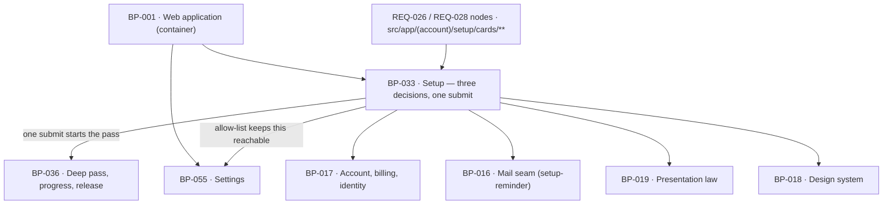

# BP-033 — Setup: three decisions, one submit, and the way back

- Parent: BP-001
- Kind: **feature** — cut from REQ-025, a leaf under the web-application container.

## Responsibility
Render the one post-payment screen that asks exactly three decisions plus the
site address, accept them in one submit, gate the rest of the app on that submit
without ever gating the way out, and chase an unfinished setup a bounded number
of times with a link that lands back on it.

## Module / boundary
`src/app/(account)/setup/` — the screen, its submit action and the
setup-completion gate — plus the one route handler `src/app/api/setup/route.ts`.
It owns the **shape** of the screen and the **fact that it happens once**. It
does not own the content of the three cards: the market and competitor cards are
REQ-026's node's and the mode-and-destination card is REQ-028's node's, and both
place their components under `src/app/(account)/setup/cards/**`, which this node
deliberately does not glob. It owns no engine logic; the deep pass it starts is
BP-036's and the mail it schedules is BP-016's.

## Diagram


## Public interface
```ts
// src/app/(account)/setup/page.tsx — server component. Three cards, one submit.
export default async function SetupPage(): Promise<JSX.Element>

/** The closed shape of the one submit. A field absent from this type cannot be
 *  sent, which is how REQ-025 criterion 1's "and for nothing else" is enforced
 *  rather than reviewed. */
export interface SetupSubmission {
  domain: string                                   // identity, not configuration
  category: string                                 // REQ-026's card supplies it
  competitors: readonly string[]                   // <= 5, REQ-026's card
  mode: 'autopilot' | 'copilot'                    // REQ-028's card
  destination: { kind: 'hosted' } | { kind: 'wordpress'; connectLater: true }
}

export type SetupResult =
  | { ok: true; siteId: string }
  | { ok: false; refused: 'invalid_domain' | 'already_complete' | 'no_active_access' }

// POST /api/setup — the only write path into setup completion.
export async function POST(req: Request): Promise<Response>

/** The one predicate every account route consults. There is no second copy. */
export type SetupState =
  | { complete: false; siteId: string; paidAt: Date }
  | { complete: true;  siteId: string; completedAt: Date }
export function readSetupState(userId: string): Promise<SetupState>

/** REQ-025 criterion 5's exception, expressed as data rather than as an `if`
 *  repeated in every route. Anything not matched here redirects to /setup while
 *  setup is incomplete. */
export const SETUP_INCOMPLETE_ALLOWLIST: readonly string[]
// ['/setup', '/app/settings', '/api/settings', '/api/export', '/api/account/*', '/api/stripe/portal']

/** REQ-025 criterion 6. Bounded, stoppable, and never sent before there is an
 *  account to sign in to. */
export const SETUP_REMINDER_OFFSETS_HOURS: readonly [24, 72, 168]
export function scheduleSetupReminders(a: { userId: string; siteId: string; paidAt: Date }): Promise<void>
```

## Data model delta
On `sites` (migration topic `sites`, structure.md rule 3 — this node globs no
migration and the delta lands in that topic's owning node):
- `setup_completed_at timestamptz null` — the one fact criteria 4 and 5 branch on.
- `setup_reminders_sent smallint not null default 0` — the bound in criterion 6,
  capped at 3 by a check constraint so a retry storm cannot exceed it.
No new table. Nothing about the three decisions is stored here: category,
competitors, mode and destination land on `sites` and `destinations` through the
nodes that own them.

## Error & edge behavior
- **The screen states no duration.** `SetupSubmission` has no field for one and
  the page's copy keys contain none. `BUILD.md` §4.3's footer *"Start — first
  page in ~3 minutes"* is **not built** (decision 1).
- A signed-out request renders the address ask and says nothing about whether an
  account or a payment exists (REQ-020 criterion 5, BP-001's boundary).
- Setup complete and the founder returns to `/setup` → redirected onward to
  `/app`; they are never re-asked the three (criterion 4).
- Setup incomplete and any app path is requested → redirected to `/setup` unless
  the path matches `SETUP_INCOMPLETE_ALLOWLIST`, which keeps Settings, cancel,
  resume, export, invoices, sign-out and delete reachable (criterion 5). A
  cancellation taken there runs the identical BP-017 path a finished customer's
  does; there is no setup-aware branch inside it.
- **Completion commits before the pass is enqueued** (decision 2). If the
  enqueue fails, the founder is still complete, the ten-minute release clock in
  BP-036 still runs from `setup_completed_at`, and they still reach the app.
- `POST /api/setup` is idempotent on `sites.setup_completed_at`: a double submit
  returns `already_complete` and starts no second pass.
- An invalid or unresolvable domain refuses with a written line and no partial
  write; the three decisions stay on the screen as the founder entered them.
- Reminders stop on submit or on cancellation, checked at send time rather than
  at schedule time, so a founder who finishes at hour 71 receives no hour-72 mail.
- Every reminder carries a sign-in link that lands on `/setup` itself (REQ-024
  criterion 4); a reminder with no working link is a send-time failure, not a
  degraded send.

## NFR budget
- p95 TTFB for `/setup` ≤ 400 ms. The screen renders from stored rows and the
  suggested-rival list already in the deep-eligible report; it runs no vendor
  call and no measurement.
- `POST /api/setup` returns in ≤ 1 s p95: it writes rows and enqueues; it never
  waits on the pass.
- Authorisation: session required; the `siteId` is resolved from the session,
  never read from the body.
- Observability: one structured line per submit carrying `userId`, `siteId` and
  whether a pass was enqueued — never the submission payload. One line per
  reminder carrying the offset index and the stop reason when suppressed.

## Decisions

1. **`BUILD.md` §4.3's "first page in ~3 minutes" footer is not built** — Status: accepted
   - Context: `BUILD.md` §4.3 specifies a footer reading *"Start — first page in
     ~3 minutes."* REQ-025 criterion 1 says, in the same breath as the three
     decisions, "nothing on the screen states how long the deep pass, or the
     founder's first page, will take", and REQ-029's non-goals add "no such
     duration has been measured".
   - Decision: the submit control carries a copy key with no duration in it. The
     approved requirement wins over the specification prose it postdates.
   - Alternatives considered: build the footer as specified — rejected, it states
     a duration nobody measured, which is rule 1.2's line and criterion 1's
     explicit prohibition; build it with a measured median once one exists —
     rejected here, that is a change to what the product promises and therefore
     the owner's, not a setup-screen detail.
   - Consequences: reversal is one copy key. The finding is reported upward
     rather than fixed in `BUILD.md`, which this node does not own.

2. **Setup completion commits before the deep pass is enqueued** — Status: accepted
   - Context: one submit must both finish setup and start the pass. Making them
     one transaction means an enqueue failure leaves the founder at setup with
     their answers taken; making the pass a precondition means an unavailable job
     runner blocks a paid customer at the door.
   - Decision: `setup_completed_at` commits first; the enqueue is at-least-once
     and idempotent on `(site_id, 'deep')`. BP-036's release deadline is timed
     from `setup_completed_at`, not from the pass, so a pass that never started
     still releases the founder into the app at ten minutes.
   - Alternatives considered: one transaction spanning the write and the enqueue
     — rejected, it couples a customer's account state to a queue's availability;
     enqueue first, commit on acknowledgement — rejected, the acknowledgement can
     be lost after the pass has begun, producing two passes for one submit.
   - Consequences: a rare founder reaches the app with no measurement and reads
     REQ-029 criterion 5's written sentence, which is exactly what that criterion
     was written for. Reversing means re-coupling the two, which re-opens the
     door-blocking failure.

3. **Reminder offsets are 24 h, 72 h and 168 h** — Status: accepted
   - Context: criterion 6 fixes the first at 24 hours after payment, the count at
     no more than three, and the last at no later than 7 days. Only the middle
     touch is free.
   - Decision: 24 / 72 / 168, pinned in `src/lib/config/constants.ts` (BP-005).
     Derivation: 168 h is exactly the 7-day cap, and 72 h matches the one other
     bounded follow-up sequence in the product (`lead/nurture`, `BUILD.md` §11 and
     §4.2, "24h/72h/168h"), so the product has one sequence shape rather than two.
   - Alternatives considered: 24 / 96 / 168 — rejected for no reason to differ;
     two reminders — rejected, criterion 6 permits three and a paid customer who
     has not started is worth the third.
   - Consequences: reversal is one pinned tuple asserted in `tests/pins.test.ts`.

4. **The incomplete-setup gate is an allow-list of paths, not a per-route check** — Status: accepted
   - Context: criterion 5 makes an exception whose extent is enumerated
     (Settings, cancel, resume, export, invoices, sign-out, delete). A per-route
     check means the next account route defaults to blocked or to open depending
     on who wrote it.
   - Decision: one `SETUP_INCOMPLETE_ALLOWLIST` consulted in one place. A new
     account route is blocked while setup is unfinished unless it is added,
     which is the safe default and makes the exception visible in one file.
   - Alternatives considered: a per-route annotation — rejected, the same failure
     mode BP-001 decision 2 rejects for the public/account split.
   - Consequences: a route added to the exception is a reviewable one-line diff.

## Status grounds (rule 3.2)
Self-certified `approved`. Grounds: cut from REQ-025, which carries
`status: approved`, so the gate "no blueprint from a non-approved requirement" is
met; `satisfies: [REQ-025]` is the derivation edge (rule 5.4). The node is a
feature leaf under the approved container BP-001 and its globs sit inside BP-001's
boundary and overlap no sibling's. The librarian audits.

## Open questions
