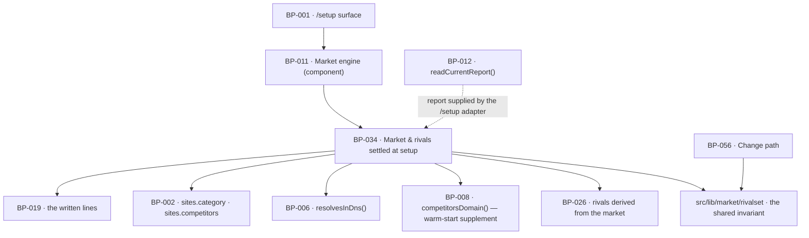

# BP-034 — Market and rivals settled at setup

- Parent: BP-011
- Kind: **feature** — cut from REQ-026, a leaf under the market engine.

## Responsibility
Settle, in one submit, the two answers everything downstream is measured against —
the market the founder confirms or states, and the rival set they accept or type —
and hold the invariant that governs that set here and after setup alike.

## Module / boundary
`src/lib/market/rivalset/` — the rival-set type and the one add/remove invariant
REQ-026 criterion 8 and REQ-071 criterion 4 both state (rule 7.1: one capability,
one owner; BP-056 consumes it and does not re-implement it).
`src/lib/market/setup/` — the setup card's state machine: which market card
renders, where rival suggestions come from, what a domain change on the screen
clears, and what must be true to submit. The setup *screen* is BP-001's; this node
holds no layout and no sentence.

## Diagram


## Public interface
```ts
// src/lib/market/rivalset/index.ts — the invariant, shared with BP-056
export type RivalOrigin = 'suggested' | 'typed'
export interface RivalEntry { domain: string; origin: RivalOrigin }
export type RivalSet = readonly RivalEntry[]              // length ≤ BATTERY.COMPETITORS_MAX
export type RivalRejection =
  | 'not_a_domain' | 'does_not_resolve' | 'own_domain' | 'already_present' | 'set_full'

export function normaliseRivalInput(input: string): string | null   // eTLD+1 or null
export function addRival(set: RivalSet, a: {
  input: string; origin: RivalOrigin; ownDomain: string
}): Promise<{ ok: true; set: RivalSet } | { ok: false; because: RivalRejection; set: RivalSet }>
export function removeRival(set: RivalSet, domain: string): RivalSet
export function clearSuggested(set: RivalSet): RivalSet             // keeps every 'typed' entry

// src/lib/market/setup/index.ts
export type MarketCard =
  | { state: 'inferred'; category: string; fromScanId: string }
  | { state: 'empty' }
  | { state: 'stated'; category: string }
export type SuggestionState = 'awaiting_market' | 'seeking' | 'none_found' | 'offered'

/** What this node needs from the current stored report, supplied by the caller.
 *  Deliberately not `StoredReport`: importing BP-012's type would close a
 *  src/lib/market ↔ src/lib/scan cycle (Decisions 4). */
export interface ReportFacts { scanId: string; category: string | null; rivals: readonly string[] }

export interface SetupState {
  siteDomain: string | null
  market: MarketCard
  suggestions: { state: SuggestionState; candidates: readonly string[] }
  rivals: RivalSet
}

export function marketCardFor(a: { siteDomain: string; report: ReportFacts | null }): MarketCard
export function suggestRivals(c: CostContext, s: SetupState): Promise<Measured<string[]>>
export function onDomainChanged(s: SetupState, a: { domain: string; report: ReportFacts | null }): SetupState
export function onMarketStated(s: SetupState, category: string): SetupState
export function validateSetup(s: SetupState): { ok: true } | { ok: false; because: 'market_missing' }
export function settleSetup(a: {
  siteId: string; category: string; rivals: RivalSet
}): Promise<void>            // writes sites.category and sites.competitors, once
```

## Data model delta
None of its own. Writes `sites.category` (text) and `sites.competitors jsonb` —
both in BUILD §10's baseline, owned by BP-002 — storing each rival as
`{ domain, origin }` so criterion 12's "clear the suggested, keep the typed" rule
survives a page reload and a later domain change. No new column, no new table, and
**no migration glob claimed here**: `supabase/migrations/*_sites*.sql` belongs to
whichever node the account/settings block gives it, and this node needs none.

## Error & edge behavior
- **What decides confirm-versus-state is whether a completed report exists for the
  address the account will use**, never how the purchase was made (REQ-026's
  rationale, the same key as REQ-021 criterion 11). The `/setup` adapter reads the
  report through BP-012 and hands it in as `ReportFacts | null` (Decisions 4); a
  report ⇒ `inferred`, no report ⇒ `empty` with
  nothing pre-filled and nothing labelled inferred or measured (criteria 1 and 3).
- **A domain change on the screen re-keys everything derived and keeps everything
  typed.** `onDomainChanged` clears an `inferred` market (re-running
  `marketCardFor` for the new address), keeps a `stated` one exactly as left,
  clears every `origin: 'suggested'` rival, keeps every `origin: 'typed'` one, and
  refuses the new address as a rival on criterion 8's terms (criteria 6 and 12).
- **`awaiting_market` and `none_found` are different states and never share a
  line.** A card with no market says it is waiting on the market; only a card whose
  market is known, whose suggestions were sought, and which got nothing back says
  none were found (criterion 10).
- The five limit is stated, not silently enforced: a sixth `addRival` returns
  `because: 'set_full'` with the set unchanged, so the surface has something to say
  (criterion 9). It never truncates.
- A rejected value **consumes none of the five** — `addRival` returns the original
  set on every rejection arm (criterion 8).
- Reachability is `resolvesInDns()` and nothing more: a rival whose site is new,
  thin, unbuilt or blocking our fetcher is accepted (REQ-026 criterion 8, REQ-071
  criterion 5). No fetch is made against a rival domain at setup.
- Self-comparison is impossible: `own_domain` matches the account's address on
  `www.` and on the `content.` publishing subdomain.
- **Zero rivals completes setup** (criterion 11) and **no market does not**
  (criterion 5). `validateSetup` has exactly one failure arm, so no future field
  can quietly become a second thing that blocks the founder.
- Nothing about a rival's size, band or reachability appears here: the measurement
  does not exist until the deep pass has run (REQ-096's first non-goal), and
  BP-052 is not reachable from this module.
- `settleSetup` writes once and is idempotent on `siteId`; a resubmitted form
  cannot produce two rival sets.

## NFR budget
- Spend: at most one `competitors_domain` call, `COMPETITORS_DOMAIN_COST_C` 1.5¢,
  against `CAPS.DEEP_C` 150¢ — and none at all on the report-backed path, where the
  rivals are read from the stored report BP-026 already derived at 0¢.
- Latency: the market card is pure and returns in ≤ 1 ms once the adapter has
  supplied the report; a rival
  suggestion call is bounded at 3 s and, on timeout, leaves `SuggestionState` at
  `none_found` rather than holding the screen — **setup is never held on
  suggestions** (REQ-026's rationale; BUILD §4.3, "A degraded pass still releases
  setup").
- `addRival`'s DNS lookup is bounded at 2 s and is the only I/O in the invariant.
- Observability: which market-card state rendered, suggestion source and count,
  every rejection reason, submit outcome.
- Pins needed from BP-005: `BATTERY.COMPETITORS_MAX` (5) and
  `PRICE_BOOK.COMPETITORS_DOMAIN_COST_C` — both already declared there.

## Decisions
1. **The rival-set invariant lives with the set's minting, and Settings consumes it** — Status: accepted
   - Context: REQ-026 criterion 8 says its rule is "the same rule that governs the
     same action after setup (REQ-071 criterion 4)". Two implementations of one
     capability is a `blocked-by` under rule 7.1, never a judgement call, so one of
     BP-034 and BP-056 must own it.
   - Decision: `src/lib/market/rivalset/` is owned here, because this node mints
     the set and writes the column; BP-056 imports `addRival` / `removeRival` and
     adds only the effectivity rules that are its own. The dependency runs
     BP-056 → BP-034 and never back, so the module graph stays acyclic.
   - Alternatives considered: owning it in BP-056 and having setup consume it —
     rejected, it makes the first write of a column depend on the module that
     edits it later, which inverts the lifecycle; a third shared node — rejected,
     it is one small invariant and a node per invariant is the artifact
     proliferation rule 2.2 exists to stop.
   - Cost of reversing: low — one directory move and two import lines — but it
     re-opens the duplication the two requirements explicitly bound together.
2. **Setup's two suggestion sources are different by path, and that reconciles
   BUILD §4.3 with §6.6** — Status: accepted
   - Context: BUILD §4.3 says setup's chips come from `competitors_domain`; §6.6
     says "At setup the suggested chips come from this list" — the market
     derivation — and that "`competitors_domain` adds candidates only when the
     customer has presence (warm-start supplement)". Read as one rule they
     conflict; read against REQ-026 criteria 1, 3 and 7 they do not.
   - Decision: where a completed report backs the account, suggestions are
     BP-026's market-derived rivals read from that report (0¢, already bought,
     BUILD §6.4's reuse rule). Where no report backs it and the founder states
     their market, the market-derived list cannot exist — it requires twelve SERPs
     only a scan produces — so the single source is `competitorsDomain()`, which
     returns measured-empty for a cold-start domain and leaves the card at
     `none_found`, which is a legal and honest outcome (criteria 10 and 11).
   - Alternatives considered: running the market chain live on the setup screen to
     derive rivals for a stated market — rejected, it holds a founder at a form
     for the length of a scan and REQ-026's rationale forbids being held at setup
     by the absence of suggestions; showing the replaced domain's rivals —
     rejected outright by criterion 7 and REQ-021 criterion 12.
   - Consequences: a cold-start founder with no report reaches the app with no
     rivals more often than a report-backed one. That is criterion 11's promise
     working, not a defect; the deep pass derives rivals afterwards and REQ-071's
     competitors card is where they add them.
   - Cost of reversing: low; one branch in `suggestRivals`.
3. **A rival's origin is stored, not inferred** — Status: accepted
   - Context: criteria 6 and 12 require clearing the suggested and keeping the
     typed across a domain change, and the change can happen after a reload.
   - Decision: `sites.competitors jsonb` holds `{ domain, origin }`, and `origin`
     is set once at the moment of adding.
   - Alternatives considered: recomputing origin by re-deriving suggestions for
     the old domain — rejected, it needs a vendor call to answer a question about
     the past and gives a different answer once the market moves; dropping the
     distinction and clearing everything — rejected, it deletes the one thing
     criterion 12 promises to keep.
   - Cost of reversing: a migration over a jsonb column that would have to invent
     the origin of every existing row — the one genuinely irreversible thing here,
     which is why it is decided before the first write rather than after.

4. **The current report is supplied to this node, never fetched by it** — Status: accepted
   - Context: `registry/structure.md` rule 6 makes a cycle between `src/lib/`
     modules a build failure, and BP-012 (`src/lib/scan/`) already depends on
     BP-011 (`src/lib/market/`). Calling `readCurrentReport()` from here would
     close that cycle; so would a type-only import of `StoredReport`.
   - Decision: `marketCardFor` and `onDomainChanged` are pure over a caller-supplied
     `ReportFacts | null`. The `/setup` route adapter reads the report through
     BP-012 and hands it in — a value hand-off, which is the adapter shape
     `structure.md` rule 1 already describes ("hands the raw body and signature to
     BP-017"), not engine logic in `src/app/`.
   - Alternatives considered: querying `scans` directly through BP-002's `db()` —
     rejected, it is a second implementation of BP-012's "one current stored report
     per domain" capability (rule 7.1); moving the setup state machine into
     `src/lib/scan/` — rejected, it is market knowledge and would put REQ-026 in a
     module whose requirement set is about measurement.
   - Consequences: `settleSetup` still writes `sites` through BP-002 directly,
     which rule 6 permits (`src/lib/` → `src/lib/db/`); only the read crosses back.
   - Cost of reversing: low in code, and it re-opens a build failure the moment the
     dependency check runs — which is the point.

## Status grounds (rule 3.2)
Self-certified `approved` under rule 3.2. Grounds: cut on `/expand-requirement`
from **REQ-026**, `status: approved`, as is REQ-025 which it depends on — §3's
blueprint gate. It satisfies exactly that requirement, both its directories sit
inside BP-011's boundary, and neither overlaps a sibling's globs.

## Open questions
